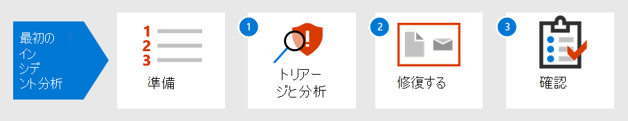

# 最初のインシデントへの対応の概要Introduction to responding to your first incident

[!INCLUDE [Microsoft 365 Defender rebranding](../includes/microsoft-defender.md)]

**適用対象:****Applies to:**
- Microsoft 365 DefenderMicrosoft 365 Defender

組織のインシデント対応戦略は、ますます破壊的なセキュリティ インシデントやサイバー犯罪に対処する能力を決定します。An organization's incident response strategy determines its ability to deal with increasingly disruptive security incidents and cybercrime. 予防措置を講じすることは重要ですが、検出されたインシデントを迅速に取り込み、根絶し、復旧する能力は、損害とビジネス上の損失を最小限に抑える可能性があります。While taking preventative measures is important, the ability to act quickly to contain, eradicate, and recover from detected incidents can minimize damage and business losses.

このインシデント対応のチュートリアルでは、セキュリティ運用チームの一員として、Defender 内の主要なインシデント対応手順のほとんどを実行Microsoft 365します。This incident response walkthrough shows how you, as part of a security operations team, can perform most of the key incident response steps within Microsoft 365 Defender. それらのステップは次のとおりです。Here are the steps:

- セキュリティ態勢の準備Preparation of your security posture
- インシデントごとに次の値を指定します。For each incident:
  - 手順 1: トリアージと分析Step 1: Triage and analysis
  - 手順 2: 修復 (格納、根絶、および回復)Step 2: Remediation (containment, eradication, and recovery)
  - 手順 3: インシデント後のレビューStep 3: Post-incident review

セキュリティ インシデントは、国立標準技術研究所 (NIST) によって「情報システムの機密性、整合性、または可用性を実際または潜在的に危険にさらす発生」と定義されます。またはシステムが処理、保存、または送信する情報。または、セキュリティ ポリシー、セキュリティ手順、または許容される使用ポリシーに対する違反または差し迫った脅威を構成します。A security incident is defined by National Institute of Standards and Technology (NIST) as "an occurrence that actually or potentially jeopardizes the confidentiality, integrity, or availability of an information system; or the information the system processes, stores, or transmits; or that constitutes a violation or imminent threat of violation of security policies, security procedures, or acceptable use policies."

Defender のインシデントMicrosoft 365分析とインシデント対応の論理的な開始点です。Incidents in Microsoft 365 Defender are the logical starting points for analysis and incident response. インシデントの分析と修復は、通常、ほとんどのセキュリティ運用チームのタスクを構成します。Analyzing and remediating incidents typically makes up most of a security operations team's tasks.

## 次の手順Next step

組織と組織のテナントMicrosoft 365インシデント[処理の準備ができているか確認します](first-incident-prepare.md)。Make sure your organization and Microsoft 365 tenant is [prepared for incident handling](first-incident-prepare.md).

## 関連項目See also

- [インシデントの概要Incidents overview](incidents-overview.md)
- [インシデントを分析するAnalyze incidents](investigate-incidents.md)
- [インシデントの管理Manage incidents](manage-incidents.md)
