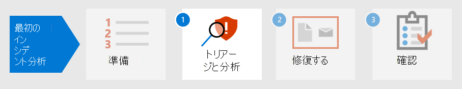

# 最初のインシデントのセキュリティ態勢を準備する

[!INCLUDE [Microsoft 365 Defender rebranding](../includes/microsoft-defender.md)]

**適用対象:**
- Microsoft 365 Defender

インシデント処理の準備には、さまざまな種類のセキュリティ インシデントから組織のネットワークを十分に保護する必要があります。 セキュリティ インシデントのリスクを軽減するために、国立標準技術研究所 (NIST) では、リスク評価、ホスト セキュリティの強化、ネットワークの安全な構成、マルウェアの防止など、いくつかのセキュリティプラクティスを推奨しています。 

Microsoft 365 Defender、インシデント防止のいくつかの側面に対処できます。 

- ゼロトラスト フレームワーク [の](/security/zero-trust/) 実装
- Microsoft Secure Score でスコアを割り当て、セキュリティの態勢 [を決定する](microsoft-secure-score.md)
- 脅威と脆弱性管理の脆弱性評価による [脅威の防止](../defender-endpoint/next-gen-threat-and-vuln-mgt.md)
- 最新のセキュリティ脅威を理解して、セキュリティ脅威に備える

## 手順 1。 ゼロ信頼の実装

[ゼロトラスト](/security/zero-trust/) は、モバイルワークフォース、ユーザー、デバイス、アプリケーション、データなど、モダンな環境の複雑な性質を考慮した統合セキュリティ哲学とエンドツーエンド戦略です。 Microsoft 365 Defender では、すべての検出を一貫した方法で管理するための単一のウィンドウを提供することで、セキュリティ運用チームがゼロトラストの指針を簡単に実装できます。 

Microsoft 365 Defender のコンポーネントは、デバイス コンプライアンス ポリシーの情報ソースとして Microsoft Defender for Endpoint または他のモバイル セキュリティ ベンダーからのデータを統合し、デバイスベースの条件付きアクセス ポリシーを実装することで、ゼロトラストの条件付きアクセス ポリシーを確立するために実装されているルールの違反を表示できます。 

デバイスリスクは、そのデバイスのユーザーがアクセスできるリソースに直接影響します。 特定の条件に基づくリソースへのアクセス拒否は、ゼロ信頼の主なテーマであり、信頼レベルの基準を決定するためにMicrosoft 365 Defender情報を提供します。 たとえば、Microsoft 365 Defenderは[脅威と脆弱性の管理] ページを通じてデバイスのソフトウェア バージョン レベルを提供し、条件付きアクセス ポリシーは古いバージョンまたは脆弱なバージョンのデバイスを制限します。

自動化は、ゼロトラスト環境を実装して維持する上で重要な部分であり、インシデント対応 (IR) イベントにつながる可能性のあるアラートの数も減らします。 Microsoft 365 Defender のコンポーネントは、修復アクション[(Microsoft 365 Defender](m365d-autoir.md)ポータルのインシデントの調査と呼ばれる)、通知アクション[、ServiceNow](https://microsoft.service-now.com/sp/)などのサポート チケットの作成など、自動化できます。

## 手順 2。 組織のセキュリティ体制を決定する

次に、組織は Microsoft [Secure Score](microsoft-secure-score.md)を使用して、Microsoft 365 Defenderを決定し、その改善方法に関する推奨事項を検討できます。 スコアが高いほど、組織によってセキュリティに関する推奨事項と改善のアクションが多くなります。 セキュリティで保護されたスコアの推奨事項は、さまざまな製品間で取り上げ、組織がスコアを上げるのをさらに高くすることができます。 

:::image type="content" source="../../media/first-incident-prepare/first-incident-secure-score.png" alt-text="Microsoft セキュリティ センターの Microsoft Secure Score の例。":::
 
## 手順 3. 組織の脆弱性の暴露を評価する

インシデントを防止すると、セキュリティ運用の取り組みを合理化し、重要で重要なセキュリティ インシデントに集中できます。 ソフトウェアの脆弱性は、多くの場合、データの盗難、データの損失、またはビジネス操作の中断につながる可能性のある攻撃の予防可能なエントリ ポイントです。 攻撃が継続的に行なえない場合、セキュリティ運用は、組織内で許容できるレベルの脆弱性の暴露を達成し、維持するために [努力する必要](../defender-endpoint/tvm-exposure-score.md) があります。

ソフトウェアの修正プログラムの進行状況を確認するには、Defender for Endpoint の [脅威と脆弱性の管理] ページにアクセスし、Microsoft 365 Defender [その他のリソース] タブから **アクセス** できます。 

:::image type="content" source="../../media/first-incident-prepare/first-incident-vulnerability.png" alt-text="Microsoft セキュリティ センターの [脅威と脆弱性] ページの例。"::: 
 
## 4. 新たな脅威を理解する

Microsoft 365 Defender[ポータル](threat-analytics.md)で脅威分析を使用して、現在のセキュリティ脅威の状況を最新の状態に保つ。 Microsoft のセキュリティ専門家は、最新のサイバー脅威を詳細に説明するレポートを作成し、Microsoft 365 サブスクリプション、デバイス、およびユーザーにどのような影響を与えるのか理解できます。 これらのレポートには、次のものが含まれます。

- アクティブな脅威アクターとそのキャンペーン
- 人気のある新しい攻撃手法
- 重大な脆弱性
- 一般的な攻撃対象領域
- 流行しているマルウェア

また、脅威分析では、構成とアラートを確認して、危険にさらされている方法と、レポートに適用されるアクティブなアラートが発生したかどうかを判断します。

新たな脅威の推奨事項を実装して、セキュリティ体制を強化し、攻撃の表面領域を最小限に抑える。

スケジュールに時間を設定して、ポータルの[[Threat Analytics]](threat-analytics.md)セクションを定期的にMicrosoft 365 Defenderします。

## 次の手順

インシデントをトリアー [ジして分析する方法について学習します](first-incident-analyze.md)。

## 関連項目

- [インシデントの概要](incidents-overview.md)
- [インシデントの調査](investigate-incidents.md)
- [インシデントの管理](manage-incidents.md)
