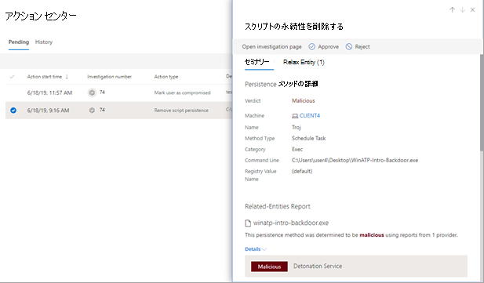

# アクション センターでのアクションの表示と管理

[!INCLUDE [Microsoft 365 Defender rebranding](../includes/microsoft-defender.md)]

**適用対象:**
- Microsoft 365 Defender

特定の修復アクションMicrosoft 365 Defender脅威保護機能が提供されます。 次に、いくつかの例を示します:

- [自動調査によって、](m365d-autoir.md) 修復アクションが自動的に実行される、または承認を待つ可能性があります。
- ウイルス対策、マルウェア対策、その他の脅威保護機能により、ファイル、URL、プロセスのブロック、検疫への成果物の送信など、修復アクションが発生する可能性があります。
- セキュリティ運用チームは、高度な検索中やアラートやインシデントの調査中など、手動で修復[アクション](investigate-alerts.md)を[実行できます](investigate-incidents.md)。

> [!NOTE]
> 修復アクションを承認または拒否するには、[適切なアクセス許可](m365d-action-center.md#required-permissions-for-action-center-tasks)が必要です。 詳細については、「前提条件」を [参照してください](m365d-configure-auto-investigation-response.md#prerequisites-for-automated-investigation-and-response-in-microsoft-365-defender)。

## アクション センターで保留中のアクションを確認する

自動調査を続行し適時完了できるよう、保留中のアクションはできるだけ早く承認 (または拒否) することが重要です。 

1. [https://security.microsoft.com](https://security.microsoft.com) に移動し、サインインします。 

2. ナビゲーション ウィンドウで、[**アクション センター**] を選択します。 

3. アクション センターの [保留中] タブ **で** 、リスト内のアイテムを選択します。 そのフライアウト ウィンドウが開きます。 次に例を示します。

   

4. フライアウト ウィンドウで情報を確認し、次のいずれかの手順を実行します。
   - [ **調査ページを開く]** を選択して、調査の詳細を表示します。
   - [承認 **] を** 選択して保留中のアクションを開始します。
   - 保留中 **のアクション** が実行されるのを防ぐには、[拒否] を選択します。
   - [Go **hunt] を** 選択して高度な [ハンティングに入る](advanced-hunting-overview.md)。 

## 完了した操作を元に戻す

デバイスまたはファイルが脅威ではないと判断した場合は、これらのアクションが自動的または手動で実行されたかどうかに関わり、実行された修復アクションを元に戻すことができます。 [アクション センター] の [履歴] **タブ** で、次の操作を元に戻すことができます。  

| アクション ソース | サポートされているアクション |
|:---|:---|
| - 自動調査  - Microsoft Defender ウイルス対策  - 手動応答アクション | - デバイスの分離  - コードの実行を制限する  - ファイルを検疫する  - レジストリ キーを削除する  - サービスを停止する  - ドライバーを無効にする  - スケジュールされたタスクを削除する |

### 1 つの修復アクションを元に戻す

1. アクション センター ( ) に移動 [https://security.microsoft.com/action-center](https://security.microsoft.com/action-center) し、サインインします。

2. [履歴 **] タブ** で、元に戻す操作を選択します。

3. 画面の右側のウィンドウで、[元に戻す] を **選択します**。

### 複数の修復アクションを元に戻す

1. [アクション センター] に移動し https://security.microsoft.com/action-center) 、サインインします。

2. [履歴 **] タブ** で、元に戻す操作を選択します。 同じアクションの種類を持つアイテムを選択してください。 フライアウト ウィンドウが開きます。

3. フライアウト ウィンドウで、[元に戻す] を **選択します**。

### 複数のデバイス間で検疫からファイルを削除するには 

1. アクション センター ( ) に移動 [https://security.microsoft.com/action-center](https://security.microsoft.com/action-center) し、サインインします。

2. [履歴 **] タブ** で、検疫ファイルのアクションの **種類を持つファイルを** 選択します。

3. 画面の右側のウィンドウで、[このファイルのインスタンスを **X** に適用する] を選択し、[元に戻す] を **選択します**。

## 次の手順

- [自動調査の詳細と結果を表示する](m365d-autoir-results.md)
- [誤検知または誤検知に対処する](m365d-autoir-report-false-positives-negatives.md)
