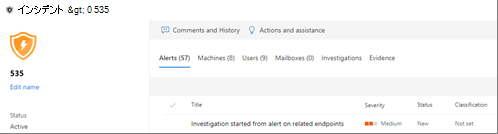

# 自動調査の詳細と結果Details and results of an automated investigation

[!INCLUDE [Microsoft 365 Defender rebranding](../includes/microsoft-defender.md)]

**適用対象:****Applies to:**
- Microsoft 365 DefenderMicrosoft 365 Defender

Microsoft 365 Defender では、自動調査が実行されると、その調査に関する詳細は、自動調査プロセス中と自動調査後の両方で利用できます。With Microsoft 365 Defender, when an [automated investigation](m365d-autoir.md) runs, details about that investigation are available both during and after the automated investigation process. [必要なアクセス許可](m365d-action-center.md#required-permissions-for-action-center-tasks)を持っている場合は、調査の詳細ビューでこれらの詳細を表示できます。If you have the [necessary permissions](m365d-action-center.md#required-permissions-for-action-center-tasks), you can view those details in an investigation details view. このビューでは、最新の状態と保留中のアクションを承認できます。This view provides you with up-to-date status and the ability to approve any pending actions. 

## (NEW!)統合された調査ページ(NEW!) Unified investigation page

調査ページが最近更新され、デバイス、電子メール、およびコラボレーション コンテンツ全体の情報が含まれます。The investigation page has recently been updated to include information across your devices, email, and collaboration content. 新しい統合された調査ページでは、共通言語が定義され [、Microsoft Defender for Endpoint](/windows/security/threat-protection/microsoft-defender-atp/microsoft-defender-advanced-threat-protection) および Microsoft Defender for Office 365 全体で自動調査 [を行う一元的なエクスペリエンスが](../office-365-security/defender-for-office-365.md)提供されます。The new, unified investigation page defines a common language and provides a unified experience for automatic investigations across [Microsoft Defender for Endpoint](/windows/security/threat-protection/microsoft-defender-atp/microsoft-defender-advanced-threat-protection) and [Microsoft Defender for Office 365](../office-365-security/defender-for-office-365.md). 統合調査ページにアクセスするには、次の黄色のバナーにあるリンクを選択します。To access the unified investigation page, select the link in the yellow banner you'll see on:

- コンプライアンス センター ( ) Office 365 セキュリティ &の調査ページ [https://protection.office.com](https://protection.office.com)Any investigation page in the Office 365 Security & Compliance Center ([https://protection.office.com](https://protection.office.com))
- Microsoft Defender セキュリティ センターの調査ページ ( [https://securitycenter.windows.com](https://securitycenter.windows.com) )Any investigation page in the Microsoft Defender Security Center ([https://securitycenter.windows.com](https://securitycenter.windows.com))
- Microsoft 365 セキュリティ センターでのインシデントまたはアクション センターのエクスペリエンス ( [https://security.microsoft.com](https://security.microsoft.com) )Any incident or Action center experience in the Microsoft 365 security center ([https://security.microsoft.com](https://security.microsoft.com))

## 調査の詳細ビューを開くOpen the investigation details view

調査の詳細ビューを開くには、次のいずれかの方法を使用できます。You can open the investigation details view by using one of the following methods:

- [アクション センターでアイテムを選択するSelect an item in the Action center](#select-an-item-in-the-action-center)
- [インシデントの詳細ページから調査を選択するSelect an investigation from an incident details page](#open-an-investigation-from-an-incident-details-page)

### アクション センターでアイテムを選択するSelect an item in the Action center

改善された[アクション センター](m365d-action-center.md) ( ) は、デバイス全体の修復アクション、電子メール、コラボレーション & ID を [https://security.microsoft.com/action-center](https://security.microsoft.com/action-center) まとめます。The improved [Action center](m365d-action-center.md) ([https://security.microsoft.com/action-center](https://security.microsoft.com/action-center)) brings together [remediation actions](m365d-remediation-actions.md) across your devices, email & collaboration content, and identities. リストされているアクションには、自動的または手動で実行された修復アクションが含まれます。Listed actions include remediation actions that were taken automatically or manually. アクション センターでは、承認を待っているアクションと、既に承認または完了したアクションを表示できます。In the Action center, you can view actions that are awaiting approval and actions that were already approved or completed. 調査ページなどの詳細に移動することもできます。You can also navigate to more details, such as an investigation page.

> [!TIP]
> アクションを承認 [、拒否、または](m365d-action-center.md#required-permissions-for-action-center-tasks) 元に戻すには、特定のアクセス許可が必要です。You must have [certain permissions](m365d-action-center.md#required-permissions-for-action-center-tasks) to approve, reject, or undo actions.

1. [https://security.microsoft.com](https://security.microsoft.com) に移動し、サインインします。Go to [https://security.microsoft.com](https://security.microsoft.com) and sign in. 

2. ナビゲーション ウィンドウで、[**アクション センター**] を選択します。In the navigation pane, choose **Action center**. 

3. [**保留中**] タブまたは [**履歴**] タブのいずれかでアイテムを選択します。On either the **Pending** or **History** tab, select an item. そのフライアウト ウィンドウが開きます。Its flyout pane opens.

4. フライアウト ウィンドウで情報を確認し、次のいずれかの手順を実行します。Review the information in the flyout pane, and then take one of the following steps:
   - [ **調査ページを開く]** を選択して、調査の詳細を表示します。Select **Open investigation page** to view more details about the investigation.
   - [承認 **] を** 選択して保留中のアクションを開始します。Select **Approve** to initiate a pending action.
   - 保留中 **のアクション** が実行されるのを防ぐには、[拒否] を選択します。Select **Reject** to prevent a pending action from being taken.
   - [Go **hunt] を** 選択して高度な [ハンティングに入る](advanced-hunting-overview.md)。Select **Go hunt** to go into [Advanced hunting](advanced-hunting-overview.md).

### インシデントの詳細ページから調査を開くOpen an investigation from an incident details page

インシデントの詳細ページを使用して、インシデントに関する詳細情報を表示します。これには、影響を受けたデバイス、ユーザー アカウント、またはメールボックスに関する情報がトリガーされた警告が含まれます。Use an incident details page to view detailed information about an incident, including alerts that were triggered information about any affected devices, user accounts, or mailboxes.

1. [https://security.microsoft.com](https://security.microsoft.com) にアクセスし、サインインします。Go to [https://security.microsoft.com](https://security.microsoft.com) and sign in. 

2. ナビゲーション ウィンドウで、[インシデント] を選択 **し、[インシデント&通知**  >  **します**。In the navigation pane, choose **Incidents & alerts** > **Incidents**. 

3. リストでアイテムを選択し、[インシデント ページを開 **く] を選択します**。Select an item in the list, and then choose **Open incident page**.

4. [調査 **] タブを** 選択し、一覧で調査を選択します。Select the **Investigations** tab, and then select an investigation in the list. そのフライアウト ウィンドウが開きます。Its flyout pane opens.

5. [調査 **ページを開く] を選択します**。Select **Open investigation page**. 

次に例を示します。Here's an example.

## 調査の詳細Investigation details

調査の詳細ビューを使用して、調査に関連する過去、現在、保留中のアクティビティを表示します。Use the investigation details view to see past, current, and pending activity pertaining to an investigation. 次に例を示します。Here's an example.

調査の詳細ビューでは、次の表で説明する [**Investigation graph (調査のグラフ)**]、[**Alerts (警告)**]、[**Device (デバイス)**]、[**Identities (ID)**]、[**Key findings (主な検出事項)**]、[**Entities (エンティティ)**]、[**Log (ログ)**]、[**Pending actions (保留中のアクション)**] の各タブに情報が表示されます。In the Investigation details view, you can see information on the **Investigation graph**, **Alerts**, **Devices**, **Identities**, **Key findings**, **Entities**, **Log**, and **Pending actions** tabs, described in the following table.

> [!NOTE]
> 調査の詳細ページに表示される特定のタブは、サブスクリプションに含まれる内容によって異なります。The specific tabs you see in an investigation details page depends on what your subscription includes. たとえば、サブスクリプションに Microsoft Defender for Office 365 プラン 2 が含まれる場合、[メールボックス] タブ **は表示** されません。For example, if your subscription does not include Microsoft Defender for Office 365 Plan 2, you won't see a **Mailboxes** tab.

| タブTab | 説明Description |
|:--------|:--------|
| **Investigation graph (調査グラフ)****Investigation graph**   | 調査を視覚的に表します。Provides a visual representation of the investigation. エンティティと検出された脅威のほか、警告、承認を待っているアクションがあるかどうかが示されます。Depicts entities and lists threats found, along with alerts and whether any actions are awaiting approval. グラフ上のアイテムを選択すると、詳細を表示できます。You can select an item on the graph to view more details. たとえば、[証拠]**アイコンを** 選択すると、[証拠]タブに移動し、検出されたエンティティとその評決を確認できます。For example, selecting the **Evidence** icon takes you to the **Evidence** tab, where you can see detected entities and their verdicts. |
| **Alerts****Alerts**    | 調査に関連する警告を一覧表示します。Lists alerts associated with the investigation. アラートは、ユーザーのデバイス、Office アプリ、Microsoft Cloud App Security、その他の Microsoft 365 Defender 機能の脅威保護機能から発生する可能性があります。Alerts can come from threat protection features on a user's device, in Office apps, Microsoft Cloud App Security, and other Microsoft 365 Defender features.|
| **デバイス****Devices** | 調査に含まれるデバイスとその修復レベルを一覧表示します。Lists devices included in the investigation along with their remediation level. (修復レベルは、 [デバイス グループのオートメーション レベルに対応します](m365d-configure-auto-investigation-response.md#review-or-change-the-automation-level-for-device-groups)。)(Remediation levels correspond to [the automation level for device groups](m365d-configure-auto-investigation-response.md#review-or-change-the-automation-level-for-device-groups).) |
| **メールボックス****Mailboxes** |検出された脅威の影響を受けたメールボックスを一覧表示します。Lists mailboxes that are impacted by detected threats.  |
| **Users****Users**  | 検出された脅威の影響を受けたユーザー アカウントを一覧表示します。Lists user accounts that are impacted by detected threats. |
| **証拠****Evidence** | アラートまたは調査によって発生した証拠の一部を一覧表示します。Lists pieces of evidence raised by alerts or investigations. 評決 (悪意のある、*疑わしい*、*不明* な、または脅威が見 *つからない)* と修復の状態が含まれます。Includes verdicts (*Malicious*, *Suspicious*, *Unknown*, or *No threats found*) and remediation status. |
| **Entities****Entities**  | 各エンティティの種類 (悪意のある、疑わしい、または脅威が見つからない)の評決を含む、分析された各エンティティの詳細 *を提供します*。Provides details about each analyzed entity, including a verdict for each entity type (*Malicious*, *Suspicious*, or *No threats found*).|
|**Log****Log**    | アラートがトリガーされた後に行ったすべての調査アクションの時系列的で詳細なビューを提供します。Provides a chronological, detailed view of all the investigation actions taken after an alert was triggered.|
| **保留中のアクションの履歴****Pending actions history** | 続けるには承認を必要とするアイテムを一覧表示します。Lists items that require approval to proceed. アクション センター ( ) に移動 [https://security.microsoft.com/action-center](https://security.microsoft.com/action-center) して、保留中のアクションを承認します。Go to the Action center ([https://security.microsoft.com/action-center](https://security.microsoft.com/action-center)) to approve pending actions. |

## 次の手順Next steps

- [修復アクションの表示と管理View and manage remediation actions](m365d-autoir-actions.md)
- [修復アクションの詳細Learn more about remediation actions](m365d-remediation-actions.md)
