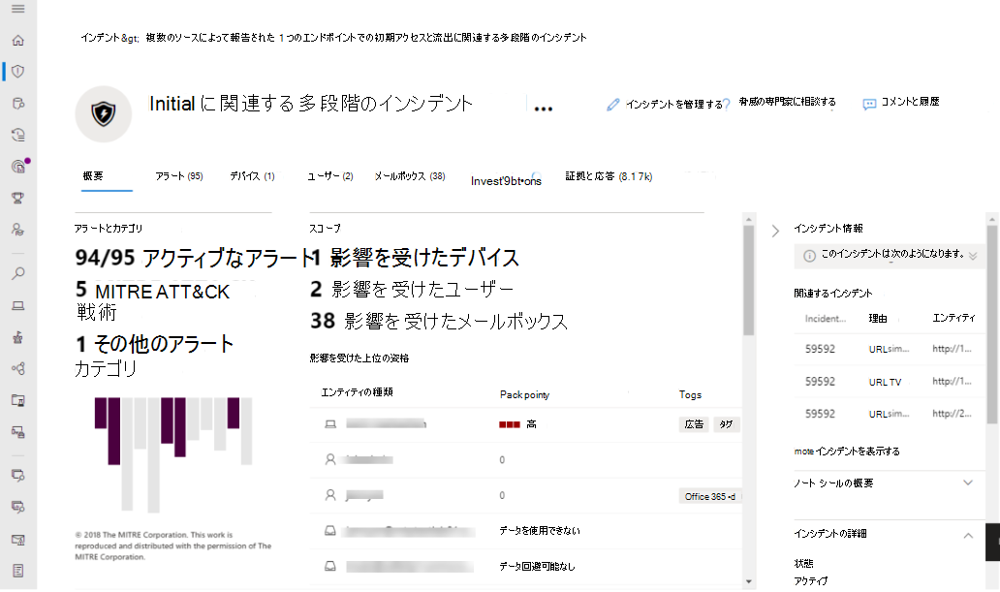

# Microsoft 365 Defender を有効にする

[!INCLUDE [Microsoft 365 Defender rebranding](../includes/microsoft-defender.md)]

**適用対象:**
- Microsoft 365 Defender

[Microsoft 365 Defender、Microsoft](microsoft-365-defender.md) Defender for Endpoint、Microsoft Defender for Office 365、Microsoft Cloud App Security、および Microsoft Defender for Identity を統合することで、インシデント対応プロセスを統合します。 この統合エクスペリエンスは、ポータルでアクセスできる強力な機能Microsoft 365 Defenderします。

Microsoft 365 Defenderアクセス許可を持つ対象ユーザーがポータルにアクセスすると、自動的にMicrosoft 365 Defenderされます。 この記事では、さまざまな前提条件とプロビジョニングのMicrosoft 365 Defender説明します。

## ライセンスの適格性と必要なアクセス許可を確認する

一般に、Microsoft 365製品のライセンスは、追加のライセンス コストなしでMicrosoft 365 Defenderを使用できます。 サポートされているサービスへのアクセスを提供するライセンスMicrosoft 365 E5 E5 Security、A5、A5 セキュリティ ライセンス、または有効なライセンスの組み合わせを取得することをお勧めします。

ライセンス情報に関する詳細については、[ライセンス要件をお読みください](prerequisites.md#licensing-requirements)。

### 役割を確認する

この機能を有効にするには、次のいずれかの役割Microsoft 365 Defender。
    
- グローバル管理者
- セキュリティ管理者
- セキュリティ オペレーター
- グローバル閲覧者
- セキュリティ閲覧者
- コンプライアンス管理者
- コンプライアンス データ管理者
- アプリケーション管理者
- クラウド アプリケーション管理者

[[ロールの表示] Azure AD](/azure/active-directory/users-groups-roles/directory-manage-roles-portal)

## サポートされているサービス

Microsoft 365 Defender は、ユーザーがすでに展開しているさまざまなサポート対象のサービスからデータを集約します。 データは一元的に処理および保存され、新しい分析情報が特定され、一元化された応答ワークフローが可能になります。 これは、既存の展開、設定、統合されたサービスに関連するデータに影響を与えることなく実行されます。

最適な保護と最適化をMicrosoft 365 Defender、該当するサポートされているサービスをネットワークに展開することをお勧めします。 詳細については、「サポート [されているサービスの展開」を参照してください](deploy-supported-services.md)。

## サービスにオンボードする
ユーザーへのオンボーディングMicrosoft 365 Defender簡単です。 ナビゲーション メニューから &、インシデント やアラート、ハンティング、アクション センター **、または** 脅威分析などの任意のアイテムを選択して、オンボーディング プロセスを開始します。  

### データ センターの場所

Microsoft 365 Defenderは、Microsoft Defender for Endpoint で使用されるのと同じ場所にデータ[を格納して処理します](/windows/security/threat-protection/microsoft-defender-atp/data-storage-privacy)。 Microsoft Defender for Endpoint をお持ちでない場合は、アクティブなセキュリティ サービスの場所に基づいて、新しいデータ センター Microsoft 365選択されます。 選択したデータ センターの場所が画面に表示されます。

別 **のデータ センターの場所** でのMicrosoft 365 Defenderに関する Microsoft サポートに問い合Microsoft 365 Defenderする場合は、[ヘルプが必要か] を選択します。

> [!NOTE]
> Azure Defender を使用してオンにした場合、Microsoft Defender for Endpoint は欧州連合 (EU) データ センターで自動的にプロビジョニングされました。 Microsoft 365 Defender、過去にこの方法で Defender for Endpoint をプロビジョニングしたお客様に対して、同じ EU データ センターで自動的にプロビジョニングされます。

### サービスが有効になっていることを確認する

サービスがプロビジョニングされると、次の機能が追加されます。

- [イベント管理](incidents-overview.md)
- [アラート キュー](investigate-alerts.md)
- [自動化された調査と対応](m365d-autoir.md)を管理するアクション センター
- [高度なハンティング](advanced-hunting-overview.md) 機能
- 脅威の分析

*Microsoft 365 Defender管理と他の機能を備* えたポータル

### Id データの Microsoft Defender の取得 
サーバーとの統合を有効Microsoft Cloud App Security、少なくとも 1 回は、Microsoft Cloud App Securityする必要があります。

## サポートを利用する

ユーザー設定のオンに関する最も一般的な質問に対する回答をMicrosoft 365 Defender FAQ[を参照してください](m365d-enable-faq.md)。

Microsoft サポート スタッフは、テナントのサービスおよび関連リソースのプロビジョニングまたはプロビジョニング解除を支援できます。 サポートについては、ポータルの **[ヘルプが必要ですかMicrosoft 365 Defender** します。 サポートに問い合わせする場合は、Microsoft 365 Defender。

## 関連項目

- [よく寄せられる質問](m365d-enable-faq.md)
- [ライセンス要件およびその他の前提条件](prerequisites.md)
- [サポートされているサービスを展開する](deploy-supported-services.md)
- [Microsoft 365 Defender概要](microsoft-365-defender.md)
- [Microsoft Defender for Endpoint の概要](../defender-endpoint/microsoft-defender-endpoint.md)
- [Defender for Office 365概要](../office-365-security/defender-for-office-365.md)
- [Microsoft Cloud App Security の概要](/cloud-app-security/what-is-cloud-app-security)
- [Microsoft Defender for Identity の概要](/azure-advanced-threat-protection/what-is-atp)
- [Microsoft Defender for Endpoint data storage](../defender-endpoint/data-storage-privacy.md)
