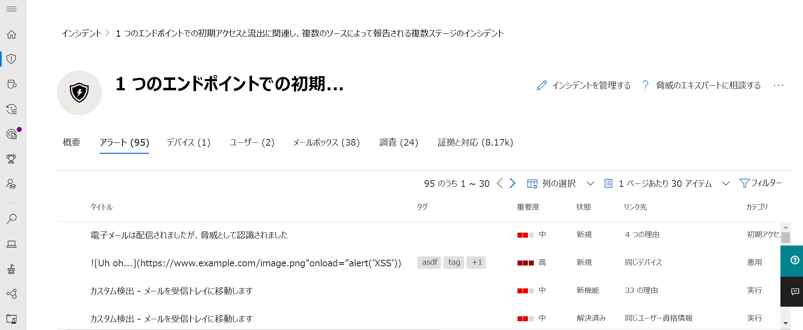
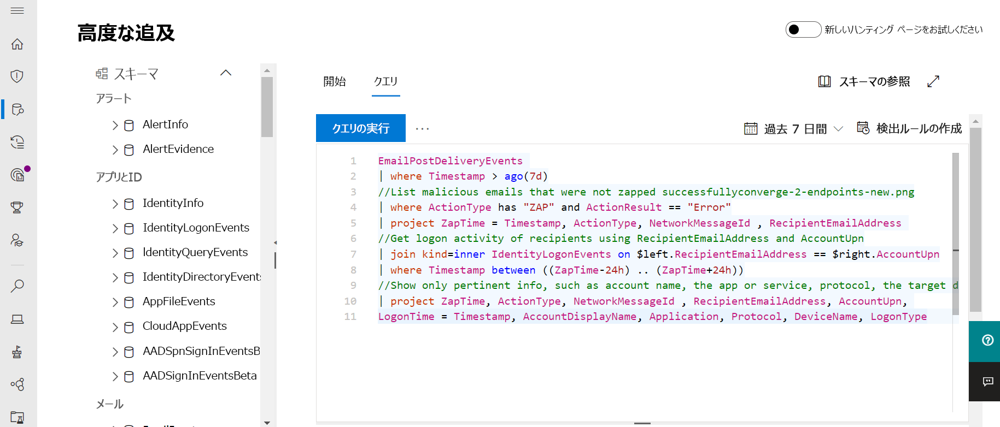

# Microsoft 365 Defender

[!INCLUDE [Microsoft 365 Defender rebranding](../includes/microsoft-defender.md)]

**適用対象:**
- Microsoft 365 Defender

> Microsoft 365 Defender を体験してみませんか? [ラボ環境で評価する](m365d-evaluation.md?ocid=cx-docs-MTPtriallab)ことも、[実稼働環境でパイロット プロジェクトを実行する](m365d-pilot.md?ocid=cx-evalpilot)こともできます。
>

Microsoft 365 Defender は、エンドポイント、ID、メール、およびアプリケーション全体での検出、防止、調査、応答をネイティブに調整し、高度な攻撃に対する統合された保護を提供する、侵害の前後に対応した統合エンタープライズ防御スイートです。

統合されたMicrosoft 365 Defenderソリューションを使用すると、セキュリティ専門家は、これらの各製品が受け取る脅威信号を一緒にまとめ、脅威の全範囲と影響を特定できます。環境に入った方法、影響を受けるもの、組織に現在どのように影響を与えています。 Microsoft 365 Defender攻撃を防止または停止し、影響を受けるメールボックス、エンドポイント、およびユーザー ID を自己回復する自動アクションを実行します。  

<h2>Microsoft 365 Defenderサービス
</h2>
<table><tr><td>
<b><a href="/windows/security/threat-protection/microsoft-defender-atp/microsoft-defender-advanced-threat-protection"><b>エンドポイント用 Microsoft Defender</b>
</a></td>
<td>
<b><a href="/office365/securitycompliance/office-365-atp"><b>Microsoft Defender for Office 365</b>
</a></td>
<td>
<b><a href="/azure-advanced-threat-protection/"><b>Microsoft Defender for Identity</b></a>
</td>
<td>
<b><a href="/cloud-app-security/"><b>Microsoft Cloud App Security</b></a>
</td>
</tr>
</table>
 

## Microsoft 365 Defenderガイド

この対話型ガイドでは、組織をセキュリティで保護する方法についてMicrosoft 365 Defender。 セキュリティ リスクの検出、Microsoft 365 Defender攻撃の調査、有害なアクティビティの自動防止に役立つ情報が表示されます。

[対話型のガイドをチェックしてください](https://aka.ms/M365Defender-InteractiveGuide)

Microsoft 365 Defender スイートは次のものを保護します。 
- **Microsoft Defender for Endpoint** を使用するエンドポイント - Microsoft Defender for Endpoint は、予防保護、侵害後の検出、自動調査、および対応のための統合エンドポイント プラットフォームです。 
- **Microsoft Defender for Office 365** との電子メールとコラボレーション - Office 365 Defender は、電子メール メッセージ、リンク (URL)、およびコラボレーション ツールによる悪意のある脅威から組織を保護します。 
- **Id** と Microsoft Defender for Identity と Azure AD Identity Protection - Microsoft Defender for Identity は、Active Directory シグナルを使用して、組織に向けられた高度な脅威、侵害された ID、悪意のあるインサイダー アクションを特定、検出、および調査します。 
- **Microsoft Cloud App** セキュリティを備えたアプリケーション - Microsoft Cloud App セキュリティは、クラウド アプリに深い可視性、強力なデータ制御、強化された脅威保護をもたらす包括的なクロス SaaS ソリューションです。 

>[!VIDEO https://www.microsoft.com/en-us/videoplayer/embed/RE4Bzww] 

Microsoft 365 Defender固有のクロスプロダクト レイヤーは、個々のスイート コンポーネントを次の値に拡張します。
- 信号の共有と自動化されたアクションを通じて、攻撃から保護し、スイート全体の防御応答を調整するのに役立ちます
- アラート、疑わしいイベント、影響を受けた資産に関するデータを 「インシデント」 に参加することで、セキュリティ チームの製品アラート、動作、コンテキスト全体にわたる攻撃の全ストーリーを説明します。
- 影響を受け取ったアセットの自己修復を自動修復でトリガーすることで、侵害への対応を自動化する
- セキュリティ チームがエンドポイントとデータ全体で詳細かつ効果的な脅威Office可能

  
製品間インシデント (概要)

 
スイート製品全体のすべての関連アラートが 1 つのインシデントに関連付け (アラート ビュー)

 
電子メールとエンドポイントの生データの上でのクエリ ベースの検索

Microsoft 365 Defender機能には、次のものが含まれます。 
- **ガラスの** 製品間単一ウィンドウ - 1 つのキューと security.microsoft.com の 1 つのウィンドウで、検出、影響を受けるアセット、自動操作、および関連する証拠に関するすべての情報を中央表示 [します](https://security.microsoft.com)。 
- **複合インシデント** キュー - セキュリティ専門家が攻撃範囲全体を確保することで重要な作業に集中するために、影響を受けたアセットと自動修復アクションがグループ化され、適切な時期に表示されます。 
- **脅威への自動対応**- 重大な脅威情報は、攻撃の進行を停止するために、Microsoft 365 Defender製品間でリアルタイムで共有されます。 たとえば、Microsoft Defender for Endpoint で保護されたエンドポイントで悪意のあるファイルが検出された場合、すべての電子メール メッセージからファイルをスキャンして削除するように defender に Office 365 に指示します。 このファイルは、セキュリティ スイート全体によってMicrosoft 365されます。
- **侵害されたデバイス**、ユーザー ID、メールボックスの自己修復 - Microsoft 365 Defender は、AI による自動アクションとプレイブックを使用して、影響を受け取ったアセットを安全な状態に戻します。 Microsoft 365 Defenderスイート製品の自動修復機能を活用して、インシデントに関連する影響を受けたすべての資産を可能な限り自動的に修復します。
- **製品間の脅威** の検出 - セキュリティ チームは、独自の組織の知識を活用して、さまざまな保護製品によって収集された生データに対して独自のカスタム クエリを作成することで、侵害の兆候を探し出します。 Microsoft 365 Defenderは、エンドポイント全体で 30 日間の過去の生信号とアラート データにクエリ ベースのアクセスを提供し、データをOffice 365します。 

## 作業の開始
Microsoft 365 Defenderポータルでサービスを有効にする前に、ライセンス要件を満Microsoft 365 Defender必要[security.microsoft.com。](https://security.microsoft.com) 詳細については、以下を参照してください。
- [ライセンス要件](prerequisites.md#licensing-requirements)
- [Microsoft 365 Defender を有効にする](m365d-enable.md)

## 関連項目
- [脅威保護機能を複数のユーザーに展開Microsoft 365 E5](/microsoft-365/solutions/deploy-threat-protection)
