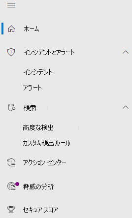
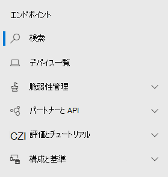

# Microsoft 365 セキュリティ センターの Microsoft Defender for EndpointMicrosoft Defender for Endpoint in the Microsoft 365 security center

[!INCLUDE [Microsoft 365 Defender rebranding](../includes/microsoft-defender.md)]

[!INCLUDE [Prerelease](../includes/prerelease.md)]

**適用対象:****Applies to:**

- [Microsoft 365 DefenderMicrosoft 365 Defender](microsoft-365-defender.md)
- [Microsoft Defender for EndpointMicrosoft Defender for Endpoint](https://go.microsoft.com/fwlink/p/?linkid=2154037)
- [Microsoft Defender for Office 365Microsoft Defender for Office 365](/microsoft-365/security/office-365-security/defender-for-office-365)

強化された [Microsoft 365](overview-security-center.md) セキュリティ センターは、電子メール、コラボレーション、ID、デバイスの脅威を保護、検出、調査、および対応するセキュリティ機能を組み合 [https://security.microsoft.com](https://security.microsoft.com) わせたもの。The improved [Microsoft 365 security center](overview-security-center.md) at [https://security.microsoft.com](https://security.microsoft.com) combines security capabilities that protect, detect, investigate, and respond to email, collaboration, identity, and device threats. このセキュリティ センターは、Microsoft Defender セキュリティ センターやコンプライアンス センターの Office 365 セキュリティ &など、既存の Microsoft セキュリティ ポータルの機能を統合します。This security center brings together functionality from existing Microsoft security portals, including Microsoft Defender Security Center and the Office 365 Security & Compliance center.

Microsoft Defender セキュリティ センターについて理解している場合、この記事では、強化された Microsoft 365 セキュリティ センターの変更点と改善点の一部について説明します。If you're familiar with the Microsoft Defender Security Center, this article helps describe some of the changes and improvements in the improved Microsoft 365 security center. ただし、注意が必要な新しい要素と更新された要素があります。However there are some new and updated elements to be aware of.

これまで [、Microsoft Defender セキュリティ センターは](/windows/security/threat-protection/microsoft-defender-atp/portal-overview) Microsoft Defender for Endpoint のホームでした。Historically, the [Microsoft Defender Security Center](/windows/security/threat-protection/microsoft-defender-atp/portal-overview) has been the home for Microsoft Defender for Endpoint. エンタープライズ セキュリティ チームは、高度な永続的な脅威アクティビティやデータ侵害の可能性に関するアラートの監視と対応に使用しています。Enterprise security teams have used it to monitor and help responding to alerts of potential advanced persistent threat activity or data breaches. ポータルの数を減らすのに役立つ Microsoft 365 セキュリティ センターは、Microsoft ID、データ、デバイス、アプリ、インフラストラクチャ全体のセキュリティを監視および管理するホームになります。To help reduce the number of portals, the Microsoft 365 security center will be the home for monitoring and managing security across your Microsoft identities, data, devices, apps, and infrastructure.

Microsoft 365 セキュリティ センターの Microsoft Defender for Endpoint は[、Microsoft Defender](mssp-access.md)セキュリティ センターでアクセスを許可するのと同じ方法で、マネージド セキュリティ サービス プロバイダー [(MSSP)](/windows/security/threat-protection/microsoft-defender-atp/grant-mssp-access)へのアクセス許可をサポートしています。Microsoft Defender for Endpoint in the Microsoft 365 security center supports [granting access to managed security service providers (MSSPs)](/windows/security/threat-protection/microsoft-defender-atp/grant-mssp-access) in the same way [access is granted in the Microsoft Defender security center](mssp-access.md).

> [!IMPORTANT]
> Microsoft 365 セキュリティ センターに表示される内容は、現在のサブスクリプションによって異なります。What you see in the Microsoft 365 security center depends on your current subscriptions. たとえば、Microsoft Defender for Office 365 のライセンスをお持ちではない場合、[メール & コラボレーション] セクションは表示されません。For example, if you don't have a license for Microsoft Defender for Office 365, then the Email & Collaboration section will not be shown.

>[!Note]
>新しい統合ポータルは、次の場合は使用できません。The new unified portal is not available for:
>- 米国政府機関コミュニティ クラウド (GCC)US Government Community Cloud (GCC)
>- US Government Community Cloud High (GCC High)US Government Community Cloud High (GCC High)
>- 米国国防総省US Department of Defense
>- 商用ライセンスを持つすべての米国政府機関All US government institutions with commercial licenses

改善された Microsoft 365 セキュリティ センターを見 [https://security.microsoft.com](https://security.microsoft.com) てみろ。Take a look at the improved Microsoft 365 security center: [https://security.microsoft.com](https://security.microsoft.com).

利点の詳細説明: [Microsoft 365 セキュリティ センターの概要](overview-security-center.md)Learn more about the benefits: [Overview of the Microsoft 365 security center](overview-security-center.md)

## 変更内容What's changed

次の表は、Microsoft Defender セキュリティ センターと Microsoft 365 セキュリティ センターの間の変更点の簡単な参照です。This table is a quick reference of the changes between the Microsoft Defender Security Center and the Microsoft 365 security center.

### アラートとアクションAlerts and actions

|**領域****Area**  |**変更の説明****Description of change** |
|---------|---------|
| [インシデント&アラートIncidents & alerts](incidents-overview.md)  | Microsoft 365 セキュリティ センターでは、すべてのエンドポイント、電子メール、および ID でインシデントとアラートを管理できます。In the Microsoft 365 security center, you can manage incidents and alerts across all of your endpoints, email, and identities. 関連するイベントを簡単に見つけ出すのに役立つエクスペリエンスを統合しました。We've converged the experience to help you find related events more easily. 詳細については、「インシデントの [概要」を参照してください](incidents-overview.md)。For more information, see [Incidents Overview](incidents-overview.md).   |
| [検索Hunting](advanced-hunting-overview.md)  |  Microsoft Defender for Endpoint で作成されたカスタム検出ルールを変更して、ID テーブルと電子メール テーブルを含め、自動的に Microsoft 365 Defender に移動します。Modifying custom detection rules created in Microsoft Defender for Endpoint to include identity and email tables automatically moves them to Microsoft 365 Defender. 対応するアラートは Microsoft 365 Defender にも表示されます。Their corresponding alerts will also appear in Microsoft 365 Defender. これらの変更の詳細については、「カスタム検出ルールの移行 [」を参照してください](advanced-hunting-migrate-from-mde.md#migrate-custom-detection-rules)。For more details about these changes, read [Migrate custom detection rules](advanced-hunting-migrate-from-mde.md#migrate-custom-detection-rules).   高度 `DeviceAlertEvents` な検索の表は、Microsoft 365 Defender では使用できません。The `DeviceAlertEvents` table for advanced hunting isn't available in Microsoft 365 Defender. Microsoft 365 Defender でデバイス固有のアラート情報を照会するには、テーブルとテーブルを使用して、さまざまなソース セットからのさらに多くの情報に `AlertInfo` `AlertEvidence` 対応できます。To query device-specific alert information in Microsoft 365 Defender, you can use the `AlertInfo` and `AlertEvidence` tables to accommodate even more information from a diverse set of sources. [DeviceAlertEvents](advanced-hunting-migrate-from-mde.md#write-queries-without-devicealertevents)なしで書き込みクエリを実行して、次のデバイス関連のクエリを作成します。Craft your next device-related query by following [Write queries without DeviceAlertEvents](advanced-hunting-migrate-from-mde.md#write-queries-without-devicealertevents).|
|[アクション センターAction center](m365d-action-center.md)    | 自動調査と修復アクションに続いて実行された保留中のアクションと完了したアクションを一覧表示します。Lists pending and completed actions that were taken following automated investigations and remediation actions. 以前は、Microsoft Defender セキュリティ センターのアクション センターには、デバイスでのみ実行される修復アクションの保留中および完了したアクションが一覧表示され、自動調査ではアラートと状態が一覧表示されました。Formerly, the Action center in the Microsoft Defender Security Center listed pending and completed actions for remediation actions taken on devices only, while Automated investigations listed alerts and status. 強化された Microsoft 365 セキュリティ センターでは、アクション センターでは、電子メール、デバイス、およびユーザー間の修復アクションと調査を 1 つの場所にまとめます。In the  improved Microsoft 365 security center, the Action center brings together remediation actions and investigations across email, devices, and users—all in one location.  |
| [脅威の分析Threat analytics](threat-analytics.md) |  ナビゲーション バーの上部に移動し、検出と使用を容易にします。Moved to the top of the navigation bar for easier discovery and use. エンドポイントと電子メールとコラボレーションの両方に関する脅威情報が含まれる。Now includes threat information for both endpoints and email and collaboration.    |

### エンドポイントEndpoints

|**領域****Area**  |**変更の説明****Description of change**  |
|---------|---------|
|検索Search   |  見出しの代わりに、Microsoft Defender for Endpoint 検索バーが [エンドポイント] セクションの下を移動しています。Instead of being in the heading, Microsoft Defender for Endpoint search bar is moving under the Endpoints section. 引き続きデバイス、ファイル、ユーザー、URL、IPs、脆弱性、ソフトウェア、推奨事項を検索できます。You can continue to search for devices, files, users, URLs, IPs, vulnerabilities, software, and recommendations.  |
|[ダッシュボードDashboard](/windows/security/threat-protection/microsoft-defender-atp/security-operations-dashboard)   |  これは、セキュリティ操作ダッシュボードです。This is your security operations dashboard. アクティブなアラートがトリガーされた数、どのデバイスが危険にさらされているか、どのユーザーが危険にさらされているのか、アラート、デバイス、およびユーザーの重大度レベルの概要を参照してください。See an overview of how many active alerts were triggered, which devices are at risk, which users are at risk, and severity level for alerts, devices, and users. また、センサーの問題が発生したデバイス、サービス全体の正常性、未解決のアラートが検出された方法も確認できます。You can also see if any devices have sensor issues, your overall service health, and how any unresolved alerts were detected. |
|デバイス一覧Device inventory | 変更はありません。No changes. |
|[脆弱性管理Vulnerability management](/windows/security/threat-protection/microsoft-defender-atp/next-gen-threat-and-vuln-mgt)    |    ナビゲーション ウィンドウに収まる名前が短縮されました。Name was shortened to fit in the navigation pane. 脅威と脆弱性の管理セクションと同じで、すべてのページが下に表示されます。It's the same as the threat and vulnerability management section, with all the pages underneath.     |
| パートナーと APIPartners and APIs | 変更はありません。No changes. |
| 評価&チュートリアルEvaluations & tutorials    |     新しいテストと学習機能。New testing and learning capabilities.     |
| 構成管理環境Configuration management   |  変更はありません。No changes.  |

> [!NOTE]
> **自動調査と修復** は、インシデントの一部です。**Automatic investigation and remediation** is now a part of  incidents. [インシデントの調査] タブには、[自動調査と修復イベント> **確認** できます。You can see Automated  investigation and remediation events in the **Incident > Investigation** tab.

### アクセスとレポートAccess and reporting

|**領域****Area**  |**変更の説明****Description of change**  |
|---------|---------|
| レポートReports  | 脅威の保護、デバイスの正常性とコンプライアンス、脆弱な&など、エンドポイントと電子メール のコラボレーションに関するレポートを参照してください。See reports for endpoints and email & collaboration, including Threat protection, Device health and compliance, and Vulnerable devices. |
| 正常性Health  |  現在、Microsoft 365 管理センターの [サービス正常性] [ページにリンクしています](https://admin.microsoft.com/)。Currently links out to the "Service health" page in the [Microsoft 365 admin center](https://admin.microsoft.com/). |
| 設定Settings |  Microsoft 365 セキュリティ センター、Microsoft 365 Defender、Endpoints、Email &コラボレーション、ID、デバイス検出の設定を管理します。Manage your settings for the Microsoft 365 security center, Microsoft 365 Defender, Endpoints, Email & collaboration, Identities, and Device discovery.   |

## Microsoft 365 のセキュリティ ナビゲーションと機能Microsoft 365 security navigation and capabilities

左側のナビゲーションまたはクイック起動バーは見慣れたものに見えます。The left navigation, or quick launch bar, will look familiar. ただし、このセキュリティ センターには、いくつかの新しい要素や更新された要素があります。However, there are some new and updated elements in this security center.

### インシデントと警告Incidents and alerts

メール、デバイス、ID 全体でインシデントと通知の管理を 1 か所で行います。Brings together incident and alert management across your email, devices, and identities. アラート ページは、攻撃信号を組み合わせて詳細なストーリーを作成することで、アラートに対する完全なコンテキストを提供します。The alert page provides full context to the alert by combining attack signals to construct a detailed story. 新しく統合されたエクスペリエンスにより、さまざまなワークロード全体で一貫した警告が表示されます。A new, unified experience now brings together a consistent view of alerts across workloads. トリアージ、調査、効果的なアクションをすばやく実行できます。You can quickly triage, investigate, and take effective action.

- [インシデントの詳細Learn more about incidents](incidents-overview.md)
- [通知の管理に関するその他の情報Learn more about managing alerts](investigate-alerts.md)

### 検索Hunting

エンドポイント、Office 365 メールボックスなどに対する脅威、マルウェア、悪意のあるアクティビティを積極的に検索するために、[高度な検索クエリ](advanced-hunting-overview.md)を使用します。Proactively search for threats, malware, and malicious activity across your endpoints, Office 365 mailboxes, and more by using [advanced hunting queries](advanced-hunting-overview.md). これらの強力なクエリを使用して、既知の脅威と潜在的な脅威の両方について脅威インジケーターとエンティティを見つけて確認できます。These powerful queries can be used to locate and review threat indicators and entities for both known and potential threats.

[カスタム検出ルールは](custom-detection-rules.md) 、高度な検索クエリから構築して、侵害アクティビティや誤った構成済みデバイスを示す可能性があるイベントを事前に監視するのに役立ちます。[Custom detection rules](custom-detection-rules.md) can be built from advanced hunting queries to help you proactively watch for events that might be indicative of breach activity and misconfigured devices.

### アクション センターAction center

アクション センターには、自動調査と自動応答機能によって作成された調査が表示されます。Action center shows you the investigations created by automated investigation and response capabilities. この Microsoft 365 Defender の自動自己修復機能は、特定のイベントに自動的に応答することでセキュリティ チームを支援します。This automated, self-healing in Microsoft 365 Defender can help security teams by automatically responding to specific events.

[アクション センターの詳細Learn more about the Action center](m365d-action-center.md)

### 脅威の分析Threat Analytics

専門家の Microsoft セキュリティ調査員から脅威インテリジェンスを取得します。Get threat intelligence from expert Microsoft security researchers. 脅威の分析は、新たな脅威に直面している場合に、セキュリティ チームの効率を向上するのに役立ちます。Threat Analytics helps security teams be more efficient when facing emerging threats. 脅威の分析には以下が含まれます。Threat Analytics includes:

- Microsoft Defender for Office 365 からのメール関連の検出と移行。Email-related detections and mitigations from Microsoft Defender for Office 365. これは、Microsoft Defender for Endpoint から既に利用できるエンドポイント データに加えて表示されます。This is in addition to the endpoint data already available from Microsoft Defender for Endpoint.
- 脅威に関連するインシデントが表示されます。Incidents view related to the threats.
- レポート内のアクション可能な情報をすばやく認識して使用するための強化されたエクスペリエンス。Enhanced experience for quickly identifying and using actionable information in the reports.

脅威分析には、Microsoft 365 セキュリティ センターの左上のナビゲーション バーから、または組織の上位の脅威を示す専用のダッシュボード カードからアクセスできます。You can access threat analytics either from the upper left navigation bar in the Microsoft 365 security center, or from a dedicated dashboard card that shows the top threats for your organization.

[[脅威の分析を使用して、新たな脅威を追跡し対応する]](./threat-analytics.md)の詳細説明Learn more about how to [track and respond to emerging threats with threat analytics](./threat-analytics.md)

### [エンドポイント] セクションEndpoints section

組織のエンドポイントのセキュリティを表示および管理します。View and manage the security of endpoints in your organization. Microsoft Defender セキュリティ センターを使用している場合は、よく知られているものに見えます。If you've used the Microsoft Defender Security Center, it will look familiar.

### アクセスとレポートAccess and reports

レポートの表示、設定の変更、およびユーザーの役割変更を行います。View reports, change your settings, and modify user roles.

![[アクセスとレポート] クイック起動バー](../../media/converge-4-access-and-reporting-new.png)

### SIEM API 接続SIEM API connections

Defender for [Endpoint SIEM API を使用する場合](../defender-endpoint/enable-siem-integration.md)は、引き続き実行できます。If you use the [Defender for Endpoint SIEM API](../defender-endpoint/enable-siem-integration.md), you can continue to do so. Microsoft 365 セキュリティ ポータルのアラート ページまたはインシデント ページをポイントする新しいリンクが API ペイロードに追加されました。We’ve added new links on the API payload that point to the alert page or the incident page in the Microsoft 365 security portal. 新しい API フィールドには、LinkToMTP と IncidentLinkToMTP が含まれます。New API fields include LinkToMTP and IncidentLinkToMTP. 詳細については、「アカウントを Microsoft Defender for Endpoint から [Microsoft 365 セキュリティ センターにリダイレクトする」を参照してください](./microsoft-365-security-mde-redirection.md)。For more information, see [Redirecting accounts from Microsoft Defender for Endpoint to the Microsoft 365 security center](./microsoft-365-security-mde-redirection.md).

### 電子メール通知Email alerts

Defender for Endpoint の電子メール 通知は引き続き使用できます。You can continue to use email alerts for Defender for Endpoint. Microsoft 365 セキュリティ センターのアラート ページまたはインシデント ページを指す新しいリンクがメールに追加されました。We've added new links in the emails that point to the alert page or the incident page in the Microsoft 365 security center. 詳細については、「アカウントを Microsoft Defender for Endpoint から [Microsoft 365 セキュリティ センターにリダイレクトする」を参照してください](./microsoft-365-security-mde-redirection.md)。For more information, see [Redirecting accounts from Microsoft Defender for Endpoint to the Microsoft 365 security center](./microsoft-365-security-mde-redirection.md).

## 関連情報Related information

- [Microsoft 365 セキュリティ センターMicrosoft 365 security center](overview-security-center.md)
- [Microsoft 365 セキュリティ センターの Microsoft Defender for EndpointMicrosoft Defender for Endpoint in the Microsoft 365 security center](microsoft-365-security-center-mde.md)
- [アカウントを Microsoft Defender for Endpoint から Microsoft 365 セキュリティ センターにリダイレクトするRedirecting accounts from Microsoft Defender for Endpoint to the Microsoft 365 security center](microsoft-365-security-mde-redirection.md)