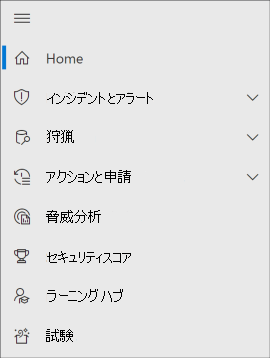
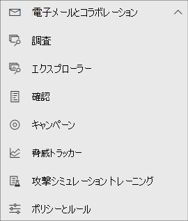
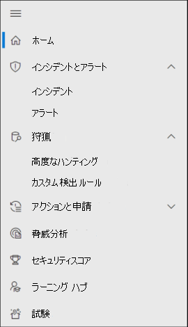
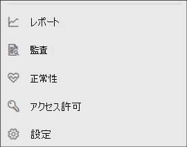

# Microsoft 365 Defender の Microsoft Defender for Office 365

[!INCLUDE [Microsoft 365 Defender rebranding](../includes/microsoft-defender.md)]

**適用対象:**
- [Microsoft 365 Defender](microsoft-365-defender.md)
- [Microsoft Defender for Office 365](/microsoft-365/security/office-365-security/defender-for-office-365)

## クイック リファレンス

次の表に、セキュリティ & コンプライアンス センターとMicrosoft 365 Defenderの間のナビゲーションの変更を示します。

****

|[セキュリティ/コンプライアンス センター](https://protection.office.com)|[Microsoft 365 Defender](https://security.microsoft.com)|[Microsoft Purview コンプライアンス ポータル](https://compliance.microsoft.com/homepage)|[Exchange 管理センター](https://admin.exchange.microsoft.com)|
|---|---|---|---|
|アラート|<ul><li>[アラート ポリシー](https://security.microsoft.com/alertpolicies)</li><li>[インシデント&アラート](https://security.microsoft.com/alerts)</li></ul>|[[アラート] ページ](https://compliance.microsoft.com/homepage)||
|分類||[Microsoft Purview コンプライアンス ポータル](https://compliance.microsoft.com/homepage)を参照してください||
|データ損失防止||[Microsoft Purview コンプライアンス ポータル](https://compliance.microsoft.com/homepage)を参照してください||
|レコード管理||[Microsoft Purview コンプライアンス ポータル](https://compliance.microsoft.com/homepage)を参照してください||
|情報ガバナンス||[Microsoft Purview コンプライアンス ポータル](https://compliance.microsoft.com/homepage)を参照してください||
|脅威の管理|[Email &コラボレーション](https://security.microsoft.com/homepage)|||
|アクセス許可|[ロール&アクセス許可](https://security.microsoft.com/emailandcollabpermissions)|[Microsoft Purview コンプライアンス ポータル](https://compliance.microsoft.com/homepage)を参照してください||
|メール フロー|||[Exchange 管理センター](https://admin.exchange.microsoft.com/#/)を参照してください|
|データのプライバシー||[Microsoft Purview コンプライアンス ポータル](https://compliance.microsoft.com/homepage)を参照してください||
|検索|[監査](https://security.microsoft.com/auditlogsearch?viewid=Async%20Search)|検索 (コンテンツ検索)||
|レポート|[Report](https://security.microsoft.com/emailandcollabreport)|||
|サービス アシュアランス||[Microsoft Purview コンプライアンス ポータル](https://compliance.microsoft.com/homepage)を参照してください||
|監督||[Microsoft Purview コンプライアンス ポータル](https://compliance.microsoft.com/homepage)を参照してください||
|電子情報開示||[Microsoft Purview コンプライアンス ポータル](https://compliance.microsoft.com/homepage)を参照してください||

[Microsoft 365 Defender](./microsoft-365-defender.md)は<a href="https://go.microsoft.com/fwlink/p/?linkid=2077139" target="_blank"><https://security.microsoft.com></a>、セキュリティ & コンプライアンス センターなど、既存の Microsoft セキュリティ ポータルのセキュリティ機能を組み合わせたものです。 この強化されたセンターは、セキュリティ チームが脅威から組織を効果的かつ効率的に保護するのに役立ちます。

セキュリティ & コンプライアンス センター (protection.office.com) について理解している場合は、この記事では、Microsoft 365 Defenderの変更点と機能強化の一部について説明します。

利点の詳細を確認する: [Microsoft 365 Defenderの概要](microsoft-365-defender.md)

コンプライアンス関連の項目をお探しの場合は、<a href="https://go.microsoft.com/fwlink/p/?linkid=2077149" target="_blank">Microsoft Purview コンプライアンス ポータル</a>にアクセスしてください。

## 新機能と改善された機能

左側のナビゲーションまたはクイック起動バーは見慣れたものに見えます。 ただし、この Defender for Cloud には、いくつかの新しい要素と更新された要素があります。

統合されたMicrosoft 365 Defender ソリューションを使用すると、脅威シグナルを結合し、脅威の完全な範囲と影響、およびそれが組織にどのような影響を与えているかを判断できます。

Defender for Office 365は、電子メール メッセージ、リンク (URL)、およびコラボレーション ツールによってもたらされる悪意のある脅威から組織を保護します。

### インシデントと警告

メール、デバイス、ID 全体でインシデントと通知の管理を 1 か所で行います。 現在、警告が [調査] ノードの下に表示されており、攻撃のより広範なビューを提供しています。 警告ページには、攻撃シグナルを組み合わせて詳細なストーリーを構築することで、アラートの完全なコンテキストが提供されます。 以前は、アラートはさまざまなワークロードに特有のものでした。 新しく統合されたエクスペリエンスにより、さまざまなワークロード全体で一貫した警告が表示されます。 トリアージ、調査、効果的なアクションをすばやく実行できます。

- [調査の詳細](incidents-overview.md)
- [通知の管理に関するその他の情報](/windows/security/threat-protection/microsoft-defender-atp/review-alerts)

### 検索

エンドポイント、Office 365 メールボックスなどに対する脅威、マルウェア、悪意のあるアクティビティを積極的に検索するために、[高度な検索クエリ](advanced-hunting-overview.md)を使用します。 これらの強力なクエリを使用して、既知の脅威と潜在的な脅威の両方を示す脅威インジケーターとエンティティを見つけて確認できます。

[カスタム検出ルール](/windows/security/threat-protection/microsoft-defender-atp/custom-detection-rules) は、高度なハンティング クエリから構築でき、侵害アクティビティや不適切な構成されたデバイスを示す可能性があるイベントを事前に監視するのに役立ちます。

Microsoft Defender for Office 365での[高度なハンティングの例](advanced-hunting-example.md)を次に示します。

### アクション センター

アクション センターには、自動調査と自動応答機能によって作成された調査が表示されます。 この Microsoft 365 Defender の自動自己修復機能は、特定のイベントに自動的に応答することでセキュリティ チームを支援します。

[アクション センター](m365d-action-center.md)の詳細については、こちらを参照してください。

#### 脅威の分析

専門家の Microsoft セキュリティ調査員から脅威インテリジェンスを取得します。 脅威の分析は、新たな脅威に直面している場合に、セキュリティ チームの効率を向上するのに役立ちます。 脅威の分析には以下が含まれます。

- Microsoft Defender for Office 365 からのメール関連の検出と移行。 これは、Microsoft Defender for Endpoint から既に利用できるエンドポイント データに加えて表示されます。
- 脅威に関連するインシデントが表示されます。
- レポート内のアクション可能な情報をすばやく認識して使用するための強化されたエクスペリエンス。

脅威分析には、Microsoft 365 Defenderの左上のナビゲーション バーから、または組織のトップ脅威を示す専用ダッシュボード カードからアクセスできます。

脅威分析を使用して [、新たな脅威を追跡して対応する](./threat-analytics.md)方法の詳細を確認します。

### メールと共同作業

ユーザーのメールへの脅威を追跡および調査し、キャンペーンなどを追跡します。 セキュリティ & コンプライアンス センターを使用したことがある場合、これはよく知られています。

  
#### [メール エンティティ] ページ

[Email エンティティ ページ](../office-365-security/mdo-email-entity-page.md)は、過去のさまざまなページまたはビューに散在していた電子メール情報を *統合* します。 脅威と傾向に関するメールの調査結果は、*1 か所に集中しています*。 ヘッダー情報とメールプレビューは、他の便利なメール関連情報と共に同じメール ページからアクセスできます。 同様に、悪意のある添付ファイルまたは URL に対するデトネーションの状態は、同じページのタブにあります。 [メール エンティティ] ページは、管理者やセキュリティ運用チームがメールの脅威とその状態をすばやく把握し、処理を迅速に決定するのに役立ちます。

### アクセスとレポート

レポートの表示、設定の変更、およびユーザーの役割変更を行います。

  
> [!NOTE]
> DomainKeys によって識別されたメール (DKIM) は、宛先電子メール システムがカスタム ドメインから送信されたメッセージを信頼することを保証します。
> Defender for Office 365 ユーザーの場合は、Microsoft 365 Defender<https://security.microsoft.com/threatpolicy>を使用して DKIM キーを *管理およびローテーション* できるようになりました。または、[**ポリシー & ルール****脅威ポリシー** \> \> **ルール**\>] セクション \> **DKIM に** 移動できます。
>
> 詳細については、「[DKIM を使用して、カスタム ドメインから送信される送信電子メールを検証する](/microsoft-365/security/office-365-security/use-dkim-to-validate-outbound-email)」を参照してください。

## 変更内容

この表は、セキュリティ & コンプライアンス センターとMicrosoft 365 Defender ポータルの間で変更が発生した脅威管理のクイック リファレンスです。 これらの領域の詳細については、リンクをクリックしてください。

****

|分野|変更の説明|
|---|---|
|[調査](../office-365-security/office-365-air.md#changes-are-coming-soon-in-your-microsoft-365-defender-portal)|[Defender for Office 365](/microsoft-365/security/office-365-security/defender-for-office-365) および[Defender for Endpoint](../defender-endpoint/automated-investigations.md)の AIR 機能を 1 つにまとめます。 これらの更新プログラムと改善により、セキュリティ運用チームは、メール、共同作業のコンテンツ、ユーザー アカウント、デバイスに対する自動調査と修復処理に関する詳細を 1 か所で確認できます。|
|[アラート キュー](../../compliance/alert-policies.md)|セキュリティ & コンプライアンス センターの [**アラートの表示**] ポップアップ ウィンドウに、Microsoft 365 Defenderへのリンクが含まれるようになりました。 [**アラート ページを開く**] リンクをクリックMicrosoft 365 Defender開きます。 通知キュー内の Office 365 をクリックすると、**[通知の表示]** ページにアクセスできます。|
|[攻撃シミュレーション トレーニング](../office-365-security/attack-simulation-training-insights.md)|攻撃シミュレーション トレーニングを使用して、組織内で現実的な攻撃シナリオを実行します。 これらのシミュレートされた攻撃は、実際の攻撃が組織に影響を与える前に、従業員をトレーニングするのに役立ちます。 攻撃シミュレーション トレーニングには、より多くのオプション、強化されたレポート、および強化されたトレーニング フローおよび配信と管理がより容易になったトレーニングシナリオが含まれています。|

次の領域に変更はありません。

- [Explorer](../office-365-security/threat-explorer.md)
- [ポリシーとルール](../../compliance/alert-policies.md)
- [キャンペーン](../office-365-security/campaigns.md)
- [Submissions](../office-365-security/admin-submission.md)
- [確認](./m365d-action-center.md)
- [脅威トラッカー](../office-365-security/threat-trackers.md)

また、この記事の下にある **関連情報** セクションを確認します。

> [!IMPORTANT]
> <a href="https://go.microsoft.com/fwlink/p/?linkid=2077139" target="_blank">Microsoft 365 Defender ポータル</a>は、セキュリティ機能と <https://securitycenter.windows.com>.<https://protection.office.com> ただし、表示される内容はサブスクリプションによって異なります。 たとえば、Microsoft Defender for Office 365 Plan 1 または 2 をスタンドアロン サブスクリプションとしてお持ちの場合、Security for Endpoints 関連の機能は表示されません。また Defender for Office Plan 1 のお客様の場合、Threat Analytics などのアイテムは表示されません。

> [!TIP]
> EOP はDefender for Office 365の中核要素であるため、すべてのExchange Online Protection (EOP) 関数がMicrosoft 365 Defenderに含まれます。

## Microsoft 365 Defender ホーム ページ

ポータルのホーム ページには、Microsoft 365 環境のセキュリティ状態に関する重要な概要情報が表示されます。

**ガイド 付 ツアー** を使用して、エンドポイントまたはメールと共同作業のページのクイック ツアーを見ることができます。 ここに表示される内容は、ライセンスが、Defender for Office 365、 Defender for Endpoint のどちらか、または両方をお持ちの場合によって異なる点に注意してください。

比較用のセキュリティ & コンプライアンス センターへのリンクも含まれています。 最後のリンクは、最近の更新プログラムを表示する **[新機能]** ページへのリンクです。

## 関連情報

- [セキュリティ & コンプライアンス センターをMicrosoft 365 Defenderにリダイレクトする](microsoft-365-security-mdo-redirection.md)
- [アクション センター](./m365d-action-center.md)
- [メールと共同作業の通知](../../compliance/alert-policies.md#default-alert-policies)
- [カスタム検出ルール](/microsoft-365/security/defender-endpoint/custom-detection-rules)
- [フィッシング攻撃のシミュレーションを作成](../office-365-security/attack-simulation-training.md)して[従業員をトレーニングするためのペイロードを作成する](../office-365-security/attack-simulation-training-payloads.md)
