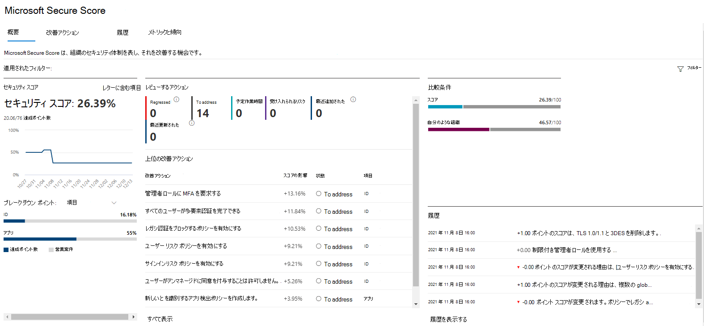

# Microsoft Secure Score 履歴を追跡し、目標を達成する

[!INCLUDE [Microsoft 365 Defender rebranding](../includes/microsoft-defender.md)]

[Microsoft Secure Score](microsoft-secure-score.md) は、組織のセキュリティ体制の測定値であり、より多くの改善アクションが実行されたことを示す数値が多くなります。 https://security.microsoft.com/securescore [Microsoft 365 Defender ポータル](microsoft-365-defender.md#the-microsoft-365-defender-portal)にあります。

## スコアに影響を与えたアクティビティに関する分析情報を取得する

[ **履歴** ] タブで、組織のスコアのグラフを時間の経過と共に表示します。

グラフの下には、選択した時間範囲内で実行されたすべてのアクションとその属性 (結果のポイントやカテゴリなど) の一覧が表示されます。 日付範囲をカスタマイズし、カテゴリ別にフィルター処理できます。

:::image type="content" source="../../media/secure-score/secure-score-history-activity.png" alt-text="Microsoft 365 Defender ポータルのアクティビティ履歴を説明するページの例" lightbox="../../media/secure-score/secure-score-history-activity.png":::

アクティビティに関連付けられている改善アクションを選択すると、完全な改善アクションポップアップが表示されます。

その特定の改善アクションのすべての履歴を表示するには、ポップアップで履歴リンクを選択します。

:::image type="content" source="../../media/secure-score/secure-score-history-flyout.png" alt-text="Microsoft 365 Defender ポータルの改善アクションに関する [履歴] ウィンドウ" lightbox="../../media/secure-score/secure-score-history-flyout.png":::

## 傾向を見つけて目標を設定する

[ **メトリック&傾向** ] タブには、傾向の可視性を高め、目標を設定するためのグラフとグラフがいくつかあります。 視覚化のページ全体の日付範囲を設定できます。 視覚化には、次のものが含まれます。

* **セキュリティスコア ゾーン** - 組織の目標と、良いスコア範囲、問題のあるスコア範囲、および不適切なスコア範囲の定義に基づいてカスタマイズされます。
* **回帰傾向** - 構成、ユーザー、またはデバイスの変更が原因で回帰したポイントのタイムライン。  
* **比較傾向** - 組織のセキュリティスコアが時間の経過と共に他のユーザーと比較する方法。 このビューには、同様のシート数を持つ組織のスコア平均を表す線と、設定できるカスタム比較ビューを含めることができます。
* **リスク受け入れ傾向** - "リスクが受け入れられた" とマークされた改善アクションのタイムライン。
* **スコアの変更** - 達成されたポイントの数、回帰されたポイント、および指定した日付範囲内のスコアの変更。

### スコアを自分のような組織と比較する

スコアが自分と似ている組織とどのように比較されるかを確認するには、2 つの場所があります。

#### 比較横棒グラフ

比較横棒グラフは、[ **概要** ] タブで使用できます。グラフにマウス ポインターを合わせると、スコアとスコアの機会が表示されます。 

:::image type="content" source="../../media/secure-score/secure-score-comparison-bar.png" alt-text="Microsoft 365 Defender ポータルでの類似組織のスコアの棒グラフの例" lightbox="../../media/secure-score/secure-score-comparison-bar.png":::

比較データは匿名化されるため、他のどのテナントが混在しているか正確にはわかりません。

#### 比較傾向

[ **メトリック&傾向** ] タブで、組織のセキュリティスコアが時間の経過と共に他のユーザーと比較する方法を確認します。

:::image type="content" source="../../media/secure-score/secure-score-comparison-trend.png" alt-text="Microsoft 365 Defender ポータルでの類似組織のスコアの時系列の折れ線グラフの例" lightbox="../../media/secure-score/secure-score-comparison-trend.png":::

## ご意見をお聞かせください。

問題がある場合は、 [セキュリティ、プライバシー、コンプライアンス](https://techcommunity.microsoft.com/t5/Security-Privacy-Compliance/bd-p/security_privacy) コミュニティに投稿&お知らせください。 コミュニティを監視しているので、問題に対応します。

## 関連リソース

- [Microsoft Secure Score の概要](microsoft-secure-score.md)
- [セキュリティ体制にアクセス](microsoft-secure-score-improvement-actions.md)
- [今後の予定](microsoft-secure-score-whats-coming.md)
- [新機能](microsoft-secure-score-whats-new.md)
