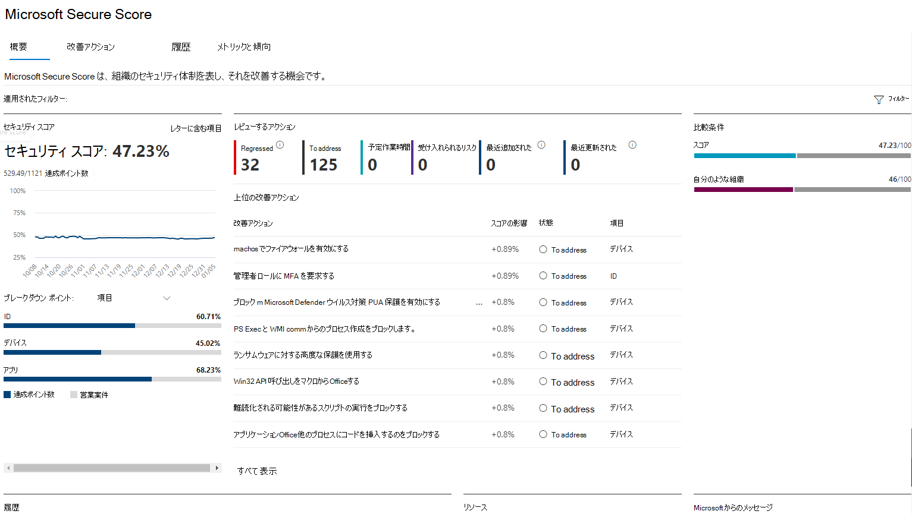

# Microsoft セキュア スコアMicrosoft Secure Score

[!INCLUDE [Microsoft 365 Defender rebranding](../includes/microsoft-defender.md)]

Microsoft セキュア スコアは組織のセキュリティ体制を測定する数値であり、数値が高いほどより多くの改善のための処置が実行されたことを示しています。Microsoft Secure Score is a measurement of an organization's security posture, with a higher number indicating more improvement actions taken. これは、セキュリティ センター https://security.microsoft.com/securescore のMicrosoft 365[にあります](overview-security-center.md)。It can be found at https://security.microsoft.com/securescore in the [Microsoft 365 security center](overview-security-center.md).

セキュリティ スコアの推奨事項を実行することにより、組織を脅威から保護できます。Following the Secure Score recommendations can protect your organization from threats. 組織は、Microsoft 365 セキュリティ センターの一元的なダッシュボードから、ユーザー ID、アプリ、デバイスのセキュリティを監視Microsoft 365作業できます。From a centralized dashboard in the Microsoft 365 security center, organizations can monitor and work on the security of their Microsoft 365 identities, apps, and devices.

セキュア スコアは、次のような方法で組織の役に立ちます。Secure Score helps organizations:  

* 組織のセキュリティ体制の現在の状態について報告します。Report on the current state of the organization's security posture.
* 検出可能性、可視性、ガイダンス、制御機能を提供して、セキュリティ体制を改善します。Improve their security posture by providing discoverability, visibility, guidance, and control.  
* ベンチマークと比較し、主要業績評価指標 (KPI) を確立します。Compare with benchmarks and establish key performance indicators (KPIs).

指標と傾向の堅牢な視覚化、他の Microsoft 製品との統合、類似組織とのスコア比較などを、組織で利用することができます。Organizations gain access to robust visualizations of metrics and trends, integration with other Microsoft products, score comparison with similar organizations, and much more. スコアは、サードパーティのソリューションが推奨アクションに対応した場合も反映されます。The score can also reflect when third-party solutions have addressed recommended actions.

## しくみHow it works

次のアクションのポイントが与えられる。You're given points for the following actions:

- 推奨されるセキュリティ機能の構成Configuring recommended security features
- セキュリティ関連のタスクを実行するDoing security-related tasks
- サード パーティ製のアプリケーションまたはソフトウェア、または代替の軽減策を使用して改善アクションに対処するAddressing the improvement action with a third-party application or software, or an alternate mitigation

一部の改善アクションは、完全に完了した場合にのみポイントを与える。Some improvement actions only give points when fully completed. 一部のデバイスまたはユーザーに対して完了した場合、部分的にポイントを与える場合があります。Some give partial points if they're completed for some devices or users. 改善アクションの 1 つを実行できない場合、または実行しない場合は、リスクまたは残存リスクを受け入れるか選択できます。If you can't or don't want to enact one of the improvement actions, you can choose to accept the risk or remaining risk.

サポートされている Microsoft 製品のライセンスがある場合は、それらの製品に関する推奨事項が表示されます。If you have a license for one of the supported Microsoft products, then you'll see recommendations for those products. ライセンス のエディション、サブスクリプション、またはプランに関係なく、製品に対して可能な改善点の完全なセットが表示されます。We show you the full set of possible improvements for a product, regardless of license edition, subscription, or plan. これにより、セキュリティのベスト プラクティスを理解し、スコアを向上できます。This way, you can understand security best practices and improve your score. Secure Score で表される絶対的なセキュリティ体制は、組織が特定の製品に対して所有しているライセンスに関係なく同じままです。Your absolute security posture, represented by Secure Score, stays the same no matter what licenses your organization owns for a specific product. セキュリティは使いやすさとバランスが取れている必要があり、すべての推奨事項がご使用の環境に適しているわけではないことを覚えておいてください。Keep in mind that security should be balanced with usability, and not every recommendation can work for your environment.

スコアはリアルタイムで更新され、視覚エフェクト ページと改善のための処置 ページに表示された情報を反映します。Your score is updated in real time to reflect the information presented in the visualizations and improvement action pages. またセキュア スコアは毎日同期を行い、各アクションで達成されたポイントに関するシステム データを受信します。Secure Score also syncs daily to receive system data about your achieved points for each action.

### 重要なシナリオKey scenarios

- [現在のスコアを確認するCheck your current score](microsoft-secure-score-improvement-actions.md#check-your-current-score)
- [スコアを自分のような組織と比較するCompare your score to organizations like yours](microsoft-secure-score-history-metrics-trends.md#compare-your-score-to-organizations-like-yours)
- [改善アクションを表示し、アクション プランを決定するView improvement actions and decide an action plan](microsoft-secure-score-improvement-actions.md#take-action-to-improve-your-score)
- [調査または実装するための作業フローの開始Initiate work flows to investigate or implement](microsoft-secure-score-improvement-actions.md#view-improvement-action-details)

### 改善のための処置のスコアHow improvement actions are scored

各改善アクションの価値は 10 ポイント以下で、ほとんどがバイナリ形式でスコア付けされます。Each improvement action is worth 10 points or less, and most are scored in a binary fashion. 新しいポリシーの作成や特定の設定の有効など、改善アクションを実装する場合は、ポイントの 100% を取得します。If you implement the improvement action, like create a new policy or turn on a specific setting, you get 100% of the points. その他の改善のための処置では、ポイントは構成全体に対するパーセンテージに応じて与えられます。For other improvement actions, points are given as a percentage of the total configuration.

たとえば、改善アクションでは、多要素認証を使用してすべてのユーザーを保護することで、10 ポイントを取得できます。For example, an improvement action states you get 10 points by protecting all your users with multi-factor authentication. 保護されているユーザーは 100 人中 50 人しかいないので、部分的なスコアは 5 ポイント (50 protected / 100 total \* 10 max pts = 5 pts) になります。You only have 50 of 100 total users protected, so you'd get a partial score of 5 points (50 protected / 100 total \* 10 max pts = 5 pts).

### セキュア スコアに含まれる製品Products included in Secure Score

現在、次の製品に関する推奨事項があります。Currently there are recommendations for the following products:

- Microsoft 365 (Exchange Online を含む)Microsoft 365 (including Exchange Online)
- Azure Active DirectoryAzure Active Directory
- Microsoft Defender for EndpointMicrosoft Defender for Endpoint
- Microsoft Defender for IdentityMicrosoft Defender for Identity
- Cloud App SecurityCloud App Security
- Microsoft TeamsMicrosoft Teams

その他のセキュリティ製品の推奨事項は近日リリース予定です。Recommendations for other security products are coming soon. 推奨事項は、各製品に関連付けられているすべての攻撃表面をカバーするのではなく、優れたベースラインです。The recommendations won't cover all the attack surfaces associated with each product, but they're a good baseline. また、改善アクションをサード パーティまたは代替の軽減策の対象としてマークできます。You can also mark the improvement actions as covered by a third party or alternate mitigation.

### セキュリティの既定値Security defaults

Microsoft Secure Score では[、Azure Active Directory](/azure/active-directory/fundamentals/concept-fundamentals-security-defaults)でセキュリティの既定値をサポートするように改善アクションが更新され、一般的な攻撃に対して事前に構成されたセキュリティ設定を使用して組織を保護しやすくなっています。Microsoft Secure Score has updated improvement actions to support [security defaults in Azure Active Directory](/azure/active-directory/fundamentals/concept-fundamentals-security-defaults), which make it easier to help protect your organization with pre-configured security settings for common attacks.

セキュリティの既定値を有効にした場合、次の改善アクションの完全なポイントが与されます。If you turn on security defaults, you'll be awarded full points for the following improvement actions:

- すべてのユーザーがセキュリティで保護されたアクセスのための多要素認証を完了できる (9 ポイント)Ensure all users can complete multi-factor authentication for secure access (9 points)
- 管理役割に MFA を要求する (10 ポイント)Require MFA for administrative roles (10 points)
- 従来の認証をブロックするポリシーを有効にする (7 ポイント)Enable policy to block legacy authentication (7 points)

>[!IMPORTANT]
>セキュリティの既定値には、"サインイン リスク ポリシー" や "ユーザー リスク ポリシー" の改善アクションと同様のセキュリティを提供するセキュリティ機能が含まれます。Security defaults include security features that provide similar security to the "sign-in risk policy" and "user risk policy" improvement actions. これらのポリシーをセキュリティの既定値の上に設定する代わりに、状態を "別の軽減策によって解決済み" に更新することをお勧めします。Instead of setting up these policies on top of the security defaults, we recommend updating their statuses to "Resolved through alternative mitigation."

## 必要なアクセス許可Required permissions

Microsoft セキュア スコアにアクセスするためのアクセス許可を付与するには、Azure Active Directory で次のいずれかの役割が割り当てられている必要があります。To have permission to access Microsoft Secure Score, you must be assigned one of the following roles in Azure Active Directory.

### 読み取りと書き込みの役割Read and write roles

読み取りと書き込みアクセス許可があれば、変更を加えたり、セキュア スコアを直接操作したりできます。With read and write access, you can make changes and directly interact with Secure Score. 他のユーザーに読み取り専用アクセス権を割り当てることもできます。You can also assign read-only access to other users.

* グローバル管理者Global administrator
* セキュリティ管理者Security administrator
* Exchange 管理者Exchange administrator
* SharePoint 管理者SharePoint administrator
* アカウント管理者Account administrator

### 読み取り専用の役割Read-only roles

読み取り専用アクセスでは、改善アクションの状態やメモを編集したり、スコア ゾーンを編集したり、カスタム比較を編集したりできない。With read-only access, you aren't able to edit status or notes for an improvement action, edit score zones, or edit custom comparisons.

* ヘルプデスク管理者Helpdesk administrator
* ユーザー管理者User administrator
* サービス管理者Service administrator
* セキュリティ閲覧者Security reader
* セキュリティ オペレーターSecurity operator
* グローバル閲覧者Global reader

## リスク認識Risk awareness

Microsoft Secure Score は、システム構成、ユーザーの動作、その他のセキュリティ関連の測定値に基づくセキュリティ体制の数値要約です。Microsoft Secure Score is a numerical summary of your security posture based on system configurations, user behavior, and other security-related measurements. システムやデータが侵害される可能性を絶対に測定する必要があります。It isn't an absolute measurement of how likely your system or data will be breached. むしろ、侵害されるリスクを相殺するのに役立つ Microsoft 環境でセキュリティ制御を採用した範囲を表します。Rather, it represents the extent to which you have adopted security controls in your Microsoft environment that can help offset the risk of being breached. セキュリティ侵害から保護されたオンライン サービスはありません。セキュリティ違反に対する保証として安全なスコアを解釈する必要はありません。No online service is immune from security breaches, and secure score shouldn't be interpreted as a guarantee against security breach in any manner.

## ご意見をお聞かせください。We want to hear from you

問題がある場合は、セキュリティ、プライバシー、コンプライアンス コミュニティに投稿して [&してください](https://techcommunity.microsoft.com/t5/Security-Privacy-Compliance/bd-p/security_privacy) 。If you have any issues, let us know by posting in the [Security, Privacy & Compliance](https://techcommunity.microsoft.com/t5/Security-Privacy-Compliance/bd-p/security_privacy) community. コミュニティを監視しているので、問題に対応します。We're monitoring the community and will provide help.

## 関連リソースRelated resources

- [セキュリティ体制にアクセスAssess your security posture](microsoft-secure-score-improvement-actions.md)
- [Microsoft Secure Score の履歴を追跡し、目標を達成するTrack your Microsoft Secure Score history and meet goals](microsoft-secure-score-history-metrics-trends.md)
- [今後の予定What's coming](microsoft-secure-score-whats-coming.md)
- [新機能What's new](microsoft-secure-score-whats-new.md)