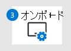

# テスト ラボMicrosoft 365 Defenderパイロット環境を準備するPrepare your Microsoft 365 Defender trial lab or pilot environment

[!INCLUDE [Microsoft 365 Defender rebranding](../includes/microsoft-defender.md)]

**適用対象:****Applies to:**
- Microsoft 365 DefenderMicrosoft 365 Defender

試用版ラボMicrosoft 365 Defenderを作成して展開するには、次の 3 段階のプロセスを実行します。Creating a Microsoft 365 Defender trial lab or pilot environment and deploying it is a three-phase process:

| フェーズ 1: 準備Phase 1: Prepare | [フェーズ 2: 設定Phase 2: Set up](setup-m365deval.md) | [フェーズ 3: オンボードPhase 3: Onboard](config-m365d-eval.md) |  [パイロット プレイブックに戻るBack to pilot playbook](m365d-pilot.md) |
|--|--|--|--|
|*お前はここにいる!**You are here!* | || |

現在準備段階です。You're currently in the preparation phase.

展開が成功するには、準備が重要です。Preparation is key to any successful deployment. このセクションでは、テスト ラボまたはパイロット環境を開発する際に検討する必要がある点Microsoft 365 Defenderします。This section will guide you through what you need to consider as you prepare to create a trial lab or pilot environment for your Microsoft 365 Defender deployment.

## 前提条件Prerequisites
ライセンス、ハードウェアとソフトウェアの Microsoft 365 Defender要件、その他の構成設定について説明します。Learn about the licensing, hardware and software requirements, and other configuration settings to provision and use Microsoft 365 Defender. 「Microsoft Defender for Endpoint 」、Microsoft 365 Defender Microsoft [Defender for Endpoint](/windows/security/threat-protection/microsoft-defender-atp/minimum-requirements) [、Microsoft](/office365/servicedescriptions/office-365-advanced-threat-protection-service-description) [Defender](/azure-advanced-threat-protection/atp-prerequisites)for Office 365 Id、Microsoft Cloud App Security の最小要件を[参照してください](/azure-advanced-threat-protection/atp-prerequisites)。See the minimum requirements for [Microsoft 365 Defender](/microsoft-365/security/defender/prerequisites), [Microsoft Defender for Endpoint](/windows/security/threat-protection/microsoft-defender-atp/minimum-requirements), [Microsoft Defender for Office 365](/office365/servicedescriptions/office-365-advanced-threat-protection-service-description), [Microsoft Defender for Identity](/azure-advanced-threat-protection/atp-prerequisites), [Microsoft Cloud App Security](/azure-advanced-threat-protection/atp-prerequisites).

## 関係者とサインオフStakeholders and sign-off
プロジェクトに関与し、評価またはパイロット プロジェクトの実行に関して、サインオフ、レビュー、または情報の提供が必要な関係者を特定します。Identify all the stakeholders that are involved in the project and who may need to sign-off, review, or stay informed, whether for evaluation or running a pilot project.

>[!NOTE]
>そのような役割を持つセキュリティ組織の成熟度を持つ組織が一部である可能性があります。Not all organizations might have the security organization maturity to have such roles. このような場合は、リーダーシップ チームに確認と承認の責任について相談してください。In such case, consult with your leadership team on review and approval accountabilities.

組織に応じて、以下の表に関係者を追加します。Add stakeholders to the table below as appropriate for your organization.

-   SO = このプロジェクトのサインオフSO = Sign-off on this project

-   R = このプロジェクトを確認し、入力を提供するR = Review this project and provide input

-   I = このプロジェクトの通知I = Informed of this project

| 氏名Name                 | 役割Role                                                                                                                                                                                                          | 操作Action |
|----------------------|---------------------------------------------------------------------------------------------------------------------------------------------------------------------------------------------------------------|--------|
| 名前とメールを入力するEnter name and email | **最高情報セキュリティ責任者 (CISO)** 新しいテクノロジ展開の組織の内部でスポンサーを務め、役員 *の代表者。***Chief Information Security Officer (CISO)** *An executive representative who serves as sponsor inside the organization for the new technology deployment.*                                                  | だからSO     |
| 名前とメールを入力するEnter name and email | **サイバー防御運用センター (CDOC)** の代表は *、CDOC* チームの担当者で、この変更が顧客のセキュリティ運用チームのプロセスとどのように一致するのか定義します。**Head of Cyber Defense Operations Center (CDOC)** *A representative from the CDOC team in charge of defining how this change is aligned with the processes in the customers security operations team.*       | だからSO     |
| 名前とメールを入力するEnter name and email | \**セキュリティ アーキ\*\*\*テクト* この変更が組織内の主要なセキュリティ アーキテクチャとどのように一致するのか定義するセキュリティ チームの担当者。**Security Architect** *A representative from the Security team in charge of defining how this change is aligned with the core Security architecture in the organization.*                         | RR      |
| 名前とメールを入力するEnter name and email | **Workplace Architect** *この変更が* 組織内のコアワークプレース アーキテクチャとどのように対応されるかを定義する IT チームの担当者。**Workplace Architect** *A representative from the IT team in charge of defining how this change is aligned with the core workplace architecture in the organization.*                             | RR      |
| 名前とメールを入力するEnter name and email | \**セキュリティ アナリスト\*\*\*セキュリティ運用の* 観点から、この変更の検出機能、ユーザー エクスペリエンス、および全体的な有用性に関するフィードバックを提供できる CDOC チームの担当者。**Security Analyst** *A representative from the CDOC team who can provide feedback on the detection capabilities, user experience, and overall usefulness of this change from a security operations perspective.* | II      |

## アカウントを準備Azure Active DirectoryPrepare your Azure Active Directory
Active Directory とオンプレミスの同期を既に有効にしている場合は、このAzure Active Directoryスキップします。Skip this step if you have already enabled synchronization between Active Directory and Azure Active Directory on premises. 既存のベスト プラクティスに関するドキュメントを、Azure Active Directory。Review existing best practices documentation from Azure Active Directory. 次の手順は、プロジェクトのパイロット テストを評価または実行Microsoft 365 Defenderされています。The following steps are optimized to evaluate or run a pilot Microsoft 365 Defender project.

1. Azure のポータル [Azure Active Directory](https://portal.azure.com/#blade/Microsoft_AAD_IAM/ActiveDirectoryMenuBlade)に>**移動AD Connect。**Go to the [Azure Active Directory](https://portal.azure.com/#blade/Microsoft_AAD_IAM/ActiveDirectoryMenuBlade) portal > **Azure AD Connect**. 
   

2. [**ドメイン コントローラーから\*\*\*\*ダウンロードMicrosoft Azure Active Directory Connect** をクリックし、ドメイン コントローラーに転送します。Click **Download** from **Microsoft Azure Active Directory Connect** and transfer it to your Domain Controller.
  

3. ドメイン コントローラーで、ウィザードのAzure Active Directory Connectします。On the domain controller, follow the Azure Active Directory Connect wizard. ライセンス条項とプライバシーに関する通知を読み、同意する場合はチェック ボックスをオンにします。Read the license terms and privacy notice and select the checkbox if you agree. [**続行**] をクリックします。Click **Continue**.
  

4. [Express **設定] に移動します**。Navigate to **Express Settings**.
  

5. グローバル管理者の資格情報を入力します。Enter your global administrator credentials. **[次へ]** をクリックします。Click **Next**.
  

6. Active Directory Domain Services エンタープライズ管理者の資格情報を入力します。Enter your Active Directory Domain Services enterprise administrator credentials. **[次へ]** をクリックします。Click **Next**.
  

7. [インストール **] を** クリックして構成を確認します。Click **Install** to confirm the configuration.
  

8. おめでとうございます、正常に構成されたAzure Active Directory Connect。Congratulations, you have successfully configured Azure Active Directory Connect.
  

Active Directory に[ユーザーとグループを追加し](/azure-advanced-threat-protection/atp-playbook-setup-lab#bkmk_hydrate)[、SAM-R ポリシーを構成できます](/azure-advanced-threat-protection/atp-playbook-setup-lab#configure-sam-r-capabilities-from-contosodc)。You can now [add users and groups to Active Directory](/azure-advanced-threat-protection/atp-playbook-setup-lab#bkmk_hydrate) and [configure a SAM-R policy](/azure-advanced-threat-protection/atp-playbook-setup-lab#configure-sam-r-capabilities-from-contosodc).  

## 構成順序Configuration order
次の表は、Microsoft が試用版ラボまたはパイロット環境の展開Microsoft 365 Defenderコンポーネントを構成するために推奨する順序を示しています。The following table indicates the order Microsoft recommends for configuring the Microsoft 365 Defender components for your trial lab or pilot environment deployment.

| コンポーネントComponent                               | 説明Description                                                                                                                                                                                                                                                                                                                                                                                                                                                                                                                                                                                                                                                                                              | 構成順序のランクConfiguration order rank |
|-----------------------------------------|----------------------------------------------------------------------------------------------------------------------------------------------------------------------------------------------------------------------------------------------------------------------------------------------------------------------------------------------------------------------------------------------------------------------------------------------------------------------------------------------------------------------------------------------------------------------------------------------------------------------------------------------------------------------------------------------------------|---------------------|
|Microsoft Defender for Office 365Microsoft Defender for Office 365|Microsoft Defender for Office 365 は、電子メール メッセージ、リンク (URL) や共同作業ツールによって生じる悪意のある脅威から組織を保護します。Microsoft Defender for Office 365 safeguards your organization against malicious threats posed by email messages, links (URLs), and collaboration tools.   [詳細情報Learn more.](/microsoft-365/security/office-365-security/defender-for-office-365)                                                                                                                                                                                                                                             | 11                   |
|Microsoft Defender for IdentityMicrosoft Defender for Identity|Microsoft Defender for Identity は、Active Directory シグナルを使用して、組織に向けられた高度な脅威、侵害された ID、悪意のあるインサイダーアクションを特定、検出、および調査します。Microsoft Defender for Identity uses Active Directory signals to identify, detect, and investigate advanced threats, compromised identities, and malicious insider actions directed at your organization.   [詳細情報](/azure-advanced-threat-protection/) を参照してください。[Learn more](/azure-advanced-threat-protection/).| 22 |
|Microsoft Cloud App SecurityMicrosoft Cloud App Security| Microsoft Cloud App Security (MCAS) は、Cloud Access Security Broker (CASB) です。Microsoft Cloud App Security is a Cloud Access Security Broker (CASB) that operates on multiple clouds. これにより、豊富な可視性、データ移動の制御、高度な分析が提供され、すべてのクラウド サービスでサイバー脅威を特定して対処できます。It provides rich visibility, control over data travel, and sophisticated analytics to identify and combat cyberthreats across all your cloud services.   [詳細情報](/cloud-app-security/) を参照してください。[Learn more](/cloud-app-security/).                                                                                                                                                                                                                                                                                                                                                                       |33                   |
|Microsoft Defender for EndpointMicrosoft Defender for Endpoint | Microsoft Defender for Endpoint のエンドポイント検出および対応機能により、高度な攻撃のほとんどリアルタイムで実用的な検出が実現されます。Microsoft Defender for Endpoint endpoint detection and response capabilities provide advanced attack detections that are near real-time and actionable. セキュリティ アナリストは、効率的にアラートの優先順位を設定し、違反の全容を可視化して、脅威に対処する対応策を講じることができます。Security analysts can prioritize alerts effectively, gain visibility into the full scope of a breach, and take response actions to remediate threats.   [詳細情報Learn more.](/windows/security/threat-protection/microsoft-defender-atp/microsoft-defender-advanced-threat-protection)                                     |4 4                   |                                                                                                                                                                                                                                    

## 次の手順Next step
|  [フェーズ 2: セットアップPhase 2: Setup](setup-m365deval.md) | 試用版ラボまたはMicrosoft 365 Defender環境をセットアップするSet up your Microsoft 365 Defender trial lab or pilot environment
|:-------|:-----|
