# ラボ環境でMicrosoft 365 Defender試用版をセットアップする 

[!INCLUDE [Microsoft 365 Defender rebranding](../includes/microsoft-defender.md)]

**適用対象:**
- Microsoft 365 Defender 

このトピックでは、専用のラボ環境をセットアップする方法について説明します。 実稼働環境での試用版のセットアップの詳細については、新しい評価とパイロット ガイド[をMicrosoft 365 Defender](eval-overview.md)してください。 

## 試用版テナントOffice 365 E5作成する
>[!NOTE]
>既存のサブスクリプションまたはサブスクリプションが既Office 365場合Azure Active Directory試用版テナントの作成手順Office 365 E5スキップできます。

1. [製品ポータル] に [Office 365 E5し、無料試用版]**を選択します**。

   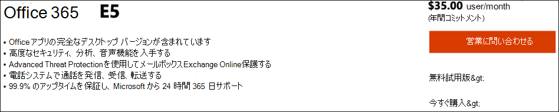
  
2. 電子メール アドレス (個人または企業) を入力して、試用版の登録を完了します。 [アカウント **の設定] をクリックします**。

   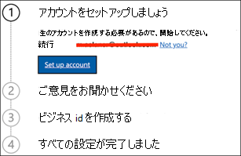

3. 名、名、会社の電話番号、会社名、会社の規模、国または地域を入力します。  

   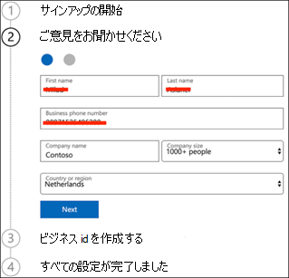
   
   > [!NOTE]
   > ここで設定した国または地域によって、ホストされるデータ センター Office 365決定されます。
  
4. 確認の基本設定を選択します。テキスト メッセージまたは通話を使用します。 [検証 **コードの送信] をクリックします**。 

   

5. テナントのカスタム ドメイン名を設定し、[次へ] を **クリックします**。

   
 
6. テナントのグローバル管理者になる最初の ID を設定します。 [名前] **と [パスワード]** を **入力します**。 [**サインアップ**] をクリックします。

   

7. [**セットアップに移動] を** クリックして、Office 365 E5プロビジョニングを完了します。

   ![[Go setup] Office 365 E5をクリックするように求める[試用版登録のセットアップ] ページのイメージ。](../../media/mtp-eval-15.png)

8. ConnectドメインをテナントにOffice 365します。 [省略可能]**[Connect所有しているドメインを選択し、** ドメイン名を入力します。 [**次へ**] をクリックします。

   
 
9. TXT レコードまたは MX レコードを追加して、ドメインの所有権を検証します。 ドメインに TXT レコードまたは MX レコードを追加したら、[確認] を **選択します**。

   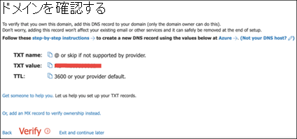
 
10. [省略可能]テナントのユーザー アカウントを作成します。 [次へ] をクリックすると、この手順を **スキップできます**。

    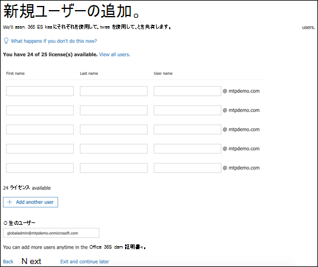
 
11. [省略可能]アプリOfficeダウンロードします。 [次 **へ] を** クリックして、この手順をスキップします。 

    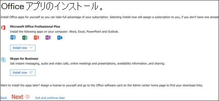

12. [省略可能]電子メール メッセージを移行します。 繰り返しますが、この手順は省略できます。

    
 
13. [オンライン サービス] を選択します。 [次 **Exchange] を** 選択し、[次へ]**をクリックします**。 

    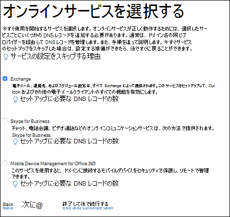

14. ドメインに MX、CNAME、TXT レコードを追加します。 完了したら、[確認] を **選択します**。

    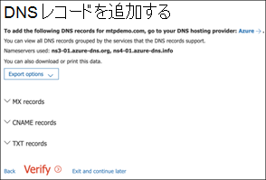
 
15. おめでとうございます、テナントのプロビジョニングOffice 365完了です。

    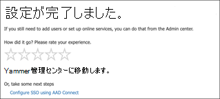

## 試用版サブスクリプションMicrosoft 365有効にする

>[!NOTE]
>試用版にサインアップすると、1 か月間 25 のユーザー ライセンスを使用できます。 詳細 [については、「Try or Buy a M365 サブスクリプション」](../../commerce/try-or-buy-microsoft-365.md) を参照してください。

1. [[Microsoft 365 管理センター] で、課金]**をクリック** し、[サービスの購入]**に移動します**。

2. [無料 **Microsoft 365 E5] を** 選択し、[無料試用版の **開始] をクリックします**。 

   

3. 確認の基本設定を選択します。テキスト メッセージまたは通話を使用します。 決定したら、電話番号を入力し、選択内容に応じて[テキスト] または [電話] を選択します。

   
 
4. 確認コードを入力し、[無料試用版の **開始] をクリックします**。

   

5. [**今すぐ試す**] をクリックして、Microsoft 365 E5確認します。

   ![イメージ of_Microsoft 365 E5 [無料試用版を開始する] ページで、[今すぐ試す] ボタンを起動する必要があります。](../../media/mtp-eval-27.png)
 
6. [センター ユーザー]**の [Microsoft 365 管理アクティブ**  >  **ユーザー]**  >  **に移動します**。 ユーザー アカウントを選択し、[製品ライセンス **の管理]** を選択し、ライセンスを [ライセンス] から [Office 365 E5 Microsoft 365 E5。  **[保存]** をクリックします。

   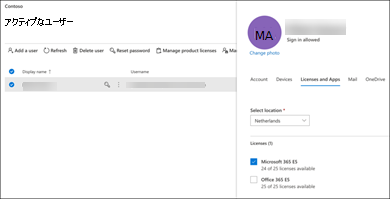
 
7. グローバル管理者アカウントを再度選択し、[ユーザー名の管理 **] をクリックします**。

   ![[of_Microsoft 365 管理センター] ページで、[アカウント] を選択し、[ユーザー名の管理] を選択できます。](../../media/mtp-eval-29.png)

8. [省略可能]前 *の手順で* onmicrosoft.com に応じて、ドメインをドメインから独自のドメインに変更します。 **[変更の保存]** をクリックします。

   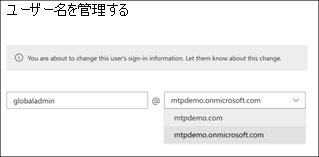

## 次の手順
|[フェーズ 3: オンボードで&する](config-m365d-eval.md) | お客様のMicrosoft 365 Defenderラボまたはパイロット環境Microsoft 365 Defender、エンドポイントをオンボードする場合は、各デバイスの柱を構成します。
|:-------|:-----|
