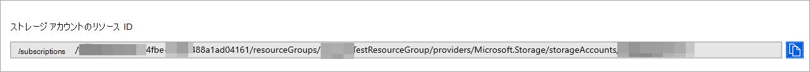
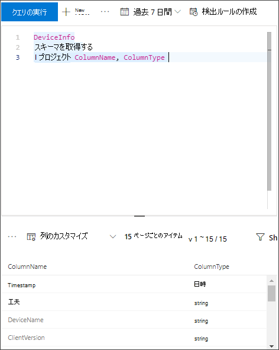

# <a name="configure-microsoft-365-defender-to-stream-advanced-hunting-events-to-your-storage-account"></a>高度Microsoft 365 Defenderイベントを自分のアカウントにストリーミングするStorage構成する

[!INCLUDE [Microsoft 365 Defender rebranding](../../includes/microsoft-defender.md)]


**適用対象:**
- [Microsoft 365 Defender](https://go.microsoft.com/fwlink/?linkid=2118804)

[!include[Prerelease information](../../includes/prerelease.md)]

## <a name="before-you-begin"></a>はじめに

1. テナントに[Storageアカウント](/azure/storage/common/storage-account-overview)を作成します。

2. Azure テナントに [ログイン](https://ms.portal.azure.com/)し、[サブスクリプション] > サブスクリプション > リソース プロバイダー> **Microsoft.インサイト** に登録します。

## <a name="enable-raw-data-streaming"></a>生データ ストリーミングを有効にする

1. *グローバル管理者 _ または _* セキュリティ管理者 **として、Microsoft 365 Defender ポータル ( <https://security.microsoft.com> )_にログイン_ します。

2. [ストリーミング API \> **設定Microsoft 365 Defender]** \> **に移動します**。 ストリーミング API ページに直接 **移動するには** 、 を使用します <https://security.microsoft.com/settings/mtp_settings/raw_data_export> 。

3. **[追加]** をクリックします。

4. 表示される **[新しいストリーミング API 設定の追加** ] フライアウトで、次の設定を構成します。
   1. **名前**: 新しい設定の名前を選択します。
   2. [イベント **を転送する] をAzure Storage** します。
   3. 表示される **[Storage リソース ID]** ボックスに、アカウント リソース ID Storage **入力します**。 アカウント リソース ID をStorageするには、Azure portal を開き、[Storage アカウント] をクリックして、[プロパティ] タブに移動し、[アカウント リソース **ID]** の下Storage <https://portal.azure.com>  \> \> **コピーします**。

      

   4. [新しい **ストリーミング API 設定の追加] フライアウトに** 戻り、ストリーミング **するイベント** の種類を選択します。

   完了したら、**[送信]** をクリックします。

## <a name="the-schema-of-the-events-in-the-storage-account"></a>アカウント内のイベントのスキーマStorageします。

- BLOB コンテナーは、イベントの種類ごとに作成されます。

  

- BLOB 内の各行のスキーマは、次の JSON です。

  ```JSON
  {
          "time": "<The time Microsoft 365 Defender received the event>"
          "tenantId": "<Your tenant ID>"
          "category": "<The Advanced Hunting table name with 'AdvancedHunting-' prefix>"
          "properties": { <Microsoft 365 Defender Advanced Hunting event as Json> }
  }
  ```

- 各 BLOB には複数の行が含まれます。

- 各行には、イベント名、Defender for Endpoint がイベントを受信した時刻、そのイベントが属するテナント (テナントからのみイベントを取得する)、および JSON 形式のイベントが "properties" と呼ばれるプロパティで含まれる。

- イベントのスキーマの詳細については、「高度なMicrosoft 365 Defender概要[」を参照してください](../defender/advanced-hunting-overview.md)。

## <a name="data-types-mapping"></a>データ型マッピング

イベント プロパティのデータ型を取得するには、次の操作を行います。

1. ポータル ( ) にログインMicrosoft 365 Defender、 <https://security.microsoft.com> ハンティング Advanced **ハンティング に** \> **移動します**。 [高度な検索] ページに **直接移動するには** 、次の<security.microsoft.com/advanced-hunting>。

2. [クエリ **] タブ** で、次のクエリを実行して、各イベントのデータ型マッピングを取得します。

   ```text
   {EventType}
   | getschema
   | project ColumnName, ColumnType
   ```

- デバイス情報イベントの例を次に示します。

  

## <a name="related-topics"></a>関連項目

- [高度なハンティングの概要](../defender/advanced-hunting-overview.md)
- [Microsoft 365 Defenderストリーミング API](streaming-api.md)
- [Azure Microsoft 365 Defenderアカウントにイベントをストリーミングする](streaming-api-storage.md)
- [Azure Storageアカウントのドキュメント](/azure/storage/common/storage-account-overview)
