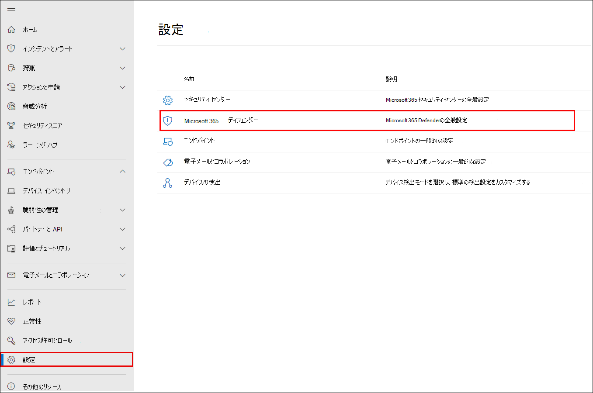
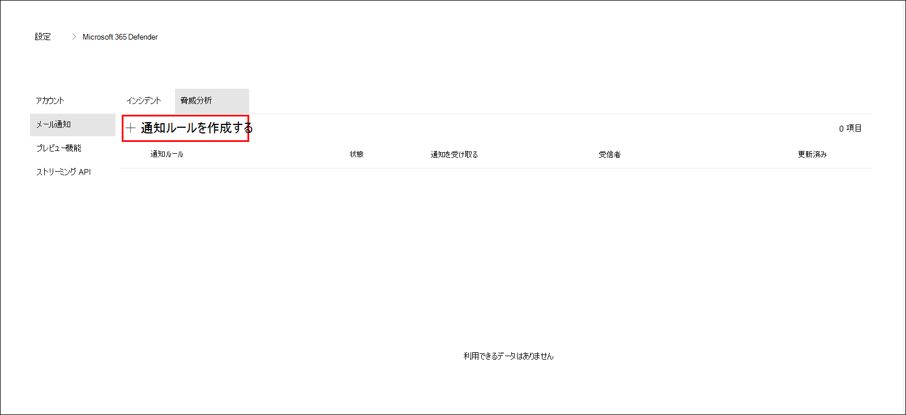
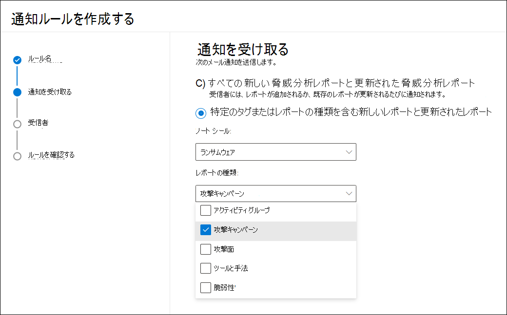
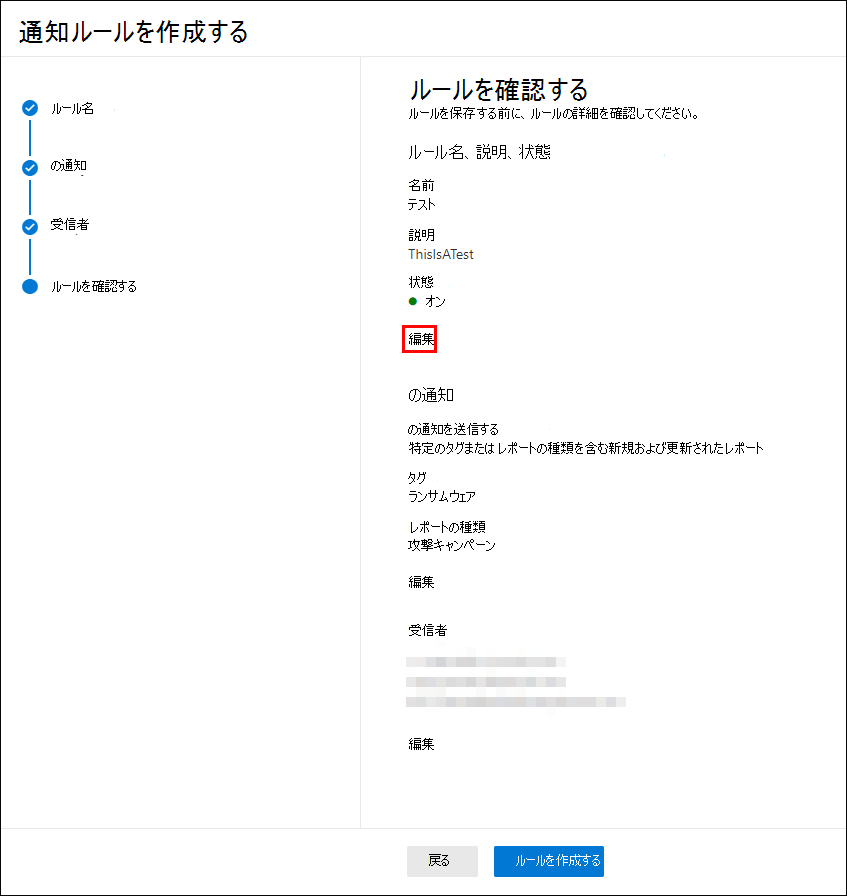
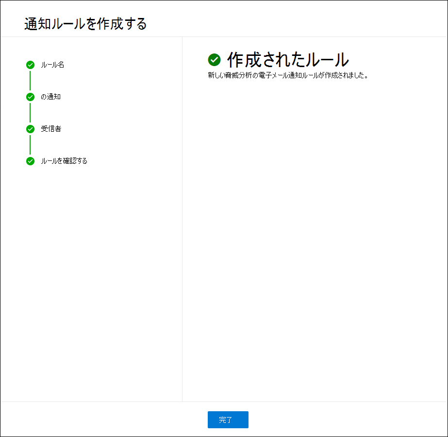

# 脅威分析 (Microsoft 365 Defender

[!INCLUDE [Microsoft 365 Defender rebranding](../includes/microsoft-defender.md)]

**適用対象:**

- Microsoft 365 Defender

> Microsoft 365 Defender を体験しますか? [ラボ環境で評価](m365d-evaluation.md?ocid=cx-docs-MTPtriallab)、または[運用でパイロット プロジェクトを実行](m365d-pilot.md?ocid=cx-evalpilot)することができます。
>

[!INCLUDE [Prerelease](../includes/prerelease.md)]

脅威分析は、Microsoft のセキュリティ専門家による製品内脅威インテリジェンス ソリューションです。 次のような新たな脅威に直面しながら、セキュリティ チームが可能な限り効率的に対応するように設計されています。

- アクティブな脅威アクターとそのキャンペーン
- 人気のある新しい攻撃手法
- 重大な脆弱性
- 一般的な攻撃対象領域
- 流行しているマルウェア

この短いビデオでは、脅威分析が最新の脅威の追跡と停止に役立つ方法について説明します。

>[!VIDEO https://www.microsoft.com/en-us/videoplayer/embed/RWwJfU]

脅威分析には、Microsoft 365 セキュリティ ポータルのナビゲーション バーの左上から、または組織に対する脅威の上位を示す専用のダッシュボード カード (影響の観点と露出の両方) からアクセスできます。

:::image type="content" source="../../media/threat-analytics/ta_inlandingpage_mtp.png" alt-text="脅威分析のランディング ページ" lightbox="../../media/threat-analytics/ta_inlandingpage_mtp.png":::

影響の大きな脅威は危害を引き起こす可能性が最も高く、露出の高い脅威は資産が最も脆弱な脅威です。 アクティブなキャンペーンや進行中のキャンペーンを可視化し、脅威分析を通じて何を行うのかを知ることにより、セキュリティ運用チームに情報に基づいた意思決定を行う際に役立ちます。

_脅威分析にアクセスする場所_

より高度な敵対者と新しい脅威が頻繁かつ一般に出現する中で、以下を迅速に実行できる必要があります。

- 新たな脅威を特定して対応する
- 現在攻撃を受け取っている場合の詳細
- 資産に対する脅威の影響を評価する
- 脅威に対する回復力または暴露を確認する
- 脅威を停止または格納するために実行できる軽減、回復、または防止のアクションを特定する

各レポートは、追跡された脅威の分析と、その脅威から防御する方法に関する広範なガイダンスを提供します。 また、ネットワークからのデータも組み込まれており、脅威がアクティブかどうか、適切な保護が適用されているかどうかを示します。

## 脅威分析ダッシュボードの表示

脅威分析[ダッシュボード (security.microsoft.com/threatanalytics3](https://security.microsoft.com/threatanalytics3)) は、組織に最も関連性の高いレポートを強調表示します。 次のセクションの脅威の概要を示します。

- **最新の脅威** - 最新の公開または更新された脅威レポートと、アクティブなアラートと解決されたアラートの数が一覧表示されます。
- **影響の大きな脅威**: 組織に最も大きな影響を与える脅威を一覧表示します。 このセクションでは、最初にアクティブなアラートと解決済みアラートの数が最も多い脅威の一覧を示します。
- **最も高い露出**: 最初に最も高い露出レベルを持つ脅威を一覧表示します。 脅威の暴露レベルは、脅威に関連する脆弱性の深刻度と、組織内のデバイスの数がこれらの脆弱性によって悪用される可能性があるという 2 つの情報を使用して計算されます。

ダッシュボードから脅威を選択して、その脅威のレポートを表示します。

:::image type="content" source="../../media/threat-analytics/ta_dashboard_mtp.png" alt-text="脅威分析ダッシュボード" lightbox="../../media/threat-analytics/ta_dashboard_mtp.png":::

_脅威分析ダッシュボード。また、読み取る脅威分析レポートに関連するキーワードでキーを設定する [検索] フィールドを選択することもできます。_

## 脅威分析レポートの表示

各脅威分析レポートには、次のいくつかのセクションの情報が表示されます。

- [**概要**](#overview-quickly-understand-the-threat-assess-its-impact-and-review-defenses)
- [**アナリスト レポート**](#analyst-report-get-expert-insight-from-microsoft-security-researchers)
- [**関連するインシデント**](#related-incidents-view-and-manage-related-incidents)
- [**影響を受け取ったアセット**](#impacted-assets-get-list-of-impacted-devices-and-mailboxes)
- [**メールの試行の防止**](#prevented-email-attempts-view-blocked-or-junked-threat-emails)
- [**露出&軽減策**](#exposure-and-mitigations-review-list-of-mitigations-and-the-status-of-your-devices)

### 概要: 脅威をすばやく理解し、影響を評価し、防御を確認する

[ **概要]** セクションには、詳細なアナリスト レポートのプレビューが表示されます。 また、組織に対する脅威の影響、および構成が誤ったデバイスと未パッチデバイスによる露出を強調するグラフも提供されます。

:::image type="content" source="../../media/threat-analytics/ta_overview_mtp.png" alt-text="脅威分析レポートの概要セクション" lightbox="../../media/threat-analytics/../../media/threat-analytics/ta_overview_mtp.png":::

_脅威分析レポートの概要セクション_

#### 組織への影響を評価する

各レポートには、脅威の組織への影響に関する情報を提供するように設計されたグラフが含まれています。

- **関連インシデント** - 追跡された脅威が組織に与える影響の概要と、次のデータを提供します。
  - アクティブなアラートの数と、関連付けられているアクティブなインシデントの数
  - アクティブ なインシデントの重大度
- **時間の間のアラート** : 関連するアクティブアラートと解決済みアラート **の時間の** 数を示します。 解決済みアラートの数は、組織が脅威に関連付けられたアラートに応答する時間を示します。 理想的には、グラフは数日以内に解決されたアラートを表示する必要があります。
- **影響を受け取** ったアセット : 現在、追跡された脅威に関連付けられているアクティブなアラートが 1 つ以上ある個別のデバイスと電子メール アカウント (メールボックス) の数を示します。 アラートは、脅威メールを受信したメールボックスに対してトリガーされます。 組織レベルとユーザー レベルの両方のポリシーで、脅威メールの配信を引き起こす上書きを確認します。
- **[メールの試行の** 防止] - 配信前にブロックされた過去 7 日間または迷惑メール フォルダーに配信されたメールの数を示します。

#### セキュリティの回復力と姿勢を確認する

各レポートには、組織が特定の脅威に対する回復力の概要を示すグラフが含まれています。

- **セキュリティで保護された構成状態**: セキュリティ設定が正しく構成されていないデバイスの数を示します。 脅威を軽減するために推奨されるセキュリティ設定を適用します。 すべての追跡設定 **が適用** されている場合、デバイスは Secure と見なされます。
- **脆弱性の修正プログラムの状態**: 脆弱なデバイスの数を示します。 脅威によって悪用される脆弱性に対処するために、セキュリティ更新プログラムまたはパッチを適用します。

#### 脅威タグごとにレポートを表示する

脅威レポートリストをフィルター処理し、特定の脅威タグ (カテゴリ) またはレポートの種類に従って最も関連性の高いレポートを表示できます。

- **脅威タグ** - 特定の脅威カテゴリに従って最も関連性の高いレポートを表示できます。 たとえば、ランサムウェアに関連するレポートすべてです。
- **レポートの種類** - 特定のレポートの種類に応じて最も関連性の高いレポートを表示できます。 たとえば、ツールとテクニックをカバーするレポートすべてです。
- **フィルター** - 脅威レポートの一覧を効率的に確認し、特定の脅威タグまたはレポートの種類に基づいてビューをフィルター処理する方法を支援します。 たとえば、ランサムウェアカテゴリに関連する脅威レポート、または脆弱性をカバーする脅威レポートを確認します。

##### どのような仕組みですか?

Microsoft Threat Intelligence チームは、各脅威レポートに脅威タグを追加しました。

- 次の 4 つの脅威タグを使用できます。
  - ランサムウェア
  - フィッシング
  - 脆弱性
  - アクティビティ グループ
- 脅威タグは、脅威分析ページの上部に表示されます。 各タグの下に使用可能なレポートの数のカウンターがあります。

  :::image type="content" source="../../media/threat-analytics/ta-threattags-mtp.png" alt-text="脅威タグ" lightbox="../../media/threat-analytics/ta-threattags-mtp.png":::

- リストは、脅威タグで並べ替えすることもできます。

  :::image type="content" source="../../media/threat-analytics//ta-taglist-mtp.png" alt-text="[脅威タグ] セクション" lightbox="../../media/threat-analytics//ta-taglist-mtp.png":::

- フィルターは、脅威タグとレポートの種類ごとに使用できます。

  :::image type="content" source="../../media/threat-analytics/ta-threattag-filters-mtp.png" alt-text="[フィルター] ページ" lightbox="../../media/threat-analytics/ta-threattag-filters-mtp.png":::

### アナリスト レポート: Microsoft セキュリティ研究者から専門家の分析情報を取得する

[ **アナリスト レポート] セクション** で、詳細なエキスパートの書き込みについて説明します。 ほとんどのレポートには、MITRE ATT&CK フレームワークにマップされた戦術と手法、推奨事項の網羅的なリスト、強力な脅威検出ガイダンスなど、攻撃チェーンの詳細な説明が記載されています。

[アナリスト レポートの詳細](threat-analytics-analyst-reports.md)

### 関連インシデント: 関連するインシデントの表示と管理

[ **関連インシデント] タブ** には、追跡された脅威に関連するすべてのインシデントの一覧が表示されます。 インシデントを割り当てるか、各インシデントにリンクされたアラートを管理できます。 

:::image type="content" source="../../media/threat-analytics/ta_related_incidents_mtp.png" alt-text="脅威分析レポートの関連インシデント セクション" lightbox="../../media/threat-analytics/ta_related_incidents_mtp.png":::

_脅威分析レポートの関連インシデント セクション_

### 影響を受け取ったアセット: 影響を受け取ったデバイスとメールボックスの一覧を取得する

アセットは、アクティブで未解決のアラートの影響を受けた場合に影響を受けたと見なされます。 [ **影響を受け取ったアセット]** タブには、影響を受け取るアセットの次の種類が一覧表示されます。

- **影響を受け**、Microsoft Defender for Endpoint アラートが未解決のエンドポイント。 これらのアラートは、通常、既知の脅威インジケーターとアクティビティの目撃情報に対して発生します。
- **影響を受けたメールボックス**: Microsoft Defender に通知のトリガーを与えた電子メール メッセージを受信したメールボックスOffice 365します。 通常、アラートをトリガーするほとんどのメッセージはブロックされますが、ユーザーレベルまたは組織レベルのポリシーはフィルターを上書きできます。

:::image type="content" source="../../media/threat-analytics/ta_impacted_assets_mtp.png" alt-text="脅威分析レポートの影響を受け取ったアセット セクション" lightbox="../../media/threat-analytics/ta_impacted_assets_mtp.png":::

_脅威分析レポートの影響を受け取ったアセット セクション_

### 電子メールの試行を防止する: ブロックまたは迷惑メールの脅威メールを表示する

Microsoft Defender for Office 365、悪意のあるリンクや添付ファイルを含む既知の脅威インジケーターを含む電子メールをブロックします。 場合によっては、疑わしいコンテンツをチェックするプロアクティブ フィルターメカニズムによって、脅威メールが迷惑メール フォルダーに送信される場合があります。 いずれの場合も、デバイス上で脅威がマルウェア コードを起動する可能性が低くなります。

[**メールの試行を** 防止する] タブには、配信前にブロックされたメール、または Microsoft Defender によって迷惑メール フォルダーに送信されたメールOffice 365。

:::image type="content" source="../../media/threat-analytics/ta_prevented_email_attempts_mtp.png" alt-text="脅威分析レポートの [電子メールの試行を防止する] セクション" lightbox="../../media/threat-analytics/ta_prevented_email_attempts_mtp.png":::

_脅威分析レポートの [メールの試行の防止] セクション_

### 露出と軽減策: 軽減策の一覧とデバイスの状態を確認する

[ **露出の軽減&]** セクションで、脅威に対する組織の回復力を高めるのに役立つ具体的なアクション可能な推奨事項の一覧を確認します。 追跡される軽減策の一覧には、次の項目が含まれます。

- **セキュリティ更新** プログラム - オンボード デバイスで見つかった脆弱性に対するサポートされているソフトウェア セキュリティ更新プログラムの展開
- **サポートされているセキュリティ構成**
  - クラウドによる保護  
  - 望ましくない可能性のあるアプリケーション (PUA) 保護
  - リアルタイム保護

このセクションの軽減情報には、脅威と脆弱性の管理からのデータが組み込まれており、レポート内のさまざまなリンクからの詳細なドリルダウン情報も提供します。

:::image type="content" source="../../media/threat-analytics/ta_mitigations_mtp.png" alt-text="セキュリティで保護された構成の詳細を示す脅威分析レポートの軽減セクション" lightbox="../../media/threat-analytics/ta_mitigations_mtp.png":::

:::image type="content" source="../../media/threat-analytics/ta_mitigations_mtp2.png" alt-text="脆弱性の詳細を示す脅威分析レポートの軽減セクション" lightbox="../../media/threat-analytics/ta_mitigations_mtp2.png":::

_脅威&レポートの [露出と軽減策] セクション_

## レポートの更新に関する電子メール通知を設定する

脅威分析レポートの更新を送信する電子メール通知を設定できます。

脅威分析レポートの電子メール通知を設定するには、次の手順を実行します。

1. サイドバー **で設定** を選択Microsoft 365 Defenderします。 設定 **Microsoft 365 Defender** から [設定] を選択します。
 

2. [**Email notificationsThreat** >  **analytics]** を選択し、ボタンを選択し **、[+ 通知ルールの作成] を選択します**。 フライアウトが表示されます。

3. フライアウトに記載されている手順に従います。 最初に、新しいルールに名前を付します。 説明フィールドは省略可能ですが、名前が必要です。 [説明] フィールドの下にあるチェック ボックスを使用して、ルールのオンとオフを切り替えます。

> [!NOTE]
> 新しい通知ルールの名前と説明フィールドは、英語の文字と数字のみを受け入れる。 スペース、ダッシュ、アンダースコア、その他の句読点は使用できません。

![すべてのフィールドが入力され、[ルールを有効にする] チェック ボックスがオンの名前付け画面のスクリーンショット](../../media/threat-analytics/ta_create_notification_2.png)

4. 通知するレポートの種類を選択します。 新しく公開または更新されたレポートすべてについて更新するか、特定のタグまたは種類を持つレポートのみを更新するか選択できます。

5. 少なくとも 1 人の受信者を追加して、通知メールを受信します。 この画面を使用して、テストメールを送信して、通知の受信方法を確認することもできます。

![[受信者] 画面のスクリーンショット。 緑色のチェックマークで示されている 3 人の受信者がリストされ、テストメールが送信されました](../../media/threat-analytics/ta_create_notification_4.png)

6. 新しいルールを確認します。 変更する内容がある場合は、各サブセクションの最後にある **[** 編集] ボタンを選択します。 レビューが完了したら、[ルールの作成] **ボタンを選択** します。

7. おめでとうございます! 新しいルールが正常に作成されました。 [完了] **ボタンを** 選択してプロセスを完了し、フライアウトを閉じます。

8. これで、新しいルールが脅威分析メール通知の一覧に表示されます。

![[メール通知] 画面内の電子メール通知ルールの一覧設定スクリーンショット](../../media/threat-analytics/ta_create_notification_7.png)

## その他のレポートの詳細と制限事項

> [!NOTE]
> 統合セキュリティ エクスペリエンスの一環として、Microsoft Defender for Endpoint だけでなく、E5 ライセンス所有者向け Microsoft Defender でも脅威分析Office利用できます。
>
> Microsoft 365 セキュリティ ポータル (Microsoft 365 Defender) を使用していない場合は、Microsoft Defender セキュリティ センター ポータル (Microsoft Defender for Endpoint) でレポートの詳細 (microsoft Defender for Office データなし) を表示することもできます。

脅威分析レポートにアクセスするには、特定の役割とアクセス許可が必要です。 詳細[については、「役割ベースのアクセス制御におけるカスタム ロール」を参照Microsoft 365 Defender](custom-roles.md)参照してください。

- アラート、インシデント、または影響を受けたアセット データを表示するには、Office または Microsoft Defender for Endpoint アラート データ、または両方に対する Microsoft Defender へのアクセス許可が必要です。
- 電子メールの試行が防止されたを表示するには、Microsoft Defender に対するアクセス許可を持っている必要があります。Office必要があります。
- 軽減策を表示するには、Microsoft Defender for Endpoint でデータ脅威と脆弱性の管理アクセス許可を持っている必要があります。

脅威分析データを見る場合は、次の要素を覚えておいてください。

- グラフには、追跡される軽減策だけが反映されます。 グラフに表示されない追加の軽減策については、レポートの概要を確認してください。
- 軽減策は、完全な復元を保証するものではありません。 提供される軽減策は、回復性を向上させるために必要な最善のアクションを反映しています。
- デバイスは、サービスにデータを送信していない場合は、"使用不可" としてカウントされます。
- ウイルス対策関連の統計情報は、ユーザー設定Microsoft Defender ウイルス対策されます。 サードパーティのウイルス対策ソリューションを使用するデバイスは、"公開" として表示されます。

## 関連記事

- [高度な検索で脅威を事前に検出する](advanced-hunting-overview.md)
- [[アナリスト レポート] セクションについて](threat-analytics-analyst-reports.md)
- [セキュリティの弱点と露出を評価して解決する](/windows/security/threat-protection/microsoft-defender-atp/next-gen-threat-and-vuln-mgt)
