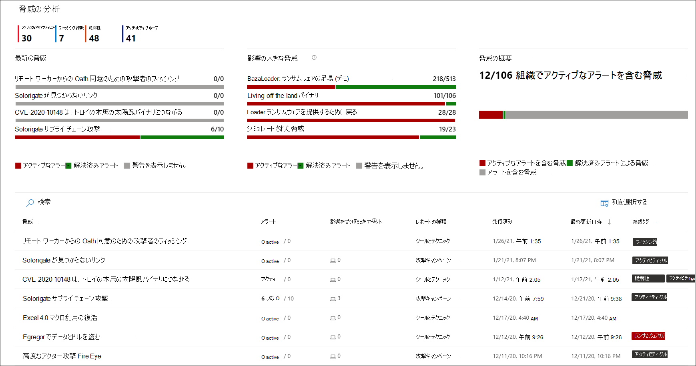
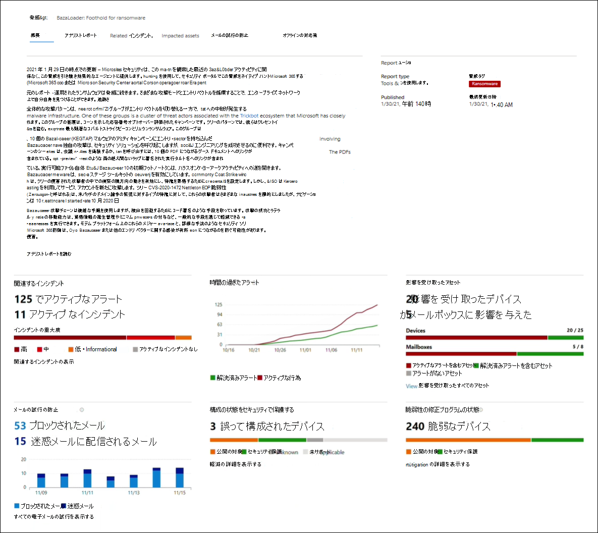
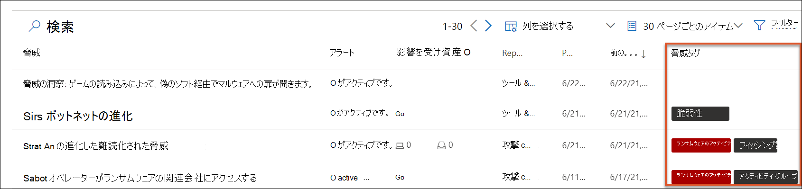
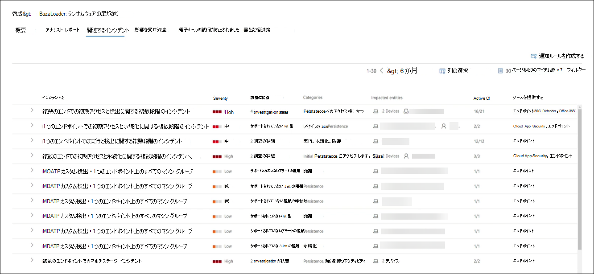
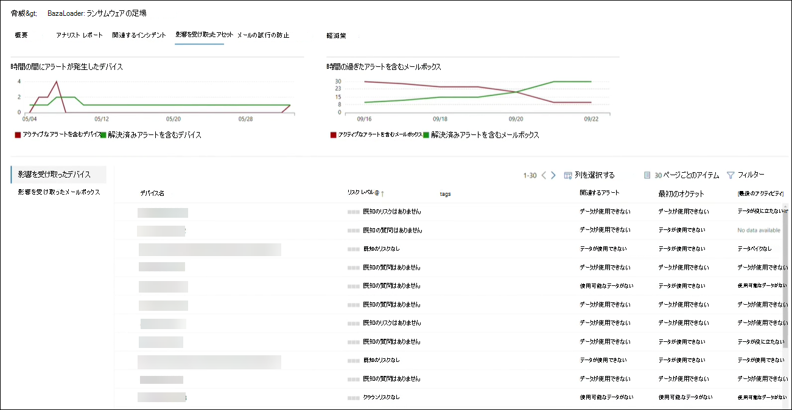
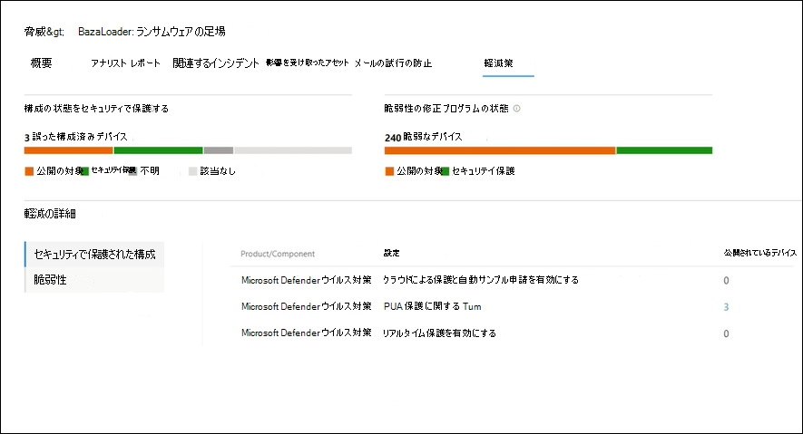
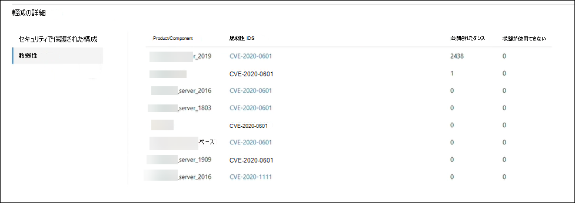

# 脅威の分析を使用して、新たな脅威を追跡し対応するTrack and respond to emerging threats with threat analytics 

[!INCLUDE [Microsoft 365 Defender rebranding](../includes/microsoft-defender.md)]

**適用対象:****Applies to:**
- Microsoft 365 DefenderMicrosoft 365 Defender

> Microsoft 365 Defender を体験してみませんか?Want to experience Microsoft 365 Defender? [ラボ環境で評価する](m365d-evaluation.md?ocid=cx-docs-MTPtriallab)ことも、[実稼働環境でパイロット プロジェクトを実行する](m365d-pilot.md?ocid=cx-evalpilot)こともできます。You can [evaluate it in a lab environment](m365d-evaluation.md?ocid=cx-docs-MTPtriallab) or [run your pilot project in production](m365d-pilot.md?ocid=cx-evalpilot).
>

[!INCLUDE [Prerelease](../includes/prerelease.md)]

脅威分析は、Microsoft のセキュリティ研究者による製品内脅威インテリジェンス ソリューションで、セキュリティ チームが次の新たな脅威に直面しながら、可能な限り効率的に対応するように設計されています。Threat analytics is our in-product threat intelligence solution from expert Microsoft security researchers, designed to assist security teams to be as efficient as possible while facing emerging threats, including:

- アクティブな脅威アクターとそのキャンペーンActive threat actors and their campaigns
- 人気のある新しい攻撃手法Popular and new attack techniques
- 重大な脆弱性Critical vulnerabilities
- 一般的な攻撃の表面Common attack surfaces
- 一般的なマルウェアPrevalent malware

この短いビデオでは、脅威分析が最新の脅威の追跡と停止に役立つ方法について説明します。Watch this short video to learn more about how threat analytics can help you track the latest threats and stop them.

>[!VIDEO https://www.microsoft.com/en-us/videoplayer/embed/RWwJfU]

脅威分析には、Microsoft 365 セキュリティ ポータルのナビゲーション バーの左上から、または組織の上位脅威を示す専用のダッシュボード カードからアクセスできます。アクティブなキャンペーンや進行中のキャンペーンを可視化し、脅威分析を通じて何を行うのかを知ることにより、セキュリティ運用チームに情報に基づいた意思決定を行う際に役立ちます。You can access threat analytics either from the upper left-hand side of Microsoft 365 security portal’s navigation bar, or from a dedicated dashboard card which shows the top threats in your org. Getting visibility on active or ongoing campaigns and knowing what to do through threat analytics can help equip your security operations team with informed decisions. 

_脅威分析にアクセスする場所__Where to access threat analytics_

より高度な敵対者と新しい脅威が頻繁かつ一般に出現する中で、以下を迅速に実行できる必要があります。With more sophisticated adversaries and new threats emerging frequently and prevalently, it's critical to be able to quickly:

- 新たな脅威を特定して対応するIdentify and react to emerging threats
- 現在攻撃を受け取っている場合の詳細Learn if you are currently under attack
- 資産に対する脅威の影響を評価するAssess the impact of the threat to your assets
- 脅威に対する回復力または暴露を確認するReview your resilience against or exposure to the threats
- 脅威を停止または格納するために実行できる軽減、回復、または防止のアクションを特定するIdentify the mitigation, recovery, or prevention actions you can take to stop or contain the threats

各レポートは、追跡された脅威の分析と、その脅威から防御する方法に関する広範なガイダンスを提供します。Each report provides an analysis of a tracked threat and extensive guidance on how to defend against that threat. また、ネットワークからのデータも組み込まれており、脅威がアクティブかどうか、適切な保護が適用されているかどうかを示します。It also incorporates data from your network, indicating whether the threat is active and if you have applicable protections in place.

## 脅威分析ダッシュボードの表示View the threat analytics dashboard

脅威分析ダッシュボード[(security.microsoft.com/threatanalytics3)](https://security.microsoft.com/threatanalytics3)は、組織に最も関連性の高いレポートを強調表示します。The threat analytics dashboard ([security.microsoft.com/threatanalytics3](https://security.microsoft.com/threatanalytics3)) highlights the reports that are most relevant to your organization. 次のセクションの脅威の概要を示します。It summarizes the threats in the following sections:

- **最新の脅威**— 最新の公開または更新された脅威レポートと、アクティブなアラートと解決されたアラートの数が一覧表示されます。**Latest threats**—lists the most recently published or updated threat reports, along with the number of active and resolved alerts.
- **影響の大きな脅威**:組織に最も大きな影響を与える脅威を一覧表示します。**High-impact threats**—lists the threats that have the highest impact to your organization. このセクションでは、最初にアクティブなアラートと解決済みアラートの数が最も多い脅威の一覧を示します。This section lists threats with the highest number of active and resolved alerts first.
- **脅威の概要**— アクティブなアラートと解決済みアラートを使用して脅威の数を表示することで、すべての追跡された脅威の全体的な影響を提供します。**Threat summary**—provides the overall impact of all tracked threats by showing the number of threats with active and resolved alerts.

ダッシュボードから脅威を選択して、その脅威のレポートを表示します。Select a threat from the dashboard to view the report for that threat.

_脅威分析ダッシュボード。検索アイコンをクリックして、読み取る脅威分析レポートに関連するキーワードをキー設定することもできます。__Threat analytics dashboard. You can also click the Search icon to key in a keyword related to the threat analytics report that you'd like to read._ 

## 脅威分析レポートの表示View a threat analytics report

各脅威分析レポートには、次のいくつかのセクションの情報が表示されます。Each threat analytics report provides information in several sections:

- [**概要****Overview**](#overview-quickly-understand-the-threat-assess-its-impact-and-review-defenses)
- [**アナリスト レポート****Analyst report**](#analyst-report-get-expert-insight-from-microsoft-security-researchers)
- [**関連するインシデント****Related incidents**](#related-incidents-view-and-manage-related-incidents)
- [**影響を受け取ったアセット****Impacted assets**](#impacted-assets-get-list-of-impacted-devices-and-mailboxes)
- [**メールの試行の防止****Prevented email attempts**](#prevented-email-attempts-view-blocked-or-junked-threat-emails)
- [**軽減策****Mitigations**](#mitigations-review-list-of-mitigations-and-the-status-of-your-devices)

### 概要: 脅威をすばやく理解し、影響を評価し、防御を確認するOverview: Quickly understand the threat, assess its impact, and review defenses

[ **概要]** セクションには、詳細なアナリスト レポートのプレビューが表示されます。The **Overview** section provides a preview of the detailed analyst report. また、組織に対する脅威の影響と、構成が正しく設定されていないデバイスや未パッチのデバイスによる露出を強調するグラフも提供されます。It also provides charts that highlight the impact of the threat to your organization and your exposure through misconfigured and unpatched devices.

_脅威分析レポートの概要セクション__Overview section of a threat analytics report_

#### 組織への影響を評価するAssess impact on your organization

各レポートには、脅威の組織への影響に関する情報を提供するように設計されたグラフが含まれています。Each report includes charts designed to provide information about the organizational impact of a threat:

- **関連するインシデント**— 追跡された脅威が組織に与える影響の概要と、次のデータを提供します。**Related incidents**—provides an overview of the impact of the tracked threat to your organization with the following data:
  - アクティブなアラートの数と、関連付けられているアクティブ なインシデントの数Number of active alerts and the number of active incidents they are associated with
  - アクティブ なインシデントの重大度Severity of active incidents
- **時間の間のアラート**— 関連するアクティブアラートと解決済みアラート **の時間** の数を示します。**Alerts over time**—shows the number of related **Active** and **Resolved** alerts over time. 解決済みアラートの数は、組織が脅威に関連付けられたアラートに応答する時間を示します。The number of resolved alerts indicates how quickly your organization responds to alerts associated with a threat. 理想的には、グラフは数日以内に解決されたアラートを表示する必要があります。Ideally, the chart should be showing alerts resolved within a few days.
- **影響を受け取** ったアセット : 現在、追跡される脅威に関連付けられているアクティブなアラートが 1 つ以上ある個別のデバイスと電子メール アカウント (メールボックス) の数を示します。**Impacted assets**—shows the number of distinct devices and email accounts (mailboxes) that currently have at least one active alert associated with the tracked threat. アラートは、脅威メールを受信したメールボックスに対してトリガーされます。Alerts are triggered for mailboxes that received threat emails. 組織レベルとユーザー レベルの両方のポリシーで、脅威メールの配信を引き起こす上書きを確認します。Review both org- and user-level policies for overrides that cause the delivery of threat emails.
- **[メールの試行を** 防止する] — 配信前にブロックされた過去 7 日間のメールの数、または迷惑メール フォルダーへの配信の回数を示します。**Prevented email attempts**—shows the number of emails from the past seven days that were either blocked before delivery or delivered to the junk mail folder.

#### セキュリティの回復力と姿勢を確認するReview security resilience and posture

各レポートには、組織が特定の脅威に対する回復力の概要を示すグラフが含まれています。Each report includes charts that provide an overview of how resilient your organization is against a given threat:

- **セキュリティで保護された構成** 状態 —構成が誤ったセキュリティ設定を持つデバイスの数を示します。**Secure configuration status**—shows the number of devices with misconfigured security settings. 脅威を軽減するために推奨されるセキュリティ設定を適用します。Apply the recommended security settings to help mitigate the threat. デバイスがすべての追跡 **設定を** 適用している _場合、_ デバイスは Secure と見なされます。Devices are considered **Secure** if they have applied _all_ the tracked settings.
- **脆弱性の修正プログラムの状態**:脆弱なデバイスの数を示します。**Vulnerability patching status**—shows the number of vulnerable devices. 脅威によって悪用される脆弱性に対処するために、セキュリティ更新プログラムまたはパッチを適用します。Apply security updates or patches to address vulnerabilities exploited by the threat.

#### 脅威タグごとにレポートを表示するView reports per threat tags

脅威レポートリストをフィルター処理し、特定の脅威タグ (カテゴリ) またはレポートの種類に従って最も関連性の高いレポートを表示できます。You can filter the threat report list and view the most relevant reports according to a specific threat tag (category) or a report type.

- **脅威タグ**— 特定の脅威カテゴリに従って最も関連性の高いレポートを表示できます。**Threat tags**—assist you in viewing the most relevant reports according to a specific threat category. たとえば、ランサムウェアに関連するレポートすべてです。For example, all reports related to ransomware.
- **レポートの種類**- 特定のレポートの種類に応じて最も関連性の高いレポートを表示できます。**Report types**—assist you in viewing the most relevant reports according to a specific report type. たとえば、ツールとテクニックをカバーするレポートすべてです。For example, all reports that cover tools and techniques. 
- **フィルター**— 脅威レポートの一覧を効率的に確認し、特定の脅威タグまたはレポートの種類に基づいてビューをフィルター処理する場合に役立つ。**Filters**—assist you in efficiently reviewing the threat report list and filtering the view based on a specific threat tag or report type. たとえば、ランサムウェアカテゴリに関連する脅威レポート、または脆弱性をカバーする脅威レポートを確認します。For example, review all threat reports related to ransomware category, or threat reports that cover vulnerabilities.

##### どのような仕組みですか?How does it work?

Microsoft Threat Intelligence チームは、各脅威レポートに脅威タグを追加しました。The Microsoft Threat Intelligence team has added threat tags to each threat report:

- 次の 4 つの脅威タグを使用できます。Four threat tags are now available:
  - ランサムウェアRansomware
  - フィッシング詐欺Phishing
  - 脆弱性Vulnerability
  - アクティビティ グループActivity group
- 脅威タグは、脅威分析ページの上部に表示され、各タグの下で使用可能なレポート数のカウンターが表示されます。Threat tags are presented at the top of the threat analytics page, with counters for the number of available reports under each tag.

  

- リストは、脅威タグで並べ替えすることもできます。The list can also be sorted by threat tags:

  

- フィルターは、脅威タグとレポートの種類ごとに使用できます。Filters are available per threat tag and report type:

  

### アナリスト レポート: Microsoft セキュリティ研究者から専門家の分析情報を取得するAnalyst report: Get expert insight from Microsoft security researchers

[ **アナリスト レポート] セクション** で、詳細なエキスパートの書き込みについて説明します。In the **Analyst report** section, read through the detailed expert write-up. ほとんどのレポートには、MITRE ATT&CK フレームワークにマップされた戦術や手法、推奨事項の網羅的なリスト、強力な脅威検出ガイダンスなど、攻撃チェーンの詳細な説明が記載されています。Most reports provide detailed descriptions of attack chains, including tactics and techniques mapped to the MITRE ATT&CK framework, exhaustive lists of recommendations, and powerful [threat hunting](advanced-hunting-overview.md) guidance.

[アナリスト レポートの詳細Learn more about the analyst report](threat-analytics-analyst-reports.md)

### 関連インシデント: 関連するインシデントの表示と管理Related incidents: View and manage related incidents

[ **関連インシデント] タブ** には、追跡された脅威に関連するすべてのインシデントの一覧が表示されます。The **Related incidents** tab provides the list of all incidents related to the tracked threat. インシデントを割り当てるか、各インシデントにリンクされたアラートを管理できます。You can assign incidents or manage alerts linked to each incident. 

_脅威分析レポートの関連インシデント セクション__Related incidents section of a threat analytics report_

### 影響を受け取ったアセット: 影響を受け取ったデバイスとメールボックスの一覧を取得するImpacted assets: Get list of impacted devices and mailboxes

アセットは、アクティブで未解決のアラートの影響を受けた場合に影響を受けたと見なされます。An asset is considered impacted if it is affected by an active, unresolved alert. [ **影響を受け取ったアセット]** タブには、影響を受け取るアセットの次の種類が一覧表示されます。The **Impacted assets** tab lists the following types of impacted assets:

- **影響を受け**、Microsoft Defender for Endpoint アラートが未解決のエンドポイント。**Impacted devices**—endpoints that have unresolved Microsoft Defender for Endpoint alerts. これらのアラートは、通常、既知の脅威インジケーターとアクティビティの目撃情報に対して発生します。These alerts typically fire on sightings of known threat indicators and activities.
- **影響を受けたメールボックス**—Microsoft Defender が警告を受け取った電子メール メッセージを受信したメールボックスOffice 365します。**Impacted mailboxes**—mailboxes that have received email messages that have triggered Microsoft Defender for Office 365 alerts. 通常、アラートをトリガーするほとんどのメッセージはブロックされますが、ユーザーレベルまたは組織レベルのポリシーはフィルターを上書きできます。While most messages that trigger alerts are typically blocked, user- or org-level policies can override filters.

_脅威分析レポートの影響を受け取ったアセット セクション__Impacted assets section of a threat analytics report_

### 電子メールの試行を防止する: ブロックまたは迷惑メールの脅威メールを表示するPrevented email attempts: View blocked or junked threat emails

Microsoft Defender for Office 365、悪意のあるリンクや添付ファイルを含む既知の脅威インジケーターを含む電子メールをブロックします。Microsoft Defender for Office 365 typically blocks emails with known threat indicators, including malicious links or attachments. 場合によっては、疑わしいコンテンツをチェックするプロアクティブ フィルターメカニズムによって、脅威メールが迷惑メール フォルダーに送信される場合があります。In some cases, proactive filtering mechanisms that check for suspicious content will instead send threat emails to the junk mail folder. いずれの場合も、デバイス上で脅威がマルウェア コードを起動する可能性が低くなります。In either case, the chances of the threat launching malware code on the device is reduced.

[**メールの試行を** 防止する] タブには、配信前にブロックされたメール、または Microsoft Defender によって迷惑メール フォルダーに送信されたメールOffice 365。The **Prevented email attempts** tab lists all the emails that have either been blocked before delivery or sent to the junk mail folder by Microsoft Defender for Office 365. 

![脅威分析レポートの [電子メール試行の防止] セクションのイメージ](../../media/threat-analytics/ta_prevented_email_attempts_mtp.png)

_脅威分析レポートの [メールの試行の防止] セクション__Prevented email attempts section of a threat analytics report_

### 軽減策: 軽減策の一覧とデバイスの状態を確認するMitigations: Review list of mitigations and the status of your devices

[軽減 **策] セクション** で、脅威に対する組織の回復力を高めるのに役立つ具体的なアクション可能な推奨事項の一覧を確認します。In the **Mitigations** section, review the list of specific actionable recommendations that can help you increase your organizational resilience against the threat. 追跡される軽減策の一覧には、次の項目が含まれます。The list of tracked mitigations includes:

- **セキュリティ更新** プログラム —オンボード デバイスで見つかった脆弱性に対するサポートされているソフトウェア セキュリティ更新プログラムの展開**Security updates**—deployment of supported software security updates for vulnerabilities found on onboarded devices
- **サポートされているセキュリティ構成****Supported security configurations**
  - クラウドによる保護Cloud-delivered protection  
  - 望ましくない可能性のあるアプリケーション (PUA) 保護Potentially unwanted application (PUA) protection
  - リアルタイム保護Real-time protection

このセクションの軽減情報には、脅威と脆弱性の管理からのデータが組み込まれており、レポート内のさまざまなリンクからの詳細なドリルダウン情報も提供します。Mitigation information in this section incorporates data from [threat and vulnerability management](/windows/security/threat-protection/microsoft-defender-atp/next-gen-threat-and-vuln-mgt), which also provides detailed drill-down information from various links in the report.

_脅威分析レポートの [軽減策] セクション__Mitigations section of a threat analytics report_

## その他のレポートの詳細と制限事項Additional report details and limitations

> [!NOTE]
> 統合セキュリティ エクスペリエンスの一環として、脅威分析は Microsoft Defender for Endpoint だけでなく、E5 ライセンス所有者向け Microsoft Defender Officeも利用できます。As part of the unified security experience, threat analytics is now available not just for Microsoft Defender for Endpoint, but also for Microsoft Defender for Office E5 license holders.
>
> Microsoft 365 セキュリティ ポータル (Microsoft 365 Defender) を使用していない場合は、Microsoft Defender セキュリティ センター ポータル (Microsoft Defender for Endpoint) でレポートの詳細 (microsoft Defender for Office データなし) も確認できます。If you are not using the Microsoft 365 security portal (Microsoft 365 Defender), you can also see the report details (without the Microsoft Defender for Office data) in the Microsoft Defender Security Center portal (Microsoft Defender for Endpoint).

脅威分析レポートにアクセスするには、特定の役割とアクセス許可が必要です。To access threat analytics report you need certain roles and permissions. 詳細[については、「役割ベースのアクセス制御における](custom-roles.md)カスタム ロール」を参照Microsoft 365 Defender参照してください。See [Custom roles in role-based access control for Microsoft 365 Defender](custom-roles.md) for details.

- アラート、インシデント、または影響を受けたアセット データを表示するには、Office または Microsoft Defender for Endpoint アラート データ、または両方に対する Microsoft Defender へのアクセス許可が必要です。To view alerts, incidents, or impacted assets data, you need to have permissions to Microsoft Defender for Office or Microsoft Defender for Endpoint alerts data, or both.
- 電子メールの試行が防止されたのを表示するには、Microsoft Defender に対するアクセス許可を持ち、Officeする必要があります。To view prevented email attempts, you need to have permissions to Microsoft Defender for Office hunting data. 
- 軽減策を表示するには、Microsoft Defender for Endpoint でデータ脅威と脆弱性の管理アクセス許可を持っている必要があります。To view mitigations, you need to have permissions to threat and vulnerability management data in Microsoft Defender for Endpoint.

脅威分析データを見る場合は、次の要素を覚えておいてください。When looking at the threat analytics data, remember the following factors:

- グラフには、追跡される軽減策だけが反映されます。Charts reflect only mitigations that are tracked. グラフに表示されない追加の軽減策については、レポートの概要を確認してください。Check the report overview for additional mitigations that are not shown in the charts.
- 軽減策は、完全な復元を保証するものではありません。Mitigations don't guarantee complete resilience. 提供される軽減策は、回復性を向上させるために必要な最善のアクションを反映しています。The provided mitigations reflect the best possible actions needed to improve resiliency.
- デバイスは、サービスにデータを送信していない場合は、"使用不可" としてカウントされます。Devices are counted as "unavailable" if they have not transmitted data to the service.
- ウイルス対策関連の統計情報は、ユーザー設定Microsoft Defender ウイルス対策されます。Antivirus-related statistics are based on Microsoft Defender Antivirus settings. サードパーティのウイルス対策ソリューションを使用するデバイスは、"公開" として表示されます。Devices with third-party antivirus solutions can appear as "exposed".

## 関連項目Related topics

- [高度な検索で脅威を事前に検出するProactively find threats with advanced hunting](advanced-hunting-overview.md) 
- [[アナリスト レポート] セクションについて](threat-analytics-analyst-reports.md)[Understand the analyst report section](threat-analytics-analyst-reports.md)
- [セキュリティの弱点と露出を評価して解決するAssess and resolve security weaknesses and exposures](/windows/security/threat-protection/microsoft-defender-atp/next-gen-threat-and-vuln-mgt)
