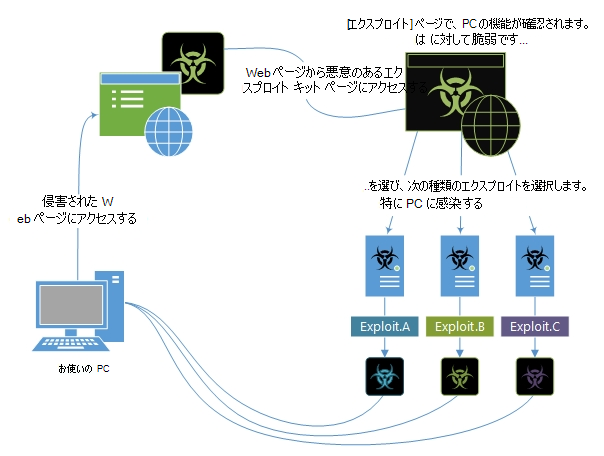

# エクスプロイトとエクスプロイト キット

悪用は、ソフトウェアの脆弱性を利用します。 脆弱性とは、マルウェアがデバイスにアクセスするために使用できるソフトウェアの穴に似た脆弱性です。 マルウェアは、これらの脆弱性を悪用して、コンピューターのセキュリティセーフガードをバイパスしてデバイスに感染します。

## エクスプロイトとエクスプロイト キットの動作

エクスプロイトは、多くの場合、大規模な攻撃の最初の部分です。 ハッカーは、重要な脆弱性を含む古いシステムをスキャンし、標的型マルウェアを展開して悪用します。 多くの場合、悪用にはシェルコードが含まれます。これは、攻撃者が制御するネットワークから追加のマルウェアをダウンロードするために使用される小さなマルウェア ペイロードです。 シェルコードを使用すると、ハッカーはデバイスに感染し、組織に侵入できます。

エクスプロイト キットは、エクスプロイトのコレクションを含む、より包括的なツールです。 これらのキットは、さまざまな種類のソフトウェアの脆弱性についてデバイスをスキャンし、検出された場合は、追加のマルウェアを展開してデバイスにさらに感染します。 キットでは、Adobe Flash Player、Adobe Reader、Internet Explorer、Oracle Java、Sun Java など、さまざまなソフトウェアを対象としたエクスプロイトを使用できます。

攻撃者が悪用や悪用キットを配布するために使用する最も一般的な方法は、Web ページを介して行いますが、悪用は電子メールにも届く可能性があります。 一部の Web サイトは、知らず知らずのうちに悪意のあるコードや悪用を広告でホストします。

以下のインフォグラフィックは、侵害された Web ページにアクセスした後に、エクスプロイト キットがデバイスを悪用しようとする方法を示しています。

*図 1.キットを活用する方法の例が機能する*

Wannacry を含むいくつかの重要な脅威は、サーバー メッセージ ブロック (SMB) の脆弱性 CVE-2017-0144 を悪用してマルウェアを起動します。

エクスプロイト キットの例:

- Angler / [Axpergle](https://www.microsoft.com/en-us/wdsi/threats/malware-encyclopedia-description?name=JS/Axpergle)

- [Neutrino](https://www.microsoft.com/en-us/wdsi/threats/malware-encyclopedia-description?name=JS/NeutrinoEK)

- [核](https://www.microsoft.com/en-us/wdsi/threats/malware-encyclopedia-description?name=JS/Neclu)

エクスプロイトの詳細については、ESET との共同ハントで検出された 2 つのゼロデイ サンプルを取り上についてのブログ記事 [を参照してください。](https://cloudblogs.microsoft.com/microsoftsecure/2018/07/02/taking-apart-a-double-zero-day-sample-discovered-in-joint-hunt-with-eset/)

## エクスプロイトに名前を付け方

マルウェア百科事典のエクスプロイトは、対象となる "プラットフォーム" によって分類されます。 たとえば、Exploit:Java/CVE-2013-1489 です。A は、ユーザーの脆弱性を対象とする悪用Java。

多くのセキュリティ ソフトウェア ベンダーでは、「共通の脆弱性と露出 (CVE)」と呼ばれるプロジェクトが使用されています。 このプロジェクトでは、各脆弱性に固有の番号 (CVE-2016-0778 など) が与えます。
部分 "2016" は、脆弱性が検出された年を指します。 "0778" は、この特定の脆弱性の一意の ID です。

詳しくは、CVE Web サイト [をご覧ください](https://cve.mitre.org/)。

## 悪用から保護する方法

悪用を防ごう最善の方法は、組織のソフトウェアを最新 [の状態に保つ方法です](https://portal.msrc.microsoft.com/)。 ソフトウェア ベンダーは、多くの既知の脆弱性に対する更新プログラムを提供します。そのため、これらの更新プログラムがすべてのデバイスに適用されます。

一般的なヒントについては、「マルウェアの [感染を防ぐ」を参照してください](prevent-malware-infection.md)。
