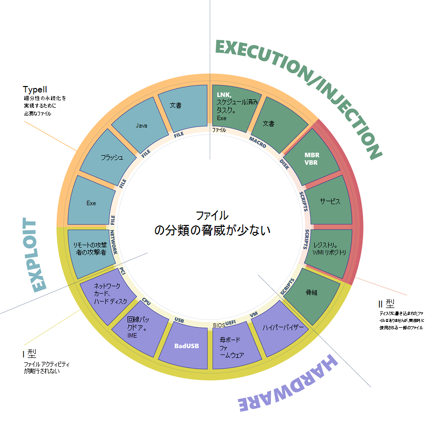
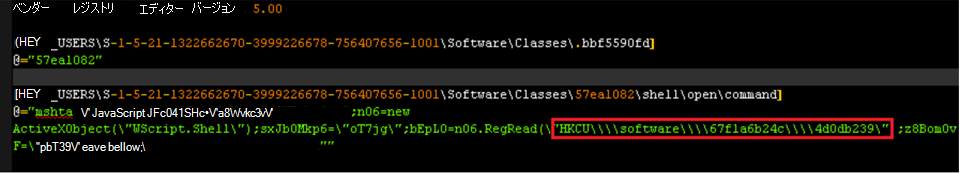

# ファイルレスの脅威

ファイルレス脅威とは何ですか? "fileless" という用語は、マシンのメモリにのみ存在するバックドアなど、脅威がファイルに含まれていないことを示しています。 ただし、ファイルレス マルウェアの定義は 1 つもありません。 この用語は広く使用され、操作するファイルに依存するマルウェア ファミリを記述する場合もあります。

攻撃には、実行、永続化、情報の盗難などの機能 [に対していくつかの段階](https://attack.mitre.org/wiki/ATT&CK_Matrix) が含まれます。 攻撃チェーンの一部はファイルレスである場合もあれば、何らかの形式でファイル システムを含む部分もあります。

わかりやすくするために、ファイルレス脅威は異なるカテゴリにグループ化されます。

 
*図 1.ファイルレス マルウェアの包括的な図*

ファイルレス脅威はエントリ ポイントによって分類できます。これは、ファイルレス マルウェアがコンピューターに到達する方法を示します。 悪用、侵害されたハードウェア、またはアプリケーションとスクリプトの定期的な実行を介して到達できます。

次に、エントリ ポイントの形式を一覧表示します。 たとえば、悪用はファイルまたはネットワーク データに基づいており、PCI 周辺機器はハードウェア ベクターの一種であり、スクリプトと実行可能ファイルは実行ベクトルのサブカテゴリです。

最後に、感染のホストを分類します。 たとえば、フラッシュ アプリケーションには、悪用、単純な実行可能ファイル、ハードウェア デバイスからの悪意のあるファームウェアなど、さまざまな脅威が含まれている場合があります。

分類は、さまざまな種類のファイルレス脅威を分割して分類するのに役立ちます。 一部は危険ですが、実装が難しいものもありますが、高度ではないにもかかわらず (または正確には) 一般的に使用されるものもあります。

この分類から、感染したマシンに残される可能性がある指紋の量に基づいて、主に 3 種類のファイルレス脅威を収集できます。

## タイプ I: ファイル アクティビティが実行されない

完全なファイルレス マルウェアは、ディスクにファイルを書き込む必要がないマルウェアと見なすことができます。 このようなマルウェアは、そもそもどのようにコンピューターに感染しますか? 1 つの例は、ターゲット マシンが、EternalBlue の脆弱性を悪用する悪意のあるネットワーク パケットを受信する場所です。 この脆弱性により、DoublePulsar バックドアがインストールされ、最終的にカーネル メモリにのみ存在します。 この場合、ファイルやファイルに書き込まれたデータはありません。

侵害されたデバイスでは、デバイス ファームウェア (BIOS など)、USB 周辺機器 (BadUSB 攻撃など)、またはネットワーク カードのファームウェアに悪意のあるコードが隠れている可能性もあります。 これらの例はすべて、ディスク上のファイルを実行する必要がなく、理論的にはメモリ内にのみ存在できます。 悪意のあるコードは、再起動、ディスクの再フォーマット、OS の再インストール後も存続します。

ほとんどのウイルス対策製品にはファームウェアを検査する機能がないため、この種類の感染を検出するのは特に困難な場合があります。 製品に悪意のあるファームウェアを検査して検出する機能がある場合でも、このレベルでは脅威の修復に関連する重大な課題があります。 この種のファイルレス マルウェアには高度な洗練が必要であり、多くの場合、特定のハードウェアまたはソフトウェアの構成に依存します。 簡単かつ確実に悪用できる攻撃ベクトルではありません。 危険ですが、この種類の脅威は一般的ではなく、ほとんどの攻撃では実用的ではありません。

## Type II: 間接ファイル アクティビティ

多くのエンジニアリング作業を必要とせずに、マルウェアがマシン上でファイルレスプレゼンスを実現する方法は他にもあります。 この種類のファイルレス マルウェアは、ファイル システムにファイルを直接書き込むのではなく、間接的にファイルを使用する可能性があります。 たとえば、 [Poshspy バックドア](https://www.fireeye.com/blog/threat-research/2017/03/dissecting_one_ofap.html) 攻撃者は、WMI リポジトリ内に悪意のある PowerShell コマンドをインストールし、コマンドを定期的に実行するように WMI フィルターを構成しました。

バックドアをファイルに既に配置しなくても、コマンド ラインを使用してこのようなインストールを実行できます。 マルウェアは、ファイル システムに触れることなく、インストールして理論的に実行できます。 ただし、WMI リポジトリは、CIM オブジェクト マネージャーによって管理される中央ストレージ領域の物理ファイルに格納され、通常は正当なデータが格納されます。 感染チェーンでは物理的なファイルが技術的に使用されますが、WMI リポジトリは検出および削除できない多目的データ コンテナーであるため、ファイルレス攻撃と見なされます。

## タイプ III: 操作に必要なファイル

一部のマルウェアではファイルレス永続化が可能ですが、ファイルを使用して操作する必要はありません。 このシナリオの例として、ランダム ファイル拡張子のシェルオープン動詞ハンドラーをレジストリに作成する Kovter があります。 このような拡張子のファイルを開くと、正当なツール mshta.exeを使用してスクリプトが実行されます。

 
*図 2.Kovter のレジストリ キー*

開いている動詞が呼び出されると、レジストリから関連するコマンドが起動され、小さなスクリプトが実行されます。 このスクリプトは、追加のレジストリ キーからデータを読み取って実行し、最終的なペイロードの読み込みに至ります。 ただし、最初に開いている動詞をトリガーするには、動詞を対象とする拡張子が同じファイルを Kovter で削除する必要があります (上の例では、拡張子は .bbf5590fd です)。 また、コンピューターの起動時にこのようなファイルを開くように構成された自動実行キーを設定する必要もあります。

Kovter は、ファイル システムが実際には使用されないため、ファイルレス脅威と見なされます。 ランダムな拡張機能を持つファイルには、脅威の存在を確認する際に使用できない迷惑データが含まれています。 レジストリを格納するファイルは、悪意のあるコンテンツが存在する場合に検出および削除できないコンテナーです。

## 感染ホスト別のファイルレス脅威の分類

広範なカテゴリについて説明したので、詳細を調べ、感染ホストの内訳を提供できるようになりました。 この包括的な分類では、通常はファイルレス マルウェアと呼ばれるもののパノラマについて説明します。 これは、攻撃のクラスを無力化し、マルウェアが武器競争で優位に立たないようにする新しい保護機能を研究し、開発するための取り組みを推進しています。

### 悪用

**ファイル ベース** (Type III: 実行可能ファイル、Flash、Java、ドキュメント): 初期ファイルは、オペレーティング システム、ブラウザー、Java エンジン、フラッシュ エンジンなどを悪用してシェルコードを実行し、メモリ内のペイロードを配信する可能性があります。 ペイロードはファイルレスですが、最初のエントリ ベクトルはファイルです。

**ネットワーク ベース** (タイプ I): ターゲット マシンの脆弱性を利用するネットワーク通信は、アプリケーションまたはカーネルのコンテキストでコードの実行を実現できます。 たとえば、WannaCry は、SMB プロトコルの以前に修正された脆弱性を悪用して、カーネル メモリ内にバックドアを提供します。

### ハードウェア

**デバイス ベース** (タイプ I: ネットワーク カード、ハード ディスク): ハード ディスクやネットワーク カードなどのデバイスでは、機能するために、チップセットと専用ソフトウェアが必要です。 デバイスのチップセットに存在し、実行されているソフトウェアはファームウェアと呼ばれます。 複雑なタスクですが、 [数式のスパイグループが実行](https://www.kaspersky.com/blog/equation-hdd-malware/7623/)しているのを見つけたので、ファームウェアはマルウェアに感染する可能性があります。

**CPU ベース** (Type I): 最新の CPU は複雑であり、管理目的でファームウェアを実行しているサブシステムが含まれる場合があります。 このようなファームウェアはハイジャックに対して脆弱であり、CPU 内から動作する悪意のあるコードの実行を許可する可能性があります。 2017 年 12 月、2 人の研究者が、Intel の最新の CPU に存在する [管理エンジン (ME)](https://en.wikipedia.org/wiki/Intel_Management_Engine) 内で攻撃者がコードを実行できる脆弱性を報告しました。 一方、攻撃者グループ PLATINUM は、インストールされているオペレーティング システムをバイパスして、Intel の [Active Management Technology (AMT)](https://en.wikipedia.org/wiki/Intel_Active_Management_Technology) を使用して [非表示のネットワーク通信](https://cloudblogs.microsoft.com/microsoftsecure/2017/06/07/platinum-continues-to-evolve-find-ways-to-maintain-invisibility/)を実行する機能を持っていることが観察されています。 ME と AMT は、本質的に CPU 内に存在し、非常に低いレベルで動作する自律マイクロ コンピューターです。 これらのテクノロジの目的はリモート管理性を提供するため、ハードウェアに直接アクセスでき、オペレーティング システムに依存せず、コンピューターの電源が切れた場合でも実行できます。

ファームウェア レベルで脆弱であるだけでなく、ハードウェア回線に直接挿入されたバックドアを使用して CPU を製造できます。 この攻撃は [過去に調査され、可能であることが証明されています](https://www.emsec.rub.de/media/crypto/veroeffentlichungen/2015/03/19/beckerStealthyExtended.pdf) 。 x86 プロセッサの特定のモデルには、通常のアプリケーションが特権的な実行を得ることができる [バックドアを効果的に提供](https://www.theregister.co.uk/2018/08/10/via_c3_x86_processor_backdoor/) できるセカンダリ埋め込み RISC のような CPU コアが含まれていると報告されています。

**USB ベース** (Type I): あらゆる種類の USB デバイスは、悪意のあるファームウェアを使用して、悪意のある方法でオペレーティング システムと対話できる再プログラミングできます。 たとえば、 [BadUSB 手法](https://arstechnica.com/information-technology/2014/07/this-thumbdrive-hacks-computers-badusb-exploit-makes-devices-turn-evil/) を使用すると、再プログラミングされた USB スティックは、キーストロークを介してコンピューターにコマンドを送信するキーボードとして、またはトラフィックを自動的にリダイレクトできるネットワーク カードとして機能できます。

**BIOS ベース** (Type I): BIOS は、チップセット内で実行されているファームウェアです。 マシンの電源がオンのときに実行され、ハードウェアが初期化され、ブート セクターに制御が転送されます。 BIOS は、低レベルで動作し、ブート セクターの前に実行される重要なコンポーネントです。 [過去に Mebromi ルートキット](https://www.webroot.com/blog/2011/09/13/mebromi-the-first-bios-rootkit-in-the-wild/)で発生したように、悪意のあるコードで BIOS ファームウェアを再プログラミングできます。

**ハイパーバイザー ベース** (Type I): 最新の CPU はハードウェア ハイパーバイザーのサポートを提供し、オペレーティング システムが堅牢な仮想マシンを作成できるようにします。 仮想マシンは限られたシミュレートされた環境で実行され、理論的にはエミュレーションに気づいていません。 コンピューターを引き継ぐマルウェアは、実行中のオペレーティング システムの領域の外に隠れる小さなハイパーバイザーを実装する可能性があります。 この種のマルウェアは過去に分類されており、最終的には実際のハイパーバイザー ルートキットが [観察されました](http://seclists.org/fulldisclosure/2017/Jun/29)が、現在までに知られているものはほとんどありませんでした。

### 実行と挿入

**ファイルベース** (Type III: 実行可能ファイル、DLL、LNK ファイル、スケジュールされたタスク): これは標準実行ベクトルです。 単純な実行可能ファイルを第 1 段階のマルウェアとして起動して、メモリ内で追加のペイロードを実行したり、他の正当な実行中のプロセスに挿入したりできます。

**マクロ ベース** (タイプ III: Office ドキュメント): [VBA 言語](/office/vba/Library-Reference/Concepts/getting-started-with-vba-in-office)は、編集タスクを自動化し、ドキュメントに動的機能を追加するように設計された柔軟で強力なツールです。 そのため、攻撃者によって悪用され、実行可能ペイロードのデコード、実行、挿入などの悪意のある操作を実行したり、 [qkG の場合](https://blog.trendmicro.com/trendlabs-security-intelligence/qkg-filecoder-self-replicating-document-encrypting-ransomware/)のようにランサムウェア全体を実装したりする可能性があります。 マクロは、Office プロセス (Winword.exeなど) のコンテキスト内で実行され、スクリプト言語で実装されます。 ウイルス対策で検査できるバイナリ実行可能ファイルはありません。 Office アプリでは、ドキュメントからマクロを実行するためにユーザーからの明示的な同意が必要ですが、攻撃者はソーシャル エンジニアリング手法を使用して、ユーザーをだましてマクロの実行を許可します。

**スクリプト ベース** (Type II: ファイル、サービス、レジストリ、WMI リポジトリ、シェル): JavaScript、VBScript、および PowerShell スクリプト言語は、既定でWindows プラットフォームで使用できます。 スクリプトはマクロと同じ利点を持ち、テキスト ファイル (バイナリ実行可能ファイルではありません) であり、インタープリター (wscript.exe、powershell.exeなど) のコンテキスト内で実行されます。これはクリーンで正当なコンポーネントです。 スクリプトは多用途であり、ファイルから (ダブルクリックして) 実行することも、インタープリターのコマンド ラインで直接実行することもできます。 コマンド ラインで実行すると、マルウェアは、WMI リポジトリから [WMI イベント サブスクリプション](https://www.fireeye.com/blog/threat-research/2017/03/dissecting_one_ofap.html)として[自動実行レジストリ キー内の自動](https://www.gdatasoftware.com/blog/2014/07/23947-poweliks-the-persistent-malware-without-a-file)開始サービスとして悪意のあるスクリプトをエンコードできます。 さらに、感染したコンピューターにアクセスした攻撃者は、コマンド プロンプトでスクリプトを入力する可能性があります。

**ディスク ベース** (タイプ II: ブート レコード): ブート レコードは、ディスクまたはボリュームの最初のセクターであり、オペレーティング システムのブート プロセスを開始するために必要な実行可能コードが含まれています。 [Petya](https://cloudblogs.microsoft.com/microsoftsecure/2017/06/27/new-ransomware-old-techniques-petya-adds-worm-capabilities/?source=mmpc) などの脅威は、悪意のあるコードで上書きすることでブート レコードに感染する可能性があります。 コンピューターが起動されると、マルウェアはすぐに制御を取得します。 ブート レコードはファイル システムの外部にありますが、オペレーティング システムからアクセスできます。 最新のウイルス対策製品には、スキャンして復元する機能があります。

## ファイルレス マルウェアを倒す

Microsoft では、セキュリティ環境を積極的に監視して、新しい脅威の傾向を特定し、脅威のクラスを軽減するソリューションを開発しています。 幅広い脅威に対して有効な持続性のある保護をインストルメント化しています。 マルウェア対策スキャン インターフェイス (AMSI)、動作監視、メモリ スキャン、ブート セクター保護を通じて、[Microsoft Defender for Endpoint](/microsoft-365/security/defender-endpoint/microsoft-defender-endpoint)は、難読化が激しい場合でもファイルレスの脅威を検査できます。 クラウドの機械学習テクノロジを使用すると、これらの保護を新しい脅威や新しい脅威に対してスケーリングできます。

詳細については、「見[えないが見えない:動作監視、AMSI、および次世代 AV でファイルレス マルウェアを倒](https://cloudblogs.microsoft.com/microsoftsecure/2018/09/27/out-of-sight-but-not-invisible-defeating-fileless-malware-with-behavior-monitoring-amsi-and-next-gen-av/)す」を参照してください。

## その他のリソースと情報

[Microsoft 365 E5全体に脅威保護機能をデプロイする](/microsoft-365/solutions/deploy-threat-protection)方法について説明します。
