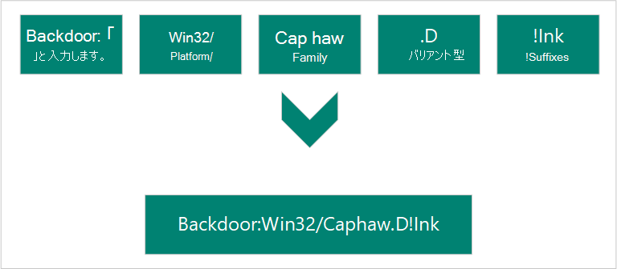

# マルウェア名

コンピューターウイルス対策研究組織 (CARO) マルウェアの名前付けスキームに従って検出したマルウェアと不要なソフトウェアに名前を付けます。 スキームでは、次の形式が使用されます。

アナリストが特定の脅威を調査すると、名前の各コンポーネントがどのようなものになるかが判断されます。

## 種類

マルウェアがコンピューターで行う処理について説明します。 ウォーム、ウイルス、トロイの木馬、バックドア、ランサムウェアは、最も一般的な種類のマルウェアの一部です。

* アドウェア
* バックドア
* 動作
* BrowserModifier
* コンストラクター
* Ddos
* 悪用
* HackTool
* 冗談
* 紛らわしい
* MonitoringTool
* プログラム
* Personal Web Server (PWS)
* 身代 金
* RemoteAccess
* 不正
* SettingsModifier
* SoftwareBundler
* スパマー
* スプーフィング
* スパイウェア
* ツール
* トロイ
* TrojanClicker
* TrojanDownloader
* TrojanNotifier
* TrojanProxy
* TrojanSpy
* VirTool
* ウイルス
* ワーム

## プラットフォーム

プラットフォームは、互換性のあるオペレーティング システム (Windows、masOS X、Android など) にマルウェアを誘導します。 プラットフォームのガイダンスは、プログラミング言語とファイル形式にも使用されます。

### オペレーティング システム

* AndroidOS: Android オペレーティング システム
* DOS: MS-DOS プラットフォーム
* エポック: Psion デバイス
* FreeBSD: FreeBSD プラットフォーム
* iPhoneOS: iPhone オペレーティング システム
* Linux: Linux プラットフォーム
* macOS: MAC 9.x プラットフォーム以前
* macOS_X: MacOS X 以降
* OS2: OS2 プラットフォーム
* Palm: Palm オペレーティング システム
* Solaris: System V ベースの Unix プラットフォーム
* SunOS: Unix プラットフォーム 4.1.3 以下
* SymbOS: Symbian オペレーティング システム
* Unix: 一般的な Unix プラットフォーム
* Win16: Win16 (3.1) プラットフォーム
* Win2K: Windows 2000 プラットフォーム
* Win32: Windows 32 ビット プラットフォーム
* Win64: Windows 64 ビット プラットフォーム
* Win95: Windows 95、98、ME プラットフォーム
* Win98: Windows 98 プラットフォームのみ
* WinCE: Windows CE プラットフォーム
* WinNT: WinNT

### スクリプト言語

* ABAP: 高度なビジネス アプリケーション プログラミング スクリプト
* ALisp: ALisp スクリプト
* AmiPro: AmiPro スクリプト
* ANSI: 米国標準標準機構のスクリプト
* AppleScript: コンパイル済みの Apple スクリプト
* ASP: Active Server Pages スクリプト
* AutoIt: AutoIT スクリプト
* BAS: 基本的なスクリプト
* BAT: 基本的なスクリプト
* CorelScript: Corelscript スクリプト
* HTA: HTML アプリケーション スクリプト
* HTML: HTML アプリケーション スクリプト
* INF: スクリプトをインストールする
* IRC: mIRC/pIRC スクリプト
* Java: Java バイナリ (クラス)
* JS: JavaScript スクリプト
* ロゴ: LOGO スクリプト
* MPB: MapBasic スクリプト
* MSH:Mond シェル スクリプト
* MSIL: .NET 中間言語スクリプト
* Perl: Perl スクリプト
* PHP: Hypertext プリプロセッサ スクリプト
* Python: Python スクリプト
* SAP: SAP プラットフォーム スクリプト
* SH: シェル スクリプト
* VBA: Visual Basic for Applications スクリプト
* VBS: Visual Basic スクリプト
* WinBAT: Winbatch スクリプト
* WinHlp: Windows ヘルプ スクリプト
* WinREG: レジストリ スクリプトをWindowsする

### マクロ

* A97M: Access 97、2000、XP、2003、2007、および 2010 マクロ
* HE: マクロ スクリプト
* O97M: Office 97、2000、XP、2003、2007、および 2010 マクロ - Word、Excel、PowerPointに影響を与えるマクロ
* PP97M: PowerPoint 97、2000、XP、2003、2007、および 2010 マクロ
* V5M: Visio5 マクロ
* W1M: Word1Macro
* W2M: Word2Macro
* W97M: Word 97、2000、XP、2003、2007、および 2010 マクロ
* WM: Word 95 マクロ
* X97M: Excel 97、2000、XP、2003、2007、および 2010 マクロ
* XF: Excel数式
* XM: Excel 95 個のマクロ

### その他のファイルの種類

* ASX: Windows Media .asf ファイルの XML メタファイル
* HC: HyperCard Apple スクリプト
* MIME: MIME パケット
* Netware: Novell Netware ファイル
* QT: Quicktime ファイル
* SB: StarBasic (StarOffice XML) ファイル
* SWF: Shockwave Flash ファイル
* TSQL: MS SQL サーバー ファイル
* XML: XML ファイル

## ファミリー

同じ作成者への属性を含む、一般的な特性に基づくマルウェアのグループ化。 セキュリティ ソフトウェア プロバイダーは、同じマルウェア ファミリに異なる名前を使用することがあります。

## バリアント文字

マルウェア ファミリのすべての異なるバージョンに対して順番に使用されます。 たとえば、バリアント ".AF" の検出は、バリアントの検出後に作成されます。AE"。

## サフィックス

マルチコンポーネント脅威の一部として使用される方法など、マルウェアに関する詳細情報を提供します。 前の例の "!lnk" は、脅威コンポーネントがトロイの木馬:Win32/Reveton.T によって使用されるショートカット ファイルであることを示しています。

* .dam: 破損したマルウェア
* .dll: マルウェアのダイナミック リンク ライブラリ コンポーネント
* .dr: マルウェアのドロッパー コンポーネント
* .gen: 汎用シグネチャを使用して検出されたマルウェア
* .kit: ウイルス コンストラクター
* .ldr: マルウェアのローダー コンポーネント
* .pak: 圧縮されたマルウェア
* .plugin: プラグイン コンポーネント
* .名残: ウイルスの残りの部分
* .worm: そのマルウェアのウォーム コンポーネント
* !bit: 一部の脅威を参照するために使用される内部カテゴリ
* !cl: 一部の脅威を参照するために使用される内部カテゴリ
* !dha: 一部の脅威を参照するために使用される内部カテゴリ
* !pfn: 一部の脅威を参照するために使用される内部カテゴリ
* !plock: 一部の脅威を参照するために使用される内部カテゴリ
* !rfn: 一部の脅威を参照するために使用される内部カテゴリ
* !rootkit: そのマルウェアのルートキット コンポーネント
* @m: ウォーム メーラー
* @mm: 大量メーラー ウォーム
