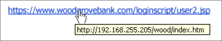

# フィッシング攻撃から保護する方法

フィッシング攻撃は、電子メール、Web サイト、テキスト メッセージ、またはその他の形式の電子通信を通じて機密情報を盗もうとします。 正当な企業や個人からの公式なコミュニケーションのように見えようとします。

サイバー犯罪者は、多くの場合、ユーザー名、パスワード、クレジット カードの詳細、銀行口座情報、またはその他の資格情報を盗もうとします。 盗まれた情報は、ハッキング、個人情報の盗難、銀行口座やクレジット カードから直接盗むなど、悪意のある目的で使用されます。 この情報は、サイバー犯罪者の地下鉄市場でも販売できます。

ソーシャル エンジニアリング攻撃は、ユーザーが意思決定を失う可能性を利用するように設計されています。 電子メールや不明な Web サイト、または電話で機密情報や個人情報を提供しないでください。 フィッシングメールは正当に見えるように設計されています。

## フィッシング詐欺の兆候を確認する

最善の保護は、認識と教育です。 メールが認識されたソースから送信された場合でも、迷惑メールで添付ファイルやリンクを開かないでください。 電子メールが予期しない場合は、添付ファイルを開いて URL を確認してください。

企業は、個人または財務情報を要求するコミュニケーションに注意するように従業員を教育し、トレーニングする必要があります。 また、脅威を会社のセキュリティ運用チームに直ちに報告するよう従業員に指示する必要もあります。

フィッシング詐欺の兆候をいくつか次に示します。

* 電子メールで提供されるリンクまたは URL が **正しい場所を指していない** か、電子メールの送信者と提携していないサード パーティのサイトを指しています。 たとえば、下の図では、指定された URL が、取得する URL と一致しません。

    

* 社会保障番号や銀行、財務 **情報などの個人情報の要求** があります。 通常、公式の通信では、電子メールの形式で個人情報を要求することはありません。

* **メール アドレス内のアイテムは、正当な電子メール アドレス** と十分に似ているが、数字や変更された文字が追加されるように変更されます。

* メッセージは **予期せず、未承諾です**。 エンティティまたはほとんど取引しないユーザーから突然電子メールを受け取った場合は、この電子メールの疑いがあると考えてください。

* メッセージまたは添付ファイルでは、 **マクロの有効化、セキュリティ設定の調整、またはアプリケーションのインストール** を求められます。 通常のメールでは、この操作を行う必要はありません。

* メッセージに **エラーが含まれています**。 正当な企業メッセージでは、文字体裁や文法上の誤りが発生したり、間違った情報が含まれる可能性が低くなります。

* **送信者アドレスがメッセージ自体の署名と一致しません**。 たとえば、電子メールは Contoso Corp の Mary からと呼ばれますが、送信者のアドレスは john@example.com です。

* [宛先] フィールドには **複数の受信者** があり、ランダムなアドレスのように見えます。 通常、企業メッセージは個々の受信者に直接送信されます。

* メッセージ自体のあいさつ文は **、個人的には対処しません**。 別のユーザーに誤って宛てるメッセージとは別に、自分の名前を誤って使用したり、電子メール アドレスから直接名前を取得したりするあいさつ文は悪意を持つ傾向があります。

* Web サイトは使い慣れているように見えますが **、不整合や正しくないもの** があります。 警告サインには、古いロゴ、入力ミス、または正当なサインイン Web サイトから求められない追加情報をユーザーに提供するよう求めるメッセージが含まれます。

* 開くページは **ライブ ページではなく**、使い慣れたサイトのように設計された画像です。 資格情報を要求するポップアップが表示される場合があります。

疑わしい場合は、既知のチャネルからビジネスに問い合わせ、疑わしい電子メールが実際に正当かどうかを確認します。

## 組織向けのソフトウェア ソリューション

* [Microsoft Edge](/microsoft-edge/deploy/index)と[Windows Defender Application Guard](/windows/security/microsoft-defender-application-guard/md-app-guard-overview.md)は、Microsoft の業界をリードする Hyper-V 仮想化テクノロジを使用して、標的型攻撃の脅威の増加から保護します。 閲覧された Web サイトが信頼されていないと見なされた場合、Hyper-V コンテナーは、そのデバイスをネットワークの残りの部分から分離して、エンタープライズ データへのアクセスを防止します。

* [Microsoft Exchange Online Protection (EOP)](https://products.office.com/exchange/exchange-email-security-spam-protection) は、緊急時および緊急時のメールへのアクセスを維持しながら、スパムやマルウェアに対するエンタープライズ クラスの信頼性と保護を提供します。  EOP では、フィルター処理のさまざまなレイヤーを使用して、一括メール制御や国際スパムなどのスパム フィルター処理のさまざまな制御を提供し、保護サービスをさらに強化できます。

* [Microsoft Defender for Office 365](https://products.office.com/exchange/online-email-threat-protection?ocid=cx-blog-mmpc)を使用して、メール、ファイル、およびオンライン ストレージをマルウェアから保護します。 Microsoft Teams、Word、Excel、PowerPoint、Visio、SharePoint Online、OneDrive for Businessの包括的な保護を提供します。 安全でない添付ファイルから保護し、悪意のあるリンクに対する保護を拡大することで、Exchange Online Protectionのセキュリティ機能を補完し、ゼロデイ保護を強化します。

## フィッシング詐欺の被害にあった場合の対処方法

フィッシング攻撃の被害に遭ったと感じる場合:

1. 職場のコンピューターにいる場合は、IT 管理者に問い合わせてください
2. アカウントに関連付けられているすべてのパスワードをすぐに変更する
3. 銀行およびクレジット カード会社に不正な行為を報告する

### スパムの報告

- **Outlook.com**: 個人情報を要求する不審な電子メール メッセージが届く場合は、Outlook受信トレイのメッセージの横にあるチェック ボックスをオンにします。 [ **迷惑メール**] の横にある矢印を選択し、[ **フィッシング**] を選択します。

- **Microsoft Office Outlook**: 不審なメッセージの中で、リボンから **[メッセージの報告**] を選択し、[**フィッシング**] を選択します。

- **Microsoft 365**: [Microsoft 365 Defenderの申請ポータル](/microsoft-365/security/office-365-security/report-junk-email-messages-to-microsoft)を使用して、分析のために迷惑メールまたはフィッシングのサンプルを Microsoft に送信します。 詳細については、「[メッセージとファイルを Microsoft に報告する](/microsoft-365/security/office-365-security/report-junk-email-messages-to-microsoft)」を参照してください。

- **フィッシング対策ワーキング グループ**: phishing-report@us-cert.gov。 グループは、送信されたメールから生成されたレポートを使用して、フィッシング詐欺やハッカーと戦います。 ISP、セキュリティ ベンダー、金融機関、法執行機関が関与しています。

### 疑わしい Web サイトにいる場合

- **Microsoft Edge**: 不審なサイトにいる間は、**その他 (...) アイコン** > **Help と feedbackReport** >  **Unsafe サイト** を選択します。 表示される Web ページの指示に従って、Web サイトを報告します。

- **Internet Explorer**: 不審なサイトにいる間は、歯車アイコンを選択し、[ **安全]** をポイントして、[ **安全でない Web サイトの報告**] を選択します。 表示される Web ページの指示に従って、Web サイトを報告します。

## フィッシング攻撃の詳細

- [フィッシングから身を守る](https://support.microsoft.com/help/4033787/windows-protect-yourself-from-phishing)
- [フィッシングの傾向](phishing-trends.md)
