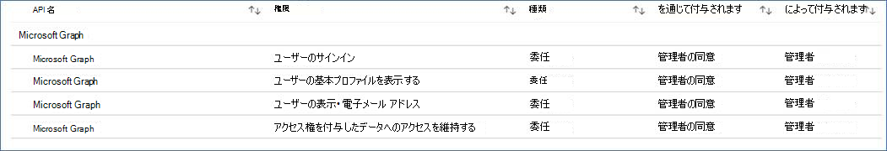
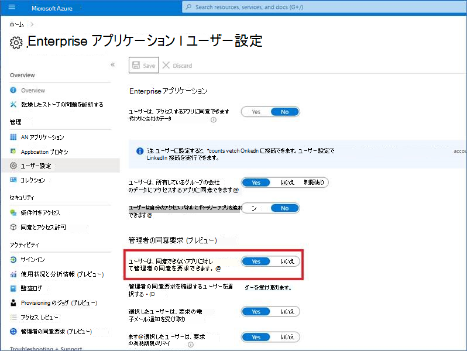
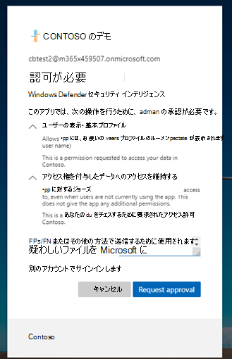
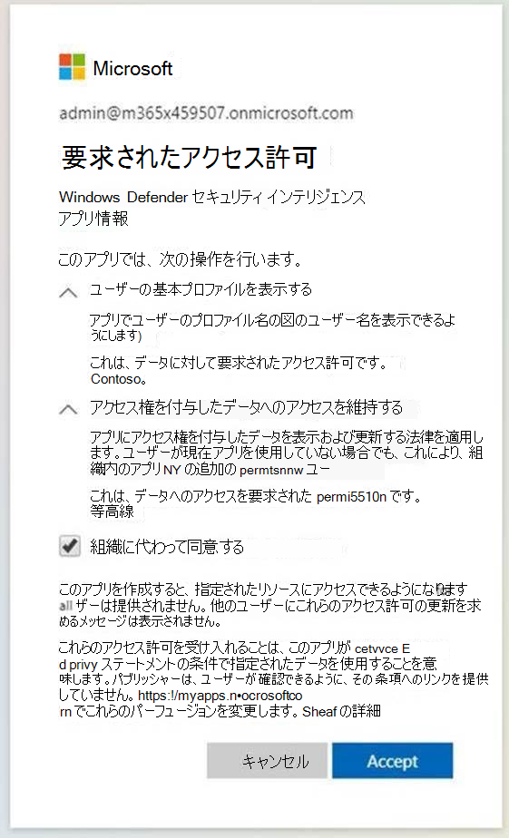
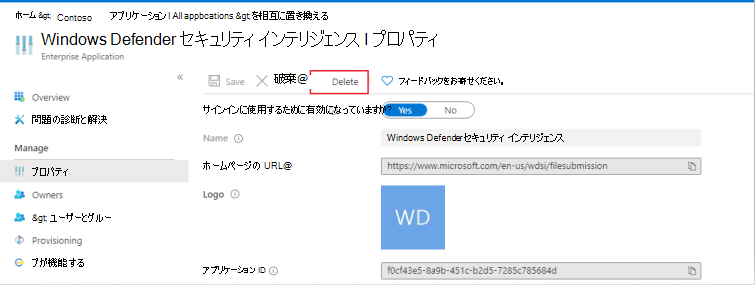

# 管理者ブロックによるマルウェアの送信エラーのトラブルシューティング
場合によっては、感染している可能性のあるファイルを [分析のために Microsoft セキュリティ](https://www.microsoft.com/wdsi) インテリジェンス Web サイトに提出しようとするときに、管理者ブロックによって提出の問題が発生する場合があります。 次のプロセスは、この問題を解決する方法を示しています。

## 設定の確認
Azure のアプリケーション設定[Enterprise開きます](https://portal.azure.com/#blade/Microsoft_AAD_IAM/StartboardApplicationsMenuBlade/UserSettings/menuId/)。 [**Enterprise ApplicationsUsers** >   は、自分の代わりに会社のデータにアクセスするアプリに同意できます。[はい] または [いいえ] が選択されているかどうかを確認します。

- **[いいえ]** が選択されている場合Azure ADテナントの管理者は、組織に同意する必要があります。 サーバーの構成によってはAzure AD、ユーザーは同じダイアログ ボックスから要求を送信できる場合があります。 管理者の同意を求めるオプションがない場合、ユーザーはこれらのアクセス許可を Azure AD 管理者に追加する必要があります。詳細については、次のセクションに移動します。

- [**はい**] が選択されている場合は、[セキュリティ インテリジェンス アプリWindows Defenderユーザーがサインインするために有効になっているか **?** が Azure で **[は** い] に [設定されている必要があります](https://portal.azure.com/#blade/Microsoft_AAD_IAM/ManagedAppMenuBlade/Properties/appId/f0cf43e5-8a9b-451c-b2d5-7285c785684d/objectId/4a918a14-4069-4108-9b7d-76486212d75d)。[**いいえ]** が選択されている場合は、管理者が有効にするAzure ADする必要があります。 
  
## 必須のアプリケーションEnterpriseを実装する 
このプロセスには、テナントのグローバル管理者またはアプリケーション管理者が必要です。
 1. [アプリケーション[Enterprise開きます](https://portal.azure.com/#blade/Microsoft_AAD_IAM/ManagedAppMenuBlade/Permissions/appId/f0cf43e5-8a9b-451c-b2d5-7285c785684d/objectId/4a918a14-4069-4108-9b7d-76486212d75d)。 
 2. [組織 **の管理者の同意を許可する] を選択します**。
 3. 実行できる場合は、次の図に示すように、このアプリケーションに必要な API アクセス許可を確認します。 テナントに同意を提供します。

    

  4. 管理者が手動で同意を提供しようとしてエラーを受け取った場合は、可能な限り、オプション [1](#option-1-approve-enterprise-application-permissions-by-user-request) または [オプション 2](#option-2-provide-admin-consent-by-authenticating-the-application-as-an-admin) を試してください。
  
## オプション 1 ユーザー要求によるエンタープライズ アプリケーションのアクセス許可の承認
> [!Note]
> これは現在、プレビュー機能です。

Azure Active Directory管理者は、ユーザーがアプリに対する管理者の同意を要求できる必要があります。 アプリケーションで設定が **[は**[い] に構成Enterpriseします](https://portal.azure.com/#blade/Microsoft_AAD_IAM/StartboardApplicationsMenuBlade/UserSettings/menuId/)。

詳細については、「Configure [Admin consent workflow」を参照してください](/azure/active-directory/manage-apps/configure-admin-consent-workflow)。

この設定が確認された後、 [ユーザーは Microsoft](https://www.microsoft.com/wdsi/filesubmission) セキュリティ インテリジェンスでエンタープライズ顧客サインインを行い、正当性を含む管理者の同意を要求することができます。

管理者は、アプリケーションのアクセス許可 Azure 管理者の同意要求を確認 [および承認できます](https://portal.azure.com/#blade/Microsoft_AAD_IAM/StartboardApplicationsMenuBlade/AccessRequests/menuId/)。

同意を得た後、テナント内のすべてのユーザーがアプリケーションを使用できます。
  
## オプション 2 アプリケーションを管理者として認証して管理者の同意を提供する 
このプロセスでは、グローバル管理者が Microsoft セキュリティ インテリジェンスEnterprise顧客サインイン フローを通過[する必要があります](https://www.microsoft.com/wdsi/filesubmission)。

次に、管理者はアクセス許可を確認し、組織の代わりに **[同意**] を選択し、[同意する] を選択 **します**。

テナント内のすべてのユーザーが、このアプリケーションを使用できます。

## オプション 3: アプリのアクセス許可を削除して読み取る
どちらのオプションでも問題が解決しない場合は、次の手順 (管理者として) を試してください。

1. アプリケーションの以前の構成を削除します。 [アプリケーションの [Enterprise] に移動し、削除] を **選択します**。

   

2. プロパティから TenantID を [キャプチャします](https://portal.azure.com/#blade/Microsoft_AAD_IAM/ActiveDirectoryMenuBlade/Properties)。

3. {tenant-id} を、以下の URL でこのアプリケーションに同意する必要がある特定のテナントに置き換えます。 この URL をブラウザーにコピーします。 残りのパラメーターは既に完了しています。 
``https://login.microsoftonline.com/{tenant-id}/v2.0/adminconsent?client_id=f0cf43e5-8a9b-451c-b2d5-7285c785684d&state=12345&redirect_uri=https%3a%2f%2fwww.microsoft.com%2fwdsi%2ffilesubmission&scope=openid+profile+email+offline_access``

   

4. アプリケーションで必要なアクセス許可を確認し、[同意する] を **選択します**。 

5. アクセス許可が Azure portal に適用されるの [を確認します](https://portal.azure.com/#blade/Microsoft_AAD_IAM/ManagedAppMenuBlade/Permissions/appId/f0cf43e5-8a9b-451c-b2d5-7285c785684d/objectId/ce60a464-5fca-4819-8423-bcb46796b051)。

   
   
6. 管理者以外の [アカウントを](https://www.microsoft.com/wdsi/filesubmission) 使用してエンタープライズ ユーザーとして Microsoft セキュリティ インテリジェンスにサインインして、アクセス権を持っている場合に確認します。

 これらのトラブルシューティング手順に従った後に警告が解決されない場合は、Microsoft サポートに問い合わせください。