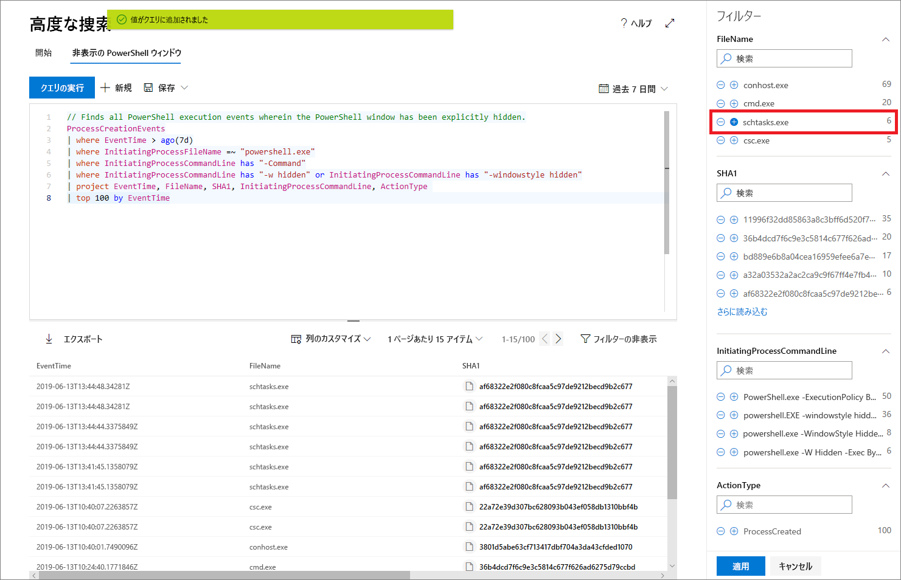

# Microsoft Threat Protection の高度な捜索により、脅威を積極的に捜索する

**適用対象:**
- Microsoft Threat Protection

[!include[Prerelease information](prerelease.md)]

高度な捜索は、クエリ ベースの脅威の捜索ツールで、最大 30 日間のロー データを検索できます。 ネットワーク内のイベントを事前に検査して、興味深いインジケーターとエンティティを見つけることができます。 データへの柔軟なアクセスにより、既知の脅威と潜在的な脅威の両方に対して、無制限な捜索が容易になります。

Microsoft 365 セキュリティ センターでは、高度な捜索により、搭載デバイスからのデータを網羅する Microsoft Defender ATP とメールからのデータを提供する Office 365 ATP の両方からのデータを調べるクエリがサポートされます。 高度な捜索を使用するには、[Microsoft Threat Protection を有効](mtp-enable.md)にします。

## 高度な捜索を開始する

高度な捜索をすぐに開始して実行するには、いくつかの手順に従うことをお勧めします。

| 学習目標 | 説明 | リソース |
|--|--|--|
| **言語に慣れる** | 高度な捜索は、同じ構文および演算子をサポートする [Kusto クエリ言語](https://docs.microsoft.com/azure/kusto/query/)に基づいています。 最初のクエリを実行して、クエリ言語を学習します。 | [クエリ言語の概要](advanced-hunting-query-language.md) |
| **スキーマを理解する** | スキーマとその列のテーブルについて、高レベルで十分に理解してください。 これにより、データを検索する場所およびクエリの作成方法を決定できます。 | [スキーマ リファレンス](advanced-hunting-schema-tables.md) |
| **定義済みクエリを使用する** | さまざまな脅威の捜索シナリオを網羅する定義済みクエリのコレクションを調べます。 | [共有クエリを使用する](advanced-hunting-shared-queries.md)
| **クエリを最適化する** | 効率的なクエリおよびメールとデバイスからのデータを結合するクエリを作成する方法を理解します。 | [クエリのベストプラクティス](advanced-hunting-shared-queries.md)、[デバイスやメール全体の捜索](advanced-hunting-best-practices.md)

## クエリを記述するときにヘルプを参照する
次の機能を利用して、クエリをより速く記述します。
- **自動補完候補** — クエリを記述するときに、高度な捜索が提案を提供します。 
- **スキーマ リファレンス** — テーブルとその列のリストを含むスキーマ リファレンスが作業領域の横に表示されます。 詳細については、アイテムにカーソルを合わせてください。 アイテムをダブルクリックして、クエリ エディターに挿入します。

## クエリ結果からドリルダウンする
クエリ結果でマシン、ファイル、ユーザー、IP アドレス、URL などのエンティティに関する詳細情報を表示するには、エンティティ識別子をクリックします。 これにより、Microsoft Defender セキュリティ センターで選択したエンティティの詳細なプロファイル ページが開きます。

## 結果からクエリを絞り込む
結果セットの値を右クリックすると、クエリがすばやく強化されます。 次のようなオプションを使用できます。

- 選択した値 (`==`) を明示的に検索する
- 選択した値をクエリ (`!=`) から除外する 
- クエリに値を追加するためのより高度な演算子 `contains`、`starts with`、および `ends with` を取得する 

## クエリ結果をフィルター処理する
右に表示されるフィルターは、結果セットの要約を提供します。 各列には、その列で見つかった個別の値とインスタンスの数を一覧表示する独自のセクションがあります。

含めるまたは除外する値の [+] または [-] ボタンを選択し、[**クエリの実行**] を選択して、クエリを絞り込みます。

フィルターを適用してクエリを変更し、クエリを実行すると、結果がそれに応じて更新されます。

## 関連項目
- [クエリ言語の説明](advanced-hunting-query-language.md)
- [共有クエリを使用する](advanced-hunting-shared-queries.md)
- [デバイスとメール全体で脅威を捜索する](advanced-hunting-query-emails-devices.md)
- [スキーマを理解する](advanced-hunting-schema-tables.md)
- [クエリのベスト プラクティスを適用する](advanced-hunting-best-practices.md)