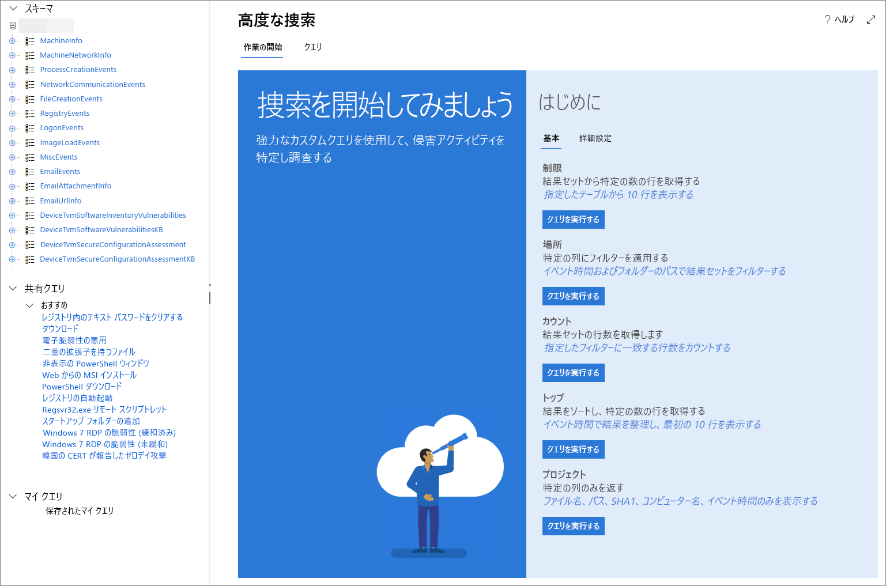

# <a name="learn-the-advanced-hunting-query-language"></a>高度な捜索のクエリ言語について学習する

**適用対象:**
- Microsoft Threat Protection

[!INCLUDE [Prerelease information](../includes/prerelease.md)]

高度な捜索は、[Kusto クエリ言語](https://docs.microsoft.com/azure/kusto/query/)に基づいています。 Kusto 構文および演算子を使用して、高度な捜索用に特別に構造化された[スキーマ](advanced-hunting-schema-tables.md)内の情報を検索するクエリを作成できます。 これらの概念をよりよく理解するために、最初のクエリを実行します。

## <a name="try-your-first-query"></a>最初のクエリを試してみる

Microsoft 365 セキュリティ センターで、[**捜索**] に移動して最初のクエリを実行します。 次の例を使用してください。

```
// Finds PowerShell execution events that could involve a download.
DeviceProcessEvents 
| where Timestamp > ago(7d)
| where FileName in ("powershell.exe", "POWERSHELL.EXE", "powershell_ise.exe", "POWERSHELL_ISE.EXE") 
| where ProcessCommandLine has "Net.WebClient"
        or ProcessCommandLine has "DownloadFile"
        or ProcessCommandLine has "Invoke-WebRequest"
        or ProcessCommandLine has "Invoke-Shellcode"
        or ProcessCommandLine contains "http:"
| project Timestamp, DeviceName, InitiatingProcessFileName, FileName, ProcessCommandLine
| top 100 by Timestamp
```

これは、高度な捜索でどのように見えるかを示します。


クエリは、まず、目的を説明する短いコメントから始まります。 これは、後でクエリを保存し、組織内の他のユーザーと共有することを決定した場合に役立ちます。

```
// Finds PowerShell execution events that could involve a download.
DeviceProcessEvents
```

通常、クエリ自体はテーブル名から始まり、続いてパイプ (`|`) で始まる一連の要素が続きます。 この例では、まずテーブル名 `DeviceProcessEvents` を追加し、必要に応じてパイプ要素を追加します。

最初のパイプ要素は、過去 7 日間に限定された時間フィルターです。 時間範囲をできる限り狭くすることで、クエリが適切に実行され、管理可能な結果が返され、タイムアウトが回避されます。

```
| where Timestamp > ago(7d)
```

時間範囲の直後に、PowerShell アプリケーションを表すファイルを検索します。

```
| where FileName in ("powershell.exe", "POWERSHELL.EXE", "powershell_ise.exe", "POWERSHELL_ISE.EXE")
```

その後、クエリは通常、ファイルをダウンロードするために PowerShell で使用されるコマンド ラインを探します。

```
| where ProcessCommandLine has "Net.WebClient"
        or ProcessCommandLine has "DownloadFile"
        or ProcessCommandLine has "Invoke-WebRequest"
        or ProcessCommandLine has "Invoke-Shellcode"
        or ProcessCommandLine contains "http:"
```

クエリによって、検索するデータが明確に識別されるようになったので、結果の見た目を定義する要素を追加できます。 `project` は特定の列を返し、`top` は結果の数を制限するため、結果が適切に書式設定され、適度に大きく、処理も簡単になります。

```
| project Timestamp, DeviceName, InitiatingProcessFileName, FileName, ProcessCommandLine
| top 100 by Timestamp'
```

[**クエリの実行**] をクリックして結果を確認します。 画面表示を拡大すると、捜索クエリと結果に集中できます。

## <a name="learn-common-query-operators-for-advanced-hunting"></a>高度な捜索のための一般的なクエリ演算子を学習する

最初のクエリを実行し、そのコンポーネントの一般的な概念を理解したので、少しだけ遡って基本的なことを学習しましょう。 高度な捜索で使用される Kusto クエリ言語は、次のような一般的な演算子をサポートします。

| 演算子 | 説明および使用法 |
|--|--|
| `where` | 述語に適合する行のサブセットにテーブルをフィルター処理します。 |
| `summarize` | 入力テーブルの内容を集約したテーブルを作成します。 |
| `join` | 各テーブルから指定された列の値を照合して、2 つのテーブルの行を結合し、新しいテーブルを作成します。 |
| `count` | 入力レコード セットのレコード数を返します。 |
| `top` | 指定された列によって並べ替えられた最初の N レコードを返します。 |
| `limit` | 指定された行数まで返します。 |
| `project` | 新しい計算列を含める、名前を変更する、またはドロップする列を選択し、挿入します。 |
| `extend` | 計算列を作成し、結果セットに追加します。 |
| `makeset` |  Expr がグループ内でとる個別の値のセットの動的 (JSON) 配列を返します。 |
| `find` | テーブルのセットで述語と一致する行を検索します。 |

これらの演算子の実際の例を見るには、高度な捜索の [**はじめに**] セクションから実行します。

## <a name="understand-data-types-and-their-query-syntax-implications"></a>データ型とクエリ構文の意味を理解する

高度な捜索テーブルのデータは、通常、次のデータ型に分類されます。

| データ型 | 説明とクエリの意味 |
|--|--|
| `datetime` | 通常、イベントのタイムスタンプを表すデータおよび時間の情報 |
| `string` | 文字の文字列 |
| `bool` | True または False |
| `int` | 32 ビットの数値  |
| `long` | 64 ビットの数値 |

## <a name="use-sample-queries"></a>サンプル クエリを使用する

[**はじめに**] セクションでは、一般的に使用されている演算子を使用した簡単なクエリーをいくつか提供します。 これらのクエリを実行して、少し変更してみてください。



>[!NOTE]
>基本的なクエリ サンプルとは別に、特定の脅威の捜索シナリオの[共有クエリ](advanced-hunting-shared-queries.md)にアクセスすることもできます。 ページ左側の共有クエリまたは GitHub クエリ リポジトリを探します。

## <a name="access-query-language-documentation"></a>クエリ言語のドキュメントにアクセスする

Kusto クエリ言語およびサポートされる演算子の詳細については、「[Kusto クエリ言語のドキュメント](https://docs.microsoft.com/azure/kusto/query/)」を参照してください。

## <a name="related-topics"></a>関連項目
- [積極的に脅威を捜索する](advanced-hunting-overview.md)
- [共有クエリを使用する](advanced-hunting-shared-queries.md)
- [デバイスとメール全体で脅威を捜索する](advanced-hunting-query-emails-devices.md)
- [スキーマを理解する](advanced-hunting-schema-tables.md)
- [クエリのベスト プラクティスを適用する](advanced-hunting-best-practices.md)