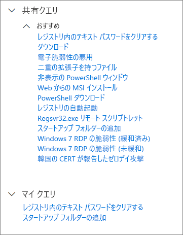
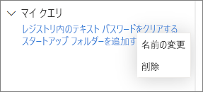

# 高度な捜索で共有クエリを使用する

**適用対象:**
- Microsoft Threat Protection

[!INCLUDE [Prerelease information](../includes/prerelease.md)]

[高度な捜索](advanced-hunting-overview.md)クエリは、同じ組織内のユーザー間で共有できます。 また、GitHub で公開されているクエリも検索できます。 これらのクエリを使用すると、クエリを最初から作成することなく、特定の脅威の捜索シナリオを迅速に実行できます。

## クエリを保存、変更、共有する
新規または既存のクエリを保存して、自分のみアクセスできるようにしたり、組織内の他のユーザーと共有したりできます。 

1. クエリを作成または変更します。 

2. [**クエリの保存**] ドロップダウン ボタンをクリックし、[**名前を付けて保存**] を選択します。
    
3. クエリの名前を入力します。 

   

4. クエリを保存するフォルダーを選択します。
    - [**共有クエリ**] — 組織のすべてのユーザーに共有する
    - [**マイ クエリ**] — 自分のみアクセス可能
    
5. [**保存**] を選択します。 

## クエリを削除または名前を変更する
1. 名前を変更または削除するクエリを右クリックします。

    

2. [**削除**] を選択して、削除を確認します。 または、[**名前の変更**] を選択して、クエリに新しい名前を入力ます。

## GitHub リポジトリ内のクエリにアクセスする  
Microsoft のセキュリティ調査員は、[GitHub の指定された公開リポジトリ](https://github.com/microsoft/MTP-AHQ)で高度な捜索クエリを定期的に共有しています。 このリポジトリは投稿できます。 投稿するには、[GitHub に無料で参加](https://github.com/)してください。

>[!tip]
>また、Microsoft のセキュリティ調査員は高度な捜索クエリも提供しています。これを使用して、新たな脅威に関連するアクティビティやインジケータを特定できます。 これらのクエリは、Microsoft Defender セキュリティ センターの[脅威の分析](https://docs.microsoft.com/windows/security/threat-protection/microsoft-defender-atp/threat-analytics)レポートの一部として提供されます。

## 関連項目
- [積極的に脅威を捜索する](advanced-hunting-overview.md)
- [クエリ言語の説明](advanced-hunting-query-language.md)
- [デバイスとメール全体で脅威を捜索する](advanced-hunting-query-emails-devices.md)
- [スキーマを理解する](advanced-hunting-schema-tables.md)
- [クエリのベスト プラクティスを適用する](advanced-hunting-best-practices.md)