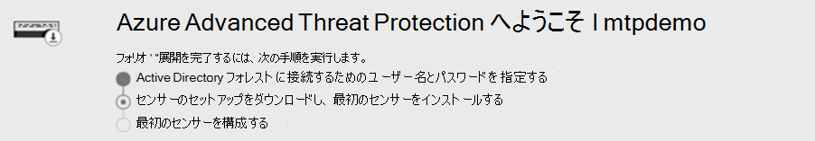
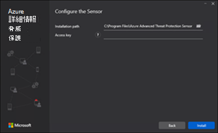
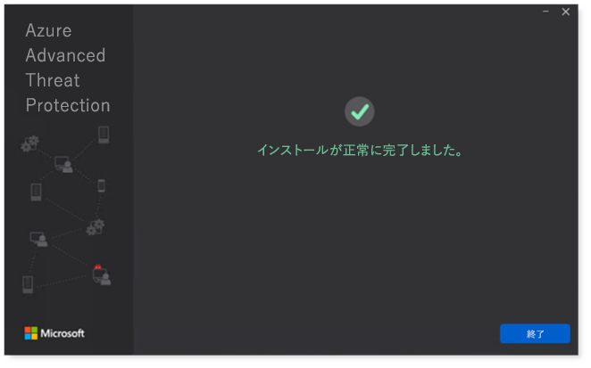

# 試験ラボまたはパイロット環境用に Microsoft 365 Defender の柱を構成する

[!INCLUDE [Microsoft 365 Defender rebranding](../includes/microsoft-defender.md)]

**適用対象:**
- Microsoft 365 Defender

Microsoft 365 Defender 試用版ラボまたはパイロット環境を作成して展開するには、次の 3 段階のプロセスがあります。

| [フェーズ 1: 準備](prepare-mtpeval.md) | [フェーズ 2: セットアップ](setup-mtpeval.md) | フェーズ 3: オンボーディング |  [パイロット プレイブックに戻る](mtp-pilot.md) |
|--|--|--|--|
|| |*ここにいます。* | |

現在、構成フェーズに入っている。

展開が成功するには、準備が重要です。 この記事では、Microsoft Defender for Endpoint の展開を準備する際に考慮する必要があるポイントについて説明します。

## Microsoft 365 Defender の柱
Microsoft 365 Defender は、4 つの柱で構成されています。 1 つの柱は既にネットワーク組織のセキュリティに価値を提供することができますが、4 つの Microsoft 365 Defender の柱を有効にすると、組織が最も価値を持つものになります。

このセクションでは、次の構成について説明します。
-   Microsoft Defender for Office 365
-   Microsoft Defender for Identity 
-   Microsoft Cloud App Security
-   Microsoft Defender for Endpoint

## Microsoft Defender を Office 365 用に構成する

>[!NOTE]
>Defender for Office 365 を有効にしている場合は、この手順をスキップします。 

これらの設定の一部を決定するのに役立つ *Office 365 Advanced Threat Protection Recommended Configuration Analyzer (ORCA)* と呼ばれる PowerShell モジュールがあります。 テナントで管理者として実行すると、get-ORCAReport はスパム対策、フィッシング対策、その他のメッセージ検疫設定の評価を生成するのに役立ちます。 このモジュールは、次のリンクからダウンロードできます https://www.powershellgallery.com/packages/ORCA/ 。 

1. コンプライアンス センター [の脅威Office 365 セキュリティ &に](https://protection.office.com/homepage)  >  **移動**  >  **します**。

   
 
2. [ **フィッシング対策] をクリックし、[** 作成 **]** を選択し、ポリシー名と説明を入力します。 [**次へ**] をクリックします。

   

   > [!NOTE]
   > Microsoft Defender で高度なフィッシング対策ポリシーを編集して、Office 365 に適用します。 高度 **なフィッシングのしきい値を** **2 - 積極的に変更します**。

3. [条件 **の追加] ドロップダウン** メニューをクリックし、受信者ドメインとしてドメインを選択します。 [**次へ**] をクリックします。

   
 
4. 設定を確認します。 [この **ポリシーの作成] をクリックして** 確認します。 

   ![[_Office 365 セキュリティ & コンプライアンス センターのフィッシング対策ポリシー] ページの画像。設定を確認して、このポリシー ボタンの作成をクリックできます。](../../media/mtp-eval-35.png)
 
5. [ **安全な添付** ファイル] を選択し **、[SharePoint、OneDrive、Microsoft Teams** の ATP を有効にする] オプションを選択します。

   ![SharePoint、OneDrive Office Microsoft Teams の ATP &有効にできる [_Office 365 セキュリティ/コンプライアンス センター] ページの画像](../../media/mtp-eval-36.png)

6. [+] アイコンをクリックして新しい安全な添付ファイル ポリシーを作成し、ドメインに受信者ドメインとして適用します。 **[保存]** をクリックします。

   ![新しい安全Officeポリシー&作成できる [_Office 365 セキュリティ/コンプライアンス センター] ページの画像](../../media/mtp-eval-37.png)
 
7. 次に、[安全な **リンク]** ポリシーを選択し、鉛筆アイコンをクリックして既定のポリシーを編集します。

8. [ユーザーが安全 **なリンク** をクリックしても追跡しない] オプションが選択されていないのに対し、残りのオプションは選択してください。 詳細については [、「安全なリンクの設定](https://docs.microsoft.com/microsoft-365/security/office-365-security/recommended-settings-for-eop-and-office365-atp) 」を参照してください。 **[保存]** をクリックします。 

   ![[安全Officeクリックしても追跡しない] オプションが選択& 365 セキュリティ センター コンプライアンス センターの画像](../../media/mtp-eval-38.png)

9. 次に、マルウェア **対策ポリシーを** 選択し、既定のポリシーを選択して、鉛筆アイコンを選択します。

10. [ **設定] を** クリックし、[ **はい] を選択し** 、既定の通知テキストを使用してマルウェア検出応答 **を有効にします**。 共通添付 **ファイルの種類フィルターを有効** にする。 **[保存]** をクリックします。

    ![[_Office 365 セキュリティ & コンプライアンス センター] ページの画像。](../../media/mtp-eval-39.png)
  
11. コンプライアンス センター [Office監査ログ& 365](https://protection.office.com/homepage)セキュリティ センターの検索に移動し、  >    >  監査を有効にしてください。

    ![監査ログ検索Office有効& 365 セキュリティ センター の [コンプライアンス センター] ページの画像](../../media/mtp-eval-40.png)

12. Microsoft Defender for Office 365 と Microsoft Defender for Endpoint を統合します。 Office [365 Security & Compliance Center](https://protection.office.com/homepage)Threat management Explorer に移動し、画面の右上隅にある [エンドポイントの設定] で Microsoft  >    >   **Defender** を選択します。 [Defender for Endpoint 接続] ダイアログ ボックスで、[Microsoft Defender for Endpoint への接続 **] をオンにします**。

    

## Id 用に Microsoft Defender を構成する

>[!NOTE]
>既に Microsoft Defender for Identity を有効にしている場合は、この手順をスキップします。

1. Microsoft [365 セキュリティ センターに](https://security.microsoft.com/info)移動し、[> Microsoft Defender の ID に関するその他  >  **のリソース] を選択します**。

   ![Id of_Microsoft Microsoft Defender を開くオプションがある [365 セキュリティ センター] ページの画像](../../media/mtp-eval-42.png)

2. [ **作成]** をクリックして、Microsoft Defender for Identity ウィザードを開始します。 

   ![[of_Microsoftの作成] ボタンをクリックする必要がある[Id 用 Defender ウィザード] ページの画像](../../media/mtp-eval-43.png)

3. Choose **Provide a username and password to connect to your Active Directory forest**.  

   

4. Active Directory のオンプレミス資格情報を入力します。 Active Directory への読み取りアクセス権を持つ任意のユーザー アカウントを指定できます。

   ![資格情報of_Microsoftする必要がある [Identity Directory サービス用 Defender] ページの画像](../../media/mtp-eval-45.png)

5. 次に、[ **センサーのセットアップのダウンロード] を選択** し、ドメイン コントローラーにファイルを転送します。

   

6. Microsoft Defender for Identity Sensor セットアップを実行し、ウィザードの実行を開始します。

   ![[Of_Microsoft Defender for Identity] ページの画像。次にクリックして、Microsoft Defender for Identity センサー ウィザードに従う必要があります。](../../media/mtp-eval-47.png)
 
7. センサー **の展開の** 種類で [次へ] をクリックします。

   ![次of_Microsoftページに移動するためにクリックする必要がある[Id 用 Defender] ページの画像](../../media/mtp-eval-48.png)
 
8. ウィザードで次に入力する必要があるアクセス キーをコピーします。

   ![次of_the Microsoft Defender for Identity センサーのセットアップ ウィザード ページで入力する必要があるアクセス キーをコピーする必要がある[センサーのイメージ] ページ](../../media/mtp-eval-49.png)
 
9. ウィザードにアクセス キーをコピーし、[インストール] を **クリックします**。 

   

10. これで完了です。ドメイン コントローラーで Id 用に Microsoft Defender が正常に構成されました。

    
 
11. [Id 設定 [用 Microsoft Defender] セクション](https://go.microsoft.com/fwlink/?linkid=2040449) で、[エンドポイント用 Microsoft Defender] を選択し、トグルをオンにします。 **[保存]** をクリックします。 

    ![Microsoft Defender of_theを有効にする必要がある[ID の設定] ページの画像](../../media/mtp-eval-52.png)

>[!NOTE]
>Windows Defender ATP は、Microsoft Defender for Endpoint として再ブランドされました。 すべてのポータルで変更の再ブランド化を行い、一貫性を確保しています。

## Microsoft Cloud App Security を構成する

>[!NOTE]
>Microsoft Cloud App Security を既に有効にしている場合は、この手順をスキップします。 

1. Microsoft Cloud App Security に関するその他のリソースを Microsoft [365](https://security.microsoft.com/info)  >    >  **セキュリティ センターに移動します**。

   ![[Of_Microsoft 365 セキュリティ センター] ページで Microsoft Cloud App カードを表示し、[開く] ボタンをクリックする必要がある画像](../../media/mtp-eval-53.png)

2. Id 用 Microsoft Defender を統合する情報プロンプトで、[Id データ統合 **用に Microsoft Defender を有効にする] を選択します**。
  
   ![Id of_the Microsoft Defender for Identity を統合する情報プロンプトが表示されます。ここで、[Id データ統合用に Microsoft Defender を有効にする] リンクを選択する必要があります。](../../media/mtp-eval-54.png)

   > [!NOTE]
   > このプロンプトが表示されていない場合は、Microsoft Defender for Identity データ統合が既に有効になっている可能性があります。 ただし、確認できない場合は、IT 管理者に問い合わせて確認してください。 

3. [設定] **に** 移動し **、[Id 統合用 Microsoft Defender]** トグルをオンにし、[保存] をクリック **します**。 

   ![Id 統合of_the Microsoft Defender を有効にし、[保存] をクリックする必要がある[画像の設定] ページ](../../media/mtp-eval-55.png)
   
   > [!NOTE]
   > ID インスタンス用の新しい Microsoft Defender の場合、この統合トグルは自動的にオンになります。 次の手順に進む前に、Id 用 Microsoft Defender の統合が有効になっている必要があります。
 
4. クラウド検出の設定で、 **エンドポイント統合用の Microsoft Defender** を選択し、統合を有効にします。 **[保存]** をクリックします。

   ![[エンドポイントof_the Microsoft Defender for Endpoint の統合の下にある[非許可アプリのブロック] チェック ボックスが選択されている[エンドポイント用 Microsoft Defender] ページの画像。 [保存] をクリックします。](../../media/mtp-eval-56.png)

5. [クラウド検出の設定] で、[ユーザー エン **リッチメント**] を選択し、Azure Active Directory との統合を有効にします。

   ![[ユーザー エンリッチメント] セクションの画像。Azure Active Directory のユーザー名を使用して検出されたユーザー識別子を強化するチェック ボックスがオン](../../media/mtp-eval-57.png)

## エンドポイント用に Microsoft Defender を構成する

>[!NOTE]
>Microsoft Defender for Endpoint を既に有効にしている場合は、この手順をスキップします。

1. Microsoft [365 セキュリティ センターの](https://security.microsoft.com/info)  >  **その** 他のリソース  >  **Microsoft Defender セキュリティ センターに移動します**。 [ **開く**] をクリックします。

   
 
2. Microsoft Defender for Endpoint ウィザードに従います。 [**次へ**] をクリックします。 

   

3. 優先するデータ保存場所、データ保持ポリシー、組織のサイズ、プレビュー機能のオプトインに基づいて選択します。

   ![画像of_theページで、データストレージの国、アイテム保持ポリシー、組織のサイズを選択できます。 選択が完了したら、[次へ] をクリックします。](../../media/mtp-eval-60.png)
   
   > [!NOTE]
   > 後で、データの保存場所など、一部の設定を変更することはできません。 

   [**次へ**] をクリックします。 

4. [ **続行]** をクリックすると、Microsoft Defender for Endpoint テナントがプロビジョニングされます。

   ![クラウド of_theを作成するために [続行] ボタンをクリックするように求める画像ページ](../../media/mtp-eval-61.png)

5. グループ ポリシー、Microsoft Endpoint Manager、またはエンドポイント用 Microsoft Defender へのローカル スクリプトを実行して、エンドポイントをオンボードします。 わかりやすくするために、このガイドではローカル スクリプトを使用します。

6. [ **パッケージのダウンロード]** をクリックし、オンボード スクリプトをエンドポイントにコピーします。

   ![[of_page] ボタンをクリックしてオンボード スクリプトをエンドポイントまたはエンドポイントにコピーするように求めるメッセージが表示される画像](../../media/mtp-eval-62.png)

7. エンドポイントで、オンボード スクリプトを管理者として実行し、Y を選択します。 

   

8. これで、最初のエンドポイントがオンボードされました。

   

9. Microsoft Defender for Endpoint ウィザードから検出テストをコピーして貼り付けます。

   ![イメージ of_the検出テスト ステップを実行します。ここで、[コピー] をクリックして、コマンド プロンプトに貼り付ける必要がある検出テスト スクリプトをコピーする必要があります。](../../media/mtp-eval-65.png)

10. 管理者特権のコマンド プロンプトに PowerShell スクリプトをコピーして実行します。 

    

11. ウィザード **から [Microsoft Defender for Endpoint の使用を** 開始する] を選択します。

    ![ウィザードof_the確認プロンプトが表示されます。ここで、[Microsoft Defender for Endpoint の使用を開始する] をクリックする必要があります。](../../media/mtp-eval-67.png)
 
12. Microsoft [Defender セキュリティ センターにアクセスします](https://securitycenter.windows.com/)。 [設定] **に移動し** 、[高度な機能] **を選択します**。 

    ![[Of_Microsoftセキュリティ センターの設定] メニューの [高度な機能] を選択する必要がある画像](../../media/mtp-eval-68.png)

13. Id 用 Microsoft Defender との **統合を有効にする**。  

    

14. Office **365 脅威インテリジェンスとの統合を有効にする**。

    

15. Microsoft Cloud **App Security との統合を有効にする**。

    

16. 下にスクロールして [ **保存] 基本設定をクリック** し、新しい統合を確認します。

    ![クリックof_Save必要な [基本設定] ボタンの画像](../../media/mtp-eval-72.png)

## Microsoft 365 Defender サービスを開始する

>[!NOTE]
>2020 年 6 月 1 日から、Microsoft は対象となるすべてのテナントに対して Microsoft 365 Defender 機能を自動的に有効にします。 詳細については、 [ライセンスの利用資格に関する Microsoft Tech Community の記事](https://techcommunity.microsoft.com/t5/security-privacy-and-compliance/microsoft-threat-protection-will-automatically-turn-on-for/ba-p/1345426) を参照してください。 

Microsoft [365 セキュリティ センターに移動します](https://security.microsoft.com/homepage)。 [設定] **に移動** し **、Microsoft 365 Defender を選択します**。

  

より包括的なガイダンスについては [、「Microsoft 365 Defender を有効にする」を参照してください](mtp-enable.md)。 

おめでとうございます! Microsoft 365 Defender 試用版ラボまたはパイロット環境が作成されました。 これで、Microsoft 365 Defender のユーザー インターフェイスについて理解することができます。 次の Microsoft 365 Defender 対話型ガイドで学習できる情報を確認し、各ダッシュボードを使用して、毎日のセキュリティ操作タスクを実行する方法について説明します。

>[!VIDEO https://aka.ms/MTP-Interactive-Guide]

次に、攻撃をシミュレートし、クロス製品の機能がエンドポイントに対するファイルレス攻撃を検出、作成、および自動的に対応する方法を確認できます。

## 次の手順
|[攻撃シミュレーション フェーズ](mtp-pilot-simulate.md) | Microsoft 365 Defender パイロット環境の攻撃シミュレーションを実行します。
|:-------|:-----|
