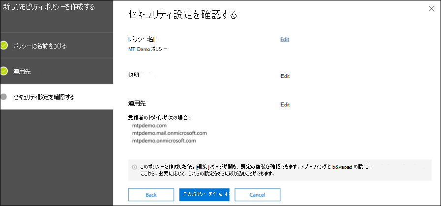
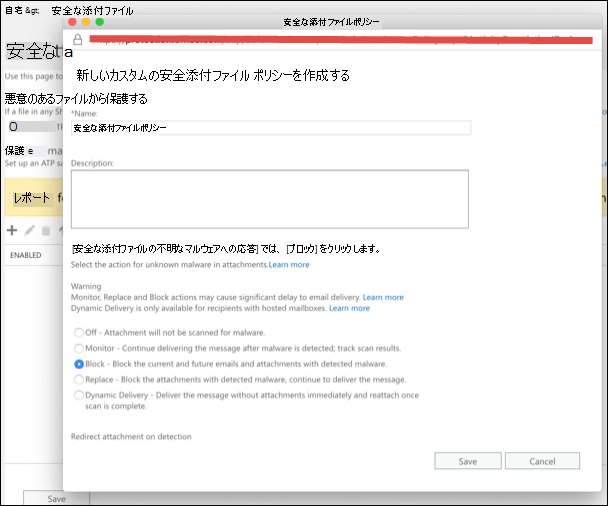
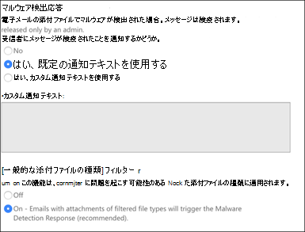
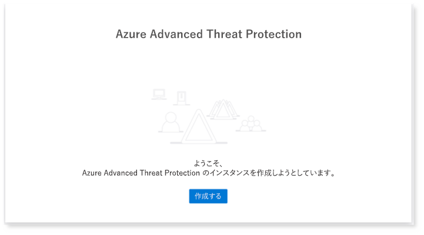
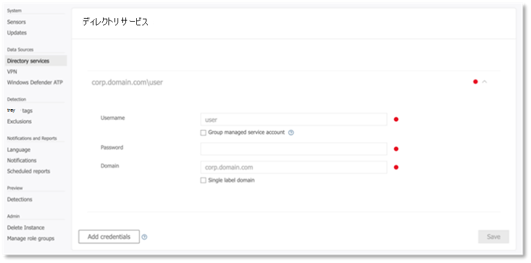
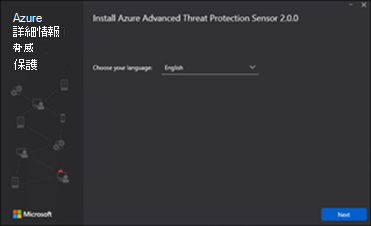
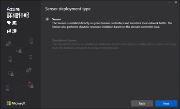
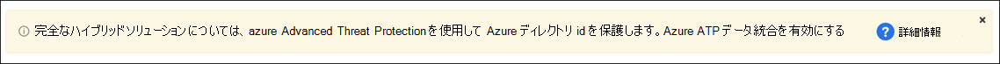

# 試用ラボまたはパイロット環境用の Microsoft 脅威保護の柱を構成するConfigure Microsoft Threat Protection pillars for your trial lab or pilot environment

**適用対象:****Applies to:**
- Microsoft Threat ProtectionMicrosoft Threat Protection

Microsoft の脅威保護の試用ラボまたはパイロット環境を作成して展開するには、3つのフェーズがあります。Creating a Microsoft Threat Protection trial lab or pilot environment and deploying it is a three-phase process:

 
<table border="0" width="100%" align="center">
  <tr style="text-align:center;">
    <td align="center" style="width:25%; border:0;" >
      <a href= "https://docs.microsoft.com/microsoft-365/security/mtp/prepare-mtpeval?view=o365-worldwide"> 
        
       フェーズ 1: 準備 </a>Phase 1: Prepare </a> 
    </td>
     <td align="center">
      <a href="https://docs.microsoft.com/microsoft-365/security/mtp/setup-mtpeval?view=o365-worldwide">
        
       フェーズ 2: セットアップ </a>Phase 2: Setup </a> 
    </td>
    <td align="center" bgcolor="#d5f5e3">
      <a href="https://docs.microsoft.com/microsoft-365/security/mtp/config-mtpeval?view=o365-worldwide">
        
       フェーズ 3: 構成 & オンボード </a>Phase 3: Configure & Onboard </a> 
</td>

  </tr>
</table>

現在、構成段階になっています。You're currently in the configuration phase.

正常な展開には、準備が重要です。Preparation is key to any successful deployment. この記事では、Microsoft Defender ATP を展開するための準備として考慮する必要があるポイントについて説明します。In this article, you'll be guided on the points you'll need to consider as you prepare to deploy Microsoft Defender ATP.

## Microsoft Threat Protection の柱Microsoft Threat Protection pillars
Microsoft の脅威保護は、4つの柱から構成されます。Microsoft Threat Protection consists of four pillars. 1つの柱がネットワーク組織のセキュリティに価値を提供していますが、4つの Microsoft 脅威保護の柱を有効にすることで、組織は最大の価値を得ることができます。Although one pillar can already provide value to your network organization's security, enabling the four Microsoft Threat Protection pillars will give your organization the most value.

![画像 of_Microsoft ユーザーのための脅威保護ソリューション、Azure Advanced Threat Protection、エンドポイントの Microsoft Defender Advanced Threat Protection、クラウドアプリ、Microsoft Cloud App Security、およびデータについては、Office 365 Advanced Threat ProtectionImage of_Microsoft Threat Protection solution for users, Azure Advanced Threat Protection, for endpoints Microsoft Defender Advanced Threat Protection, for cloud apps, Microsoft Cloud App Security, and for data, Office 365 Advanced Threat Protection  ](../../media/mtp-eval-31.png)  

このセクションでは、以下を構成する方法について説明します。This section will guide you to configure:
-   Office 365 Advanced Threat ProtectionOffice 365 Advanced Threat Protection
-   Azure Advanced Threat ProtectionAzure Advanced Threat Protection 
-   Microsoft Cloud App SecurityMicrosoft Cloud App Security
-   Microsoft Defender Advanced Threat ProtectionMicrosoft Defender Advanced Threat Protection

## Office 365 Advanced Threat Protection を構成するConfigure Office 365 Advanced Threat Protection
>[!NOTE]
>Office 365 Advanced Threat Protection を既に有効にしている場合は、この手順をスキップします。Skip this step if you've already enabled Office 365 Advanced Threat Protection. 

これらの設定の一部を決定するのに役立つ、 *Office 365 Advanced Threat Protection (ORCA)* という名前の PowerShell モジュールがあります。There's a PowerShell Module called the *Office 365 Advanced Threat Protection Recommended Configuration Analyzer (ORCA)* that helps determine some of these settings. テナントで管理者として実行すると、ORCAReport はスパム対策、フィッシング、その他のメッセージの検疫設定の評価を作成するのに役立ちます。When run as an administrator in your tenant, get-ORCAReport will help generate an assessment of the anti-spam, anti-phish, and other message hygiene settings. このモジュールはからダウンロードでき https://www.powershellgallery.com/packages/ORCA/ ます。You can download this module from https://www.powershellgallery.com/packages/ORCA/. 

1. [Office 365 セキュリティ & コンプライアンスセンター](https://protection.office.com/homepage)の  >  **脅威管理**  >  **ポリシー**に移動します。Navigate to [Office 365 Security & Compliance Center](https://protection.office.com/homepage) > **Threat management** > **Policy**.
  
 
2. [ **ATP のフィッシング対策**] をクリックし、[ポリシーの名前と説明を **作成** して入力] を選択します。Click **ATP anti-phishing**, select **Create** and fill in the policy name and description. [**次へ**] をクリックします。Click **Next**.
  

>[!NOTE]
>詳細な ATP のフィッシング対策ポリシーを編集します。Edit your Advanced ATP anti-phishing policy. **Advanced フィッシングしきい値**を**2-アグレッシブ**に変更します。Change **Advanced Phishing Threshold** to **2 - Aggressive**.
 

3. [ **条件の追加** ] ドロップダウンメニューをクリックして、ドメインを受信者のドメインとして選択します。Click the **Add a condition** drop-down menu and select your domain(s) as recipient domain. [**次へ**] をクリックします。Click **Next**.
  
 
4. 設定を確認します。Review your settings. [ **このポリシーを作成** する] をクリックして確認します。Click **Create this policy** to confirm. 
![Image of_Office 365 Security & コンプライアンスセンターのフィッシング対策ポリシーページで設定を確認し、[このポリシーの作成] ボタンをクリックします。](../../media/mtp-eval-35.png)  
 
5. [ **Atp の安全な添付ファイル** ] を選択し、[ **SharePoint、OneDrive、MICROSOFT Teams で atp を有効にする** ] オプションを選択します。Select **ATP Safe attachments** and select the **Turn on ATP for SharePoint, OneDrive, and Microsoft Teams** option.  
  

6. [+] アイコンをクリックして、新しい安全な添付ファイルポリシーを作成し、ドメインに受信者ドメインとして適用します。Click the + icon to create a new safe attachment policy, apply it as recipient domain to your domains. [**保存**] をクリックします。Click **Save**.
  
 
7. 次に、 **ATP の安全なリンク** ポリシーを選択し、鉛筆アイコンをクリックして既定のポリシーを編集します。Next, select the **ATP Safe Links** policy, then click the pencil icon to edit the default policy.

8. **[ユーザーが安全なリンクをクリックしたときに追跡**しない] オプションが選択されていない状態で、残りのオプションがオンになっていることを確認します。Make sure that the **Do not track when users click safe links** option is not selected, while the rest of the options are selected. 詳細については、「 [安全なリンク設定](https://docs.microsoft.com/microsoft-365/security/office-365-security/recommended-settings-for-eop-and-office365-atp) 」を参照してください。See [Safe Links settings](https://docs.microsoft.com/microsoft-365/security/office-365-security/recommended-settings-for-eop-and-office365-atp) for details. [**保存**] をクリックします。Click **Save**. 
![Image of_Office 365 Security & コンプライアンスセンター] ページで、ユーザーが [セーフ] が選択されていないときに、オプションが追跡されないことを示します。](../../media/mtp-eval-38.png)  

9. 次に、 **マルウェア対策** ポリシーを選択し、既定値を選択して、鉛筆アイコンを選択します。Next select the **Anti-malware** policy, select the default, and choose the pencil icon.

10. [ **設定** ] をクリックし、[はい] を選択して、 **既定の通知テキストを使用** して **マルウェア検出応答**を有効にします。Click **Settings** and select **Yes and use the default notification text** to enable **Malware Detection Response**. **一般的な添付ファイルの種類のフィルター**を有効にします。Turn the **Common Attachment Types Filter** on. [**保存**] をクリックします。Click **Save**.
   
  
11. [ [Office 365 Security & コンプライアンスセンター](https://protection.office.com/homepage)]  >  **Search**  >  [**監査ログの検索**] の順に移動し、監査をオンにします。Navigate to [Office 365 Security & Compliance Center](https://protection.office.com/homepage) > **Search** > **Audit log search** and turn Auditing on.  
![イメージ of_Office 365 セキュリティ & コンプライアンスセンター] ページで監査ログの検索を有効にする](../../media/mtp-eval-40.png)  

12. Microsoft Defender ATP に Office 365 ATP を統合します。Integrate Office 365 ATP with Microsoft Defender ATP. [Office 365 Security & コンプライアンスセンター](https://protection.office.com/homepage)の  >  **脅威管理**  >  **エクスプローラー**に移動し、画面の右上にある [ **wdatp 設定**] を選択します。Navigate to [Office 365 Security & Compliance Center](https://protection.office.com/homepage) > **Threat management** > **Explorer** and select **WDATP Settings** on the upper right corner of the screen. [Microsoft Defender ATP 接続] ダイアログボックスで、[ **WINDOWS ATP への接続**] をオンにします。In the Microsoft Defender ATP connection dialog box, turn on **Connect to Windows ATP**.
![Image of_Office 365 Security & コンプライアンスセンター] ページで Windows Defender ATP 接続をオンにすることができます。](../../media/mtp-eval-41.png)  

## Azure Advanced Threat Protection を構成するConfigure Azure Advanced Threat Protection
>[!NOTE]
>Azure Advanced Threat Protection を既に有効にしている場合は、この手順をスキップします。Skip this step if you've already enabled Azure Advanced Threat Protection

1. [Microsoft 365 セキュリティセンター](https://security.microsoft.com/info) > [**その他のリソース**] [  >  **Azure Advanced Threat Protection**] の順に移動します。Navigate to [Microsoft 365 Security Center](https://security.microsoft.com/info) > select **More Resources** > **Azure Advanced Threat Protection**.
  

2. [ **作成** ] をクリックして、Azure Advanced Threat Protection ウィザードを開始します。Click **Create** to start the Azure Advanced Threat Protection wizard. 
 ![Image of_Azure Advanced Threat Protection ウィザードページで、[作成] ボタンをクリックする必要があります。](../../media/mtp-eval-43.png)  

3. [ **Active Directory フォレストに接続するためのユーザー名とパスワードを入力**する] を選択します。Choose **Provide a username and password to connect to your Active Directory forest**.  
  

4. Active Directory のオンプレミスの資格情報を入力します。Enter your Active Directory on-premises credentials. これには、Active Directory への読み取りアクセス権を持つユーザーアカウントを指定できます。This can be any user account that has read access to Active Directory.
  

5. 次に、[ **センサーのセットアップをダウンロード** し、ファイルをドメインコントローラーに転送する] を選択します。Next, choose **Download Sensor Setup** and transfer file to your domain controller. 
![[イメージ of_Azure の詳細な脅威保護] ページで、ダウンロードセンサーのセットアップを選択できます。](../../media/mtp-eval-46.png)  

6. Azure ATP センサーのセットアップを実行して、ウィザードの次の作業を開始します。Execute the Azure ATP Sensor Setup and begin following the wizard.
 ![[イメージ of_Azure の詳細な脅威保護] ページで、[次へ] をクリックして Azure ATP センサーウィザードを実行します。](../../media/mtp-eval-47.png)  
 
7. センサー展開の種類で [ **次へ** ] をクリックします。Click **Next** at the sensor deployment type.
 ![[イメージ of_Azure の詳細な脅威保護] ページで、[次へ] をクリックして Azure ATP センサーウィザードを実行します。](../../media/mtp-eval-48.png)  
 
8. ウィザードで次に入力する必要があるため、アクセスキーをコピーします。Copy the access key because you need to enter it next in the Wizard.
  
 
9. ウィザードにアクセスキーをコピーし、[ **インストール**] をクリックします。Copy the access key into the Wizard and click **Install**. 
 ![Image of_Azure Advanced Threat Protection Azure ATP センサーウィザードページでアクセスキーを指定し、[インストール] ボタンをクリックします。](../../media/mtp-eval-50.png)  

10. ご使用のドメインコントローラーに Azure Advanced Threat Protection が正常に構成されました。Congratulations, you've successfully configured Azure Advanced Threat Protection on your domain controller.
![Image of_Azure Advanced Threat Protection Azure ATP センサーウィザードインストールの完了 [完了] ボタンをクリックする必要があります。](../../media/mtp-eval-51.png)  
 
11. [ [Azure AZURE atp](https://go.microsoft.com/fwlink/?linkid=2040449) の設定] セクションで、[ **Windows Defender atp**] を選択し、切り替えをオンにします。Under the [Azure Azure ATP](https://go.microsoft.com/fwlink/?linkid=2040449) settings section, select **Windows Defender ATP**, then turn on the toggle. [**保存**] をクリックします。Click **Save**. 
![Image of_the [Azure Azure ATP 設定] ページで、Windows Defender ATP のオン/オフを切り替える必要があります。](../../media/mtp-eval-52.png)  

>[!NOTE]
>Windows Defender ATP は、Microsoft Defender ATP として再ブランド化されています。Windows Defender ATP has been rebranded as Microsoft Defender ATP. すべてのポータルにわたる Rebranding の変更は、一貫性を保つために、を展開しています。Rebranding changes across all of our portals are being rolled out the for consistency.

## Microsoft Cloud App Security を構成するConfigure Microsoft Cloud App Security
>[!NOTE]
>Microsoft Cloud App Security を既に有効にしている場合は、この手順をスキップします。Skip this step if you've already enabled Microsoft Cloud App Security. 

1. [Microsoft 365 Security Center](https://security.microsoft.com/info)  >  **More Resources**  >  **microsoft Cloud App Security**に移動します。Navigate to [Microsoft 365 Security Center](https://security.microsoft.com/info) > **More Resources** > **Microsoft Cloud App Security**.
![Image of_Microsoft 365 セキュリティセンターページには、Microsoft Cloud App card を参照して、[開く] ボタンをクリックする必要があります。](../../media/mtp-eval-53.png)  

2. Azure ATP を統合するための情報プロンプトで、[ **AZURE atp データ統合の有効化**] を選択します。At the information prompt to integrate Azure ATP, select **Enable Azure ATP data integration**. 
   

>[!NOTE]
>このプロンプトが表示されない場合は、Azure ATP データ統合が既に有効になっていることを意味します。If you don’t see this prompt, it might mean that your Azure ATP data integration has already been enabled. ただし、わからない場合は、IT 管理者に確認してください。However, if you are not sure, contact your IT Administrator to confirm. 

3. [ **設定**] に移動し、[ **Azure ATP 統合** ] のオン/オフを切り替えて、[ **保存**] をクリックします。Go to **Settings**, turn on the **Azure ATP integration** toggle, then click **Save**. 
![[イメージ of_the の設定] ページの [Azure ATP 統合] をオンにして、[保存] をクリックします。](../../media/mtp-eval-55.png)  
>[!NOTE]
>新しい Azure ATP インスタンスの場合、この統合トグルは自動的にオンになります。For new Azure ATP instances, this integration toggle is automatically turned on. 次の手順に進む前に、Azure ATP 統合が有効になっていることを確認します。Confirm that your Azure ATP integration has been enabled before you proceed to the next step.
 
4. [クラウド検出の設定] で、[ **Microsoft DEFENDER ATP 統合**] を選択し、統合を有効にします。Under the Cloud discovery settings, select **Microsoft Defender ATP integration**, then enable the integration. [**保存**] をクリックします。Click **Save**.
![Image of_the Microsoft defender atp 統合の [承認されていないアプリをブロックする] チェックボックスがオンになっている Microsoft Defender ATP ページ。![Image of_the Microsoft Defender ATP page where the block unsanctioned apps checkbox under Microsoft Defender ATP integration is selected. [保存] をクリックします。](../../media/mtp-eval-56.png)Click save.](../../media/mtp-eval-56.png)  

5. [クラウド検出の設定] で、[ **ユーザーエンリッチメント**] を選択して、Azure Active Directory との統合を有効にします。Under Cloud discovery settings, select **User enrichment**, then enable the integration with Azure Active Directory.
![[エンリッチメントのユーザー識別子を Azure Active Directory ユーザー名で強化する] チェックボックスがオンになっているユーザーのイメージ](../../media/mtp-eval-57.png)  

## Microsoft Defender Advanced Threat Protection を構成するConfigure Microsoft Defender Advanced Threat Protection
>[!NOTE]
>Microsoft Defender Advanced Threat Protection を既に有効にしている場合は、この手順をスキップします。Skip this step if you've already enabled Microsoft Defender Advanced Threat Protection.

1. [Microsoft 365 security center](https://security.microsoft.com/info)  >  **More Resources**  >  **microsoft Defender セキュリティセンター**に移動します。Navigate to [Microsoft 365 Security Center](https://security.microsoft.com/info) > **More Resources** > **Microsoft Defender Security Center**. [ **開く**] をクリックします。Click **Open**.
 ![Microsoft 365 セキュリティセンターページの [イメージ of_Microsoft Defender セキュリティセンター] オプション](../../media/mtp-eval-58.png)  
 
2. Microsoft Defender Advanced Threat Protection ウィザードに従います。Follow the Microsoft Defender Advanced Threat Protection wizard. [**次へ**] をクリックします。Click **Next**. 
   

3. 推奨されるデータストレージの場所、データ保持ポリシー、組織のサイズ、およびプレビュー機能のオプトインに基づいて選択します。Choose based on your preferred data storage location, data retention policy, organization size, and opt-in for preview features. 
 ![[イメージ of_the] ページで、データストレージの国、アイテム保持ポリシー、組織のサイズを選択します。![Image of_the page to select your data storage country, retention policy, and organization size. 選択が完了したら、[次へ] をクリックします。](../../media/mtp-eval-60.png)Click next when you're done selecting.](../../media/mtp-eval-60.png)  
>[!NOTE]
>その後、データ保存場所など、一部の設定を変更することはできません。You cannot change some of the settings, like data storage location, afterwards. 
 

[**次へ**] をクリックします。Click **Next**. 

4. [ **続行** ] をクリックすると、MICROSOFT Defender ATP テナントがプロビジョニングされます。Click **Continue** and it will provision your Microsoft Defender ATP tenant.
 ![画像 of_the ページの表示 [続行] ボタンをクリックすると、クラウドインスタンスが作成されます。](../../media/mtp-eval-61.png)  

5. グループポリシー、Microsoft エンドポイントマネージャー、または Microsoft Defender ATP へのローカルスクリプトを実行することにより、エンドポイントをオンボードにします。Onboard your endpoints through Group Policies, Microsoft Endpoint Manager or by running a local script to Microsoft Defender ATP. 簡略化のために、このガイドではローカルスクリプトを使用します。For simplicity, this guide uses the local script.

6. [ **パッケージのダウンロード** ] をクリックし、オンボードスクリプトをエンドポイントにコピーします。Click **Download package** and copy the onboarding script to your endpoint(s).  
 ![画像 of_page の [パッケージのダウンロード] ボタンをクリックしてオンボードスクリプトをエンドポイントまたはエンドポイントにコピーするように求めるメッセージが表示されます。](../../media/mtp-eval-62.png)  

7. エンドポイントで、オンボードスクリプトを管理者として実行し、[Y] を選択します。On your endpoint, run the onboarding script as Administrator and choose Y.
   

8. おめでとうございます。第1のエンドポイントを利用しました。Congratulations, you've onboarded your first endpoint.  
   

9. コピー-Microsoft Defender ATP ウィザードから検出テストを貼り付けます。Copy-paste the detection test from the Microsoft Defender ATP wizard.
 ![Image of_the [コピー] をクリックして、コマンドプロンプトに貼り付ける必要のある検出テストスクリプトをコピーするための検出テスト手順を実行します。](../../media/mtp-eval-65.png)  

10. PowerShell スクリプトを昇格したコマンドプロンプトにコピーして実行します。Copy the PowerShell script to an elevated command prompt and run it. 
   

11. [ウィザードから **Microsoft DEFENDER ATP の使用を開始する** ] を選択します。Select **Start using Microsoft Defender ATP** from the Wizard.
 ![[Microsoft Defender ATP の使用開始] をクリックする必要があるウィザードからのイメージ of_the 確認プロンプト](../../media/mtp-eval-67.png)  
 
12. [Microsoft Defender セキュリティセンター](https://securitycenter.windows.com/)を参照してください。Visit the [Microsoft Defender Security Center](https://securitycenter.windows.com/). [ **設定** ] に移動し、[ **拡張機能**] を選択します。Go to **Settings** and then select **Advanced features**. 
 ![イメージ of_Microsoft Defender セキュリティセンターの設定] メニューで、高度な機能を選択する必要があります。](../../media/mtp-eval-68.png)  

13. **Azure Advanced Threat Protection**との統合を有効にします。Turn on the integration with **Azure Advanced Threat Protection**.  
   

14. **Office 365 の脅威インテリジェンス**との統合をオンにします。Turn on the integration with **Office 365 Threat Intelligence**.
   

15. **Microsoft Cloud App Security**との統合を有効にします。Turn on integration with **Microsoft Cloud App Security**.
   

16. 下にスクロールして [ **保存の設定** ] をクリックし、新しい統合を確認します。Scroll down and click **Save preferences** to confirm the new integrations.
 ![クリックする必要があるイメージ of_Save の設定] ボタン](../../media/mtp-eval-72.png)  

## Microsoft Threat Protection を開始するStart the Microsoft Threat Protection service
>[!NOTE]
>2020年6月1日以降、対象のすべてのテナントに対して Microsoft の脅威保護機能が自動的に有効になります。Starting June 1, 2020, Microsoft automatically enables Microsoft Threat Protection features for all eligible tenants. 詳細については、 [Microsoft Tech Community](https://techcommunity.microsoft.com/t5/security-privacy-and-compliance/microsoft-threat-protection-will-automatically-turn-on-for/ba-p/1345426) の次の記事を参照してください。See this [Microsoft Tech Community article on license eligibility](https://techcommunity.microsoft.com/t5/security-privacy-and-compliance/microsoft-threat-protection-will-automatically-turn-on-for/ba-p/1345426) for details. 
 

[Microsoft 365 セキュリティセンター](https://security.microsoft.com/homepage)に移動します。Go to [Microsoft 365 Security Center](https://security.microsoft.com/homepage). [ **設定** ] に移動し、[ **Microsoft Threat Protection**] を選択します。Navigate to **Settings** and then select **Microsoft Threat Protection**.
 ![Microsoft 365 セキュリティセンターの [設定] ページの [イメージ of_Microsoft 脅威保護] オプションのスクリーンショット ](../../media/mtp-eval-72b.png)  

より包括的なガイダンスについては、「 [Microsoft Threat Protection を有効](mtp-enable.md)にする」を参照してください。For a more comprehensive guidance, see [Turn on Microsoft Threat Protection](mtp-enable.md). 

おめでとうございます!Congratulations! Microsoft の脅威保護の試用ラボまたはパイロット環境を作成したばかりです。You've just created your Microsoft Threat Protection trial lab or pilot environment! これで、Microsoft の脅威保護ユーザーインターフェイスに慣れることができました。Now you can familiarize yourself with the Microsoft Threat Protection user interface! 各ダッシュボードを使用して、日常のセキュリティ運用タスクを実行する方法について理解し、 [Microsoft Threat Protection の対話式ガイド](https://aka.ms/MTP-Interactive-Guide)を参照してください。See what you can learn from and know how to use each dashboard for your day-to-day security operation tasks: [Microsoft Threat Protection interactive guide](https://aka.ms/MTP-Interactive-Guide).

次に、攻撃をシミュレートし、製品間の機能を検出して通知を作成し、エンドポイントへの fileless 攻撃に自動的に応答する方法を確認できます。Next, you can simulate an attack and see how the cross product capabilities detect, create alerts, and automatically respond to a fileless attack on an endpoint.

## 次の手順Next steps
[テスト警告を生成](generate-test-alert.md)します。[Generate a test alert](generate-test-alert.md).
