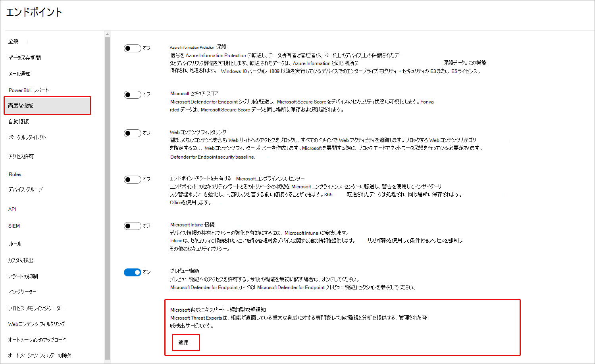
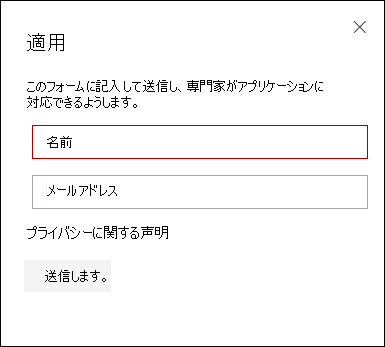
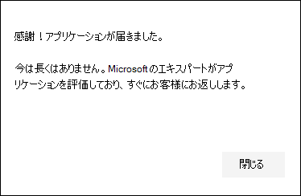
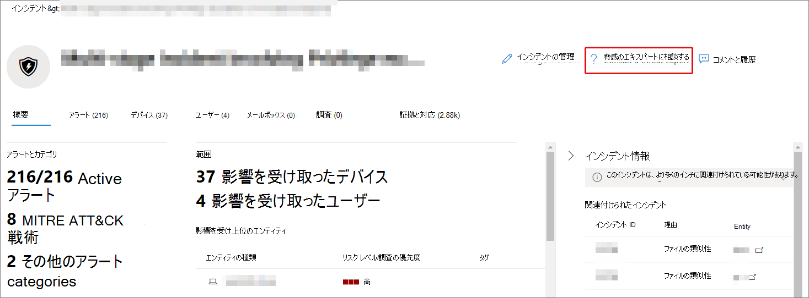

# 管理を通じてMicrosoft 脅威エキスパート機能を構成Microsoft 365 Defender

[!INCLUDE [Microsoft 365 Defender rebranding](../includes/microsoft-defender.md)]

**適用対象:**

- [Microsoft 365 Defender](https://go.microsoft.com/fwlink/?linkid=2118804)
- [Microsoft Defender for Endpoint](https://go.microsoft.com/fwlink/p/?linkid=2154037)

[!INCLUDE [Prerelease](../includes/prerelease.md)]

## はじめに

> [!IMPORTANT]
> 適用する前に、microsoft Technical Service プロバイダーとアカウント チームと一緒に、Microsoft 脅威エキスパート - ターゲット攻撃通知管理脅威検出サービスの適格性要件について説明してください。

ターゲット攻撃通知を受信するには、デバイスが登録されたMicrosoft 365 Defender展開する必要があります。 次に、M365 ポータルからアプリケーションを送信し、Microsoft 脅威エキスパート攻撃通知を送信します。

アカウント チームまたは Microsoft 担当者に問い合わせ、Microsoft 脅威エキスパートエキスパート オンデマンドを購読してください。 オンデマンドの専門家は、関連する検出や敵対者から組織を保護する方法について、脅威の専門家と相談できます。

## [ターゲット攻撃通知Microsoft 脅威エキスパートを適用する]

Microsoft Defender for Endpoint および Microsoft 365 Defenderを既に持っている場合は、Microsoft 脅威エキスパート – ターゲット攻撃通知を自分のポータルからMicrosoft 365 Defenderできます。  標的型攻撃通知は、組織にとって最も重要な脅威を特定するのに役立つ特別な洞察と分析を提供し、迅速に対応できます。

1. ナビゲーション ウィンドウから、[エンドポイント] 設定 > > > - ターゲット攻撃通知> Microsoft 脅威エキスパートに **移動します**。

2. **[適用]** を選択します。

    

3. Microsoft がアプリケーションについて連絡できるよう、名前とメール アドレスを入力します。

    

4. プライバシーに [関する声明を読み](https://privacy.microsoft.com/en-us/privacystatement)、完了 **したら [送信** ] を選択します。 アプリケーションが承認されると、ウェルカム メールが届きます。

    

5. ウェルカム メールを受信すると、ターゲット攻撃通知の受信が自動的に開始されます。

6. [エンドポイント] ページの [全般] 設定 >にアクセスして>**を>確認できます**。 承認されると、[ターゲット攻撃Microsoft 脅威エキスパート通知]**トグル** が表示され、[オン] に切り替 **わるようになります**。

## ユーザーからのターゲット攻撃通知が表示Microsoft 脅威エキスパート

ターゲット攻撃通知は、次のメディアMicrosoft 脅威エキスパートから受け取ります。

- [Microsoft 365 Defenderのインシデント **]** ページ
- ポータルMicrosoft 365 Defenderアラート **ダッシュボード**
- OData アラート [API と](/windows/security/threat-protection/microsoft-defender-atp/get-alerts) REST [API](/windows/security/threat-protection/microsoft-defender-atp/pull-alerts-using-rest-api)
- [高度な検索の DeviceAlertEvents](/windows/security/threat-protection/microsoft-defender-atp/advanced-hunting-devicealertevents-table) テーブル
- 電子メールを介してターゲット攻撃通知を送信する場合は、受信トレイ。 以下の [「電子メール通知ルールを作成する」を](#create-an-email-notification-rule) 参照してください。

### 電子メール通知ルールの作成

通知受信者の電子メール通知を送信するルールを作成できます。 詳細については、「アラート通知を  [構成して](/windows/security/threat-protection/microsoft-defender-atp/configure-email-notifications) 電子メール通知を作成、編集、削除、またはトラブルシューティングする」を参照してください。

## ターゲット攻撃の通知を表示する

電子メール通知を受信するようにシステムを構成したMicrosoft 脅威エキスパートから、電子メール内のターゲット攻撃通知の受信を開始します。

1. メール内のリンクを選択して、脅威の専門家とタグ付けされたダッシュボードの対応するアラート コンテキスト **に移動します**。

2. [アラート **] ページ** で、電子メールで受信したアラート トピックと同じアラート トピックを選択して、詳細を表示します。

## ユーザー登録Microsoft 脅威エキスパート - エキスパート オンデマンド

Microsoft Defender for Endpoint のお客様が既に存在する場合は、Microsoft 担当者に問い合わせ、Microsoft 脅威エキスパートエキスパート オンデマンドを購読できます。

## 組織内の疑わしいサイバーセキュリティアクティビティについて Microsoft の脅威専門家に相談する

連絡先は、Microsoft 脅威エキスパートポータル内Microsoft 365 Defenderできます。 専門家は、複雑な脅威や標的型攻撃の通知を理解するのに役立ちます。 アラートやインシデントに関する詳細、または侵害の処理に関するアドバイスについては、専門家と提携してください。 ポータル ダッシュボードで説明されている脅威インテリジェンス コンテキストに関する分析情報を取得します。

> [!NOTE]
>
> - 組織のカスタマイズされた脅威インテリジェンス データに関連するアラートの問い合わせは現在サポートされていません。 詳細については、セキュリティ操作またはインシデント対応チームに問い合わせください。
> - [脅威の専門家に相談する] フォームから問い合わせを送信するには、Microsoft 365 Defender ポータルの [セキュリティ センターのセキュリティ設定の管理]**アクセス許可が必要** です。

1. 調査する情報 (デバイス、アラート、インシデントなど) に関連するポータル **ページに移動****します**。 調査要求を送信する前に、問い合わせに関連するポータル ページが表示されている必要があります。

2. トップ メニューから **[?脅威の専門家に相談してください**。

    

    フライアウト画面が開きます。

    このヘッダーは、試用版サブスクリプションを使用しているか、完全なサブスクリプションを使用Microsoft 脅威エキスパートエキスパート オンデマンド サブスクリプションを示します。

    

    [ **調査] トピック** フィールドには、要求の関連ページへのリンクが既に入力されています。

3. 次のフィールドで、調査を開始するのに十分なコンテキストMicrosoft 脅威エキスパート情報を提供します。

4. メール アドレスに対応するために使用するメール アドレスを入力Microsoft 脅威エキスパート。

> [!NOTE]
> Microsoft Services Hub を通じてエキスパート オンデマンド ケースの状態を追跡する場合は、テクニカル アカウント マネージャーに連絡してください。

Microsoft Services Hub の概要については、このビデオをご覧ください。

> [!VIDEO https://www.microsoft.com/videoplayer/embed/RE4pk9f]

## 調査のサンプル トピック

### アラート情報

- 新しい種類のアラートが、生きている土地のバイナリに対して表示されます。 アラート ID を指定できます。 このアラートの詳細と、さらに詳しく調査する方法を教えてください。
- 同様の攻撃が 2 つ見られたので、どちらも悪意のある PowerShell スクリプトを実行しようとするが、異なるアラートを生成します。 1 つは "不審な PowerShell コマンド ライン" で、もう 1 つは "O365 によって提供される指示に基づいて悪意のあるファイルが検出されました" です。 違いは何ですか?
- 今日、知名度の高いユーザーのデバイスから失敗したログインの異常数に関する奇数の警告を受け取りました。 これらの試みについてのそれ以上の証拠は見つからん。 これらの試行Microsoft 365 Defender確認する方法 監視対象のログインの種類
- 「システム ユーティリティによる疑わしい動作が観察されました」というアラートに関するコンテキストや分析情報を追加できますか?
- "転送/リダイレクト ルールの作成" というタイトルのアラートが表示されました。 アクティビティは良性だと思います。 通知を受け取った理由を教えてください。

### コンピューターの侵害の可能性

- 組織内の多くのデバイスで「不明なプロセスが観察された」というメッセージや警告が表示される理由を説明できますか? このメッセージまたはアラートが悪意のあるアクティビティに関連するかどうかを明確にするための任意の入力に感謝します。
- 次のシステムで、先週から発生した可能性がある侵害の検証に役立ちますか? これは、6 か月前に同じシステムで以前のマルウェア検出と同様に動作します。

### 脅威インテリジェンスの詳細

- 悪意のある Word 文書をユーザーに配信したフィッシングメールが検出されました。 このドキュメントでは、一連の疑わしいイベントが発生し、特定のマルウェア ファミリに対して複数のアラートが発生しました。 このマルウェアに関する情報はありますか? はいの場合、リンクを送信できますか?
- 最近、業界をターゲットにしている脅威に関するブログ投稿を見ました。 この脅威アクターに対して提供されるMicrosoft 365 Defenderを理解するのに役立ちますか?
- 最近、組織に対して行われたフィッシング キャンペーンを確認しました。 これは、特に当社または垂直に対象とされたのか教えてください。

### Microsoft 脅威エキスパートのアラート通信

- インシデント対応チームは、対象となる攻撃通知に対処するのに役立ちますか?
- この標的型攻撃の通知を受け取ったのは、Microsoft 脅威エキスパート。 独自のインシデント対応チームは持ち合わせください。 ここで何を行い、インシデントを含めるのか。
- ターゲット攻撃の通知を受け取ったのは、Microsoft 脅威エキスパート。 インシデント対応チームに渡すデータを提供できますか?

> [!NOTE]
> Microsoft 脅威エキスパートは、インシデント対応サービスではなく、管理された脅威検出サービスです。 ただし、インシデント対応チームと関わり、インシデント対応が必要な問題に対処できます。 独自のインシデント対応チームをお持ちで、Microsoft のサポートが必要な場合は、CSS サイバーセキュリティ インシデント対応チーム (CIRT) に参加できます。 チケットを開き、お問い合わせに対応できます。

## シナリオ

### 管理された狩猟に関する問い合わせに関する進行状況レポートを受け取る

お問い合わせMicrosoft 脅威エキスパート、お問い合わせ内容によって異なります。 通常、次のいずれかの応答を受け取る必要があります。

- 調査を続行するには、さらに詳しい情報が必要です。
- 技術的なコンテキストを決定するには、ファイルまたは複数のファイル サンプルが必要です
- 調査にはより多くの時間が必要
- 最初の情報は、調査を終了するのに十分でした

専門家が詳細な情報やファイル サンプルを要求する場合は、調査の動きを維持するために迅速に対応することが重要です。

## 関連項目

- [Microsoft 脅威エキスパートの概要](microsoft-threat-experts.md)
