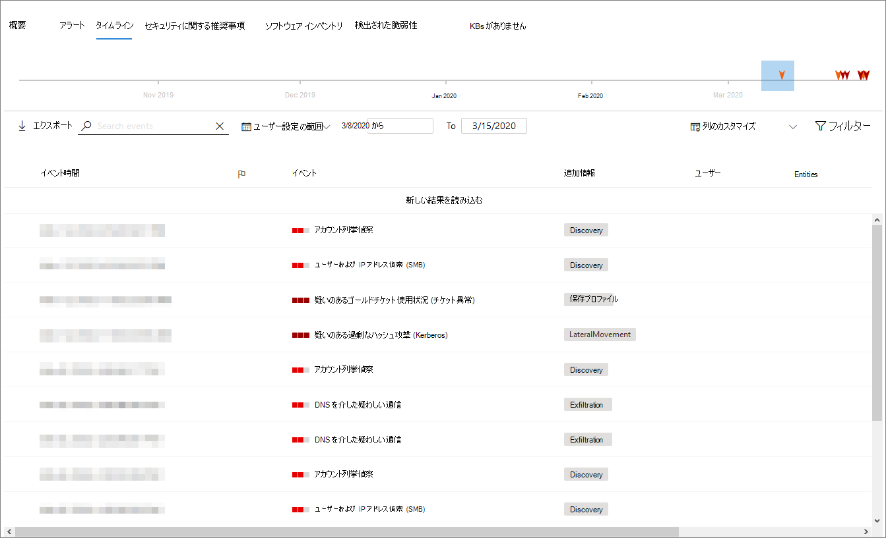

# デバイス プロファイル ページ

[!INCLUDE [Microsoft 365 Defender rebranding](../includes/microsoft-defender.md)]

Microsoft 365 セキュリティ ポータルでは、デバイス プロファイル ページが提供され、ネットワーク上のデバイスの正常性と状態をすばやく評価できます。

> [!IMPORTANT]
> デバイス プロファイル ページは、デバイスが Microsoft Defender for Endpoint、Microsoft Defender for Identity、または両方に登録されているかどうかに応じて、少し異なって表示される場合があります。

デバイスが Microsoft Defender for Endpoint に登録されている場合は、デバイス プロファイル ページを使用して一般的なセキュリティ タスクを実行することもできます。

## デバイス プロファイル ページの移動

プロファイル ページは、いくつかの広範なセクションに分割されます。

サイドバー (1) には、デバイスに関する基本的な詳細が一覧表示されます。

メイン コンテンツ領域 (2) には、デバイスに関するさまざまな種類の情報を表示するために切り替え可能なタブが含まれています。

デバイスが Microsoft Defender for Endpoint に登録されている場合は、対応アクションの一覧 (3) も表示されます。 対応アクションを使用すると、セキュリティ関連の一般的なタスクを実行できます。

## サイドバー

デバイス プロファイル ページのメイン コンテンツ領域の横にサイドバーがあります。

サイドバーには、デバイスの完全な名前と露出レベルが一覧表示されます。 また、次のような、開くまたは閉じた状態に切り替え可能な小さなサブセクションの重要な基本情報も提供します。

* **タグ** - デバイスに関連付けられているエンドポイント用 Microsoft Defender、Id 用 Microsoft Defender、またはカスタム タグ。 Id 用 Microsoft Defender のタグは編集できません。
* **セキュリティ情報** - インシデントとアクティブなアラートを開きます。 Microsoft Defender for Endpoint に登録されているデバイスには、露出レベルとリスク レベルも表示されます。

> [!TIP]
> 露出レベルは、デバイスがセキュリティの推奨事項にどの程度準拠しているのかに関係し、リスク レベルはアクティブなアラートの種類や重大度など、さまざまな要因に基づいて計算されます。

* **デバイスの** 詳細 - ドメイン、OS、デバイスが最初に表示された時刻のタイムスタンプ、IP アドレス、リソース。 Microsoft Defender for Endpoint に登録されているデバイスでも、正常性状態が表示されます。 Id 用 Microsoft Defender に登録されているデバイスには、デバイスが最初に作成された日時の SAM 名とタイムスタンプが表示されます。
* **ネットワーク アクティビティ** - デバイスがネットワーク上で最初に確認された時刻と最後のタイムスタンプ。
* **ディレクトリ データ***(Id* 用 Microsoft Defender に登録されているデバイスの場合のみ) - [UAC](https://docs.microsoft.com/windows/security/identity-protection/user-account-control/user-account-control-overview)フラグ [、SPN、](https://docs.microsoft.com/windows/win32/ad/service-principal-names)およびグループ メンバーシップ。

## 応答アクション

対応アクションは、脅威から迅速に防御して分析する方法を提供します。

> [!IMPORTANT]
> * [応答アクション](https://docs.microsoft.com/windows/security/threat-protection/microsoft-defender-atp/respond-machine-alerts) は、デバイスが Microsoft Defender for Endpoint に登録されている場合にのみ使用できます。
> * Microsoft Defender for Endpoint に登録されているデバイスでは、デバイスの OS とバージョン番号に基づいて、異なる数の応答アクションが表示される場合があります。

デバイス プロファイル ページで使用可能なアクションは次のとおりです。

* **タグの管理** - このデバイスに適用したカスタム タグを更新します。
* **デバイスの** 分離 - デバイスを Microsoft Defender for Endpoint に接続した状態に保ちながら、組織のネットワークからデバイスを分離します。 通信の目的で、デバイスが分離されている間に Outlook、Teams、Skype for Business の実行を許可することができます。
* **アクション センター** - 送信されたアクションの状態を表示します。 別のアクションが既に選択されている場合にのみ使用できます。
* **アプリの実行を** 制限する - Microsoft によって署名されていないアプリケーションが実行されるのを防ぐ。
* **ウイルス対策スキャンの** 実行 - ウイルスWindows Defender定義を更新し、ウイルス対策スキャンを直ちに実行します。 クイック スキャンまたはフル スキャンを選択します。
* **調査パッケージの収集** - デバイスに関する情報を収集します。 調査が完了したら、ダウンロードできます。
* **ライブ応答セッションの開始** - 詳細なセキュリティ調査のためにデバイスにリモート シェル [を読み込む](https://docs.microsoft.com/windows/security/threat-protection/microsoft-defender-atp/live-response)。
* **自動調査の開始** - 脅威 [を自動的に調査して修復します](https://docs.microsoft.com/microsoft-365/security/office-365-security/office-365-air)。 このページから自動調査を手動で実行することもできますが、特定のアラートポリシーによって自動的に調査がトリガーされます。
* **アクション センター** - 現在実行中の応答アクションに関する情報を表示します。

## [タブ] セクション

[デバイス プロファイル] タブでは、デバイスに関するセキュリティの詳細の概要と、アラートの一覧を含むテーブルを切り替えられます。

Microsoft Defender for Endpoint に登録されているデバイスには、タイムライン、セキュリティに関する推奨事項の一覧、ソフトウェア インベントリ、検出された脆弱性の一覧、不足している KB (セキュリティ更新プログラム) を備えたタブも表示されます。

### [概要] タブ

既定のタブは [概要] **です**。 デバイスに関する最も重要なセキュリティの事実を簡単に確認できます。

![デバイス プロファイルの [概要] タブの画像](../../media/mtp-device-profile/hybrid-device-tab-overview.png)

ここでは、デバイスのアクティブなアラートと、現在ログオンしているユーザーを簡単に確認できます。

デバイスが Microsoft Defender for Endpoint に登録されている場合は、デバイスのリスク レベルと、セキュリティ評価に関する利用可能なデータも表示されます。 セキュリティ評価では、デバイスの露出レベルについて説明し、セキュリティの推奨事項を示し、影響を受けるソフトウェアと検出された脆弱性の一覧を示します。

### [通知] タブ

[ **アラート]** タブには、Microsoft Defender for Identity と Microsoft Defender for Endpoint の両方から、デバイスで発生したアラートの一覧が表示されます。

![デバイス プロファイルの [アラート] タブの画像](../../media/mtp-device-profile/hybrid-device-tab-alerts.png)

表示されるアイテムの数、および各アイテムに対して表示される列をカスタマイズできます。 既定の動作では、1 ページあたり 30 アイテムを一覧表示します。

このタブの列には、アラートをトリガーした脅威の重大度、状態、調査状態、アラートが割り当てられているユーザーに関する情報が含まれます。

影響 *を受けるエンティティ* 列は、現在表示しているプロファイルを持つデバイス (エンティティ) と、影響を受けるネットワーク内の他のデバイスを参照します。

この一覧からアイテムを選択すると、選択したアラートに関するさらに多くの情報を含むフライアウトが開きます。

この一覧は、重大度、状態、またはアラートが割り当てられているユーザーでフィルター処理できます。

### [タイムライン] タブ

[ **タイムライン]** タブには、デバイスで発生したイベントの対話型の時系列グラフが表示されます。 グラフの強調表示された領域を左または右に移動すると、さまざまな期間のイベントを表示できます。 また、対話型グラフとイベントの一覧の間にあるドロップダウン メニューから、日付のカスタム範囲を選択することもできます。

グラフの下には、選択した日付範囲のイベントの一覧が表示されます。

表示されるアイテムの数とリストの列の両方をカスタマイズできます。 既定の列には、イベント時間、アクティブ ユーザー、アクションの種類、エンティティ (プロセス)、およびイベントに関する追加情報が一覧表示されます。

このリストからアイテムを選択すると、イベント エンティティのグラフを表示するフライアウトが開き、イベントに関係する親プロセスと子プロセスが表示されます。

リストは、特定の種類のイベントでフィルター処理できます。たとえば、レジストリ イベントやスマート スクリーン イベントなどです。

この一覧は、ダウンロード用に CSV ファイルにエクスポートできます。 ファイルはイベントの数によって制限されるのではなく、エクスポートできる最大時間の範囲は 7 日間です。

### [セキュリティの推奨事項] タブ

[ **セキュリティの推奨事項]** タブには、デバイスを保護するために実行できるアクションが一覧表示されます。 この一覧で項目を選択すると、フライアウトが開き、推奨事項を適用する方法について説明します。

![デバイス プロファイルの [セキュリティの推奨事項] タブの画像](../../media/mtp-device-profile/hybrid-device-tab-security-recs.png)

前のタブと同様に、ページごとに表示されるアイテムの数と表示される列をカスタマイズできます。

既定のビューには、対処するセキュリティ上の弱点、関連する脅威、脅威の影響を受ける関連コンポーネントまたはソフトウェアなどについて詳しく説明する列が含まれています。 アイテムは、推奨事項の状態によってフィルター処理できます。

### ソフトウェア インベントリ

[ **ソフトウェア インベントリ]** タブには、デバイスにインストールされているソフトウェアが一覧表示されます。

![デバイス プロファイルの [ソフトウェア インベントリ] タブの画像](../../media/mtp-device-profile/hybrid-device-tab-software-inventory.png)

既定のビューには、ソフトウェア ベンダー、インストールされているバージョン番号、既知のソフトウェアの弱点の数、脅威の分析情報、製品コード、タグが表示されます。 表示されるアイテムの数と表示される列の両方をカスタマイズできます。

この一覧から項目を選択すると、選択したソフトウェアに関する詳細と、ソフトウェアが最後に見つかった時点のパスとタイムスタンプを含むフライアウトが開きます。

この一覧は、製品コードでフィルター処理できます。

### [検出された脆弱性] タブ

[ **検出された脆弱性]** タブには、デバイスに影響を与える可能性のある一般的な脆弱性と悪用 (CVEs) が一覧表示されます。

![デバイス プロファイルの [検出された脆弱性] タブの画像](../../media/mtp-device-profile/hybrid-device-tab-discovered-vulnerabilities.png)

既定のビューには、CVE の重要度、共通脆弱性スコア (CVS)、CVE に関連するソフトウェア、CVE の公開日、CVE が最後に更新された日、および CVE に関連する脅威が一覧表示されます。

前のタブと同様に、表示されるアイテムの数と表示される列をカスタマイズできます。

このリストから項目を選択すると、CVE を説明するフライアウトが開きます。

### 不足している KB

[ **不足している KB]** タブには、デバイスにまだ適用されていない Microsoft 更新プログラムが一覧表示されます。 問題の "KBs" は、これらの [更新プログラムについて](https://support.microsoft.com/help/242450/how-to-query-the-microsoft-knowledge-base-by-using-keywords-and-query) 説明するサポート技術情報の記事です。たとえば [、KB4551762 です](https://support.microsoft.com/help/4551762/windows-10-update-kb4551762)。

![デバイス プロファイルの [kbs] タブが見つからない画像](../../media/mtp-device-profile/hybrid-device-tab-missing-kbs.PNG)

既定のビューには、更新プログラム、OS バージョン、影響を受ける製品、アドレス指定された CVEs、KB 番号、タグが含まれる情報が一覧表示されます。

ページごとに表示されるアイテムの数と表示される列をカスタマイズできます。

アイテムを選択すると、更新プログラムにリンクするフライアウトが開きます。

## 関連項目

* [Microsoft 365 Defender の概要](microsoft-threat-protection.md)
* [Microsoft 365 Defender を有効にする](mtp-enable.md)
* [ライブ応答を使用して、デバイス上のエンティティを調査する](https://docs.microsoft.com/windows/security/threat-protection/microsoft-defender-atp/live-response)
* [Office 365 での自動調査および対応 (AIR)](https://docs.microsoft.com/microsoft-365/security/office-365-security/office-365-air)
