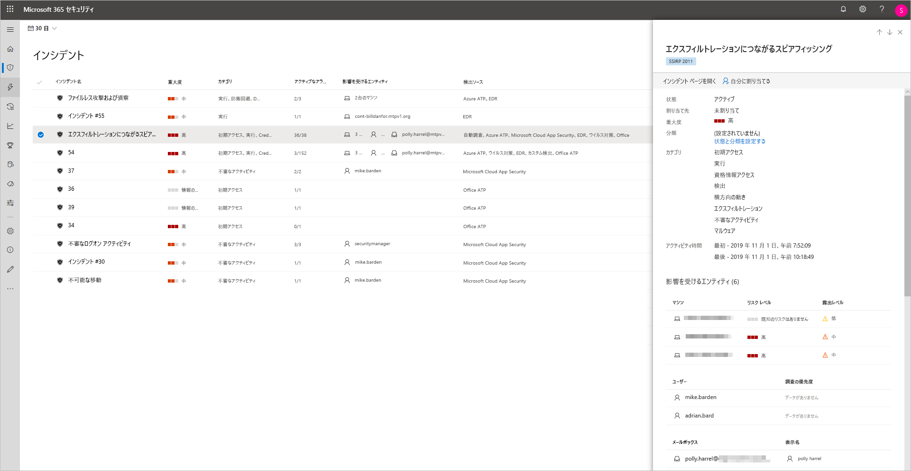
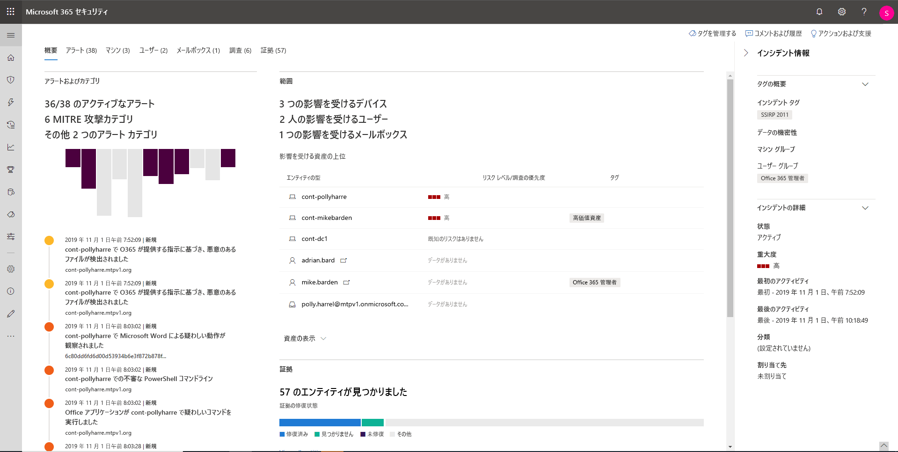
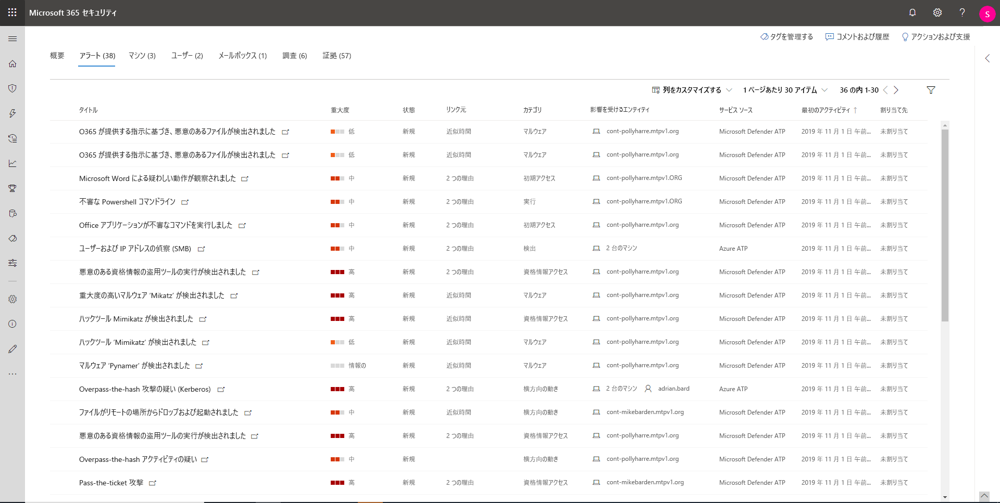

# Microsoft Threat Protection のインシデントを調査する

**適用対象:**
- Microsoft Threat Protection

[!INCLUDE [Prerelease information](../includes/prerelease.md)]

Microsoft Threat Protection は、すべてのデバイス、ユーザー、およびメールボックスを対象に、関連するすべてのアラート、資産、調査、エビデンスを集計して、あらゆる攻撃を総合的に把握できるようにします。 

効果的な修復計画を考案できるようにするために、ネットワークに影響するアラートを調査し、その意味を理解し、インシデントに関連する証拠を照合します。 

## インシデントの調査

1. インシデント キューからインシデントを選択します。   これにより、サイドパネルが開き、状態、重要度、カテゴリ、影響を受けるエンティティなどの重要な情報のプレビューが表示されます。

    

2. [**インシデント ページを開く**] を選択します。   これにより、インシデント ページが開き、インシデントの詳細、コメントとアクション、タブ (概要、アラート、デバイス、ユーザー、調査、証拠) が表示されます。

3. インシデントに関連するアラート、デバイス、ユーザー、その他のエンティティを確認します。

## インシデントの概要 
概要ページでは、インシデントに関する主な情報がスナップショットで表示されます。

攻撃のカテゴリでは、キルチェーンに対する攻撃の状況を視覚的に、そして数値で確認できます。 他の Microsoft セキュリティ製品と同様に、Microsoft Threat Protection は、[MITRE ATT&CK&trade;](https://attack.mitre.org/) フレームワークに準拠します。 

範囲セクションでは、このインシデントの一部である最も影響を受ける資産の一覧が表示されます。 この資産に関する特定の情報 (リスク レベル、調査の優先順位、資産のタグ付けなど) がある場合は、その情報もこのセクションに表示されます。

アラートのタイムラインでは、アラートの発生順に時系列でプレビューすることができ、これらのアラートがインシデントに関連付けられた理由も表示されます。

最後に、証拠セクションでは、どれぐらいの数の成果物がインシデントに含まれるかや修復状況の概要が示されます。そのため、対応が必要かどうかをすぐに特定できます。 

この概要は、注意が必要なインシデントの特徴の洞察を提供することで、インシデントの初回トリアージに役立ちます。 

## アラート 
インシデントに関連するすべてのアラートを表示することができます。重要度、アラートに関係したエンティティ、アラートのソース (Azure ATP、Microsoft Defender ATP、Office 365 ATP)、およびそれらのアラートが相互にリンクされた理由などの情報も確認できます。 

既定では、アラートは発生順に並べ替えられています。これにより、発生した攻撃を時系列で確認できます。 各アラートをクリックすると、関連するアラート ページが表示され、そのアラートについて詳細な調査を行うことができます。 

## デバイス 
[デバイス] タブには、インシデントに関連するアラートが表示されているすべてのデバイスが一覧表示されます。 

攻撃が行われたコンピューターの名前をクリックすると、そのコンピューターのページが表示されます。調査を簡単にするために、トリガーされたアラートや関連イベントが表示されます。 

![インシデントの [コンピューター] タブの画像](../images/incident-machines.png)

[タイムライン] タブを選択すると、コンピューターのタイムラインをスクロールして、コンピューター上で監視されているすべてのイベントおよび動作、発生したアラートを日付順に表示できます。 

## ユーザー 
特定のインシデントに関連すると識別されたユーザーを表示します。 

ユーザー名をクリックすると、ユーザーの Cloud App Security ページに移動します。ここで詳細な調査を行うことができます。

![インシデントの [ユーザー] タブの画像](../images/incident-users.png)

## メールボックス
インシデントに関連すると識別されたメールボックスを調査します。 メール関連アラートを選択し Office 365 Advanced Threat Protection を開くと、修復アクションを実行でき、さらに調査を行うことができます。

![インシデントの [メールボックス] タブの画像](../images/incident-mailboxes.png)

## 調査
このインシデントのアラートによって実行されたすべての自動調査を表示するには、[**調査**] を選択します。 調査は、Microsoft Defender ATP および Office 365 Advanced Threat Protection での自動調査の実行をどのように構成したかによって、修復アクションを実行するか、またはアナリストからのアクションの承認を待ちます。

![インシデントの [調査] タブの画像](../images/incident-investigations.png)

調査を選択して [調査の詳細] ページに移動すると、調査と修復状況に関する詳細情報が表示されます。 調査の一部として承認待ちのアクションがある場合は、[保留中のアクション] タブに表示されます。インシデント修復の一環としてアクションを行います。

## 証拠
Microsoft Threat Protection は、アラート内のすべてのインシデントのサポートされているイベントおよび不審なエンティティを自動的に調査し、自動応答や重要なファイル、プロセス、サービス、メールなどに関する情報を提供します。 これにより、インシデントの潜在的な脅威をすばやく検出してブロックできます。 

![インシデントの [証拠] タブの画像](../images/incident-evidence.png)

分析された各エンティティには、判定 (悪質、不審、クリーン)、および修復状況が示されます。 これにより、インシデント全体の修復状況、および修復の次の手順について理解するのをサポートします。

## 関連項目
- [インシデントの概要](incidents-overview.md)
- [インシデントの優先度設定](incident-queue.md)
- [インシデントの管理](manage-incidents.md)