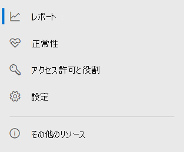

# Microsoft 365 セキュリティ センターのエンドポイント用 Microsoft DefenderMicrosoft Defender for Endpoint in the Microsoft 365 security center

[!INCLUDE [Microsoft 365 Defender rebranding](../includes/microsoft-defender.md)]

[!INCLUDE [Prerelease](../includes/prerelease.md)]

**適用対象:****Applies to:**

- [Microsoft 365 DefenderMicrosoft 365 Defender](https://go.microsoft.com/fwlink/?linkid=2118804)
- [Microsoft Defender for EndpointMicrosoft Defender for Endpoint](https://go.microsoft.com/fwlink/p/?linkid=2146631)
- [Microsoft Defender for Office 365Microsoft Defender for Office 365](https://go.microsoft.com/fwlink/?linkid=2148715)

強化された [Microsoft 365](overview-security-center.md) セキュリティ センターは、電子メール、コラボレーション、ID、デバイスの脅威を保護、検出、調査、および対応するセキュリティ機能を組み合わせた [https://security.microsoft.com](https://security.microsoft.com) 機能です。The improved [Microsoft 365 security center](overview-security-center.md) at [https://security.microsoft.com](https://security.microsoft.com) combines security capabilities that protect, detect, investigate, and respond to email, collaboration, identity, and device threats. このセキュリティ センターには、Microsoft Defender セキュリティ センターや Office 365 セキュリティ センターコンプライアンス センターなど、既存の Microsoft セキュリティ ポータル&が組み込されています。This security center brings together functionality from existing Microsoft security portals, including Microsoft Defender Security Center and the Office 365 Security & Compliance center.

Microsoft Defender セキュリティ センターに慣れ親しんだ場合、この記事では、強化された Microsoft 365 セキュリティ センターの変更点と改善点について説明します。If you're familiar with the Microsoft Defender Security Center, this article helps describe some of the changes and improvements in the improved Microsoft 365 security center. ただし、注意が必要な新しい要素と更新された要素があります。However there are some new and updated elements to be aware of.

従来 [、Microsoft Defender セキュリティ](https://docs.microsoft.com/windows/security/threat-protection/microsoft-defender-atp/portal-overview) センターは、Microsoft Defender for Endpoint のホームでした。Historically, the [Microsoft Defender Security Center](https://docs.microsoft.com/windows/security/threat-protection/microsoft-defender-atp/portal-overview) has been the home for Microsoft Defender for Endpoint. エンタープライズ セキュリティ チームは、この機能を使用して、潜在的な持続的脅威アクティビティやデータ侵害のアラートを監視し、対応しています。Enterprise security teams have used it to monitor and help responding to alerts of potential advanced persistent threat activity or data breaches. ポータルの数を減らすために、Microsoft 365 セキュリティ センターは、Microsoft ID、データ、デバイス、アプリ、インフラストラクチャ全体のセキュリティを監視および管理するホームになります。To help reduce the number of portals, the Microsoft 365 security center will be the home for monitoring and managing security across your Microsoft identities, data, devices, apps, and infrastructure.

Microsoft 365 セキュリティ センターの Microsoft Defender for Endpoint は[、Microsoft Defender](mssp-access.md)セキュリティ センターで付与されるのと同じ方法で、管理されたセキュリティ サービス プロバイダー [(MSSP)](https://docs.microsoft.com/windows/security/threat-protection/microsoft-defender-atp/grant-mssp-access)へのアクセスを許可します。Microsoft Defender for Endpoint in the Microsoft 365 security center supports [granting access to managed security service providers (MSSPs)](https://docs.microsoft.com/windows/security/threat-protection/microsoft-defender-atp/grant-mssp-access) in the same way [access is granted in the Microsoft Defender security center](mssp-access.md).

> [!IMPORTANT]
> Microsoft 365 セキュリティ センターに表示される内容は、現在のサブスクリプションによって異なります。What you see in the Microsoft 365 security center depends on your current subscriptions. たとえば、Office 365 用の Microsoft Defender のライセンスを持ってない場合、[メールとグループ&] セクションは表示されません。For example, if you don't have a license for Microsoft Defender for Office 365, then the Email & Collaboration section will not be shown.

改善された Microsoft 365 セキュリティ センターをご覧 [https://security.microsoft.com](https://security.microsoft.com) ください。Take a look at the improved Microsoft 365 security center: [https://security.microsoft.com](https://security.microsoft.com).

メリットの詳細については[、「Microsoft 365 セキュリティ センターの概要」を参照してください](overview-security-center.md)。Learn more about the benefits: [Overview of the Microsoft 365 security center](overview-security-center.md)

## 変更内容What's changed

次の表は、Microsoft Defender セキュリティ センターと Microsoft 365 セキュリティ センターの間の変更点のクイック リファレンスです。This table is a quick reference of the changes between the Microsoft Defender Security Center and the Microsoft 365 security center.

### アラートとアクションAlerts and actions

|**領域****Area**  |**変更の説明****Description of change**  |
|---------|---------|
| [インシデント&アラートIncidents & alerts](incidents-overview.md)  | Microsoft 365 セキュリティ センターでは、すべてのエンドポイント、メール、ID でインシデントとアラートを管理できます。In the Microsoft 365 security center, you can manage incidents and alerts across all of your endpoints, email, and identities. 関連するイベントを簡単に見つけ出すのに役立つエクスペリエンスが集約されました。We've converged the experience to help you find related events more easily. 詳細については、「インシデントの [概要」を参照してください](incidents-overview.md)。For more information, see [Incidents Overview](incidents-overview.md).   |
| [ハンティングHunting](advanced-hunting-overview.md)  |  Microsoft Defender for Endpoint で作成されたカスタム検出ルールを変更して、ID テーブルと電子メール テーブルを含めるには、自動的に Microsoft 365 Defender に移動します。Modifying custom detection rules created in Microsoft Defender for Endpoint to include identity and email tables automatically moves them to Microsoft 365 Defender. 対応するアラートは、Microsoft 365 Defender にも表示されます。Their corresponding alerts will also appear in Microsoft 365 Defender. これらの変更の詳細については、「カスタム検出ルールの移行 [」を参照してください](advanced-hunting-migrate-from-mdatp.md#migrate-custom-detection-rules)。For more details about these changes, read [Migrate custom detection rules](advanced-hunting-migrate-from-mdatp.md#migrate-custom-detection-rules). 高度 `DeviceAlertEvents` な検索の表は、Microsoft 365 Defender では使用できません。The `DeviceAlertEvents` table for advanced hunting isn't available in Microsoft 365 Defender. Microsoft 365 Defender でデバイス固有のアラート情報を照会するには、テーブルとテーブルを使用して、さまざまなソースからさらに多くの情報を `AlertInfo` `AlertEvidence` 取り込みます。To query device-specific alert information in Microsoft 365 Defender, you can use the `AlertInfo` and `AlertEvidence` tables to accommodate even more information from a diverse set of sources. DeviceAlertEvents を使用せずに Write クエリに従って、次の [デバイス関連のクエリを作成します](advanced-hunting-migrate-from-mdatp.md#write-queries-without-devicealertevents)。Craft your next device-related query by following [Write queries without DeviceAlertEvents](advanced-hunting-migrate-from-mdatp.md#write-queries-without-devicealertevents).|
|[アクション センターAction center](mtp-action-center.md)    | 自動調査と修復アクションに従って実行された保留中のアクションと完了したアクションを一覧表示します。Lists pending and completed actions that were taken following automated investigations and remediation actions. 以前は、Microsoft Defender セキュリティ センターのアクション センターには、デバイスでのみ実行された修復アクションの保留中のアクションと完了したアクションが一覧表示され、自動調査ではアラートと状態が一覧表示されました。Formerly, the Action center in the Microsoft Defender Security Center listed pending and completed actions for remediation actions taken on devices only, while Automated investigations listed alerts and status. 強化された Microsoft 365 セキュリティ センターでは、アクション センターによって、メール、デバイス、ユーザー間の修復アクションと調査が 1 か所にまとめらされています。In the  improved Microsoft 365 security center, the Action center brings together remediation actions and investigations across email, devices, and users—all in one location.  |
| [脅威の分析Threat analytics](threat-analytics.md) |  ナビゲーション バーの上部に移動して、検出と使用を容易にします。Moved to the top of the navigation bar for easier discovery and use. エンドポイントと電子メールとコラボレーションの両方の脅威情報が含まれる。Now includes threat information for both endpoints and email and collaboration.    |

### エンドポイントEndpoints

|**領域****Area**  |**変更の説明****Description of change**  |
|---------|---------|
|検索Search   |  見出しに表示される代わりに、Microsoft Defender for Endpoint の検索バーは [エンドポイント] セクションの下に移動しています。Instead of being in the heading, Microsoft Defender for Endpoint search bar is moving under the Endpoints section. デバイス、ファイル、ユーザー、URL、IPS、脆弱性、ソフトウェア、推奨事項を引き続き検索できます。You can continue to search for devices, files, users, URLs, IPs, vulnerabilities, software, and recommendations.  |
|[ダッシュボードDashboard](https://docs.microsoft.com/windows/security/threat-protection/microsoft-defender-atp/security-operations-dashboard)   |  これは、セキュリティ運用ダッシュボードです。This is your security operations dashboard. トリガーされたアクティブなアラートの数、どのデバイスが危険にさらされているか、どのユーザーが危険にさらされているのか、アラート、デバイス、ユーザーの重大度レベルの概要を確認します。See an overview of how many active alerts were triggered, which devices are at risk, which users are at risk, and severity level for alerts, devices, and users. また、デバイスにセンサーの問題が発生している場合、サービス全体の正常性、未解決のアラートが検出された方法も確認できます。You can also see if any devices have sensor issues, your overall service health, and how any unresolved alerts were detected. |
|デバイス一覧Device inventory | 変更はありません。No changes. |
|[脆弱性管理Vulnerability management](https://docs.microsoft.com/windows/security/threat-protection/microsoft-defender-atp/next-gen-threat-and-vuln-mgt)    |    ナビゲーション ウィンドウに収まる名前が短くされました。Name was shortened to fit in the navigation pane. これは、脅威と脆弱性の管理セクションと同じであり、すべてのページが下に表示されます。It's the same as the threat and vulnerability management section, with all the pages underneath.     |
| パートナーと APIPartners and APIs | 変更はありません。No changes. |
| 評価と&チュートリアルEvaluations & tutorials    |     新しいテストおよび学習機能。New testing and learning capabilities.     |
| 構成管理環境Configuration management   |  変更はありません。No changes.  |

> [!NOTE]
> **自動調査と修復** は、インシデントの一部です。**Automatic investigation and remediation** is now a part of  incidents. 自動調査と修復イベントは、[インシデントの調査] **タブ>確認** できます。You can see Automated  investigation and remediation events in the **Incident > Investigation** tab.

### アクセスとレポートAccess and reporting

|**領域****Area**  |**変更の説明****Description of change**  |
|---------|---------|
| レポートReports  | 脅威の防止、デバイスの正常性とコンプライアンス&脆弱なデバイスなど、コラボレーションに関するエンドポイントと電子メール のレポートをご覧ください。See reports for endpoints and email & collaboration, including Threat protection, Device health and compliance, and Vulnerable devices. |
| 正常性Health  |  現在 [、Microsoft 365](https://admin.microsoft.com/)管理センターの [サービス正常性] ページにリンクしています。Currently links out to the "Service health" page in the [Microsoft 365 admin center](https://admin.microsoft.com/). |
| 設定Settings |  Microsoft 365 セキュリティ センター、Microsoft 365 Defender、エンドポイント、メール & コラボレーション、ID、デバイス検出の設定を管理します。Manage your settings for the Microsoft 365 security center, Microsoft 365 Defender, Endpoints, Email & collaboration, Identities, and Device discovery.   |

## Microsoft 365 のセキュリティ ナビゲーションと機能Microsoft 365 security navigation and capabilities

左側のナビゲーションまたはクイック起動バーは使い慣れたものに見えます。The left navigation, or quick launch bar, will look familiar. ただし、このセキュリティ センターには、いくつかの新しい要素と更新された要素があります。However, there are some new and updated elements in this security center.

### インシデントとアラートIncidents and alerts

電子メール、デバイス、ID 全体にわたってインシデントとアラートの管理をまとめます。Brings together incident and alert management across your email, devices, and identities. アラート ページは、攻撃シグナルを組み合わせて詳細なストーリーを構築することで、アラートに対する完全なコンテキストを提供します。The alert page provides full context to the alert by combining attack signals to construct a detailed story. 新しい統一されたエクスペリエンスにより、ワークロード間で一貫したアラートが表示されます。A new, unified experience now brings together a consistent view of alerts across workloads. 迅速にトリアージし、調査し、効果的なアクションを実行できます。You can quickly triage, investigate, and take effective action.

- [インシデントの詳細Learn more about incidents](incidents-overview.md)
- [アラートの管理について詳しくは、次のリンクを参照してください。Learn more about managing alerts](investigate-alerts.md)

### ハンティングHunting

高度な捜索クエリを使用して、エンドポイント、Office 365 メールボックスなど、脅威、マルウェア、悪意のあるアクティビティを事前に [検索します](advanced-hunting-overview.md)。Proactively search for threats, malware, and malicious activity across your endpoints, Office 365 mailboxes, and more by using [advanced hunting queries](advanced-hunting-overview.md). これらの強力なクエリを使用して、既知の脅威と潜在的な脅威の両方に関する脅威インジケーターとエンティティを見つけて確認できます。These powerful queries can be used to locate and review threat indicators and entities for both known and potential threats.

[カスタム検出ルールは](custom-detection-rules.md) 、高度なハンティング クエリから構築して、侵害アクティビティや誤構成されたデバイスを示している可能性があるイベントを事前に監視するのに役立ちます。[Custom detection rules](custom-detection-rules.md) can be built from advanced hunting queries to help you proactively watch for events that might be indicative of breach activity and misconfigured devices.

### アクション センターAction center

アクション センターには、自動調査および対応機能によって作成された調査が表示されます。Action center shows you the investigations created by automated investigation and response capabilities. この Microsoft 365 Defender での自動自動修復は、特定のイベントに自動的に応答することでセキュリティ チームを支援します。This automated, self-healing in Microsoft 365 Defender can help security teams by automatically responding to specific events.

[アクション センターの詳細Learn more about the Action center](mtp-action-center.md)

### 脅威分析Threat Analytics

Microsoft のセキュリティの専門家のリサーチ ャーから脅威インテリジェンスを取得します。Get threat intelligence from expert Microsoft security researchers. 脅威分析は、新たな脅威に直面した場合のセキュリティ チームの効率向上に役立ちます。Threat Analytics helps security teams be more efficient when facing emerging threats. 脅威分析には以下が含まれます。Threat Analytics includes:

- Microsoft Defender for Office 365 からのメール関連の検出と軽減策。Email-related detections and mitigations from Microsoft Defender for Office 365. これは、Microsoft Defender for Endpoint から既に利用できるエンドポイント データに加えてです。This is in addition to the endpoint data already available from Microsoft Defender for Endpoint.
- インシデントビューは、脅威に関連します。Incidents view related to the threats.
- レポート内の操作可能な情報をすばやく識別して使用するための強化されたエクスペリエンス。Enhanced experience for quickly identifying and using actionable information in the reports.

脅威分析には、Microsoft 365 セキュリティ センターの左上のナビゲーション バーからアクセスするか、組織の上位の脅威を表示する専用のダッシュボード カードからアクセスできます。You can access threat analytics either from the upper left navigation bar in the Microsoft 365 security center, or from a dedicated dashboard card that shows the top threats for your organization.

脅威分析を使用して新たな脅威 [を追跡して対応する方法について詳しくは、次のリンクを参照してください。](https://docs.microsoft.com/microsoft-365/security/mtp/threat-analytics)Learn more about how to [track and respond to emerging threats with threat analytics](https://docs.microsoft.com/microsoft-365/security/mtp/threat-analytics)

### [エンドポイント] セクションEndpoints section

組織内のエンドポイントのセキュリティを表示および管理します。View and manage the security of endpoints in your organization. Microsoft Defender セキュリティ センターを使ったことがある場合は、使い慣れたものに見えます。If you've used the Microsoft Defender Security Center, it will look familiar.

### アクセスとレポートAccess and reports

レポートの表示、設定の変更、ユーザー ロールの変更を行います。View reports, change your settings, and modify user roles.

### SIEM API 接続SIEM API connections

Defender for [Endpoint SIEM API を使用](/windows/security/threat-protection/microsoft-defender-atp/enable-siem-integration.md)する場合は、引き続き使用できます。If you use the [Defender for Endpoint SIEM API](/windows/security/threat-protection/microsoft-defender-atp/enable-siem-integration.md), you can continue to do so. アラート ページまたは Microsoft 365 セキュリティ ポータルのインシデント ページを指す新しいリンクが API ペイロードに追加されました。We’ve added new links on the API payload that point to the alert page or the incident page in the Microsoft 365 security portal. 新しい API フィールドには、LinkToMTP と IncidentLinkToMTP が含まれます。New API fields include LinkToMTP and IncidentLinkToMTP. 詳しくは、「Microsoft Defender for Endpoint から [Microsoft 365](/microsoft-365/security/mtp/microsoft-365-security-mde-redirection.md)セキュリティ センターへのアカウントのリダイレクト」をご覧ください。For more information, see [Redirecting accounts from Microsoft Defender for Endpoint to the Microsoft 365 security center](/microsoft-365/security/mtp/microsoft-365-security-mde-redirection.md).

### 電子メール通知Email alerts

引き続きエンドポイント用 Defender のメール通知を使用できます。You can continue to use email alerts for Defender for Endpoint. Microsoft 365 セキュリティ センターのアラート ページまたはインシデント ページを指す新しいリンクがメールに追加されました。We've added new links in the emails that point to the alert page or the incident page in the Microsoft 365 security center. 詳しくは、「Microsoft Defender for Endpoint から [Microsoft 365](/microsoft-365/security/mtp/microsoft-365-security-mde-redirection.md)セキュリティ センターへのアカウントのリダイレクト」をご覧ください。For more information, see [Redirecting accounts from Microsoft Defender for Endpoint to the Microsoft 365 security center](/microsoft-365/security/mtp/microsoft-365-security-mde-redirection.md).

## 関連情報Related information

- [Microsoft 365 セキュリティ センターMicrosoft 365 security center](overview-security-center.md)
- [Microsoft 365 セキュリティ センターのエンドポイント用 Microsoft DefenderMicrosoft Defender for Endpoint in the Microsoft 365 security center](microsoft-365-security-center-mde.md)
- [エンドポイント用 Microsoft Defender から Microsoft 365 セキュリティ センターへのアカウントのリダイレクトRedirecting accounts from Microsoft Defender for Endpoint to the Microsoft 365 security center](microsoft-365-security-mde-redirection.md)
