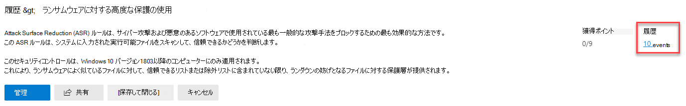
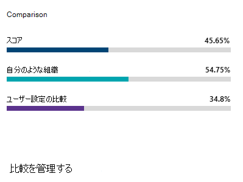
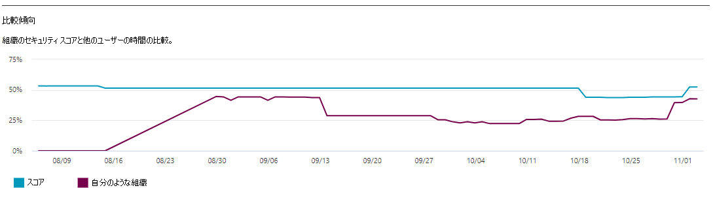

# Microsoft のセキュリティで保護されたスコア履歴を追跡し、目標を達成するTrack your Microsoft Secure Score history and meet goals

[Microsoft セキュリティスコア](microsoft-secure-score.md)は、組織のセキュリティに関する状況の測定値で、より多くの改善アクションが行われたことを示しています。[Microsoft Secure Score](microsoft-secure-score.md) is a measurement of an organization's security posture, with a higher number indicating more improvement actions taken. この点については https://security.microsoft.com/securescore 、「 [Microsoft 365 セキュリティセンター](overview-security-center.md)」を参照してください。It can be found at https://security.microsoft.com/securescore in the [Microsoft 365 security center](overview-security-center.md).

## スコアに影響を与える状況を把握するGain insights into activity that has affected your score

[**履歴**] タブで、組織のスコアのグラフを時間の経過と共に表示します。View a graph of your organization's score over time in the **History** tab.

グラフの下には、選択した時間範囲内で実行されるすべてのアクションとその属性 (結果として得られる点やカテゴリなど) の一覧が表示されます。Below the graph is a list of all the actions taken in the selected time range and their attributes, such as resulting points and category. 日付範囲をカスタマイズし、カテゴリ別にフィルター処理できます。You can customize a date range and filter by category.

アクティビティに関連付けられている改善アクションを選択すると、[完全な改善] アクションのポップアップが表示されます。If you select the improvement action associated with an activity, the full improvement action flyout will appear.

その特定の改善アクションの履歴をすべて表示するには、フライアウトの [履歴] リンクを選択します。To view all history for that specific improvement action, select the history link in the flyout.

## 傾向を検出し、目標を設定するDiscover trends and set goals

[**指標 & の傾向**] タブには、傾向を把握し、目標を設定するのに役立つグラフやグラフがいくつかあります。In the **Metrics & trends** tab, there are several graphs and charts to give you more visibility into trends and set goals. 視覚エフェクトのページ全体の日付範囲を設定できます。You can set the date range for the whole page of visualizations. 視覚エフェクトは次のとおりです。The visualizations include:

* **セキュリティで保護されたスコアゾーン**: 組織の目標と、適切で良好な、悪いスコアの範囲の定義に基づいてカスタマイズします。**Your Secure Score zone** — Customized based on your organization's goals and definitions of good, okay, and bad score ranges.
* **回帰傾向**: 構成、ユーザー、またはデバイスの変更によって regressed を持つポイントのタイムライン。**Regression trend** — A timeline of points that have regressed due to configuration, user, or device changes.  
* **比較傾向**-組織のセキュリティスコアと他のユーザーとの間の比較方法。**Comparison trend** — How your organization's Secure Score compares to others' over time. このビューには、同じような座席数を持つ組織の平均スコアを表す行と、設定可能なカスタムの比較ビューを含めることができます。This view can include lines representing the score average of organizations with similar seat count and a custom comparison view that you can set.
* **リスク許容度の傾向**— "リスクが許容される" としてマークされた改善アクションのタイムライン。**Risk acceptance trend** — Timeline of improvement actions marked as "risk accepted."
* **スコアの変更**: 獲得したポイント数、ポイント regressed、およびそれ以降のスコア変更 (指定された日付範囲)。**Score changes** — The number of points achieved, points regressed, along with the subsequent score change, in the specified date range.

### 自分のスコアを組織と同じように比較するCompare your score to organizations like yours

自分に似た組織とスコアがどのように比較されるかを確認するには、2つの場所があります。There are two place to see how your score compares to organizations that are similar to you.

最初に [**概要**] タブが表示され、比較バーのグラフを表示することができます。The first place is in the **Overview** tab, where you will be able to see a comparison bar graph. グラフをポイントすると、スコアとスコアの機会が表示されます。Hover over the chart to view the score and score opportunity.

2番目の場所は [**指標 & 傾向**] タブで、組織のセキュリティスコアが他のユーザーとどのように比較されるかを確認できます。The second place is in the **Metrics & trends** tab, where you can view how your organization's Secure Score compares to others' over time.

両方のグラフで [比較の**管理**] を選択して、組織の情報を表示および編集できます。In both charts, you can select **Manage comparisons** to view and edit your organization's information. また、業界、組織の規模、ライセンス、地域に基づいて、カスタム比較を作成することもできます。You can also create a custom comparison based on industry, organization size, licenses, and regions. 

## ご意見をお聞かせください。We want to hear from you

問題がある場合は、[Security, Privacy & Compliance](https://techcommunity.microsoft.com/t5/Security-Privacy-Compliance/bd-p/security_privacy) コミュニティに投稿してお知らせください。If you have any issues, please let us know by posting in the [Security, Privacy & Compliance](https://techcommunity.microsoft.com/t5/Security-Privacy-Compliance/bd-p/security_privacy) community. コミュニティを監視しているので、問題に対応します。We're monitoring the community and will provide help.

## 関連リソースRelated resources

- [Microsoft セキュリティスコアの概要Microsoft Secure Score overview](microsoft-secure-score.md)
- [セキュリティ体制の可視性を獲得するGain visibility into your security posture](microsoft-secure-score-improvement-actions.md)
- [今後の予定What's coming](microsoft-secure-score-whats-coming.md)