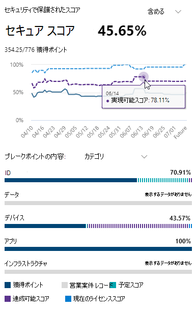

# Microsoft セキュア スコアを使用してセキュリティの状況を評価する

[!INCLUDE [Microsoft 365 Defender rebranding](../includes/microsoft-defender.md)]

Microsoft セキュア スコアは組織のセキュリティ体制を測定する数値であり、数値が高いほどより多くの改善のための処置が実行されたことを示しています。 https://security.microsoft.com/securescore[これは、Microsoft 365](overview-security-center.md)セキュリティ センターにあります。

必要な情報を迅速に把握できるように、Microsoft の改善のための処置は次のグループに分類されています。

* ID (Azure Active Directory アカウント&ロール)
* デバイス (デバイスの Microsoft セキュア スコアと呼ばれる [、エンドポイント用 Microsoft](https://docs.microsoft.com/windows/security/threat-protection/microsoft-defender-atp/tvm-microsoft-secure-score-devices)Defender)
* アプリ (Office 365 や Microsoft Cloud App Security を含む、メール アプリとクラウド アプリ)

>[!NOTE]
>Microsoft セキュア スコアの最近のリリースでは、スコアモデルが改善され、Microsoft セキュア スコアと Id セキュア スコアおよび Graph API との互換性が一時的に改善されました。 [詳細の表示](microsoft-secure-score-whats-new.md)

Microsoft セキュア スコアの概要ページで、これらのグループ間でのポイントの分割方法と使用可能なポイントを確認します。 また、合計スコアの全体表示、ベンチマーク比較によるセキュア スコアの履歴傾向、スコアを向上させるために実行できる優先順位付けされた改善アクションを取得できます。

## 現在のスコアを確認する

To check on your current score, go to the Microsoft Secure Score overview page and look for the tile that says **Your secure score**. スコアは、達成可能な合計ポイント数と共にパーセンテージで表示されます。

さらに、スコアの横にある [ **含** める] ボタンを選択した場合は、スコアの異なるビューを選択できます。 これらの異なるスコア ビューは、スコア タイルとポイントブレークダウン グラフのグラフに表示されます。

全体的なスコアのビューに追加できるスコアを次に示します。スコア全体の全体像を確認できます。

- **計画されたスコア**: 計画されたアクションが完了すると、投影されたスコアを表示する
- **現在のライセンス スコア**: 現在の Microsoft ライセンスで実現できるスコアを表示する
- **達成可能なスコア**: Microsoft ライセンスと現在のリスク受け入れで達成できるスコアを表示します

考えられるすべてのスコア ビューを含めた場合、このビューは次のように表示されます。

## スコアを上げるための対策

[ **改善アクション]** タブには、攻撃の可能性に対処するセキュリティの推奨事項が一覧表示されます。 また、その状態 (対応、計画、受け入れられるリスク、サード パーティ経由での解決、代替軽減策による解決、完了) も含まれます。 すべての改善のための処置の検索、フィルター処理、グループ化を行うことができます。  

### ランク付け

ランク付けは、達成するポイント数、実装の難易度、ユーザーへの影響、および複雑さに基づいて行います。 最高ランクの改善のための処置では、難易度、ユーザーへの影響度、複雑度は低く、高ポイントを取ることができます。

### 改善アクションの詳細を表示する

特定の改善アクションを選択すると、ページ全体のフライアウトが表示されます。  

この操作を完了するには、いくつかの選択肢があります。

- [ **管理] を** 選択して構成画面に移動し、変更を行います。 その後、アクションが価値のあるポイントを取得し、フライアウトに表示されます。ポイントの更新には、通常約 24 時間かかります。

- [ **共有]** を選択して、改善アクションへの直接リンクをコピーします。 また、電子メール、Microsoft Teams、Microsoft Planner、ServiceNow などのリンクを共有するプラットフォームを選択できます。 ServiceNow を選択すると、ServiceNow と Microsoft 365 セキュリティ センター ホームに表示される変更チケットを作成できます。 詳細については [、Microsoft 365 セキュリティ センターと ServiceNow の統合を参照してください](tickets-security-center.md)。

メモ **を** 追加して、進行状況を追跡したり、コメントを付けるその他の項目を追跡したりします。 改善アクションに独自の **タグ** を追加する場合は、それらのタグでフィルター処理できます。

### 改善アクションの状態を選択する

状態を選択し、改善アクションに固有のメモを記録します。

- **対処するには** 、 - 改善アクションが必要なと認識し、将来ある時点で対処する予定です。 この状態は、部分的に検出されたが、完全には完了していないアクションにも適用されます。
- **計画済** み - 改善アクションを完了する具体的な計画が実施されています。
- **受け入れられる** リスク - セキュリティは常に使いやすさとバランスを取る必要があります。すべての推奨事項が環境で機能するとは限しません。 その場合は、リスクまたは残りのリスクを受け入れ、改善アクションを実行しない選択をすることができます。 ポイントは与えらえませんが、改善アクションの一覧にアクションが表示されなくなりました。 このアクションは履歴で表示したり、いつでも元に戻したりできます。
- **サード パーティを通** じて解決され、代替の軽減策によって **解決されました。** 改善アクションは、サード パーティ製のアプリケーションまたはソフトウェア、または内部ツールによって既に対処されています。 アクションの価値のあるポイントが得られるので、スコアは全体的なセキュリティの体勢をより良く反映します。 サードパーティまたは内部ツールがコントロールをカバーしなくなった場合は、別の状態を選択できます。 改善アクションがこれらの状態のいずれかとしてマークされている場合、Microsoft は実装の完全性を確認できません。

#### 脅威&管理改善アクション

[デバイス] カテゴリの改善のためのアクションでは、状態を選択できません。 代わりに[、Microsoft Defender](https://docs.microsoft.com/windows/security/threat-protection/microsoft-defender-atp/use)セキュリティ センターの関連する脅威と脆弱性管理のセキュリティに関する推奨事項にアクセスして対応します。 選択した例外と記述する正当な理由は、そのポータルに固有です。 Microsoft セキュア スコア ポータルには表示されません。

#### 完了した改善アクション

改善アクションの可能性があるすべてのポイントが達成された後、改善アクションは"完了" 状態になります。 完了した改善アクションは Microsoft データによって確認され、状態を変更できない。

### 情報を評価し、ユーザーへの影響を確認する

「一目 **で」というセクション** には、カテゴリ、保護できる攻撃、製品が表示されます。

**ユーザーへの** 影響は、改善アクションが実施された場合にユーザーが経験する操作であり、影響を受けるユーザーは影響を受けるユーザーです。

### 改善アクションを実装する

[ **実装** ] セクションには、すべての前提条件、改善アクションを完了するためのステップ バイ ステップの次の手順、改善アクションの現在の実装状態、および詳細なリンクが表示されます。

前提条件には、必要なライセンス、または改善アクションに対処する前に完了するアクションが含まれます。 改善アクションを完了するのに十分なシートがライセンスに含まれています。また、それらのライセンスが必要なユーザーに適用されます。  

## ご意見をお聞かせください。

問題がある場合は、セキュリティ/プライバシー/コンプライアンス コミュニティに投稿 [&知](https://techcommunity.microsoft.com/t5/Security-Privacy-Compliance/bd-p/security_privacy) らせてください。 コミュニティを監視しているので、問題に対応します。

## 関連リソース

- [Microsoft セキュア スコアの概要](microsoft-secure-score.md)
- [Microsoft セキュア スコアの履歴を追跡し、目標を達成する](microsoft-secure-score-history-metrics-trends.md)
- [今後の予定](microsoft-secure-score-whats-coming.md)
- [新機能](microsoft-secure-score-whats-new.md)
