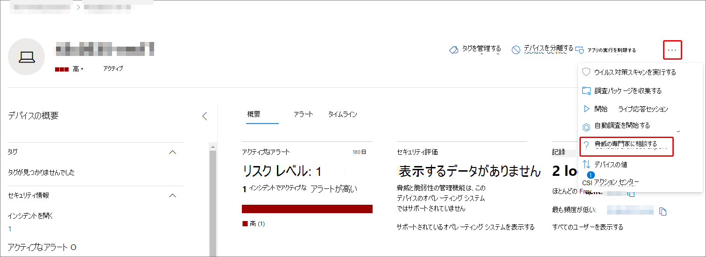
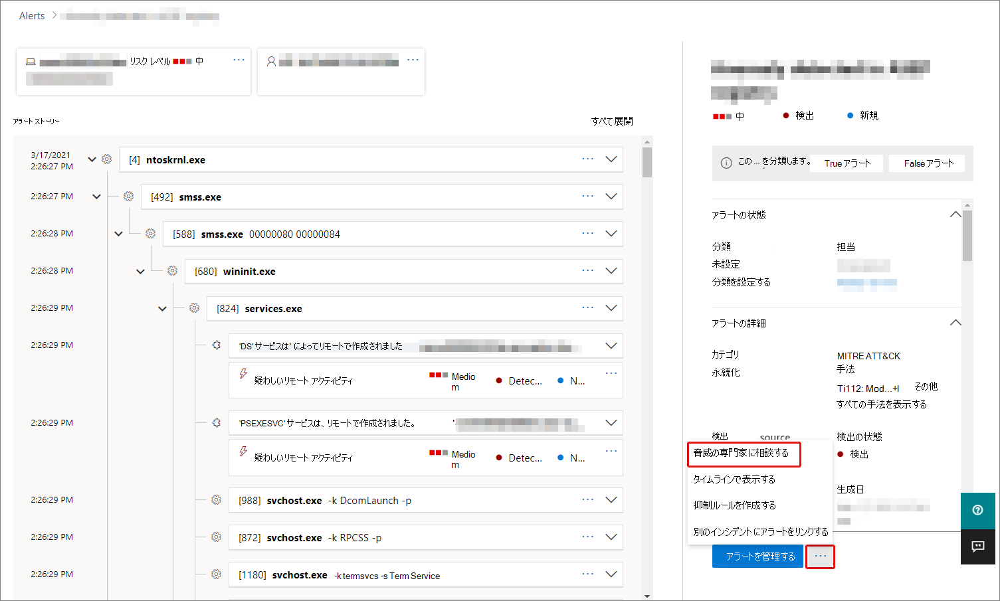
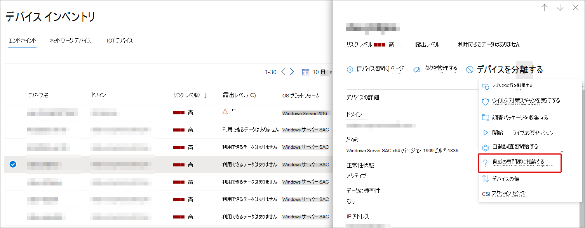

# Microsoft 脅威エキスパートの概要Microsoft 365説明

[!INCLUDE [Microsoft 365 Defender rebranding](../includes/microsoft-defender.md)]

**適用対象:**

- [Microsoft 365 Defender](https://go.microsoft.com/fwlink/?linkid=2118804)
- [Microsoft Defender for Endpoint](https://go.microsoft.com/fwlink/p/?linkid=2154037)

[!INCLUDE [Prerelease](../includes/prerelease.md)]

Microsoft 脅威エキスパート - ターゲット攻撃通知は、管理された脅威検出サービスです。 適用して受け入れられると、Microsoft の脅威の専門家から標的型攻撃通知が届くので、環境に対する重大な脅威を見逃す必要はありません。 これらの通知は、組織のエンドポイント、電子メール、および ID を保護するのに役立ちます。
Microsoft 脅威エキスパート – エキスパート オンデマンドを使用すると、組織が直面している脅威に関する専門家のアドバイスを受け取ります。 組織が直面している脅威に関するヘルプを受け取ります。 サブスクリプション サービスとして利用できます。

## [ターゲット攻撃Microsoft 脅威エキスパートを適用する]

> [!IMPORTANT]
> 申請する前に、Microsoft Technical Service プロバイダーおよびアカウント チームと Microsoft 脅威エキスパート – ターゲット攻撃通知の適格性要件について説明してください。

Microsoft Defender for Endpoint および Microsoft 365 Defenderを既に持っている場合は、Microsoft 脅威エキスパート – ターゲット攻撃通知を自分のポータルからMicrosoft 365 Defenderできます。 [エンドポイントの **設定 >全般>に** 移動> – > Microsoft 脅威エキスパート攻撃通知] に移動し、[適用] を **選択します**。 詳細[については、「Microsoft 脅威エキスパート機能の](./configure-microsoft-threat-experts.md)構成」を参照してください。

アプリケーションが承認されると、脅威の専門家が環境に対する脅威を検出するたびに、ターゲット攻撃通知の受信を開始します。

## ユーザー登録Microsoft 脅威エキスパート - エキスパート オンデマンド

Microsoft 担当者に問い合わせ、エキスパート オンデマンドを購読してください。  詳細については[、「configure Microsoft 脅威エキスパート機能](./configure-microsoft-threat-experts.md)」を参照してください。

## ターゲット攻撃の通知を受け取る

[Microsoft 脅威エキスパート- ターゲット攻撃通知機能は、ネットワークに対する最も重要な脅威に対する予防的な検出を提供します。 脅威の専門家は、人間の敵対的侵入、ハンズオンキーボード攻撃、サイバー攻撃などの高度な攻撃を探します。 これらの通知は、新しいアラートとして表示されます。 管理されたハンティング サービスには、次の機能が含まれます。

- 脅威の監視と分析、ビジネスの滞留時間とリスクの削減
- 既知の攻撃と新たな脅威の両方を検出してターゲットにするための、ハンタートレーニングを受けた人工知能
- 最も関連するリスクを特定し、SOC の有効性を最大化する
- 迅速な SOC 応答を可能にするために、迅速に提供できる限り多くのコンテキストを提供し、妥協点を範囲指定するのに役立ちます。

## 専門家とオンデマンドで共同作業を行う

また、セキュリティ ポータル内から Microsoft の脅威の専門家に直接連絡Microsoft 365、迅速かつ正確な脅威対応を行います。  専門家は、組織が直面する可能性がある複雑な脅威をより深く理解するために洞察を提供できます。  専門家に相談して、次の情報を提供します。

- 根本原因やスコープを含む、アラートとインシデントに関する追加情報を収集する
- 高度な攻撃者に直面した場合、疑わしいデバイス、アラート、インシデントを明確にし、次の手順を実行する
- 脅威のアクター、キャンペーン、または新しい攻撃者の手法に関連するリスクと利用可能な保護を決定する

脅威の専門家 **に相談するオプション** は、ポータル全体のいくつかの場所で利用できます。

- <i>**[デバイス ページのアクション] メニュー**</i> 

- <i>**デバイス インベントリ ページのフライアウト メニュー**</i> 

- <i>**アラート ページの飛び出しメニュー**</i> 

- <i>**[インシデント] ページの [操作] メニュー**</i> 

- <i>**インシデント インベントリ ページ**</i> 

> [!NOTE]
> プレミア サポート サブスクリプションを Microsoft Defender にマップして Office 365 ライセンスを取得している場合は、Microsoft Services Hub を通じてエキスパート オンデマンド ケースの状態を追跡できます。

Microsoft Services Hub の概要については、このビデオをご覧ください。

> [!VIDEO https://www.microsoft.com/videoplayer/embed/RE4pk9f]

## 関連項目

- [機能Microsoft 脅威エキスパート構成する](./configure-microsoft-threat-experts.md)
