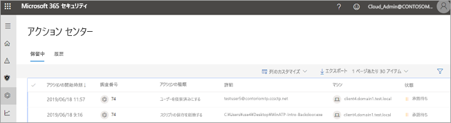
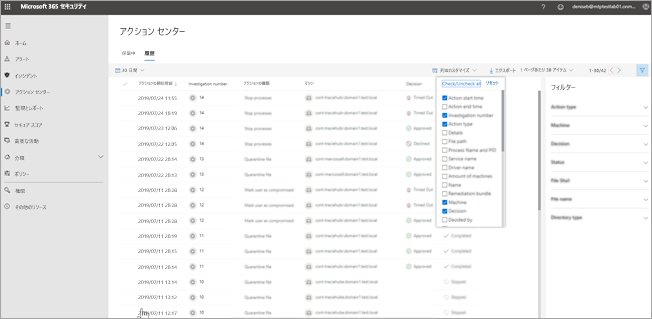

# アクション センターに移動して修復アクションを表示するGo to the Action center to view remediation actions

**適用対象:****Applies to:**
- Microsoft Threat ProtectionMicrosoft Threat Protection

[!include[Prerelease information](prerelease.md)]

## 「単一画面」エクスペリエンスA "single pane of glass" experience

アクション センターを使用して、組織のデバイスおよびメールボックス全体の現在および過去の調査結果を確認します。Use the Action center to see the results of current and past investigations across your organization's devices and mailboxes. 脅威の種類および[出された判定](mtp-autoir-results.md#remediation-actions-following-automated-investigation)に応じて、修復アクションが自動的に、または組織のセキュリティ運用チームの承認を受けて実行されます。Depending on the type of threat and [resulting verdict](mtp-autoir-results.md#remediation-actions-following-automated-investigation), remediation actions occur automatically or upon approval by your organization’s security operations team. すべての修復アクションは、承認待ちか既に承認済みかにかかわらず、アクションセンターに統合されます。All remediation actions, whether they are pending approval or were already approved, are consolidated in the Action center. 

アクション センターは、次のようなタスクに「単一画面」エクスペリエンスを提供します。The Action center provides a "single pane of glass" experience for tasks, such as:
- 保留中の修復アクションを承認する。Approving pending remediation actions;
- 承認済みの修復アクションの監査ログを表示する。Viewing an audit log of already approved remediation actions; and
- 完了した修復アクションを確認する。Reviewing completed remediation actions.

アクション センターは、職場で Microsoft Threat Protection の包括的なビューを提供するため、セキュリティ運用チームはより効果的かつ効率的に運用できます。Your security operations team can operate more effectively and efficiently, because the Action center provides a comprehensive view of Microsoft Threat Protection at work.

## 修復アクションRemediation actions

次の表に、現在アクション センターでサポートされている修復アクションを示します。The following table lists remediation actions that are currently supported in the Action center: 

|エンドポイントの修復アクションEndpoints remediation actions  |メールの修復アクションEmail remediation actions  |
|---------|---------|
|ファイルの検疫Quarantine file レジストリ キーの削除Remove registry key プロセスの強制終了Kill process  サービスの停止Stop the service application  レジストリ キーの削除Remove registry key  ドライバーの無効化Disable driver  スケジュールされたタスクの実行Remove scheduled task      |メール メッセージまたはクラスターの論理的な削除Soft delete email messages or clusters URL のブロック (クリック時)Block URL (time-of-click) 外部メール転送の無効化Turn off external mail forwarding          |

## アクション センターに移動するGo to the admin center.

1. [https://security.microsoft.com](https://security.microsoft.com) に移動し、サインインします。Go to https://security.microsoft.com and sign in. 

2. ナビゲーション ウィンドウで、[**アクション センター**] を選択します。In the navigation pane, choose **Action center**. 

3. [アクション センター] には、[**保留中**] と [**履歴**] の 2 つのタブが表示されます。In the Action center, you’ll see two tabs: **Pending** and **History**.

    - [**保留中**] タブには、続行するにはセキュリティ運用チームの誰かによる確認および承認が必要な調査のリストが表示されます。The **Pending** tab lists investigations that require review and approval by someone in your security operations team to continue. ここに表示されている保留中のアイテムを確認し、実行してください。Make sure to review and take action on pending items you see here.

    - [**履歴**] タブには、過去の調査や、自動的に実行された修復アクションのリストが表示されます。The **History** tab lists past investigations and remediation actions that were taken automatically. 過去 1 日、1 週間、1 か月、または 6 か月のデータを表示できます。You can view data for the past day, week, month, or six months.

4. 表示する列のみを表示するには、[**列のカスタマイズ**] を選択します。To show only the columns you want to see, select **Customize columns**. 

5. 調査の詳細を表示するには、リストから項目を選択します。Select an item in the list to view more details about an investigation. 調査の詳細ビューが開きます。The investigation details view opens. 

    - 調査がメール コンテンツ (エンティティがメールボックスなど) に関連する場合は、調査の詳細は Office 365 セキュリティ/コンプライアンス センター に表示されます ([https://protection.office.com/threatinvestigation](https://protection.office.com/threatinvestigation))。If the investigation pertains to email content (such as, the entity is a mailbox), investigation details open in the Office 365 Security & Compliance Center ([https://protection.office.com/threatinvestigation](https://protection.office.com/threatinvestigation)). 

    - 調査にデバイスが含まれる場合は、調査の詳細がセキュリティ センター で開きます ([https://security.microsoft.com](https://security.microsoft.com))。If the investigation involves a device, investigation details open in the security center ([https://security.microsoft.com](https://security.microsoft.com)). 

## アクション センター タスクに必要なアクセス許可Required permissions for Action center tasks

アクション センターで保留中のアクションを承認または拒否するには、次の表に示すアクセス許可が割り当てられている必要があります。To approve or reject pending actions in the Action center, you must have permissions assigned as listed in the following table:

|修復アクションRemediation action |必要な役割と権限Required licenses and permissions |
|--|----|
|Microsoft Defender ATP の修復 (デバイス)Microsoft Defender ATP remediation (devices) |Azure Active Directory ([https://portal.azure.com](https://portal.azure.com)) または Microsoft 365 管理センター ([https://admin.microsoft.com](https://admin.microsoft.com)) で割り当てられた**セキュリティ管理者**の役割**Security Administrator** role assigned in either Azure Active Directory ([https://portal.azure.com](https://portal.azure.com)) or the Microsoft 365 admin center ([https://admin.microsoft.com](https://admin.microsoft.com)) --- または ---() or [] Microsoft Defender ATP で割り当てられた**有効な修復アクション**の役割**Active remediation actions** role assigned in Microsoft Defender ATP     詳細については、次のリソースを参照してください。To learn more, see the following resources:  - [Azure Active Directory での管理者役割のアクセス許可](https://docs.microsoft.com/azure/active-directory/users-groups-roles/directory-assign-admin-roles)Administrator role permissions in Azure Active Directory - [役割ベースのアクセス制御のための役割の作成と管理 (Microsoft Defender ATP)](https://docs.microsoft.com/windows/security/threat-protection/microsoft-defender-atp/user-roles)- [Create and manage roles for role-based access control (Microsoft Defender ATP)](https://docs.microsoft.com/windows/security/threat-protection/microsoft-defender-atp/user-roles)  |
|Office 365 ATP の修復 (Office コンテンツおよびメール)Office 365 ATP remediation (Office content and email)  |Azure Active Directory ([https://portal.azure.com](https://portal.azure.com)) または Microsoft 365 管理センター ([https://admin.microsoft.com](https://admin.microsoft.com)) で割り当てられた**セキュリティ管理者**の役割**Security Administrator** role assigned in either Azure Active Directory ([https://portal.azure.com](https://portal.azure.com)) or the Microsoft 365 admin center ([https://admin.microsoft.com](https://admin.microsoft.com)) --- さらに ---( and )  Office 365 セキュリティ/コンプライアンス センターに割り当てられた**検索と消去**の役割 [https://protection.office.com](https://protection.office.com))Search and Purge (this is assigned only in the Office 365 Security & Compliance Center)   **重要**: Office 365 セキュリティ/コンプライアンス センターにのみセキュリティ管理者の役割が割り当てられている場合は、アクション センターまたは Microsoft Threat Protection の機能にアクセスできません。**IMPORTANT**: If you have the Security Administrator role assigned only in the Office 365 Security & Compliance Center, you will not be able to access the Action center or Microsoft Threat Protection capabilities. Azure Active Directory または Microsoft 365 管理センターでセキュリティ管理者の役割が割り当てられている必要があります。You must have the Security Administrator role assigned in Azure Active Directory or the Microsoft 365 admin center.   詳細については、次のリソースを参照してください。To learn more, see the following resources:  - [Azure Active Directory での管理者役割のアクセス許可](https://docs.microsoft.com/azure/active-directory/users-groups-roles/directory-assign-admin-roles)Administrator role permissions in Azure Active Directory - [Office 365 セキュリティ/コンプライアンス センターのアクセス許可](https://docs.microsoft.com/microsoft-365/security/office-365-security/permissions-in-the-security-and-compliance-center)Permissions in the Office 365 Security  Compliance Center |

> [!NOTE]
> Azure Active Directory で**グローバル管理者**の役割が割り当てられているユーザーは、アクション センターで保留中のアクションを承認または拒否できます。Users who have the **Global Administrator** role assigned in Azure Active Directory can approve or reject any pending action in the Action center. ただし、ベスト プラクティスとして、グローバル管理者の役割が割り当てられているユーザーの数を制限する必要があります。However, as a best practice, your organization should limit the number of people who have the Global Administrator role assigned. アクション センターのアクセス許可については、上記の**セキュリティ管理者**、**有効な修復アクション**、および**検索と消去**の役割を使用することをお勧めします。We recommend using the **Security Administrator**, **Active remediation actions**, and **Search and Purge** roles listed above for Action center permissions.

## 次のステップNext steps 

- [Microsoft Threat Protection のインシデントの詳細Learn more about incidents in Microsoft Threat Protection](incidents-overview.md)
- [自動化された調査の結果を表示するView the results of an automated investigation](mtp-autoir-results.md)
- [Microsoft Threat Protection の捜索の詳細Learn about hunting in Microsoft Threat Protection](advanced-hunting-overview.md)

