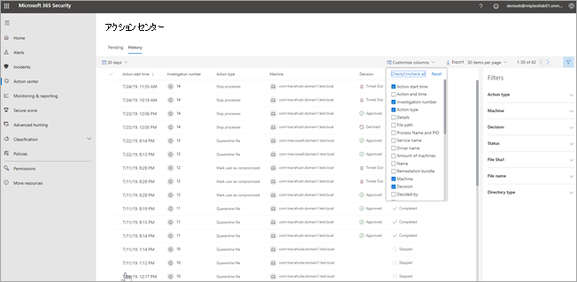

# アクション センターThe Action center

[!INCLUDE [Microsoft 365 Defender rebranding](../includes/microsoft-defender.md)]

**適用対象:****Applies to:**
- Microsoft 365 DefenderMicrosoft 365 Defender

アクション センターを使用して、組織のデバイスおよびメールボックス全体の現在および過去の調査結果を確認します。Use the Action center to see the results of current and past investigations across your organization's devices and mailboxes. 脅威の種類および結果の verdict に応じて、 [修復アクション](https://docs.microsoft.com/microsoft-365/security/mtp/mtp-remediation-actions) は自動的に、または組織のセキュリティ運用チームによる承認時に発生します。Depending on the type of threat and resulting verdict, [remediation actions](https://docs.microsoft.com/microsoft-365/security/mtp/mtp-remediation-actions) occur automatically or upon approval by your organization's security operations team. すべての修復アクションは、承認待ちか既に承認済みかにかかわらず、アクションセンターに統合されます。All remediation actions, whether they are pending approval or were already approved, are consolidated in the Action center. 

## 「単一画面」エクスペリエンスA "single pane of glass" experience

アクション センターは、次のようなタスクに「単一画面」エクスペリエンスを提供します。The Action center provides a "single pane of glass" experience for tasks, such as:
- 保留中の修復アクションを承認する。Approving pending remediation actions;
- 承認済みの修復アクションの監査ログを表示する。Viewing an audit log of already approved remediation actions; and
- 完了した修復アクションを確認する。Reviewing completed remediation actions.

アクションセンターでは、Microsoft 365 Defender の作業中の包括的なビューが提供されるため、セキュリティ運用チームはより効果的かつ効率的に運用できます。Your security operations team can operate more effectively and efficiently, because the Action center provides a comprehensive view of Microsoft 365 Defender at work.

## アクション センターに移動するGo to the Action center

1. [https://security.microsoft.com](https://security.microsoft.com) に移動し、サインインします。Go to [https://security.microsoft.com](https://security.microsoft.com) and sign in. 

2. ナビゲーション ウィンドウで、[ **アクション センター** ] を選択します。In the navigation pane, choose **Action center**. 

3. アクションセンターに、[ **保留中** ] と [ **履歴** ] という2つのタブが表示されます。In the Action center, you'll see two tabs: **Pending** and **History**.

    - [ **保留中** ] タブには、続行するにはセキュリティ運用チームの誰かによる確認および承認が必要な調査のリストが表示されます。The **Pending** tab lists investigations that require review and approval by someone in your security operations team to continue. ここに表示されている保留中のアイテムを確認し、実行してください。Make sure to review and take action on pending items you see here.

    - [ **履歴** ] タブには、過去の調査や、自動的に実行された修復アクションのリストが表示されます。The **History** tab lists past investigations and remediation actions that were taken automatically. 過去 1 日、1 週間、1 か月、または 6 か月のデータを表示できます。You can view data for the past day, week, month, or six months.

4. 表示する列のみを表示するには、[ **列のカスタマイズ** ] を選択します。To show only the columns you want to see, select **Customize columns**. 

5. 調査の詳細を表示するには、リストから項目を選択します。Select an item in the list to view more details about an investigation. 調査の詳細ビューが開きます。The investigation details view opens. 

    - 調査が電子メールコンテンツ (たとえば、エンティティがメールボックスなど) に関係している場合は、セキュリティ & コンプライアンスセンター () で調査の詳細を開き [https://protection.office.com/threatinvestigation](https://protection.office.com/threatinvestigation) ます。If the investigation pertains to email content (such as, the entity is a mailbox), investigation details open in the Security & Compliance Center ([https://protection.office.com/threatinvestigation](https://protection.office.com/threatinvestigation)). 

    - 調査にデバイスが含まれる場合は、調査の詳細がセキュリティ センター で開きます ([https://security.microsoft.com](https://security.microsoft.com))。If the investigation involves a device, investigation details open in the security center ([https://security.microsoft.com](https://security.microsoft.com)). 

> [!TIP]
> Microsoft 365 Defender の自動化された調査と応答機能によって、何らかの問題が生じたり、誤って検出されたと思われる場合は、お知らせください。If you think something was missed or wrongly detected by automated investigation and response features in Microsoft 365 Defender, let us know! [Microsoft 365 Defender の自動調査と応答 (AIR) 機能で誤検知/ネガを報告する方法を](mtp-autoir-report-false-positives-negatives.md)参照してください。See [How to report false positives/negatives in automated investigation and response (AIR) capabilities in Microsoft 365 Defender](mtp-autoir-report-false-positives-negatives.md).

## 使用可能なアクションAvailable actions

修復アクションが実行されると、アクションセンターの [履歴] タブに一覧表示されます。As remediation actions are taken, they're listed on the History tab in the Action center. このような操作には、次のようなものがあります。Such actions include the following:

- 調査パッケージを収集するCollect investigation package 
- デバイスを分離する (この操作は元に戻すことができます)Isolate device (this action can be undone) 
- Offboard マシンOffboard machine 
- リリースコードの実行Release code execution 
- 検疫からの解放Release from quarantine 
- 要求のサンプルRequest sample 
- コードの実行を制限する (この操作は元に戻すことができます)Restrict code execution (this action can be undone) 
- ウイルス対策スキャンを実行するRun antivirus scan 
- 停止および検疫Stop and quarantine 

## アクション センター タスクに必要なアクセス許可Required permissions for Action center tasks

アクション センターで保留中のアクションを承認または拒否するには、次の表に示すアクセス許可が割り当てられている必要があります。To approve or reject pending actions in the Action center, you must have permissions assigned as listed in the following table:

|修復アクションRemediation action |必要な役割と権限Required roles and permissions |
|--|----|
|エンドポイント修復のための Microsoft Defender (デバイス)Microsoft Defender for Endpoint remediation (devices) |Azure Active Directory ([https://portal.azure.com](https://portal.azure.com)) または Microsoft 365 管理センター ([https://admin.microsoft.com](https://admin.microsoft.com)) で割り当てられたセキュリティ管理者の役割Security Administrator role assigned in either Azure Active Directory ([https://portal.azure.com](https://portal.azure.com)) or the Microsoft 365 admin center ([https://admin.microsoft.com](https://admin.microsoft.com)) --- または ------ or --- エンドポイントの Microsoft Defender で割り当てられているアクティブな修復アクションの役割Active remediation actions role assigned in Microsoft Defender for Endpoint     詳細については、次のリソースを参照してください。To learn more, see the following resources:  - [Azure Active Directory での管理者役割のアクセス許可](https://docs.microsoft.com/azure/active-directory/users-groups-roles/directory-assign-admin-roles)- [Administrator role permissions in Azure Active Directory](https://docs.microsoft.com/azure/active-directory/users-groups-roles/directory-assign-admin-roles) - [役割ベースのアクセス制御の役割を作成および管理する (エンドポイントの Microsoft Defender)](https://docs.microsoft.com/windows/security/threat-protection/microsoft-defender-atp/user-roles)- [Create and manage roles for role-based access control (Microsoft Defender for Endpoint)](https://docs.microsoft.com/windows/security/threat-protection/microsoft-defender-atp/user-roles)  |
|Microsoft Defender for Office 365 修復 (Office コンテンツおよび電子メール)Microsoft Defender for Office 365 remediation (Office content and email)  |Azure Active Directory ([https://portal.azure.com](https://portal.azure.com)) または Microsoft 365 管理センター ([https://admin.microsoft.com](https://admin.microsoft.com)) で割り当てられたセキュリティ管理者の役割Security Administrator role assigned in either Azure Active Directory ([https://portal.azure.com](https://portal.azure.com)) or the Microsoft 365 admin center ([https://admin.microsoft.com](https://admin.microsoft.com)) --- さらに ------ and ---  セキュリティ & コンプライアンスセンター () に割り当てられた検索および削除の役割 [https://protection.office.com](https://protection.office.com)Search and Purge role assigned the Security & Compliance Center ([https://protection.office.com](https://protection.office.com))   **重要** : セキュリティ管理者の役割がセキュリティ & コンプライアンスセンターのみに割り当てられている場合、アクションセンターまたは Microsoft 365 Defender の機能にアクセスすることはできません。**IMPORTANT** : If you have the Security Administrator role assigned only in the Security & Compliance Center, you will not be able to access the Action center or Microsoft 365 Defender capabilities. Azure Active Directory または Microsoft 365 管理センターでセキュリティ管理者の役割が割り当てられている必要があります。You must have the Security Administrator role assigned in Azure Active Directory or the Microsoft 365 admin center.   詳細については、次のリソースを参照してください。To learn more, see the following resources:  - [Azure Active Directory での管理者役割のアクセス許可](https://docs.microsoft.com/azure/active-directory/users-groups-roles/directory-assign-admin-roles)- [Administrator role permissions in Azure Active Directory](https://docs.microsoft.com/azure/active-directory/users-groups-roles/directory-assign-admin-roles) - [セキュリティ & コンプライアンスセンターのアクセス許可](https://docs.microsoft.com/microsoft-365/security/office-365-security/permissions-in-the-security-and-compliance-center)- [Permissions in the Security & Compliance Center](https://docs.microsoft.com/microsoft-365/security/office-365-security/permissions-in-the-security-and-compliance-center) |

> [!NOTE]
> Azure Active Directory でグローバル管理者の役割が割り当てられているユーザーは、アクション センターで保留中のアクションを承認または拒否できます。Users who have the Global Administrator role assigned in Azure Active Directory can approve or reject any pending action in the Action center. ただし、ベスト プラクティスとして、グローバル管理者の役割が割り当てられているユーザーの数を制限する必要があります。However, as a best practice, your organization should limit the number of people who have the Global Administrator role assigned. アクション センターのアクセス許可については、上記のセキュリティ管理者、有効な修復アクション、および検索と消去の役割を使用することをお勧めします。We recommend using the Security Administrator, Active remediation actions, and Search and Purge roles listed above for Action center permissions.

## 次の手順Next steps 

- [自動調査の後に保留中のアクションを承認または拒否するApprove or reject pending actions following an automated investigation](mtp-autoir-actions.md)
- [自動化された調査の結果を表示するView the results of an automated investigation](mtp-autoir-results.md)

