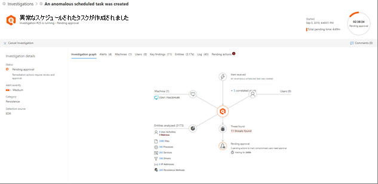

# 自動調査の後に保留中のアクションを承認または拒否する

**適用対象:**
- Microsoft Threat Protection

自動調査が実行されたときに、調査を続行するには承認を必要とする 1 つまたは複数の[修復](https://docs.microsoft.com/microsoft-365/security/mtp/mtp-remediation-actions)アクションが発生する場合があります。 たとえば、一連のメール メッセージを削除する必要がある場合や、検疫されたファイルを削除する必要がある場合があります。 自動調査を続行し適時完了できるよう、保留中のアクションはできるだけ早く承認 (または拒否) することが重要です。 

> [!TIP]
> Microsoft の脅威保護の自動化された調査と応答機能によって何かが失敗したか、誤って検出されたと思われる場合は、お知らせください。 [Microsoft の脅威保護で自動調査と応答 (AIR) 機能の誤検知/ネガを報告する方法を](mtp-autoir-report-false-positives-negatives.md)参照してください。

保留中のアクションは、[アクションセンター](#review-a-pending-action-in-the-action-center)または[調査詳細ビュー](#review-a-pending-action-in-the-investigation-details-view)を使用して確認および承認できます。

> [!NOTE]
> 修復アクションを承認または拒否するには、[適切なアクセス許可](mtp-action-center.md#required-permissions-for-action-center-tasks)が必要です。

## 保留中のアクションをアクション センターで確認する

1. [https://security.microsoft.com](https://security.microsoft.com) にアクセスし、サインインします。 

2. ナビゲーション ウィンドウで、[**アクション センター**] を選択します。 

3. アクション センターの [**Pending (保留中)**] タブで、リスト内のアイテムを選択します。 

    - [**Investigation number (調査番号)**] 列でアイテムを選択すると、[Investigation details (調査の詳細)] ページが開きます。 このページでは、調査の結果を表示し、推奨されるアクションを承認または拒否できます。
 
    - リスト内の行を選択すると、ポップアップが開き、そのアイテムに関する情報が表示されます。   リンクを使用して関連付けられている警告または調査を表示し、アクションを承認または拒否します。

## 保留中のアクションを調査の詳細ビューで確認する

1. [[Investigation details (調査の詳細)](mtp-autoir-results.md)] ページで、[**Pending actions (保留中のアクション)**] (または [**Actions (アクション)**]) タブを選択します。承認待ちのアイテムがそこに表示されます。

2. リスト内のアイテムを選択し、[**Approve (承認)**] または [**Reject (拒否)**] を選択します。

## 次のステップ

- [アクション センターの詳細](mtp-action-center.md)

- [インシデントの詳細](incidents-overview.md)

- [捜索の詳細](advanced-hunting-overview.md)
