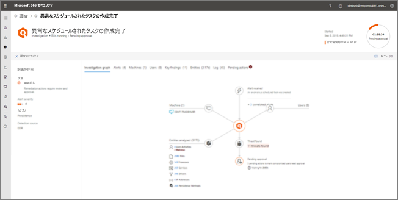
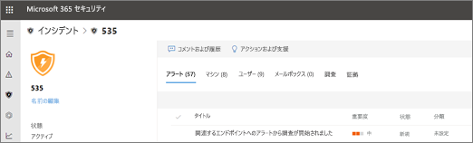

# 自動調査の詳細と結果を表示するView the details and results of an automated investigation

**適用対象:****Applies to:**
- Microsoft Threat ProtectionMicrosoft Threat Protection

[!INCLUDE [Prerelease information](../includes/prerelease.md)]

自動調査が Microsoft Threat Protection で実行された際は、自動調査プロセスの実行中および実行後に調査の詳細を確認できます。When an automated investigation occurs in Microsoft Threat Protection, details about that investigation are available during and after the automated investigation process. [必要なアクセス許可](mtp-action-center.md#required-permissions-for-action-center-tasks)を持っている場合は、調査の詳細ビューでこれらの詳細を表示できます。If you have the [necessary permissions](mtp-action-center.md#required-permissions-for-action-center-tasks), you can view those details in an investigation details view. 調査の詳細ビューでは最新の状態が表示され、保留中のアクションを承認する機能が提供されます。The investigation details view provides you with up-to-date status and the ability to approve any pending actions. 

## 調査の詳細ビューを開くOpen the investigation details view

調査の詳細ビューを開くには、次のいずれかの方法を使用できます。You can open the investigation details view by using one of the following methods:
- [アクション センターでアイテムを選択するSelect an item in the Action center](#select-an-item-in-the-action-center)
- [インシデントの詳細ページから調査を選択するSelect an investigation from an incident details page](#open-an-investigation-from-an-incident-details-page)

### アクション センターでアイテムを選択するSelect an item in the Action center

アクション センターを使用して、承認が保留中のアクション ([**保留中**] タブで) または既に承認されているアクション ([**履歴**] タブで) を表示します。Use the Action center to view actions that are either pending approval (on the **Pending** tab) or were already approved (on the **History** tab). 

1. [https://security.microsoft.com](https://security.microsoft.com) にアクセスし、サインインします。Go to [https://security.microsoft.com](https://security.microsoft.com) and sign in. 

2. ナビゲーション ウィンドウで、[**アクション センター**] を選択します。In the navigation pane, choose **Action center**. 

3. [**保留中**] タブまたは [**履歴**] タブのいずれかでアイテムを選択します。On either the **Pending** or **History** tab, select an item. [必要なアクセス許可](mtp-action-center.md#required-permissions-for-action-center-tasks)を持っている場合は、保留中のアクションを承認 (または拒否) できます。If you have the [necessary permissions](mtp-action-center.md#required-permissions-for-action-center-tasks), you can approve (or reject) pending actions.

### インシデントの詳細ページから調査を開くOpen an investigation from an incident details page

インシデントの詳細ページを使用して、インシデントに関する詳細情報を表示します。これには、影響を受けたデバイス、ユーザー アカウント、またはメールボックスに関する情報がトリガーされた警告が含まれます。Use an incident details page to view detailed information about an incident, including alerts that were triggered information about any affected devices, user accounts, or mailboxes.

1. [https://security.microsoft.com](https://security.microsoft.com) にアクセスし、サインインします。Go to [https://security.microsoft.com](https://security.microsoft.com) and sign in. 

2. ナビゲーション ウィンドウで、[**インシデント**] を選択します。In the navigation pane, choose **Incidents**. 

3. リスト内のアイテムを選択してインシデントの詳細ビューを開きます。Select an item in the list to open the incident details view. 

4. [**調査**] タブで、一覧から調査を選択します。On the **Investigations** tab, select an investigation in the list.

## 調査の詳細Investigation details

調査の詳細ビューを使用して、調査に関連する過去、現在、保留中のアクティビティを表示します。Use the investigation details view to see past, current, and pending activity pertaining to an investigation. 調査の詳細ビューの画像は次のようになります。The investigation details view resembles the following image:

調査の詳細ビューでは、次の表で説明する [**Investigation graph (調査のグラフ)**]、[**Alerts (警告)**]、[**Device (デバイス)**]、[**Identities (ID)**]、[**Key findings (主な検出事項)**]、[**Entities (エンティティ)**]、[**Log (ログ)**]、[**Pending actions (保留中のアクション)**] の各タブに情報が表示されます。In the Investigation details view, you can see information on the **Investigation graph**, **Alerts**, **Devices**, **Identities**, **Key findings**, **Entities**, **Log**, and **Pending actions** tabs, described in the following table.

|タブTab    |説明Description |
|--------|--------|
|Investigation graph (調査グラフ)Investigation graph    |調査を視覚的に表します。Provides a visual representation of the investigation. エンティティと検出された脅威のほか、警告、承認を待っているアクションがあるかどうかが示されます。Depicts entities and lists threats found, along with alerts and whether any actions are awaiting approval. グラフ上のアイテムをクリックすると、詳細が表示されます。You can click an item on the graph to view more details. たとえば、[**Threats found (見つかった脅威)**] アイコンをクリックすると、[**Key findings (主な検出事項)**] タブに移動します。For example, clicking the **Threats found** icon takes you to the **Key findings** tab. |
|Alerts (警告)Alerts |調査に関連する警告を一覧表示します。Lists alerts associated with the investigation. 警告は、ユーザーのコンピューター上または Office アプリ内の脅威対策機能、Cloud App Security、その他の Microsoft 365 Threat Protection 機能により出されます。Alerts can come from threat protection features on a user's machine, in Office apps, Cloud App Security, and other Microsoft 365 Threat Protection features.|
|Devices (デバイス)Devices|調査に含まれるコンピューターと修復レベルを一覧表示します。Lists machines included in the investigation along with remediation level.|
|Key findings (主な検出事項)Key findings   |調査の結果と共に、状態と実行または保留されているアクションを一覧表示します。Lists results from the investigation along with status and actions taken or pending. このタブでは、デバイスおよび ID に対する保留中のアクションを承認できます。You can approve pending actions for devices and identities in on this tab.|
|Entities (エンティティ)Entities   |調査に関連付けられているユーザー アクティビティ、ファイル、プロセス、サービス、ドライバー、IP アドレス、および永続化の方法と共に、状態と実行されたアクションが一覧表示されます。Lists user activities, files, processes, services, drivers, IP addresses, and persistence methods associated with the investigation, along with status and actions taken.|
|Log (ログ)Log    |調査中に実行されたすべてのステップの詳細および状態を表示します。Provides a detailed view of all steps taken during the investigation, along with status.|
|Pending actions (保留中のアクション)Pending actions    |続けるには承認を必要とするアイテムを一覧表示します。Lists items that require approval to proceed.|

## 自動調査後の修復アクションRemediation actions following automated investigation

自動調査が完了すると、関係するすべての証拠について判定が行われ、修復アクションが特定されます。When an automated investigation completes, a verdict is reached for every piece of evidence involved, and remediation actions are identified. 修復アクションが自動的に実行される場合もあれば、修復アクションが承認を待機する場合もあります。In some cases, remediation actions are taken automatically; in other cases, remediation actions await approval. 考えられる判定と結果を次の表に示します。The following table lists possible verdicts and outcomes:

|判定Verdict    |分野Area   |結果Outcomes|
|------|------|------|
|Malicious (悪意のある)Malicious  |デバイス (エンドポイント)Devices (endpoints)    |修復アクションが自動的に実行されますRemediation actions are taken automatically|
|Malicious (悪意のある)Malicious  |メールのコンテンツ (URL または添付ファイル)Email content (URLs or attachments) | 推奨される修復アクションが承認待ちになりますRecommended remediation actions are pending approval|
|Suspicious (不審)Suspicious |デバイスまたはメールのコンテンツDevices or email content |推奨される修復アクションが承認待ちになりますRecommended remediation actions are pending approval|
|Clean (クリーン)Clean  |デバイスまたはメールのコンテンツDevices or email content   |必要な修復アクションはありませんNo remediation actions are needed|

[保留中のアクションをアクション センターで確認するReview a pending action in the Action center](mtp-autoir-actions.md#review-a-pending-action-in-the-action-center)

> [!TIP]
> Microsoft の脅威保護の自動化された調査と応答機能によって何かが失敗したか、誤って検出されたと思われる場合は、お知らせください。If you think something was missed or wrongly detected by automated investigation and response features in Microsoft Threat Protection, let us know! [Microsoft の脅威保護で自動調査と応答 (AIR) 機能の誤検知/ネガを報告する方法を](mtp-autoir-report-false-positives-negatives.md)参照してください。See [How to report false positives/negatives in automated investigation and response (AIR) capabilities in Microsoft Threat Protection](mtp-autoir-report-false-positives-negatives.md).

## 次のステップNext steps

- [アクション センターのアクセス許可の概要を確認するGet an overview of Action center permissions](mtp-action-center.md#required-permissions-for-action-center-tasks)
- [自動調査と応答に関連するアクションを承認または拒否するApprove or reject actions related to automated investigation and response](mtp-autoir-actions.md)

