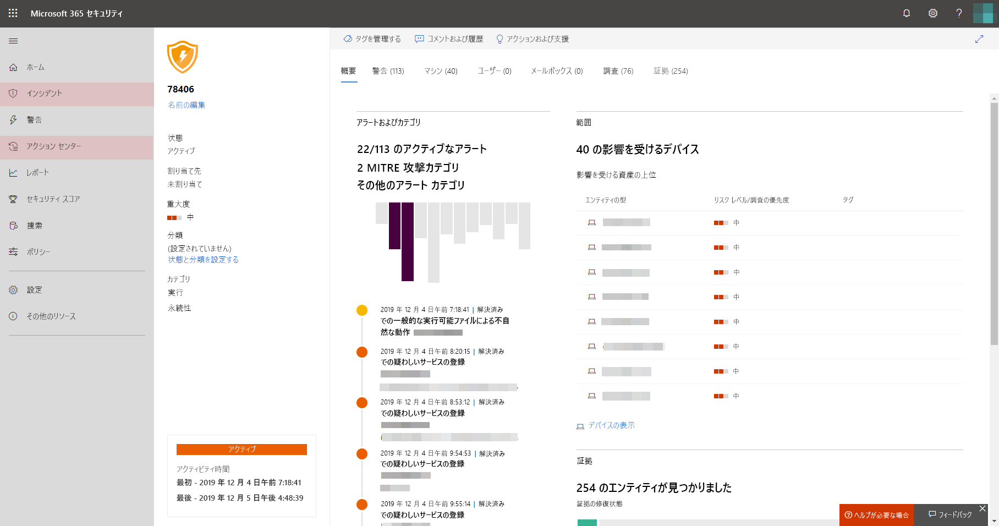

# Microsoft Threat Protection を有効にするTurn on Microsoft Threat Protection

**適用対象:****Applies to:**
- Microsoft Threat ProtectionMicrosoft Threat Protection

[!INCLUDE [Prerelease information](../includes/prerelease.md)]

Microsoft Threat Protection は、Microsoft Defender Advanced Threat Protection (ATP)、Office 365 ATP、Microsoft Cloud App Security、および Azure ATP の主要機能を統合することで、インシデント対応プロセスを統合します。Microsoft Threat Protection unifies your incident response process by integrating key capabilities across Microsoft Defender Advanced Threat Protection (ATP), Office 365 ATP, Microsoft Cloud App Security, and Azure ATP. この統合されたエクスペリエンスにより、Microsoft 365 セキュリティ センターでアクセスできる強力な機能が追加されました。This unified experience adds powerful features you can access in the Microsoft 365 security center.

## ライセンスの利用資格と必要なアクセス許可を確認するCheck license eligibility and required permissions
Microsoft 365 E5、Microsoft 365 E5 セキュリティ、またはそれと同等のライセンスの組み合わせを使用しているお客様は、Microsoft の脅威保護を使用できます。Customers with Microsoft 365 E5, Microsoft 365 E5 Security, or an equivalent combination of licenses can use Microsoft Threat Protection. 詳細については、[ライセンス要件を参照してください](prerequisites.md#licensing-requirements)。For more information, [read the licensing requirements](prerequisites.md#licensing-requirements).

Microsoft の脅威保護を有効にするには、 [Azure Active Directory](https://docs.microsoft.com/azure/active-directory/users-groups-roles/directory-assign-admin-roles#available-roles)の**グローバル管理者**または**セキュリティ管理者**である必要があります。You must be a **global administrator** or a **security administrator** in [Azure Active Directory](https://docs.microsoft.com/azure/active-directory/users-groups-roles/directory-assign-admin-roles#available-roles) to turn on Microsoft Threat Protection.

## サービスの使用を開始するStart using the service
Microsoft の脅威保護は、さまざまな統合サービスからのデータを集約します。Microsoft Threat Protection aggregates data from the various integrated services. データを一元的に処理および保存して、新しい洞察を識別し、集中管理された応答ワークフローを実現できるようにします。It will process and store data centrally to identify new insights and make centralized response workflows possible.

サービスを有効にする前に、Microsoft 365 セキュリティセンター ([security.microsoft.com](https://security.microsoft.com)) では、ナビゲーションウィンドウの [**インシデント**] および [**アクションセンター** ] オプションが表示されません。Before you turn on the service, the Microsoft 365 security center ([security.microsoft.com](https://security.microsoft.com)) doesn't show the **Incidents** and the **Action center** options in the navigation pane.

機能のない microsoft*365 セキュリティセンターと microsoft の脅威保護がオフになっている*
*Microsoft 365 security center with Microsoft Threat Protection turned off*

Microsoft の脅威保護を有効にするには、ナビゲーションウィンドウで [**設定**] を選択します。To turn on Microsoft Threat Protection, select **Settings** in the navigation pane. [\*\*[設定] ページ](https://security.microsoft.com/settings)\*\* で、[ **Microsoft Threat Protection** > **オプトイン/オプトアウト**] に移動します。In the **[Settings page](https://security.microsoft.com/settings)**, go to **Microsoft Threat Protection** > **Opt-in / Opt-out**.

>[!NOTE]
>ナビゲーションウィンドウに**設定**が表示されない場合や、ページにアクセスできなかった場合は、アクセス許可とライセンスを確認してください。If you don't see **Settings** in the navigation pane or couldn't access the page, check your permissions and licenses.

### データセンターの場所を選択するSelect data center location
Microsoft Defender ATP が組織にプロビジョニングされている場合、データは、[Microsoft Defender ATP データ](https://docs.microsoft.com/windows/security/threat-protection/microsoft-defender-atp/data-storage-privacy)用に選択した同じデータ センターの場所に保存および処理されます。If Microsoft Defender ATP has been provisioned for your organization, data will be stored and processed in the same data center location you have selected for [your Microsoft Defender ATP data](https://docs.microsoft.com/windows/security/threat-protection/microsoft-defender-atp/data-storage-privacy). Microsoft Defender ATP がない場合は、Microsoft Threat Protection 専用の新しいデータ センターの場所を選択するよう求められます。If you don't have Microsoft Defender ATP, you will be asked to choose a new data center location specifically for Microsoft Threat Protection. 

サービス間でデータを共有し、集約する前に、同意を得る必要があります。You need to provide consent before data is shared between services and aggregated.

### サービスが有効になっていることを確認するConfirm that the service is on
サービスがプロビジョニングされると、次の機能が追加されます。Once the service is provisioned, it adds:

- [イベント管理Incidents management](incidents-overview.md)
- [自動化された調査と対応](mtp-autoir.md)を管理するアクション センターAn action center for managing [automated investigation and response](mtp-autoir.md)
- 既存の [**捜索**] ページへの[高度な捜索](advanced-hunting-overview.md)機能[Advanced hunting](advanced-hunting-overview.md) capabilities to the existing **Hunting** page

のイメージ microsoft*365 セキュリティセンターとインシデント管理およびその他の microsoft の脅威保護機能*
*Microsoft 365 security center with incidents management and other Microsoft Threat Protection capabilities*

### Azure ATP データを取得するGetting Azure ATP data
Azure ATP データを Microsoft Threat Protection と共有するには、Microsoft Cloud App Security と Azure ATP の統合を有効にします。To share Azure ATP data with Microsoft Threat Protection, ensure that Microsoft Cloud App Security and Azure ATP integration is turned on. [この統合に関する詳細情報Learn more about this integration](https://docs.microsoft.com/cloud-app-security/aatp-integration)

## Microsoft Threat Protection を無効にするTurn off Microsoft Threat Protection
Microsoft Threat Protection を使用しない場合、Microsoft 365 セキュリティ センターの [**設定**]  >  [**Microsoft Threat Protection**]  >  [**オプトイン/オプトアウト**] の順に移動します。To stop using Microsoft Threat Protection, go to **Settings** > **Microsoft Threat Protection** > **Opt-in / Opt-out** in the Microsoft 365 security center. [**Microsoft Threat Protection を有効にする**] の選択を解除し、変更を保存します。Unselect **Turn on Microsoft Threat Protection** and save the changes.

データは完全に削除され、対応する機能は Microsoft 365 セキュリティセンターから削除されます。Data will be permanently deleted and corresponding features will be removed from the Microsoft 365 security center.

## サポートを利用するGet assistance

Microsoft サポートスタッフは、テナントのサービスおよび関連するリソースのプロビジョニングまたはプロビジョニング解除に役立ちます。Microsoft support staff can help provision or deprovision the service and related resources on your tenant. 詳細については、「Microsoft 365 セキュリティセンターで**ヘルプが必要ですか?** 」を参照してください。For assistance, select **Need help?** in the Microsoft 365 security center. サポートに連絡するときは、「Microsoft Threat Protection」をお伝えください。When contacting support, mention Microsoft Threat Protection.

## 関連項目Related topics

- [Microsoft Threat Protection の概要Microsoft Threat Protection overview](microsoft-threat-protection.md)
- [ライセンス要件およびその他の前提条件Licensing requirements and other prerequisites](prerequisites.md)
- [Microsoft Defender ATP の概要Microsoft Defender ATP overview](https://docs.microsoft.com/windows/security/threat-protection/microsoft-defender-atp/microsoft-defender-advanced-threat-protection)
- [Office 365 ATP の概要Office 365 ATP overview](../office-365-security/office-365-atp.md)
- [Microsoft Cloud App Security の概要Microsoft Cloud App Security overview](https://docs.microsoft.com/cloud-app-security/what-is-cloud-app-security)
- [Azure ATP の概要Azure ATP overview](https://docs.microsoft.com/azure-advanced-threat-protection/what-is-atp)
- [Microsoft Defender ATP のデーター ストレージMicrosoft Defender ATP data storage](https://docs.microsoft.com/windows/security/threat-protection/microsoft-defender-atp/data-storage-privacy)
