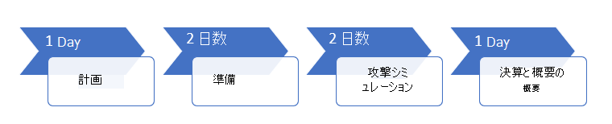

# パイロットを実行する Microsoft 365 Defender プロジェクトRun your pilot Microsoft 365 Defender project 

[!INCLUDE [Microsoft 365 Defender rebranding](../includes/microsoft-defender.md)]

**適用対象:****Applies to:**
- Microsoft 365 DefenderMicrosoft 365 Defender

Microsoft 365 Defender の利点と導入を効果的に決定するために、パイロットプロジェクトを実行できます。To effectively determine the benefit and adoption of Microsoft 365 Defender, you can run a pilot project. 運用環境で Microsoft 365 Defender を有効にし、ユースケースを開始する前に、パイロットプロジェクトに対して実行するタスクを決定し、成功の基準を設定することを計画することをお勧めします。Before enabling Microsoft 365 Defender in your production environment and starting your use cases, it's best to plan to determine the tasks to accomplish for your pilot project and set the success criteria. 

## このパイロットプレイブックの使用方法How to use this pilot playbook

このガイドでは、パイロットプロジェクトをセットアップする方法について、Microsoft 365 Defender の概要と詳細な手順について説明します。This guide provides an overview of Microsoft 365 Defender and step-by-step instructions on how to set up your pilot project. 

Microsoft 365 Defender は、統合された事前違反および適用後のエンタープライズ防衛スイートで、エンドポイント、id、電子メール、およびアプリケーション間の応答をネイティブに調整し、高度な攻撃に対する統合保護を提供します。Microsoft 365 Defender is a unified pre- and post-breach enterprise defense suite that natively coordinates protection, detection, prevention, investigation, and response across endpoints, identities, email, and applications to provide integrated protection against sophisticated attacks. そのためには、次の機能を結合して、単一のセキュリティソリューションにオーケストレーションします。It does so by combining and orchestrating the following capabilities into a single security solution:
  - エンドポイントの microsoft Defender。 Microsoft Defender Advanced Threat Protection (エンドポイント) の新しい名前Microsoft Defender for Endpoint, the new name for Microsoft Defender Advanced Threat Protection (endpoints)
  - Microsoft Defender for Office 365、Office 365 ATP (電子メール) の新しい名前Microsoft Defender for Office 365, the new name for Office 365 ATP (email) 
  - Id の Microsoft Defender。 Azure ATP (identity) の新しい名前Microsoft Defender for Identity, the new name for Azure ATP (identity) 
  - Microsoft Cloud App Security (apps)Microsoft Cloud App Security (apps)

統合された Microsoft 365 Defender ソリューションを使用することにより、セキュリティ担当者は microsoft Defender for Endpoint、microsoft defender for Office 365、Id 用 Microsoft Defender、および Microsoft Cloud App Security receive という脅威について協力することができ、脅威の完全な範囲と影響、その脅威がどのような影響を受けるか、どのように組織をどのようにWith the integrated Microsoft 365 Defender solution, security professionals can stitch together the threat signals that Microsoft Defender for Endpoint, Microsoft Defender for Office 365, Microsoft Defender for Identity, and Microsoft Cloud App Security receive, and determine the full scope and impact of the threat, how it entered the environment, what it's affected, and how it's currently impacting the organization. Microsoft 365 Defender は、攻撃を阻止または停止する、または影響を受けるメールボックス、エンドポイント、ユーザー id を自己回復させるための自動操作を行います。Microsoft 365 Defender takes automatic action to prevent or stop the attack and self-heal affected mailboxes, endpoints, and user identities. 詳細については、 [Microsoft 365 Defender の概要](https://docs.microsoft.com/microsoft-365/security/mtp/microsoft-threat-protection) を参照してください。See the [Microsoft 365 Defender overview](https://docs.microsoft.com/microsoft-365/security/mtp/microsoft-threat-protection) for details.

次のサンプルタイムラインは、環境内に適切なリソースがあるかによって異なります。The following sample timeline varies depending on having the right resources in your environment. 一部の検出とワークフローでは、他のユーザーよりも多くの学習時間が必要になることがあります。Some detections and workflows might need more learning time than the others.

>[!IMPORTANT]
>最適な結果を得るには、パイロットの手順をできるだけ忠実に実行します。For optimum results, follow the pilot instructions as closely as possible.

### パイロットプレイブックのフェーズPilot playbook phases 

Microsoft 365 Defender パイロットの実行には、次の4つのフェーズがあります。There are four phases in running a Microsoft 365 Defender pilot:

|フェーズPhase | 説明Description | 
|:-------|:-----|
|  [計画Planning](mtp-pilot-plan.md)| Microsoft 365 Defender パイロットプロジェクトを実行する前に考慮する必要のある事項について説明します。Learn what you need to consider before running your Microsoft 365 Defender pilot project:   -スコープ- Scope   -ユースケース- Use cases  - 要件- Requirements  -テスト計画- Test plan   -成功の条件- Success criteria   -スコアカード- Scorecard 
|   [準備Preparation](mtp-evaluation.md)|  Microsoft 365 セキュリティセンターにアクセスして、Microsoft 365 Defender パイロット環境を設定します。Access Microsoft 365 Security Center to set up your Microsoft 365 Defender pilot  environment. 次のようなガイドが表示されます。You'll be guided to:  -パイロットの関係者を特定し、承認を求める- Identify stakeholders and seek sign-off for your pilot   -環境に関する考慮事項- Environment considerations  -アクセス- Access  -Azure Active Directory のセットアップ- Azure Active Directory setup   -構成の順序- Configuration order   -Microsoft 365 E5 試用版にサインアップする- Sign up for Microsoft 365 E5 Trial   -ドメインの構成- Configure domain  -Microsoft 365 E5 ライセンスを割り当てる- Assign Microsoft 365 E5 licenses   -ポータルのセットアップウィザードを完了します。- Complete the setup wizard in the portal|
|   [攻撃シミュレーションAttack simulation](mtp-pilot-simulate.md) | 攻撃をシミュレートするために、次のように指導します。To simulate an attack, you'll be guided to:  -テスト環境の要件を確認する- Verify the test environment requirements  -シミュレーションを実行する-  Run the simulation  -インシデントを調査する- Investigate an incident  -インシデントを解決する- resolve the incident 
|   [決算と概要Closing and summary](mtp-pilot-close.md) | プロセスの最後に達すると、次のようになります。When you've reached the end of the process, you'll be guided to:  -最終出力に進む- Go through your final output -利害関係者への出力を提示する- Present your output to your stakeholders  -フィードバックを提供する- Provide feedback  -次の手順を実行します。- Take next steps 

## 次のステップNext step
|  [計画フェーズPlanning phase](mtp-pilot-plan.md) | Microsoft 365 Defender パイロットプロジェクトを計画するPlan your Microsoft 365 Defender pilot project 
|:-------|:-----|
