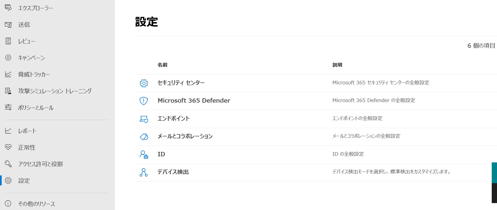

# 統合 Microsoft 365 セキュリティ センターの概要The unified Microsoft 365 security center overview

[!INCLUDE [Microsoft 365 Defender rebranding](../includes/microsoft-defender.md)]

[!INCLUDE [Prerelease](../includes/prerelease.md)]

**適用対象:****Applies to:**

- [Microsoft 365 DefenderMicrosoft 365 Defender](https://go.microsoft.com/fwlink/?linkid=2118804)
- [Microsoft Defender for EndpointMicrosoft Defender for Endpoint](https://go.microsoft.com/fwlink/p/?linkid=2146631)
- [Microsoft Defender for Office 365Microsoft Defender for Office 365](https://go.microsoft.com/fwlink/?linkid=2148715)

> Microsoft 365 Defender を体験したい場合Want to experience Microsoft 365 Defender? ラボ環境 [で評価したり、](https://aka.ms/mtp-trial-lab) パイロット プロジェクトを実 [稼働環境で実行することができます](https://aka.ms/m365d-pilotplaybook)。You can [evaluate it in a lab environment](https://aka.ms/mtp-trial-lab) or [run your pilot project in production](https://aka.ms/m365d-pilotplaybook).

強化された **Microsoft 365** セキュリティ センター ( ) は、中央ポータルの電子メール、 [https://security.microsoft.com](https://security.microsoft.com) *コラボレーション\*\*、ID、* デバイスの脅威に対する保護、検出、調査、応答を組み合わせたものになります。 The improved **Microsoft 365 security center** ([https://security.microsoft.com](https://security.microsoft.com)) combines protection, detection, investigation, and response to *email*, *collaboration*, *identity*, and *device* threats, in a central portal.

Microsoft 365 セキュリティ センターは、Microsoft Defender セキュリティ センターや Office 365 セキュリティ/コンプライアンス センターなど、既存の Microsoft セキュリティ ポータル&しています。Microsoft 365 security center brings together functionality from existing Microsoft security portals, like Microsoft Defender Security Center and the Office 365 Security & Compliance center. セキュリティ センターでは、情報への迅速なアクセス、より簡単なレイアウト、および関連する情報の組み合わせて使いやすくなっています。The security center emphasizes quick access to information, simpler layouts, and bringing related information together for easier use. このセンターには以下が含まれます。This center includes:

- **[Microsoft Defender for Office 365](https://docs.microsoft.com/microsoft-365/security/office-365-security/office-365-atp)** Microsoft Defender for Office 365 は、組織が電子メールを保護し、365 リソースを保護するための一連の予防、検出、調査、捜Officeを支援します。**[Microsoft Defender for Office 365](https://docs.microsoft.com/microsoft-365/security/office-365-security/office-365-atp)** Microsoft Defender for Office 365 helps organizations secure their enterprise with a set of prevention, detection, investigation and hunting features to protect email, and Office 365 resources.
- **[Microsoft Defender for Endpoint は](https://docs.microsoft.com/windows/security/threat-protection/microsoft-defender-atp/microsoft-defender-advanced-threat-protection)** 、組織内のデバイスに対して予防的な保護、侵害後の検出、自動調査、対応を提供します。**[Microsoft Defender for Endpoint](https://docs.microsoft.com/windows/security/threat-protection/microsoft-defender-atp/microsoft-defender-advanced-threat-protection)** delivers preventative protection, post-breach detection, automated investigation, and response for devices in your organization.
- **[Microsoft 365 Defender は、Microsoft 365](microsoft-threat-protection.md)** セキュリティ ポートフォリオを活用してドメイン間の脅威データを自動的に分析し、1 つのダッシュボードで攻撃の画像を作成する Microsoft の *拡張* 検出と対応 (XDR) ソリューションの一部です。**[Microsoft 365 Defender](microsoft-threat-protection.md)** is part of Microsoft’s *Extended Detection and Response* (XDR) solution that leverages the Microsoft 365 security portfolio to automatically analyze threat data across domains, and build a picture of an attack on a single dashboard.

Office 365 Security & コンプライアンス センターまたは Microsoft Defender セキュリティ センターからの変更点に関する情報が必要な場合は、次を参照してください。If you need information about what's changed from the Office 365 Security & Compliance center or the Microsoft Defender Security Center, see:

- [Microsoft 365 Office 365 用 DefenderDefender for Office 365 in the Microsoft 365 security center](microsoft-365-security-center-mdo.md)
- [Microsoft 365 セキュリティ センターのエンドポイント用 DefenderDefender for Endpoint in the Microsoft 365 security center](microsoft-365-security-center-mde.md)

## 期待される問題What to expect

Office 365 セキュリティ/コンプライアンス センター (protection.office.com) と Microsoft Defender セキュリティ センター (securitycenter.microsoft.com) で使用しているすべてのセキュリティ コンテンツは *、Microsoft 365* セキュリティ センターで見つかる可能性があります。All the security content that you use in the Office 365 Security and Compliance Center (protection.office.com) and the Microsoft Defender security center (securitycenter.microsoft.com) can now be found in the *Microsoft 365 security center*.

Microsoft 365 セキュリティ センターは、セキュリティ チームがさまざまなワークロードからのシグナルを単一の統一されたエクスペリエンスに収め、攻撃の調査と対応を行うのに役立ちます。Microsoft 365 security center helps security teams investigate and respond to attacks by brining in signals from different workloads into a single, unified experiences:

- インシデント&アラートIncidents & alerts
- ハンティングHunting
- アクション センターAction Center
- 脅威分析Threat analytics

Microsoft 365 セキュリティ センターでは、microsoft Defender for Office 365 と Microsoft Defender for Endpoint が統合され、統一性、明瞭さ、共通の目標が強調されています。The Microsoft 365 security center emphasizes *unity, clarity, and common goals* as it merges Microsoft Defender for Office 365 and Microsoft Defender for Endpoint. マージは、以下の優先順位に基づいており、各セキュリティ スイートが組み合わせに持ち込んだ機能を犠牲にせずに行いました。The merge was based on the priorities listed below, and made without sacrificing the capabilities that each security suite brought to the combination:

- 共通の構成要素common building blocks
- 一般的な用語common terminology
- 共通エンティティcommon entities
- 他のワークロードとの機能パリティfeature parity with other workloads

## 統合された調査Unified investigations

セキュリティ センターの合理化によって、Microsoft 365 組織全体のインシデントを調査する 1 つのウィンドウが作成されます。Streamlining security centers creates a single pane for investigating any incidents across a Microsoft 365 organization. 主な例 **は、Microsoft** 365 セキュリティ センターのクイック起動の Incidents ノードです。A primary example is the **Incidents** node on the quick launch of the Microsoft 365 security center.

:::image type="content" source="../../media/converged-incidents-2.png.png" alt-text="MDO の [Incidents] ページ。":::

たとえば、重大度が高いインシデント名をダブルクリックすると、収束センターの利点を示すページが表示されます。As an example, double-clicking on an incident name with **High** severity brings you to a page that demonstrates the advantage of converging centers.

> [!TIP]
> [コンバージド **ユーザー]** タブは、問い合わせを始めるのに便利な場所です。The converged **Users** tab is a good place to begin your inquiries. この単一ページでは、統合されたワークロード (Microsoft Defender for Endpoint、Microsoft Defender for Identity、MCAS を活用している場合)、およびオンプレミスの Active Directory、Azure Active Directory、同期済み、ローカル、およびサード パーティのユーザーなど、さまざまなソースからの情報が表示されます。This single page surfaces information for users from converged workloads (Microsoft Defender for Endpoint, Microsoft Defender for Identity, and MCAS, if you leverage it) and a range of sources such as on-premises Active Directory, Azure Active Directory, synced, local, and third-party users. 新しいユーザー [エクスペリエンスについて詳しくは、以下を参照してください](investigate-users.md)。Learn more about [the new Users experience](investigate-users.md).

インシデント情報には、影響を受けるメールボックスの他に、ユーザー/ID 固有のデバイスと危険なデバイスが表示されます。Incident information shows user/identity specifics and at-risk devices, beside affected mailboxes. また、調査情報と **収集された** エビデンスも関連 **付けされます**。It also relates any **Investigation information** and gathered **Evidence**. これにより、管理者とセキュリティ運用チームは、リスクの高い 1 つの警告から影響を受けるユーザーやメールボックスに簡単にピボットできます。This makes it easier for admins and security operation teams to pivot from one high-risk alert to the affected users and mailboxes. このページの上部にある [ **インシデント** ] タブを見て、この 1 つの場所から他の主要なセキュリティ ピボットを使用できます。Looking at the **Incident** tabs at the top of this page, there are other key security pivots available from this single location.

> [!IMPORTANT]
> 特定のインシデントの任意のページの上部に、[概要]、[アラート]、[デバイス **]、[** ユーザー  **]、[** メールボックス **]、[** 調査]、および [エビデンス] タブが **表示** されます。Along the top of any page for a specific Incident, you'll see the **Summary**, **Alerts**, **Devices**, **Users**, **Mailboxes**, **Investigations**, and **Evidence** tabs.

[調査 **] を** 選択すると、分析のグラフィックが表示されたページが開き、修復の状態 (承認待 **ちなど)** が一覧表示されます。Selecting **Investigations** opens  a page that features a graphic of the analysis taking place and lists a status (such as **pending approval**) for remediation. 環境内の特定のインシデントを選択し、これらのタブにドリルダウンして、さまざまな種類の脅威のプロファイルを作成する方法について説明します。Take time to select specific incidents in your environment, drill down into these tabs, and practice building a profile for different kinds of threats. 慣れ親しみは、後で調査を進める上で有益です。Familiarity will benefit any later pressing investigations.

## 改善されたプロセスImproved processes

共通のコントロールとコンテンツは、同じ場所に表示されるか、データの 1 つのフィードに要約され、見つけやすくなります。Common controls and content either appear in the same place, or are condensed into one feed of data making it easier to find. たとえば、統合設定です。For example, unified settings.

### 統合設定Unified settings

### ロール&アクセス許可Permissions & roles

![グループ&デバイス グループのエンドポイントの役割を&を示す [アクセス許可] ページ](../../media/converged-roles-5.png)

 Microsoft 365 セキュリティ センターへのアクセスは、Azure Active Directory グローバル ロールまたはカスタム ロールを使用して構成されます。Access the Microsoft 365 security center is configured with Azure Active Directory global roles or by using custom roles. エンドポイント用 Defender については、「Microsoft Defender セキュリティ センター [へのユーザー アクセスの割り当て」をご覧ください](https://docs.microsoft.com/windows/security/threat-protection/microsoft-defender-atp/assign-portal-access)。For Defender for Endpoint, see [Assign user access to Microsoft Defender Security Center](https://docs.microsoft.com/windows/security/threat-protection/microsoft-defender-atp/assign-portal-access). Defender for Office 365 については [、Microsoft 365](../office-365-security/permissions-microsoft-365-compliance-security.md)コンプライアンス センターと Microsoft 365 セキュリティ センターの「アクセス許可」を参照してください。For Defender for Office 365, see [Permissions in the Microsoft 365 compliance center and Microsoft 365 security center](../office-365-security/permissions-microsoft-365-compliance-security.md).

- [Microsoft 365 Defender へのアクセスを管理する方法の詳細](mtp-permissions.md)Learn more about how to [manage access to Microsoft 365 Defender](mtp-permissions.md)
- Microsoft 365 セキュリティ センター [でカスタム ロール](custom-roles.md) を作成する方法の詳細Learn more about how to [create custom roles](custom-roles.md) in Microsoft 365 security center

### 統合レポートIntegrated reports

レポートは、Microsoft 365 セキュリティ センターでも統合されています。Reports are also unified in the Microsoft 365 security center. 管理者は、一般的なセキュリティ レポートから始め、エンドポイント、電子メール、コラボレーションに関する特定のレポート&できます。Admins can start with a general security report, and branch into specific reports about endpoints, email & collaboration. ここに示すリンクは、ワークロード構成に基づいて動的に生成されます。The links here are dynamically generated based upon workload configuration.

### Microsoft 365 環境をすばやく表示するQuickly view your Microsoft 365 environment

ホーム **ページには** 、セキュリティ チームが必要とする一般的なカードの多くが表示されます。The **Home** page shows many of the common cards that security teams need. カードとデータの構成は、ユーザー ロールによって異なります。The composition of cards and data is dependent on the user role. Microsoft 365 セキュリティ センターでは役割ベースのアクセス制御が使用されるので、さまざまな役割で、毎日のジョブにとってより意味のあるカードが表示されます。Because the Microsoft 365 security center uses role-based access control, different roles will see cards that are more meaningful to their day to day jobs.  

この一目でわかる情報は、組織内の最新のアクティビティを把握するのに役立ちます。This at-a-glance information helps you keep up with the latest activities in your organization. Microsoft 365 セキュリティ センターは、さまざまなソースからのシグナルをまとめ、Microsoft 365 環境の全体像を表示します。The Microsoft 365 security center brings together signals from different sources to present a holistic view of your Microsoft 365 environment.

カードは、次のカテゴリに分類されます。The cards fall into these categories:

- **ID -** 組織内の ID を監視し、疑わしい動作や危険な動作を追跡します。**Identities**- Monitor the identities in your organization and keep track of suspicious or risky behaviors. [ID 保護について詳しくは、次のリンクを参照してください](https://docs.microsoft.com/azure/active-directory/identity-protection/overview-identity-protection)。[Learn more about identity protection](https://docs.microsoft.com/azure/active-directory/identity-protection/overview-identity-protection).
- **データ** - 許可されていないデータの漏えいにつながる可能性があるユーザーアクティビティを追跡するのに役立ちます。**Data** - Help track user activity that could lead to unauthorized data disclosure.
- **デバイス** - デバイス上のアラート、侵害アクティビティ、その他の脅威に関する最新の情報を取得します。**Devices** - Get up-to-date information on alerts, breach activity, and other threats on your devices.
- **アプリ** - クラウド アプリが組織でどのように使用されているのかについての洞察を得る。**Apps** - Gain insight into how cloud apps are being used in your organization. [Cloud App Security で検出されたアプリについて詳しくは、次のリンクを参照してください](https://docs.microsoft.com/cloud-app-security/discovered-apps)。[Learn more about Cloud App Security discovered apps](https://docs.microsoft.com/cloud-app-security/discovered-apps).

## データ範囲が向上した脅威分析Threat analytics with better data coverage
次の Microsoft 365 Defender 脅威分析統合エクスペリエンスを使用して、新たな脅威を追跡して対応します。Track and respond to emerging threats with the following Microsoft 365 Defender threat analytics integrated experience:

- microsoft Defender for Endpoint と Office 365 の Microsoft Defender 間のデータカバレッジが向上し、インシデント管理、自動調査、修復、予防的または事後対応的な脅威検出をドメイン全体で可能にしています。Better data coverage between Microsoft Defender for Endpoint and Microsoft Defender for Office 365, making combined incident management, automatic investigation, remediation, and proactive or reactive threat hunting across-domain possible. 
- Office 365 用の Microsoft Defender からのメール関連の検出と軽減策、および Microsoft Defender for Endpoint から既に利用できるエンドポイント データ。Email-related detections and mitigations from Microsoft Defender for Office 365, in addition to the endpoint data already available from Microsoft Defender for Endpoint.
- Microsoft Defender for Endpoint と Office 365 用 Microsoft Defender を通してアラートをエンドツーエンドの攻撃ストーリーに集約し、作業キューを削減し、調査を簡素化して高速化する脅威関連インシデントのビュー。A view of threat-related incidents which aggregate alerts into end-to-end attack stories across Microsoft Defender for Endpoint and Microsoft Defender for Office 365 to reduce the work queue, as well as simplify and speed up your investigation.
- Microsoft 365 Defender ソリューションによって攻撃の試行が検出およびブロックされました。Attack attempts detected and blocked by Microsoft 365 Defender solutions. また、さらなる露出のリスクを軽減し、回復性を高める予防措置を実行するために使用できるデータがあります。There's also data that you can use to drive preventive actions that mitigate the risk of further exposure and increase resilience. 
- アクション可能な情報をスポットライトに表示する高度な設計により、レポートに緊急に焦点を当て、調査し、活用するデータをすばやく識別できます。Enhanced design that puts actionable information in the spotlight to help you  quickly identify data to urgently focus on, investigate, and leverage from the reports.

## 集中型学習ハブA centralized Learning Hub

Microsoft 365 セキュリティ センターには、Microsoft セキュリティ ブログ、YouTube の Microsoft セキュリティ コミュニティ、docs.microsoft.com の公式ドキュメントなどのリソースからの公式なガイダンスをバブルアップする学習ハブが含まれています。The Microsoft 365 security center includes a learning hub that bubbles up official guidance from resources such as the Microsoft security blog, the Microsoft security community on YouTube, and the official documentation at docs.microsoft.com.

学習ハブ内では、Email & Collaboration (Microsoft Defender for Office 365 または MDO) のガイダンスは、Endpoint (Microsoft Defender for Endpoint または MDE) および Microsoft 365 Defender のラーニング リソースと並べて提供されています。Inside the learning hub, Email & Collaboration (Microsoft Defender for Office 365 or MDO) guidance is side-by-side with Endpoint (Microsoft Defender for Endpoint or MDE), and Microsoft 365 Defender learning resources.

学習ハブが開き、「Microsoft 365 Defender を使用して調査する方法」などのトピックに関するラーニング パスが表示されます。The learning hub opens with Learning paths organized around topics such as “How to Investigate Using Microsoft 365 Defender?” 「Microsoft Defender for Office 365 ベスト プラクティス」を参照してください。and “Microsoft Defender for Office 365 Best Practices”. このセクションは現在、Microsoft 内のセキュリティ製品グループによって管理されています。This section is currently curated by the security Product Group inside Microsoft. 各ラーニング パスには、概念を理解するために要する時間が反映されます。Each Learning path reflects a projected time it takes to get through the concepts. たとえば、「Office 365 ユーザー アカウント用の Microsoft Defender が侵害された場合に実行する手順」は、8 分かかると投影され、オンザフライで有益な学習を行います。For example 'Steps to take when a Microsoft Defender for Office 365 user account is compromised' is projected to take 8 minutes, and is valuable learning on the fly.

コンテンツをクリックすると、このサイトをブックマークし、ブックマークを 'Security' フォルダーまたは 'Critical' フォルダーに整理すると便利な場合があります。After clicking through to the content, it may be useful to bookmark this site and organize bookmarks into a 'Security' or 'Critical' folder. すべてのラーニング パスを表示するには、メイン パネルの [すべてのパスを表示] リンクをクリックします。To see all Learning paths, click the Show all link in the main panel.

> [!NOTE]
> Microsoft 365 セキュリティ センターラーニング ハブの上部には、製品 (現在は Microsoft 365 Defender、エンドポイント用 Microsoft Defender、および Office 365 用の Microsoft Defender) を選択できる便利なフィルターがあります。 There are helpful **filters** along the top of the Microsoft 365 security center learning hub that will let you choose between products (currently Microsoft 365 Defender, Microsoft Defender for Endpoint, and Microsoft Defender for Office 365). 各セクションの学習リソースの数が一覧表示されています。これは、トレーニングと学習のために、学習者が用意しているリソースの数を追跡するのに役立ちます。Notice that the number of learning resources for each section is listed, which can help learners keep track of how many resources they have at hand for training and learning.
>
> 製品フィルターと共に、現在のトピック、リソースの種類 (ビデオからウェビナーまで)、セキュリティ領域に関する経験や経験のレベル、セキュリティ ロール、製品機能を示します。Along with the Product filter, current topics, types of resources (from videos to webinars), levels of familiarity or experience with security areas, security roles, and product features are listed.

## フィードバックをお送りくださいSend us your feedback

フィードバックが必要です。We need your feedback. We're always looking to improve, so if there's there's like to see, [send us your Microsoft 365 Defender feedback](https://www.microsoft.com/videoplayer/embed/RE4K5Ci).We're always looking to improve, so if there's something you'd like to see, [send us your Microsoft 365 Defender feedback](https://www.microsoft.com/videoplayer/embed/RE4K5Ci).

また、この記事のフィードバックを送信できます。You can also leave feedback from this article. In the 'Feedback' section at the end under 'Submit and view feedback', the options are *This product*, or *This page*.In the 'Feedback' section at the end under 'Submit and view feedback for', the options are *This product*, or *This page*.

製品のフィードバック **には、この製品** ボタン *を使用* します。Use the **This product** button for *product* feedback:

1. 記事 *の下部にある* [この製品] を選択します。Select *This product* at the bottom of the article.
    1. これらの指示を読み続ける場合は、ボタンを右クリックし、[新しいタブで開く] をクリックします。Right-click the button and 'Open in a new tab' if you want to keep reading these directions.
2. UserVoice フォーラム **に移動します**。This will navigate to the **UserVoice forum**.
3. 次の 2 つのオプションがあります。You have 2 options:
    1. テキスト ボックスまで下にスクロールして、コンプライアンスを改善したり *、Office 365* でユーザーを保護したりするには *、Microsoft 365* セキュリティ センターに貼り付けます。Scroll down to the text box *How can we improve compliance or protect your users better in Office 365?* and paste in *Microsoft 365 security center*. You can search the results for an idea like yours and up-vote it, or use the button for **Post a new idea**.You can search the results for an idea like yours and up-vote it, or use the button for **Post a new idea**.
    1. この問題が既に報告され、投票 (または投票) でプロファイルを上げる場合は、UserVoiceの右側にある [フィードバックの送信] ボックスを使用します。If you feel certain this issue is already reported, and want to raise its profile with a vote (or votes), use the *Give Feedback* box on the right side of UserVoice. Microsoft *365 セキュリティ* センターを検索し、問題を見つけて、投票ボタンを使用して状態を上げてください。Search for *Microsoft 365 security center*, **find the issue, and use the vote button** to raise its status.

この *ページは、* 記事自体に関するフィードバックに使用します。Use *This page* for feedback on the article itself. フィードバックをお寄せいただきありがとうございます。Thanks for your feedback. お客様の声は、製品の改善に役立ちます。Your voice helps us improve products.

### セキュリティ センターが提供する機能を確認するExplore what the security center has to offer

Microsoft 365 セキュリティ センターの機能を常に確認してください。Keep exploring the features and capabilities in the Microsoft 365 security center:

- [インシデントとアラートを管理するManage incidents and alerts](manage-incidents.md)
- [脅威分析による新たな脅威の追跡と対応Track and respond to emerging threats with threat analytics](threat-analytics.md)
- [アクション センターThe Action center](https://docs.microsoft.com/microsoft-365/security/mtp/mtp-action-center)
- [デバイス、メール、アプリ、ID 間で脅威を検出するHunt for threats across devices, emails, apps, and identities](https://docs.microsoft.com/microsoft-365/security/mtp/advanced-hunting-query-emails-devices)
- [カスタム検出ルールCustom detection rules](https://docs.microsoft.com/microsoft-365/security/mtp/custom-detection-rules)
- [電子メール&コラボレーションアラートEmail & collaboration alerts](https://docs.microsoft.com/microsoft-365/compliance/alert-policies#default-alert-policies)
- [フィッシング攻撃シミュレーションを作成し、](https://docs.microsoft.com/microsoft-365/security/office-365-security/attack-simulation-training)[チームをトレーニングするペイロードを作成する](https://docs.microsoft.com/microsoft-365/security/office-365-security/attack-simulation-training-payloads)[Create a phishing attack simulation](https://docs.microsoft.com/microsoft-365/security/office-365-security/attack-simulation-training) and [create a payload for training your teams](https://docs.microsoft.com/microsoft-365/security/office-365-security/attack-simulation-training-payloads)
 
### 関連情報Related information
- [Microsoft 365 セキュリティ センターMicrosoft 365 security center](overview-security-center.md)
- [Microsoft 365 Office 365 用 Microsoft DefenderMicrosoft Defender for Office 365 in the Microsoft 365 security center](microsoft-365-security-center-mdo.md)
- [Microsoft 365 セキュリティ センターの Microsoft Defender for EndpointMicrosoft Defender for Endpoint in the Microsoft 365 security center](microsoft-365-security-center-mde.md)
- [エンドポイント用 Microsoft Defender から Microsoft 365 セキュリティ センターへのアカウントのリダイレクトRedirecting accounts from Microsoft Defender for Endpoint to the Microsoft 365 security center](microsoft-365-security-mde-redirection.md)
