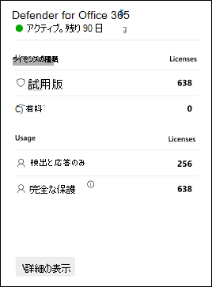

# Microsoft Defender for Office 365試用版

> [!IMPORTANT]
> 簡単に使用できる Microsoft Defender を使用して、プレイブック[Office 365開始します](https://download.microsoft.com/download/8/8/8/888e96ce-eb6a-487a-babc-a7e4ae1cd151/MDO%20Trial%20Playbook.pdf)。 このプレイブックは、Microsoft Defender を使用して組織を保護する方法を示して、無料試用版をOffice 365。

Microsoft Defender for Office 365、電子メール メッセージ、リンク (URL)、およびコラボレーション ツールによって組織が悪意のある脅威から保護します。 Defender for Office 365 には次のものが含まれます。

- **脅威保護ポリシー**: 脅威保護ポリシーを定義して、組織に適切なレベルの保護を設定します。
- **レポート**: 組織における Defender for Office 365 のパフォーマンスを監視するリアルタイム レポートを表示します。
- **脅威の調査および反応機能**: 最先端のツールを使用して、脅威を調査、把握、シミュレーション、および回避を行います。
- **自動調査および対応機能**: 脅威の調査と軽減にかかる時間と労力を節約します。

Microsoft Defender for Office 365 試用版は、数回クリックした後、Office 365 プラン 2 の Defender の機能を無料で試す簡単な方法です。 これらの高レベル機能については、次の表で説明します。

 

****

|機能|説明|
|---|---|
|[フィッシング対策ポリシーの排他的設定](set-up-anti-phishing-policies.md#exclusive-settings-in-anti-phishing-policies-in-microsoft-defender-for-office-365)|ユーザー偽装保護、ドメイン偽装保護、メールボックス インテリジェンス、高度なフィッシングしきい値を取得します。|
|[添付ファイル保護](safe-attachments.md)|制御されたデトレーション環境で電子メールの添付ファイルや他のファイルを検査して、新しいマルウェアや回避的なマルウェアをキャッチします。|
|[リンク保護](safe-links.md)|クリック時のチェックを実行して、初期検査に合格した可能性がある URL が武器化されていないか確認します。|
|[脅威トラッカー](threat-trackers.md)\*|有益なウィジェットとビューを使用して、組織に影響を与える可能性のあるサイバーセキュリティの問題を特定します。|
|[脅威エクスプローラー](threat-explorer.md)\*|メール内の脅威に関するほぼリアルタイムの情報をOffice 365します。|
|[自動調査と対応 (AIR)](office-365-air.md)\*|アラートがトリガーされると、脅威オブジェクトを自動的に見つけて修復します。|
|[攻撃シミュレーションのトレーニング](attack-simulation-training.md)\*|フィッシング攻撃を識別し、適切に対応するためにユーザーをトレーニングします。|
|[キャンペーン ビュー](campaigns.md)\*|大規模な悪意のある電子メール アクティビティを調査して対応します。|
|[Defender を使用したレポートOffice 365機能](view-reports-for-mdo.md)|脅威保護の状態、URL の脅威保護、メールの待機時間などのレポートを表示します。|
|[優先度アカウントの保護](/microsoft-365/admin/setup/priority-accounts)\*|優先度アカウントとして識別するユーザーは、アラート、レポート、調査にタグ付けされ、目立つ。フィルターで Priority タグを使用することもできます。|
|

\*この機能は、プラン 2 の Defender Office 365専用です。

## 試用版用に Defender をOffice 365する

試用版を使用すると、組織は簡単に Defender を設定し、その機能をOffice 365できます。 セットアップ中に、Office 365 用の Defender 専用のポリシー (特に、セーフ 電子メール メッセージの添付ファイル[、セーフ](safe-links.md)電子メール メッセージと Microsoft Teams のリンク、およびスパム対策ポリシーの偽装[保護)](set-up-anti-phishing-policies.md#impersonation-settings-in-anti-phishing-policies-in-microsoft-defender-for-office-365)は、事前設定されたセキュリティ ポリシー用の標準テンプレートを使用して適用されます。 

既定では、これらのポリシーは組織内のすべてのユーザーを対象としますが、試用版のセットアップ中またはセットアップ後に、ポリシーの割り当てを特定のユーザーに変更できます。

他のワークロードも保護に使用できます セーフ (たとえば、SharePoint、OneDrive、Microsoft Teams、Microsoft Teams および[セーフ](mdo-for-spo-odb-and-teams.md)Office 365 アプリの添付[ファイル](safe-links.md#safe-links-settings-for-office-365-apps)など)。

試用版のセットアップ中に、Office 365 プラン 2 の Defender 専用の応答機能[(AIR](office-365-air.md)や脅威[エクスプローラーなど)](threat-explorer.md)も組織全体に対して設定されます。 ポリシースコープは必要ありません。

## ライセンス

試用版のセットアップの一環として、ライセンスOffice 365 Defender が組織に自動的に適用されます。 ライセンスは、最初の 30 日間無料です。

試用版のライセンス カードには、次の情報が表示されます。

- **[使用法の種類** ] セクション:
  - **試用版**: 使用できるライセンスOffice 365の試用版 Defender の数。

    > [!NOTE]
    > 他の場所では、利用可能な試用版ライセンスの数に 300 という値が表示される場合があります。 この値は正しくありません (組織のユーザー数が 300 人の場合を超える場合を含む)。 利用可能な試用版ライセンスの数は、任意の値 300 ではなく、組織のサイズに対応します。

  - **有料**: ライセンスの有料 Defender の数 (Office 365場合)。

- **[利用状況**] セクション: ポリシーの対象となるユーザーの数Office 365です。
  - **検出&応答のみ**: 次のシナリオに含まれるユーザーの総数。
    - 試用版では、ポリシーの範囲を特定のユーザーに設定しました。
    - 特定のユーザーを対象にしたカスタム の警察があります。
  - **完全な** 保護: プラン 2 の機能 (AIR、Threat Explorer、攻撃シミュレーション トレーニングなど) Office 365 Defender によって保護されているユーザーの総数。

## アクセス許可

試用版を開始または終了するには、グローバル管理者またはセキュリティ管理者の役割のメンバーである必要Azure Active Directory。 詳細については、「[管理者ロールについて](../../admin/add-users/about-admin-roles.md)」を参照してください。

## その他の情報

試用版を開始した後、変更と更新プログラムが利用可能になるには、最大 2 時間かかる場合があります。 また、管理者はログアウトしてログインし、変更を確認する必要があります。

## 可用性

Office 365 試用版の Defender は、特定の条件を満たす既存の顧客と、Office 365 プラン 2 ライセンス (サブスクリプションまたはアドオンに含まれる) の既存の Defender を持つユーザーに徐々に展開されています。

## 使用条件

詳細については[、「Microsoft Defender for Office 365試用版&を参照してください](defender-for-office-365-trial-terms-and-conditions.md)。

## よく寄せられる質問

### Q: 試用版を拡張する方法

A: 「試 [用期間を延長する」を参照してください](/microsoft-365/commerce/try-or-buy-microsoft-365#extend-your-trial)。

### Q: 試用版の有効期限が切れた後、自分のデータは何が起こりますか?

A: 試用版の有効期限が切れると、30 日間、試用版データ (以前はなかった Office 365 の Defender の機能からのデータ) にアクセスできます。 この 30 日間の期間を過ごした後、すべてのポリシーとデータが、試用版の Defender に関連付Office 365削除されます。

### Q: 組織内で Defender を試用Office 365何回使用できますか?

A: 最大 2 回。 最初の試用版の有効期限が切れた場合は、有効期限の 30 日以上経過してから、Defender に再び試用版をOffice 365する必要があります。

## Defender for Office 365

Defender for Office 365機能の包括的なスレートを提供することで、組織が企業をセキュリティで保護するのに役立ちます。

Defender for Office 365については、この対話型ガイドを[参照してください](https://aka.ms/MS365D.InteractiveGuide)。

### 予防

堅牢なフィルター スタックにより、ビジネス メールの侵害、資格情報フィッシング、ランサムウェア、高度なマルウェアなど、さまざまなボリューム ベースの標的型攻撃を防止できます。

- [フィッシング対策ポリシー: Defender for Office 365](set-up-anti-phishing-policies.md#exclusive-settings-in-anti-phishing-policies-in-microsoft-defender-for-office-365)
- [添付ファイル保護](safe-attachments.md)
- [リンク保護](safe-links.md)

### 検出

業界をリードする AI は、悪意のあるコンテンツや疑わしいコンテンツを検出し、攻撃パターンを関連付け、保護を回避するために設計されたキャンペーンを特定します。

- [Microsoft Defender のキャンペーン ビュー (Office 365](campaigns.md)

### 調査と狩猟

強力なエクスペリエンスは、脅威の特定、優先順位付け、および調査に役立ち、高度な狩猟機能を使用して、攻撃を追跡Office 365。

- [脅威エクスプローラーとリアルタイム検出](threat-explorer.md)
- [Defender for Office 365](view-reports-for-mdo.md)
- [脅威トラッカー - 新機能とNoteworthy 機能 ](threat-trackers.md)
- [Microsoft 365 Defender](../defender/microsoft-365-defender.md) との統合

### 応答と修復

広範なインシデント対応と自動化機能により、セキュリティ チームの有効性と効率が向上します。

- [Microsoft Defender の自動調査と応答 (AIR) Office 365](office-365-air.md)

### 認識とトレーニング

豊富なシミュレーションとトレーニング機能と、クライアント アプリケーション内の統合されたエクスペリエンスにより、ユーザーの認識が構築されます。

- [攻撃シミュレーション トレーニングの使用を開始する](attack-simulation-training-get-started.md)

### セキュリティの姿勢

推奨されるテンプレートと構成に関する分析情報は、お客様が安全にアクセスし、安全を確保するのに役立ちます。

- [EOP と Microsoft Defender でセキュリティ ポリシーを事前に設定Office 365](preset-security-policies.md)
- [EOP および Microsoft Defender の保護](configuration-analyzer-for-security-policies.md)ポリシー用の構成Office 365。

## フィードバックを送信

フィードバックは、高度な攻撃から環境を保護する上で役立ちます。 製品機能と試用結果のエクスペリエンスとインプレッションを共有します。
