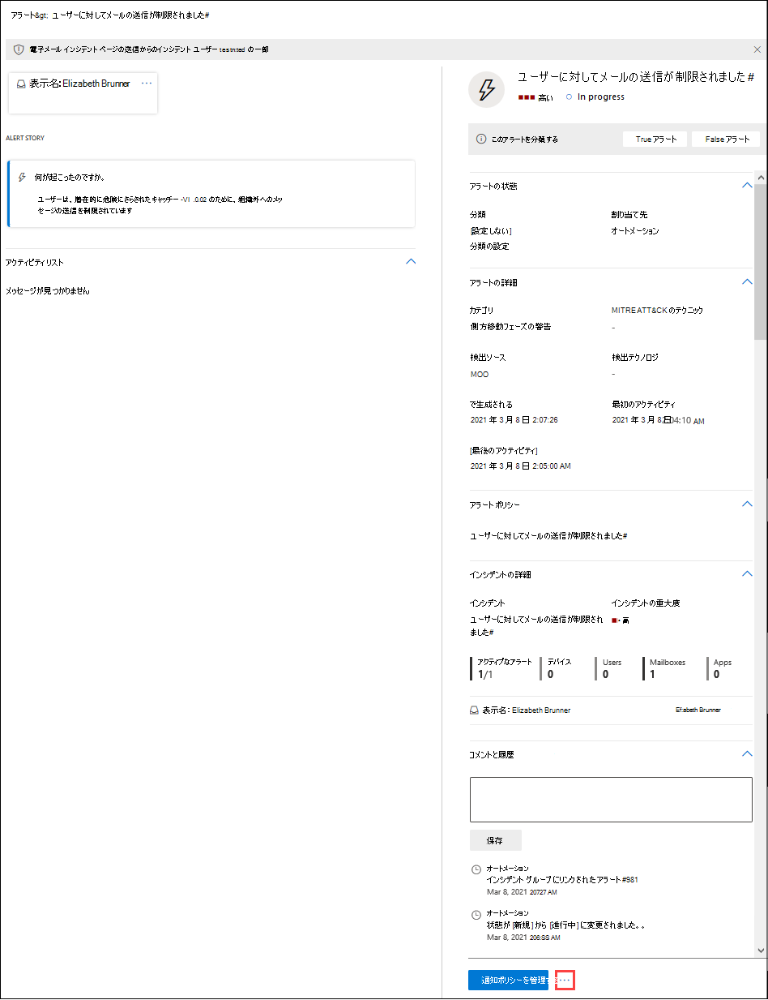

# 調査と対応を自動化して、侵害されたユーザー アカウントに対処する

**適用対象**
- [Exchange Online Protection](exchange-online-protection-overview.md)
- [Microsoft Defender for Office 365 プラン 1 およびプラン 2](defender-for-office-365.md)
- [Microsoft 365 Defender](../defender/microsoft-365-defender.md)

[Microsoft Defender for Office 365プラン 2 には](defender-for-office-365.md#microsoft-defender-for-office-365-plan-1-and-plan-2)、強力な自動調査と応答[(AIR)](office-365-air.md)機能が含まれています。 このような機能により、セキュリティ運用チームが脅威に対処するために多くの時間と労力を節約できます。 Microsoft は引き続きセキュリティ機能を強化しています。 最近、AIR の機能が強化され、セキュリティが侵害されたユーザー セキュリティ プレイブック (現在プレビュー中) が含まれます。 侵害されたユーザー セキュリティ プレイブックの詳細については、この記事を参照してください。 また、詳細については、[ブログの投稿「Microsoft Defender](https://techcommunity.microsoft.com/t5/Security-Privacy-and-Compliance/Speed-up-time-to-detect-and-respond-to-user-compromise-and-limit/ba-p/977053)を使用してユーザーの侵害を検出して対応する時間をOffice 365を参照してください。

侵害されたユーザー セキュリティ プレイブックを使用すると、組織のセキュリティ チームは次の操作を実行できます。

- 侵害されたユーザー アカウントの検出を高速化します。
- アカウントが侵害された場合に侵害の範囲を制限する。そして
- 侵害されたユーザーに対して、より効果的かつ効率的に対応します。

## 侵害されたユーザー通知

ユーザー アカウントが侵害された場合、異常または異常な動作が発生します。 たとえば、フィッシングメッセージとスパム メッセージは、信頼できるユーザー アカウントから内部的に送信される場合があります。 Defender for Office 365は、メール パターンやグループ内での共同作業のアクティビティでこのような異常をOffice 365。 この場合、アラートがトリガーされ、脅威の軽減プロセスが開始されます。

たとえば、疑わしいメール送信のためにトリガーされたアラートを次に示します。

次に、ユーザーの送信制限に達した際にトリガーされたアラートの例を示します。

## 侵害されたユーザーを調査して対応する

ユーザー アカウントが侵害されると、アラートがトリガーされます。 場合によっては、組織のセキュリティ運用チームによって問題が解決されるまで、そのユーザー アカウントがブロックされ、それ以上の電子メール メッセージの送信がブロックされ、防止されます。 それ以外の場合は、自動調査が開始され、セキュリティ チームが推奨するアクションが実行される可能性があります。

- [制限付きユーザーの表示と調査](#view-and-investigate-restricted-users)

- [自動調査の詳細を表示する](#view-details-about-automated-investigations)

> [!IMPORTANT]
> 次のタスクを実行するには、適切なアクセス許可が必要です。 「AIR [機能を使用するために必要なアクセス許可」を参照してください](office-365-air.md#required-permissions-to-use-air-capabilities)。

### 制限付きユーザーの表示と調査

制限付きユーザーの一覧に移動するためのいくつかのオプションがあります。 たとえば、ポータルの [Microsoft 365 Defender] に移動して、グループ&**ユーザー** \> **の確認** \> **を行います**。 次の手順では、アラート ダッシュボードを使用したナビゲーションについて説明します。これは、トリガーされた可能性があるさまざまな種類のアラートを確認するための良い方法です。

1. [インシデント] Microsoft 365 Defender ( <https://security.microsoft.com> ) を開き、[インシデント] **&アラートに移動** \> **します**。 または、[アラート] ページに直接移動するには、 **を** 使用します <https://security.microsoft.com/alerts> 。

2. [アラート **] ページ** で、期間別に結果をフィルター処理し、[ユーザーが電子メールの送信を制限する] という名前 **のポリシーをフィルター処理します**。

   ![制限付きユーザーに対してフィルター処理Microsoft 365 Defenderポータルの [アラート] ページ](../../media/m365-sc-alerts-page-with-restricted-user.png)

3. 名前をクリックしてエントリを選択すると、メールの送信を制限されたユーザー ページが開き、詳細を確認できます。 [警告の管理 **]** ボタンの横にある [その他のオプション] アイコンをクリックし、[制限付きユーザーの詳細の表示] を選択して [制限付きユーザー] ページに移動し、制限付きユーザーを解放  [できます](removing-user-from-restricted-users-portal-after-spam.md)。  

   

### 自動調査の詳細を表示する

自動調査が開始すると、その詳細と結果をセキュリティ コンプライアンス センター&確認できます。 [脅威管理 **の** \> **調査] に** 移動し、調査を選択して詳細を表示します。

詳細については、「調査の詳細 [を表示する」を参照してください](air-view-investigation-results.md)。

## 以下の点にご注意ください。

- **アラートの上に滞在します**。 ご存知のように、妥協点が検出されなくなるほど、組織、顧客、パートナーに対する広範な影響とコストの可能性が大きくなります。 脅威を軽減するために、特にユーザーのアカウントが侵害された場合は、早期の検出と適切な対応が重要です。

- **オートメーションは、セキュリティ運用チームを支援しますが、置き換えは行ないます**。 調査と対応の自動化機能は、侵害されたユーザーを早期に検出できますが、セキュリティ運用チームは調査と修復を行う必要があります。 これにはいくつかのヘルプが必要ですか? 「アクション [の確認と承認」を参照してください](air-review-approve-pending-completed-actions.md)。

- **疑わしいログインアラートを唯一のインジケーターとして使用しない**。 ユーザー アカウントが侵害されると、疑わしいログイン 通知がトリガーされる場合と、トリガーされない場合があります。 アカウントが侵害された後に発生する一連のアクティビティがアラートをトリガーする場合があります。 アラートについて詳しくは、お知りください。 「 [アラート ポリシー」を参照してください](../../compliance/alert-policies.md)。

## 次の手順

- [AIR 機能を使用するために必要なアクセス許可を確認する](office-365-air.md#required-permissions-to-use-air-capabilities)

- [悪意のあるメールを検索して調査Office 365](investigate-malicious-email-that-was-delivered.md)

- [エンドポイント向け Microsoft Defender の AIR について説明します。](/windows/security/threat-protection/microsoft-defender-atp/automated-investigations)

- [Microsoft 365 ロードマップにアクセスして、近日公開予定の機能を確認する](https://www.microsoft.com/microsoft-365/roadmap?filters=)