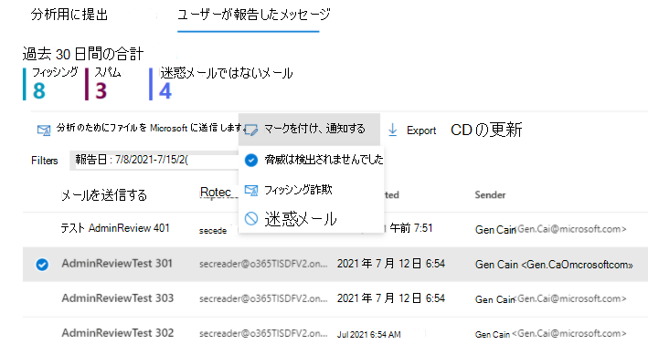
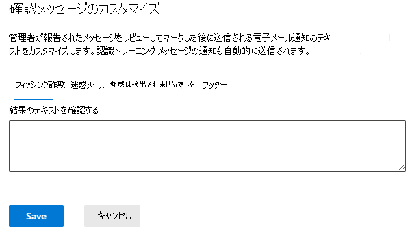

# 報告されたメッセージの管理者によるレビュー

[!INCLUDE [Microsoft 365 Defender rebranding](../includes/microsoft-defender-for-office.md)]

> [!NOTE]
> この記事の情報は、商用リリース前に大幅に変更される可能性があるプレビュー製品に関連しています。 このドキュメントは、評価と探索の目的でのみ提供されています。

**適用対象**
- [Microsoft Defender for Office 365 プラン 1 およびプラン 2](defender-for-office-365.md)
- [Microsoft 365 Defender](../defender/microsoft-365-defender.md)

Microsoft 365メールボックスExchange Online Microsoft Defender for Office 365 の組織では、管理者は報告されたメッセージを確認した後、テンプレートメッセージをエンド ユーザーに送り返す機能を備えました。 テンプレートは、組織に合わせてカスタマイズし、管理者の評決にも基づいてカスタマイズできます。

この機能は、ユーザーにフィードバックを提供するように設計されているが、システム内のメッセージの評決を変更しません。 Microsoft がフィルターを更新して改善するには、管理者申請を使用して分析用のメッセージを送信 [する必要があります](admin-submission.md)。

メッセージが誤検知または偽陰性として報告された場合にのみ、ユーザーにレビュー結果をマークして [通知できます](report-false-positives-and-false-negatives.md)。

## はじめに把握しておくべき情報

- <https://security.microsoft.com/> で Microsoft 365 Defender ポータルを開きます。 [申請] ページに直接 **移動するには** 、 を使用します <https://security.microsoft.com/reportsubmission> 。

- ユーザー申請の構成を変更するには、次のいずれかの役割グループのメンバーである必要があります。
  - [組織の管理] または [セキュリティ管理者][をMicrosoft 365 Defenderします](permissions-microsoft-365-security-center.md)。
  - [組織の管理] [Exchange Online](/Exchange/permissions-exo/permissions-exo#role-groups)。

- また、PowerShell へのアクセスExchange Online必要があります。 使用しようとしているアカウントが Exchange Online PowerShell にアクセスできない場合は、「ドメインに電子メール アドレスを指定する」というエラーが *表示されます*。 PowerShell へのアクセスを有効または無効にする方法のExchange Online、次のトピックを参照してください。
  - [Exchange Online PowerShell へのアクセスを有効または無効にする](/powershell/exchange/disable-access-to-exchange-online-powershell)
  - [クライアント アクセス ルール (Exchange Online](/exchange/clients-and-mobile-in-exchange-online/client-access-rules/client-access-rules)

## ポータル内からユーザーに通知する

1. このポータルMicrosoft 365 Defender、[提出] ページに直接 **移動** します。 https://security.microsoft.com/reportsubmission}(https://security.microsoft.com/reportsubmission)

2. [ **報告されたメッセージのユーザー**] をクリックし、マークして通知するメッセージを選択します。

3. [マークを **付け、通知** する] ドロップダウンを選択し、[脅威が見 **つかりません]、[** フィッシング]、または [ **迷惑メール]** を **選択します**。

   > [!div class="mx-imgBorder"]
   > 

報告されたメッセージは誤検知または偽陰性としてマークされ、メッセージを報告したユーザーに通知するメールがポータル内から自動的に送信されます。

## ユーザーへの通知に使用するメッセージをカスタマイズする

1. このポータルMicrosoft 365 Defender、[その他] セクションの [メール &グループ &ルールの脅威ポリシー] [ユーザーが報告したメッセージ設定] \>  \>  \> **に移動** します。

2. [ユーザー申請] ページで、送信者の表示名を指定する場合は、[管理者レビュー結果の電子メール通知] セクションの [送信者として使用する **Office 365** 電子メール アドレスを指定する] チェック ボックスをオンにし、使用する名前を入力します。 メッセージに表示される電子メール Outlook、すべての返信がそこに送信されます。

3. テンプレートをカスタマイズする場合は、ページの下部にある **[メール** 通知のカスタマイズ] をクリックします。 開くフライアウトでは、次の情報のみをカスタマイズできます。

    - フィッシング詐欺
    - 迷惑メール
    - 脅威は検出されませんでした
    - フッター

    > [!div class="mx-imgBorder"]
    > 

4. 完了したら、**[保存]** をクリックします。 これらの値をクリアするには、[ユーザー申請] **ページ** で [破棄] をクリックします。
