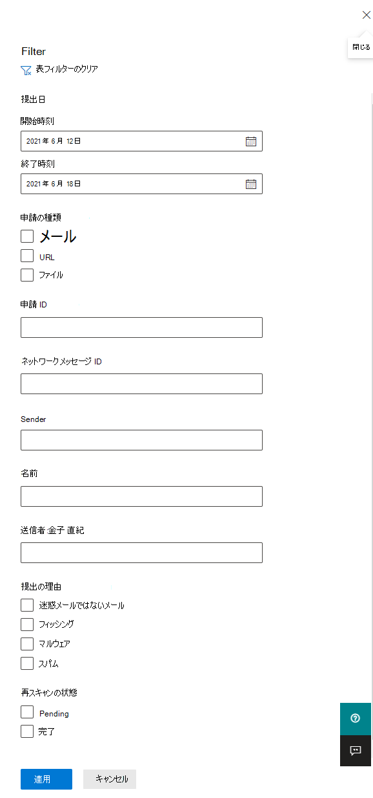
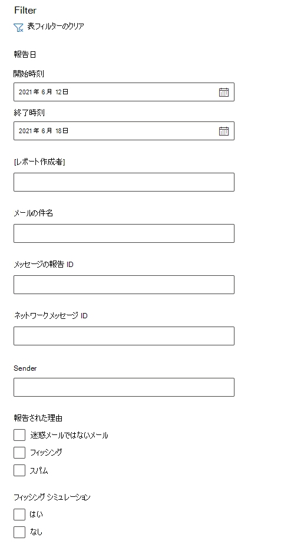

# 申請ポータルを使用して、疑わしいスパム、フィッシング、URL、ファイルを Microsoft に提出する

[!INCLUDE [Microsoft 365 Defender rebranding](../includes/microsoft-defender-for-office.md)]

**適用対象**
- [Exchange Online Protection](exchange-online-protection-overview.md)
- [Microsoft Defender for Office 365 プラン 1 およびプラン 2](defender-for-office-365.md)

Exchange Online メールボックスを持つ組織では、管理者は Microsoft 365 Defender ポータルの Submits ポータルを使用して、電子メール メッセージ、URL、添付ファイルを Microsoft に送信してスキャンできます。 Microsoft 365

分析用に電子メール メッセージを送信すると、次の情報が表示されます。

- **電子メール認証チェック**: 電子メール認証が配信された際に合格または失敗したかどうかの詳細。
- **ポリシーヒット**: テナントへの受信メールを許可またはブロックした可能性があるポリシーに関する情報で、サービス フィルターの評決を上書きします。
- **ペイロード評価/発起**: メッセージ内の URL と添付ファイルの最新の検査。
- **Grader 分析**: メッセージが悪意のあるかどうかを確認するために、人間の採点者が行うレビュー。

> [!IMPORTANT]
> ペイロード評価/デトナレーションおよび採点者分析は、すべてのテナントで行われるという問題ではありません。 データがコンプライアンスの目的でテナント境界から離れるはずではない場合、情報は組織外に出るのをブロックされます。

電子メール メッセージ、URL、添付ファイルを Microsoft に送信するその他の方法については、「メッセージとファイルを Microsoft に報告する」 [を参照してください](report-junk-email-messages-to-microsoft.md)。

## はじめに把握しておくべき情報

- <https://security.microsoft.com/> で Microsoft 365 Defender ポータルを開きます。 [申請] ページに直接 **移動するには** 、 を使用します <https://security.microsoft.com/reportsubmission> 。

- メッセージとファイルを Microsoft に送信するには、次のいずれかの役割グループのメンバーである必要があります。
  - **[組織の管理****] または [セキュリティ**[リーダー] をMicrosoft 365 Defenderします](permissions-microsoft-365-security-center.md)。
  
    この記事で後述するように、カスタム メールボックスへのユーザー申請を表示するには、この役割グループのメンバーシップが必要です。

- 管理者は、メールボックスで引き続き使用できるメッセージであり、ユーザーまたは別の管理者によって削除されない場合は、30 日間の古いメッセージを送信できます。

- ユーザーがメッセージとファイルを Microsoft に送信する方法の詳細については、「メッセージとファイルを Microsoft に報告する」 [を参照してください](report-junk-email-messages-to-microsoft.md)。

## 疑わしいコンテンツを Microsoft に報告する

1. [ポータル] Microsoft 365 Defender[メール]**に移動し、[&]** \> **に移動します**。

2. [申請 **] ページで**、[分析用に送信済み] タブが選択されているのを確認し、[分析のために Microsoft に送信する] の [広告] アイコン  **をクリックします**。

3. 次の **セクションで説明するように** 、メッセージ、URL、または電子メールの添付ファイルを送信するために表示される [Microsoft に送信する] を使用して、確認の飛び出しを行います。

   > [!NOTE]
   > ファイルと URL の申請は、データが環境から離れるのを許可しないクラウドでは使用できません。 [ファイル] または [URL] を選択する機能は灰色で表示されます。

### 疑いがある電子メールを Microsoft に送信する

1. [申請 **の種類の選択** ] ボックスで、ドロップダウン リスト **で [メール** ] が選択されているのを確認します。

2. [ネットワーク **メッセージ ID の追加または電子メール** ファイルのアップロード] セクションで、次のいずれかのオプションを使用します。
   - 電子メール ネットワーク メッセージ **ID** を追加する: これは、メッセージ内の **X-MS-Exchange-Organization-Network-Message-Id** ヘッダー、または検疫済みメッセージの **X-MS-Office365-Filtering-Correlation-Id** ヘッダーで使用できる GUID 値です。
   - **アップロード ファイル (.msg または .eml)** をクリックします。[ファイルの参照]**をクリックします**。 開いたダイアログで、.eml ファイルまたは .msg ファイルを見つけて選択し、[開く] を **クリックします**。

3. [問題 **が発生した受信者の選択** ] ボックスで、ポリシー チェックを実行する受信者を指定します。 ポリシー チェックは、ユーザーまたは組織のポリシーが原因で電子メールがスキャンをバイパスしたかどうかを判断します。

4. [Microsoft **に提出する理由の選択] セクション** で、次のいずれかのオプションを選択します。
   - **ブロックされていない必要があります (誤検知)**
   - **ブロックされている必要** があります: 電子メールが表示されるセクションに分類されている必要があります。次のいずれかの値を選択します (不明な場合は、最善の判断を使用してください)。
     - **フィッシング**
     - **[スパム]**
     - **マルウェア**

5. 完了したら、[送信] ボタン **をクリック** します。

> [!div class="mx-imgBorder"]
> 

### 疑わしい URL を Microsoft に送信する

1. [申請 **の種類の選択] ボックス** で、 **ドロップダウン リストから [URL]** を選択します。

2. 表示される **URL** ボックスに、完全な URL (たとえば) を入力 `https://www.fabrikam.com/marketing.html` します。

3. [Microsoft **に提出する理由の選択] セクション** で、次のいずれかのオプションを選択します。
   - **ブロックされていない必要があります (誤検知)**
   - **ブロックされている必要があります**: [この **URL** は表示されるセクションとして分類されている必要があります] セクションで、[フィッシング] または [マルウェア] **を** 選択 **します**。

4. 完了したら、[送信] ボタン **をクリック** します。

> [!div class="mx-imgBorder"]
> 

### 疑わしいメール添付ファイルを Microsoft に送信する

1. [申請 **の種類の選択] ボックス** で、ドロップダウン リスト **から [** ファイル] を選択します。

2. 表示される **[ファイル]** セクションで、[ファイルの参照] **をクリックします**。 開いたダイアログで、ファイルを見つけて選択し、[開く] を **クリックします**。

3. [Microsoft **に提出する理由の選択] セクション** で、次のいずれかのオプションを選択します。
   - **ブロックされていない必要があります (誤検知)**
   - **ブロックされている必要があります**:この **URL** は表示されるセクションとして分類されている必要があります、 **マルウェア** は唯一の選択肢であり、自動的に選択されます。

4. 完了したら、[送信] ボタン **をクリック** します。

> [!div class="mx-imgBorder"]
> 

## Microsoft への管理者申請の表示

1. [ポータル] Microsoft 365 Defender[メール]**に移動し、[&]** \> **に移動します**。

2. [申請 **] ページで** 、[分析用に送信 **済み] タブ** が選択されているのを確認します。

   - 使用可能な列ヘッダーをクリックすると、エントリを並べ替えできます。 [列 **のカスタマイズ] を** クリックして、最大 7 列を表示します。 既定値にはアスタリスク (\*) が付いています。
     - **申請名**\*
     - **[送信者]**\*
     - **提出日**\*
     - **申請の種類**\*
     - **提出の理由**\*
     - **再スキャンの状態**\*
     - **再スキャンの結果**\*
     - **タグ**\*
     - **フィルターの評決**
     - **配信/ブロックの理由**
     - **申請 ID**
     - **ネットワーク メッセージ ID/オブジェクト ID**
     - **Direction**
     - [**Sender IP (送信者の IP)**]
     - **バルク準拠レベル (BCL)**
     - **宛先**
     - **ポリシー アクション**
     - **提出者**

     完了したら、**[適用]** をクリックします。

   - エントリをフィルターするには、[フィルター] を **クリックします**。 使用できるフィルターは次のとおりです。
     - **提出日**:**開始日と****終了日**。
     - **申請の種類**:**電子メール****、URL、** または **ファイルです**。
     - **申請 ID**: すべての申請に割り当てられている GUID 値。
     - **ネットワーク メッセージ ID**
     - **Sender**
     - **Tags**

     完了したら、**[適用]** をクリックします。

     > [!div class="mx-imgBorder"]
     > 

   - エントリをグループ化するには、[グループ] を **クリック** し、ドロップダウン リストから次のいずれかの値を選択します。
     - **なし**
     - **Type**
     - **理由**
     - **状態**
     - **再スキャンの結果**

   - エントリをエクスポートするには、[エクスポート] を **クリックします**。 表示されるダイアログで、ファイルを保存.csvします。

### 管理者申請の再スキャンの詳細

管理者の申請で送信されたメッセージは確認され、提出の詳細フライアウトに結果が表示されます。

- 配信時に送信者のメール認証に失敗した場合。
- メッセージのセキュリティ判定に影響を与える、または上書きされる可能性があるポリシー ヒットに関する情報。
- 現在の爆発的な結果により、メッセージに含まれる URL またはファイルが悪意のあるものかが確認されます。
- 成績者からのフィードバック。

上書きが見つかった場合、再スキャンは数分で完了します。 メール認証や配信に問題が発生しない場合は、上書きによって影響を受けなかった場合、採点者からのフィードバックは最大で 1 日かかる可能性があります。

## Microsoft へのユーザー申請の表示

レポート メッセージ アドイン、レポート フィッシング アドイン、またはユーザー が [Outlook on the web](report-junk-email-and-phishing-scams-in-outlook-on-the-web-eop.md)の組み込みレポートを使用している場合は、[ユーザーが報告したメッセージ] タブでユーザーが報告している情報を **確認** できます。

1. [ポータル] Microsoft 365 Defender[メール]**に移動し、[&]** \> **に移動します**。

2. [申請 **] ページで** 、[ユーザーが報告した **メッセージ] タブを選択** します。

   - 使用可能な列ヘッダーをクリックすると、エントリを並べ替えできます。 [列 **のカスタマイズ] を** クリックして、最大 7 列を表示します。 既定値にはアスタリスク (\*) が付いています。

     - **メールの件名**\*
     - **報告者**\*
     - **報告日**\*
     - **[送信者]**\*
     - **報告された理由**\*
     - **再スキャンの結果**\*
     - **タグ**\*
     - **メッセージの報告 ID**
     - **ネットワーク メッセージ ID**
     - [**Sender IP (送信者の IP)**]
     - **フィッシング シミュレーション**

     完了したら、**[適用]** をクリックします。

   - エントリをフィルターするには、[フィルター] を **クリックします**。 使用できるフィルターは次のとおりです。
     - **報告日**:**開始日と****終了日**。
     - [**レポート作成者**]
     - **メールの件名**
     - **メッセージの報告 ID**
     - **ネットワーク メッセージ ID**
     - **Sender**
     - **報告された理由**:**迷惑メール、****フィッシング、スパム****ではありません**。
     - **フィッシングシミュレーション**:**はいまたは****いいえ**
     - **Tags**

     完了したら、**[適用]** をクリックします。

     > [!div class="mx-imgBorder"]
     > 

   - エントリをグループ化するには、[グループ] を **クリック** し、ドロップダウン リストから次のいずれかの値を選択します。
     - **なし**
     - **理由**
     - **Sender**
     - [**レポート作成者**]
     - **再スキャンの結果**
     - **フィッシング シミュレーション**

   - エントリをエクスポートするには、[エクスポート] を **クリックします**。 表示されるダイアログで、ファイルを保存.csvします。

> [!NOTE]
> 組織がユーザー報告メッセージをカスタム メールボックスにのみ送信するように構成されている場合、報告されたメッセージは再スキャンのために送信されません。ユーザーレポートメッセージの結果は常に空になります。

### ユーザー申請の元に戻す

ユーザーが不審なメールをカスタム メールボックスに送信すると、ユーザーと管理者は申請を元に戻すオプションを使用できません。 ユーザーが電子メールを回復する場合は、削除済みアイテムまたは迷惑メール フォルダーで回復できます。

### ユーザーが報告したメッセージをカスタム メールボックスから管理者申請に変換する 

Microsoft にメッセージを送信せずにユーザーが報告したメッセージを傍受するようにカスタム メールボックスを構成している場合は、特定のメッセージを見つけて分析のために Microsoft に送信できます。

[ユーザー **報告メッセージ** ] タブで、一覧でメッセージを選択し、[分析のために **Microsoft** に送信] をクリックし、ドロップダウン リストから次のいずれかの値を選択します。

- **クリーンレポート**
- **フィッシングの報告**
- **マルウェアの報告**
- **スパムを報告する**
- **トリガー調査**

> [!div class="mx-imgBorder"]
> ![[アクション] ボタンの [新しいオプション]](../../media/admin-submission-main-action-button.png)
