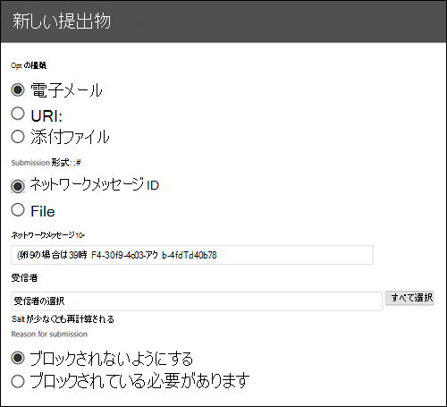

# 管理者送信を使用して、疑いがあるスパム、フィッシング、URL、ファイルを Microsoft に提出する

[!INCLUDE [Microsoft 365 Defender rebranding](../includes/microsoft-defender-for-office.md)]

Exchange Online のメールボックスを使用する Microsoft 365 の組織では、管理者はセキュリティ & コンプライアンスセンターの送信ポータルを使用して、電子メールメッセージ、Url、および添付ファイルをスキャン用に Microsoft に提出できます。

電子メールを送信すると、受信メールがテナントに許可されている可能性のあるポリシーや、メール内のすべての Url と添付ファイルの調査に関する情報が得られます。 メールが許可されているポリシーには、個々のユーザーの信頼できる差出人のリストと、Exchange メールフロールール (トランスポートルールとも呼ばれる) などのテナントレベルのポリシーが含まれます。

他の方法で電子メールメッセージ、Url、および添付ファイルを Microsoft に提出する方法については、「 [microsoft にメッセージとファイルを報告](report-junk-email-messages-to-microsoft.md)する」を参照してください。

## はじめに把握しておくべき情報

- <https://protection.office.com/> でセキュリティ/コンプライアンス センターを開きます。 **送信**ページに直接移動するには、を使用 <https://protection.office.com/reportsubmission> します。

- メッセージとファイルを Microsoft に送信するには、次のいずれかの役割グループのメンバーである必要があります。

  - **組織の管理**または[セキュリティ/コンプライアンス センター](permissions-in-the-security-and-compliance-center.md)の**セキュリティ管理者**。

  - [Exchange Online](https://docs.microsoft.com/Exchange/permissions-exo/permissions-exo#role-groups)での**組織の管理**。

    このトピックで後述するように [、カスタムメールボックスへのユーザーの送信を表示](#view-user-submissions-to-the-custom-mailbox) するには、この役割グループのメンバーシップが必要であることに注意してください。

- ユーザーがメッセージやファイルを Microsoft に送信する方法の詳細については、「 [microsoft へのメッセージとファイルの報告](report-junk-email-messages-to-microsoft.md)」を参照してください。

## 疑わしいコンテンツを Microsoft に報告する

1. [セキュリティ & コンプライアンスセンター] で、[**脅威管理**の提出] に移動し、[管理者への提出] タブが表示されていることを確認して、 \> **Submissions**[**新しい提出**] をクリックします。 **Admin submissions**

2. 次のセクションで説明されているように、メッセージ、URL、または添付ファイルを送信するための **新しい送信** ポップアップを使用します。

### 疑わしいメールを Microsoft に送信する

1. [ **オブジェクトの種類** ] セクションで、[ **電子メール**] を選択します。 [ **提出形式** ] セクションで、次のいずれかのオプションを使用します。

   - **ネットワークメッセージ id**: これは、メッセージ内の、 **Exchange 組織のネットワークメッセージ id** ヘッダーで使用可能な GUID 値になります。

   - [**ファイル**]: [**ファイルの選択] を**クリックします。 開いたダイアログで、.eml または .msg ファイルを見つけて選択し、[ **開く**] をクリックします。

2. [ **受信者** ] セクションで、ポリシーチェックの実行対象となる1人または複数の受信者を指定します。 ポリシーチェックは、ユーザーまたは組織のポリシーによって、電子メールがスキャンをバイパスしたかどうかを判断します。

3. [ **送信理由** ] セクションで、次のいずれかのオプションを選択します。

   - **ブロックされないようにする**

   - **ブロックされている必要があり**ます。 [ **スパム**、 **フィッシング**、または **マルウェア**] を選択します。 わからない場合は、適切な判断を行ってください。

4. 送信時のポリシーによってフィルターがバイパスされた場合は、そのポリシーに関する情報が表示されます。

   1つまたは複数のポリシーによってフィルターがバイパスされていない場合、スキャンは数分で完了します。 [状態] リンクをクリックすると、送信に関する追加情報が表示されます。 これには、ポリシーチェックの結果と rescan verdict が含まれます。 メモこれにより、Office 365 ATP の完全なフィルター処理スタックからメールが再度実行されることはありませんが、メール、URL、またはファイルの特定の属性に基づいて、部分的な再スキャンが実行されます。

5. 完了したら、[ **送信** ] ボタンをクリックします。

### 疑わしい URL を Microsoft に送信する

1. [ **オブジェクトの種類** ] セクションで、[ **URL**] を選択します。 表示されるボックスに、完全な URL (たとえば、) を入力し `https://www.fabrikam.com/marketing.html` ます。

2. [ **送信理由** ] セクションで、次のいずれかのオプションを選択します。

   - **ブロックされないようにする**

   - **ブロックされている必要があり**ます。 [ **フィッシング** または **マルウェア**] を選択します。

3. 完了したら、[ **送信** ] ボタンをクリックします。

### 疑わしいファイルを Microsoft に送信する

1. [ **オブジェクトの種類** ] セクションで、[ **添付ファイル**] を選択します。

2. [ **ファイルの選択] を**クリックします。 開いたダイアログで、ファイルを見つけて選択し、[ **開く**] をクリックします。

3. [ **送信理由** ] セクションで、次のいずれかのオプションを選択します。

   - **ブロックされないようにする**

   - **ブロックされている必要があり**ます。 **マルウェア** のみが選択され、自動的に選択されます。

4. 完了したら、[ **送信** ] ボタンをクリックします。

## 管理者の送信を表示する

[セキュリティ & コンプライアンスセンター] で、[**脅威管理**の提出] に移動し、[管理者への提出] タブが表示されていることを確認して、 \> **Submissions**[**新しい提出**] をクリックします。 **Admin submissions**

ページの上部に、[開始日]、[終了日]、[(既定)] の順に入力し、ボックスに値を入力して [最新の情報に更新] ボタンをクリックすることにより、 **送信 ID** でフィルター処理できます (既定では、すべての提出物に割り当てられている GUID 値)  。 Update

フィルター条件を変更するには、[ **提出 ID** ] ボタンをクリックして、次のいずれかの値を選択します。

- **Sender**
- **Subject/URL/ファイル名**
- **提出者**
- **送信の種類**
- **状態**

結果をエクスポートするには、ページの上部にある [ **エクスポート** ] をクリックして、[ **グラフデータ** ] または [ **テーブル**] を選択します。 表示されるダイアログで、.csv ファイルを保存します。

グラフの下に、[ **電子メール** ] (既定)、[ **URL**]、および [ **添付ファイル**] の3つのタブがあります。

### 管理者の電子メールの送信を表示する

[ **電子メール** ] タブをクリックします。

ページの下部にある [ **列のオプション** ] ボタンをクリックすると、ビューの列を追加または削除できます。

- **Date**
- **送信 ID**: すべての提出物に割り当てられている GUID 値。
- **提出者**\*
- **[件名]**\*
- **Sender**
- [**Sender IP (送信者の IP)**\*]
- **送信の種類**
- **配信理由**
- **現状**\*
- **コントロールの種類**
- **コントロールソース**

  \* この値をクリックすると、詳細情報がフライアウトに表示されます。

### 管理者 URL の提出を表示する

[ **URL** ] タブをクリックします。

ページの下部にある [ **列のオプション** ] ボタンをクリックすると、ビューの列を追加または削除できます。

- **Date**
- **送信 ID**
- **提出者**\*
- [**URL**\*]
- **送信の種類**
- **現状**\*

  \* この値をクリックすると、詳細情報がフライアウトに表示されます。

### 管理者添付ファイルの送信を表示する

[ **添付ファイル** ] タブをクリックします。

ページの下部にある [ **列のオプション** ] ボタンをクリックすると、ビューの列を追加または削除できます。

- **Date**
- **送信 ID**
- **提出者**\*
- **ファイル名**\*
- **送信の種類**
- **現状**\*

  \* この値をクリックすると、詳細情報がフライアウトに表示されます。

## Microsoft へのユーザーの送信を表示する

[レポートメッセージアドイン](enable-the-report-message-add-in.md)を展開した場合、またはユーザーが[Outlook on the web で組み込みのレポート](report-junk-email-and-phishing-scams-in-outlook-on-the-web-eop.md)を使用している場合は、[**ユーザーの送信**] タブでどのユーザーがレポートしているかを確認できます。

1. [セキュリティ & コンプライアンスセンター] で、[**脅威管理**の提出] に移動 \> **Submissions**します。

2. [ **ユーザーの送信** ] タブを選択し、[ **新しい送信**] をクリックします。

ページの下部にある [ **列のオプション** ] ボタンをクリックすると、ビューの列を追加または削除できます。

- **送信されたもの**
- **提出者**\*
- **[件名]**\*
- **Sender**
- [**Sender IP (送信者の IP)**\*]
- **送信の種類**

\* この値をクリックすると、詳細情報がフライアウトに表示されます。

ページの上部に、[開始日]、[終了日]、[(既定)] の順に入力し、ボックスに値を入力して [最新の情報に更新] ボタンをクリックすることによって、 **送信者** によるフィルター処理を実行でき  ます。 Update

フィルター条件を変更するには、[ **送信者** ] ボタンをクリックし、次のいずれかの値を選択します。

- **送信元ドメイン**
- **Subject**
- **提出者**
- **送信の種類**
- [**Sender IP (送信者の IP)**]

結果をエクスポートするには、ページの上部にある [ **エクスポート** ] をクリックして、[ **グラフデータ** ] または [ **テーブル**] を選択します。 表示されるダイアログで、.csv ファイルを保存します。

## カスタムメールボックスへのユーザー送信を表示する

ユーザーが報告したメッセージを受信するように[カスタムメールボックスを構成](user-submission.md)した**場合**は、レポートメールボックスに配信されたメッセージを表示して送信することもできます。

1. [セキュリティ & コンプライアンスセンター] で、[**脅威管理**の提出] に移動 \> **Submissions**します。

2. [ **カスタムメールボックス** ] タブを選択します。

ページの下部にある [ **列のオプション** ] ボタンをクリックすると、ビューの列を追加または削除できます。

- **送信されたもの**
- **提出者**\*
- **[件名]**\*
- **Sender**
- [**Sender IP (送信者の IP)**\*]
- **送信の種類**

ページの上部に、開始日と終了日を入力し、ボックスに値を入力して [最新の情報に更新] ボタンをクリックすることで、 **送信** によってフィルター処理を行うことができます  。 Update

結果をエクスポートするには、ページの上部にある [ **エクスポート** ] をクリックして、[ **グラフデータ** ] または [ **テーブル**] を選択します。 表示されるダイアログで、.csv ファイルを保存します。

### カスタムメールボックスから Microsoft にメッセージを送信する

ユーザーが報告したメッセージを Microsoft に送信せずに受信するようにカスタムメールボックスを構成した場合は、特定のメッセージを検索して Microsoft に送信して分析を行うことができます。 これにより、ユーザーの送信が管理者の送信に効果的に移動されます。

[ **カスタムメールボックス** ] タブで、一覧からメッセージを選択し、[ **アクション** ] ボタンをクリックして、次のいずれかの選択を行います。

- **クリーンなレポート**
- **フィッシングを報告する**
- **マルウェアの報告**
- **スパムの報告**

![[アクション] ボタンのオプション](../../media/user-submission-custom-mailbox-action-button.png)
