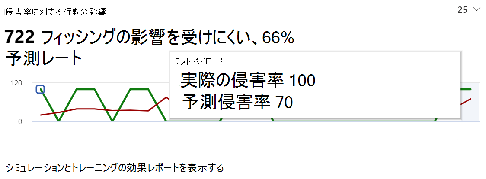

# 攻撃シミュレーション トレーニングを通して洞察を得る

**Microsoft** Defender for [Office 365プラン 2 に適用されます](defender-for-office-365.md)

攻撃シミュレーション トレーニングでは、従業員が行ったシミュレーションとトレーニングの結果に基づいて分析情報を提供します。 これらの分析情報は、従業員の脅威の準備状況に関する情報を提供し続けるのに役立ちます。また、従業員と環境を攻撃に備える次の手順を推奨します。

お客様が利用できる分析情報の拡大に継続的に取り組み続けます。 動作への影響と推奨されるアクションは現在利用できます。 まず、ポータルで攻撃[シミュレーション トレーニングにMicrosoft 365 Defenderします](https://security.microsoft.com/attacksimulator?viewid=overview)。

## 侵害率に対する動作の影響

攻撃シミュレーション **トレーニングの** [概要] タブで、侵害率カードに対する動作 **の影響を確認** できます。 このカードは、予想される妥協率とは対照的に、従業員が実行したシミュレーションに対する従業員の対処 **方法を示しています**。 これらの分析情報を使用して、同じ従業員グループに対して複数のシミュレーションを実行することで、従業員の脅威の準備状況の進捗状況を追跡できます。

グラフには、次の情報が表示されます。

- **攻撃シミュレーション トレーニングを** 使用する他のテナント間で同じ種類のペイロードを使用するシミュレーションの平均妥協率を反映Microsoft 365予測された妥協率。
- **実際の妥協率** は、シミュレーションで低下した従業員の割合を反映します。

さらに、攻撃によって侵害された従業員の実際の数と予想される妥協率の `<number> less susceptible to phishing` 違いを反映しています。 この数の従業員は、将来同様の攻撃によって侵害される可能性は低く、従業員が予想される妥協率とは対照的に全体的にどのように行ったか `<percent%> better than predicted rate` 示しています。

> [!div class="mx-imgBorder"]
> 

より詳細なレポートを表示するには、[シミュレーションとトレーニングの有効性レポートの **表示] をクリックします**。 このレポートは、シミュレーション自体からの追加のコンテキスト (シミュレーション手法や対象ユーザーの総数など) と同じ情報を提供します。

## 推奨処理

[シミュレーション [**] タブ** で](https://security.microsoft.com/attacksimulator?viewid=simulations)シミュレーションを選択すると、シミュレーションの詳細が表示されます。[推奨されるアクション] **セクションが表示** されます。

推奨されるアクション セクションでは、Microsoft Secure Score で使用可能な推奨事項 [の詳細を示します](../defender/microsoft-secure-score.md)。 これらの推奨事項は、シミュレーションで使用されるペイロードに基づいており、従業員と環境の保護に役立ちます。 各改善アクションをクリックすると、その詳細が表示されます。

> [!div class="mx-imgBorder"]
> 

## 関連リンク

[攻撃シミュレーション トレーニングの使用を開始する](attack-simulation-training-get-started.md)

[フィッシング攻撃シミュレーションの作成](attack-simulation-training.md)

[ユーザーをトレーニングするペイロードを作成する](attack-simulation-training-payloads.md)
