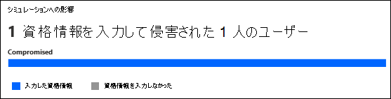
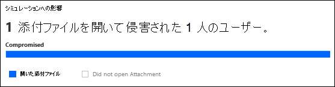
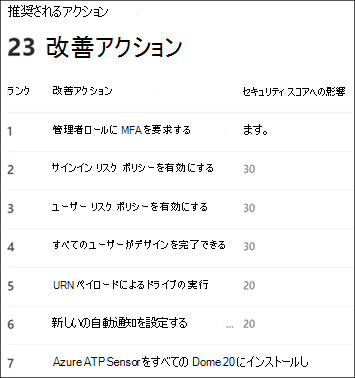

# インサイトの Defender での攻撃シミュレーション トレーニングの詳細とレポートOffice 365

**Microsoft** Defender for [Office 365プラン 2 に適用されます](defender-for-office-365.md)

Microsoft Defender for Office プラン 2 または Microsoft 365 E5 の攻撃シミュレーション トレーニングでは、シミュレーションの結果と対応するトレーニングからの分析情報とレポートが提供されます。 この情報を使用すると、ユーザーの脅威の準備状況に関する情報と、今後の攻撃に備えたユーザーの準備を行う次の手順を推奨します。

インサイトレポートは、このポータルの攻撃シミュレーション トレーニングの次のMicrosoft 365 Defender使用できます。

- [ **概要]** タブ。
- [シミュレーション] タブ **のシミュレーションの** 詳細。

この記事の残りの部分では、利用可能な情報について説明します。

攻撃シミュレーション トレーニングの概要については、「攻撃シミュレーション トレーニングの使用を開始 [する」を参照してください](attack-simulation-training-get-started.md)。

## インサイトシミュレーション トレーニングの [概要] タブの詳細とレポート

[概要]タブに移動するには、Microsoft 365 Defender ポータルを開き、[メール & コラボレーション攻撃シミュレーション トレーニング] に移動し、[概要] タブが選択されている (既定です) を確認します <https://security.microsoft.com>  \> 。  攻撃シミュレーション トレーニング ページの **[概要]** タブに直接 **移動するには** 、 を使用します <https://security.microsoft.com/attacksimulator?viewid=overview> 。

このセクションの残りの部分では、攻撃シミュレーション トレーニングの [ **概要** ] タブで使用できる情報について説明します。

### 最近のシミュレーション カード

[**概要] タブの**  [最近使ったシミュレーション] カードには、組織で作成または実行した最後の 3 つのシミュレーションが表示されます。

シミュレーションを選択して詳細を表示できます。

[すべての **シミュレーションを表示] を選択すると** 、[シミュレーション] **タブに移動** します。

[シミュレーションの **起動] を選択すると、** シミュレーション作成ウィザードが開始されます。 詳細については、「Defender[でフィッシング攻撃を](attack-simulation-training.md)シミュレートする」を参照Office 365。

![ポータルの攻撃シミュレーション トレーニングの [概要] タブにある最近のシミュレーション カードMicrosoft 365 Defenderします。](../../media/attack-sim-training-overview-recent-simulations-card.png)

### 侵害率カードに対する動作の影響

[**概要]** タブの [侵害率カードに対する動作の影響] は、ユーザーがシミュレーションに対してどのように応答したのか、およびユーザーの履歴データと比較してMicrosoft 365。 これらの分析情報を使用して、同じユーザー グループに対して複数のシミュレーションを実行することで、ユーザーの脅威の準備状況の進捗状況を追跡できます。

グラフ データ自体には、次の情報が表示されます。

- **予測妥協率**: 他のすべての組織で同じ種類のペイロードを使用する攻撃シミュレーション の平均妥協 \* 率Microsoft 365です。
- **実際の妥協率** \* : シミュレーションで低下したユーザーの実際の割合。

グラフ内のデータ ポイントにカーソルを合わせると、実際のパーセンテージ値が表示されます。

次の概要情報もカードに表示されます。

- **ユーザーがフィッシングの影響** を受けにくい : シミュレートされた攻撃によって侵害された実際のユーザー数と予測される侵害率の違い。 この数のユーザーは、今後同様の攻撃によって侵害される可能性は低い。
- **予測速度よりも x% 優** れた : ユーザーが予想される妥協率とは対照的に、全体的にどのように行ったかを示します。

![セキュリティ ポータルの攻撃シミュレーション トレーニングの [概要] タブの侵害率カードに対するMicrosoft 365 Defender影響。](../../media/attack-sim-training-overview-behavior-impact-card.png)

より詳細なレポートを表示するには、[シミュレーションとトレーニングの有効性レポートの **表示] をクリックします**。 このレポートについては、 [この記事の後半で説明します](#training-efficacy-tab-for-the-attack-simulation-report)。

### シミュレーション カバレッジ カード

[**概要**] タブの[シミュレーション カバレッジ カード] には、**シミュレーションを受** け取った組織内のユーザーの割合 (シミュレートされたユーザー) と、シミュレーションを受け取っていないユーザー (シミュレートされていないユーザー) の割合が **表示** されます。 グラフ内のセクションにカーソルを合わせると、各カテゴリの実際のユーザー数を確認できます。

[シミュレーション **以外の** ユーザーのシミュレーションを起動する] を選択すると、シミュレーションを受け取らなかったユーザーが [ターゲット ユーザー] ページで自動的に選択されるシミュレーション作成 **ウィザードが開始** されます。 詳細については、「Defender[でフィッシング攻撃を](attack-simulation-training.md)シミュレートする」を参照Office 365。

[シミュレーション カバレッジ **レポートの表示] を選択** すると、攻撃シミュレーション レポートの [ユーザー [カバレッジ] タブに移動します](#user-coverage-tab-for-the-attack-simulation-report)。

![ポータルの攻撃シミュレーション トレーニングの [概要] タブにあるシミュレーション カバレッジ カードMicrosoft 365 Defenderします。](../../media/attack-sim-training-overview-sim-coverage-card.png)

### トレーニング完了カード

[**概要] タブの**[トレーニング完了] カードは、シミュレーションの結果に基づいてトレーニングを受けたユーザーの割合を次のカテゴリに整理します。 

- **Completed**
- **処理中**
- **不完全**

グラフ内のセクションにカーソルを合わせると、各カテゴリの実際のユーザー数を確認できます。

[トレーニング **完了レポートの表示] を選択** すると、攻撃シミュレーション レポートの [トレーニング完了] [タブに移動します](#training-completion-tab-for-the-attack-simulation-report)。

### 繰り返し犯罪者カード

[ **概要] タブの [** 繰り返し犯罪者] **カードには** 、繰り返し犯人に関する情報が表示されます。 繰 _り返し犯人_ とは、連続したシミュレーションによって侵害されたユーザーです。 連続するシミュレーションの既定の数は **2** ですが、攻撃シミュレーション トレーニングの [設定] タブで値を変更できます <https://security.microsoft.com/attacksimulator?viewid=setting> 。

グラフは、シミュレーションの種類別に繰り返し犯罪者データ [を整理します](attack-simulation-training.md#select-a-social-engineering-technique)。

- **All**
- **マルウェアの添付ファイル**
- **マルウェアへのリンク**
- **資格情報の取得**
- **添付ファイル内のリンク**
- **ドライブバイ URL**

[繰 **り返し犯罪者レポートの表示** ] を選択すると、攻撃シミュレーション レポートの [繰り返し犯罪者] [タブに移動します](#repeat-offenders-tab-for-the-attack-simulation-report)。

### おすすめカード

[ **概要] タブの** [推奨事項] **カード** には、実行するシミュレーションの種類が異なります。

[起動 **] を選択すると** 、[テクニックの選択] ページで指定したシミュレーションの種類が自動的に選択されたシミュレーション作成 **ウィザードが開始** されます。 詳細については、「Defender[でフィッシング攻撃を](attack-simulation-training.md)シミュレートする」を参照Office 365。

![ポータルの攻撃シミュレーション トレーニングの [概要] タブにあるMicrosoft 365 Defenderカード。](../../media/attack-sim-training-overview-recommendations-card.png)

### 攻撃シミュレーション レポート

View ..**をクリックすると、[** 概要] タブから攻撃シミュレーション レポート **を開きます。この** 記事で説明する多くのカードで使用できるレポート ボタン。 レポートに直接移動するには、 <https://security.microsoft.com/attacksimulationreport>

#### 攻撃シミュレーション レポートの [トレーニングの有効性] タブ

[攻撃 **シミュレーション レポート] ページで** 、[ **トレーニングの有効性]** タブが既定で選択されています。 このタブには、シミュレーション自体からの追加のコンテキストを使用して、侵害率カードに対する動作の影響で使用できるのと同じ情報が表示されます。

![ポータルの [攻撃シミュレーション] レポートの [トレーニングの有効性] Microsoft 365 Defenderします。](../../media/attack-sim-report-training-efficacy-view.png)

グラフは、予測妥 **協率と実際の** 侵害 **率を示しています**。 グラフ内のセクションにカーソルを合わせると、実際のパーセンテージ値が表示されます。

グラフの下の詳細テーブルは、次の情報を示しています。

- **シミュレーション名**
- **シミュレーション手法**
- **シミュレーションの戦術**
- **予測された侵害率**
- **実際の侵害率**
- **対象ユーザーの総数**
- **クリックされたユーザーの数**

使用できる列見出しをクリックすると、結果を並べ替えることができます。

[列 **のカスタマイズ]** をクリックして、表示されている列を削除します。 完了したら、**[適用]** をクリックします。

[ ![ 検索] アイコン ](../../media/m365-cc-sc-search-icon.png) **の [検索]** ボックスを使用して、シミュレーション名または **シミュレーションテクニックで** 結果 **をフィルター処理します**。 ワイルドカードはサポートされていません。

[エクスポート] アイコン  **[レポートのエクスポート** ] ボタンをクリックすると、レポート生成の進行状況が完了の割合として表示されます。 開いたダイアログで、ファイルを開き、.csvファイルを保存し、.csvを記憶することができます。

#### 攻撃シミュレーション レポートの [ユーザー範囲] タブ

![ポータルの [攻撃シミュレーション] レポートの [ユーザーカバレッジ] Microsoft 365 Defenderします。](../../media/attack-sim-report-user-coverage-view.png)

[ユーザー **範囲] タブ** のグラフには、[シミュレートされたユーザー] **と** [シミュレートされていないユーザー **] が表示されます**。 グラフ内のデータ ポイントにカーソルを合わせると、実際の値が表示されます。

グラフの下の詳細テーブルは、次の情報を示しています。

- **Username**
- **電子メール アドレス**
- **シミュレーションに含まれる**
- **最後のシミュレーションの日付**
- **最後のシミュレーション結果**
- **クリック数**
- **侵害された数**

使用できる列見出しをクリックすると、結果を並べ替えることができます。

[列 **のカスタマイズ]** をクリックして、表示されている列を削除します。 完了したら、**[適用]** をクリックします。

[検索 ![ ] アイコン ](../../media/m365-cc-sc-search-icon.png) **の [検索]** ボックスを使用して、結果を [ユーザー名] または **[電子メール アドレス]** **でフィルター処理します**。 ワイルドカードはサポートされていません。

[エクスポート] アイコン  **[レポートのエクスポート** ] ボタンをクリックすると、レポート生成の進行状況が完了の割合として表示されます。 開いたダイアログで、ファイルを開き、.csvファイルを保存し、.csvを記憶することができます。

#### 攻撃シミュレーション レポートのトレーニング完了タブ

![ポータルの [攻撃シミュレーション] レポートの [トレーニングMicrosoft 365 Defenderします。](../../media/attack-sim-report-training-completion-view.png)

[トレーニング **の完了] タブ** で、グラフに[完了] 、[進行中] 、および [不完全なシミュレーション]**の数が** 表示されます。 グラフ内のセクションにカーソルを合わせると、実際の値が表示されます。

グラフの下の詳細テーブルは、次の情報を示しています。

- **Username**
- **電子メール アドレス**
- **シミュレーションに含まれる**
- **最後のシミュレーションの日付**
- **最後のシミュレーション結果**
- **完了した最新のトレーニングの名前**
- **完了した日付**
- **すべてのトレーニング**

使用できる列見出しをクリックすると、結果を並べ替えることができます。

[列 **のカスタマイズ]** をクリックして、表示されている列を削除します。 完了したら、**[適用]** をクリックします。

[フィルター ![ ] アイコンをクリックします。](../../media/m365-cc-sc-filter-icon.png) **次** の値の 1 つ以上でグラフと詳細テーブルをフィルター処理します。

- **Completed**
- **処理中**
- **All**

フィルターの構成が完了したら、[適用]、[**キャンセル**]、または [フィルターのクリア]**をクリックします**。

[検索 ![ ] アイコン ](../../media/m365-cc-sc-search-icon.png) **の [検索]** ボックスを使用して、結果を [ユーザー名] または **[電子メール アドレス]** **でフィルター処理します**。 ワイルドカードはサポートされていません。

[エクスポート] アイコン  **[レポートのエクスポート** ] ボタンをクリックすると、レポート生成の進行状況が完了の割合として表示されます。 開いたダイアログで、ファイルを開き、.csvファイルを保存し、.csvを記憶することができます。

#### 攻撃シミュレーション レポートの [繰り返し犯罪者] タブ

![[攻撃シミュレーション] レポートの [繰り返し犯罪者] タブは、Microsoft 365 Defenderします。](../../media/attack-sim-report-repeat-offenders-view.png)

繰 _り返し犯人_ とは、連続したシミュレーションによって侵害されたユーザーです。 連続するシミュレーションの既定の数は **2** ですが、攻撃シミュレーション トレーニングの [設定] タブで値を変更できます <https://security.microsoft.com/attacksimulator?viewid=setting> 。

[繰 **り返し犯罪者] タブ** で、グラフはシミュレーションの種類別に繰り返し犯罪者データ [を整理します](attack-simulation-training.md#select-a-social-engineering-technique)。

- **All**
- **資格情報の取得**
- **マルウェアの添付ファイル**
- **添付ファイルのリンク**
- **マルウェアへのリンク**
- **ドライブバイ URL**

グラフ内のデータ ポイントにカーソルを合わせると、実際の値が表示されます。

グラフの下の詳細テーブルは、次の情報を示しています。

- **ユーザー**
- **繰り返し数**
- **シミュレーションの種類**
- **シミュレーション**

使用できる列見出しをクリックすると、結果を並べ替えることができます。

[列 **のカスタマイズ]** をクリックして、表示されている列を削除します。 完了したら、**[適用]** をクリックします。

[フィルター ![ ] アイコンをクリックします。](../../media/m365-cc-sc-filter-icon.png) **フィルター** を使用して、シミュレーションの種類の値の一部またはすべてによってグラフと詳細テーブルをフィルター処理します。

- **資格情報の取得**
- **マルウェアの添付ファイル**
- **添付ファイルのリンク**
- **マルウェアへのリンク**
- **ドライブバイ URL**

フィルターの構成が完了したら、[適用]、[**キャンセル**]、または [フィルターのクリア]**をクリックします**。

[ ![ 検索] アイコン ](../../media/m365-cc-sc-search-icon.png) **の [検索** ] ボックスを使用して、任意の列値で結果をフィルター処理します。 ワイルドカードはサポートされていません。

[エクスポート] アイコン  **[レポートのエクスポート** ] ボタンをクリックすると、レポート生成の進行状況が完了の割合として表示されます。 開いたダイアログで、ファイルを開き、.csvファイルを保存し、.csvを記憶することができます。

## インサイトシミュレーショントレーニングのシミュレーションの詳細に関する情報とレポート

[シミュレーション]**タブに** 移動するには、Microsoft 365 Defender ポータルを開き、[メール & コラボレーション攻撃シミュレーション トレーニング] に移動し、[シミュレーション] タブ <https://security.microsoft.com>  \> **を選択** します。攻撃シミュレーション トレーニング ページの **[シミュレーション**] タブに直接 **移動するには**、 を使用します <https://security.microsoft.com/attacksimulator?viewid=simulations> 。

一覧からシミュレーションを選択すると、詳細ページが開きます。 このページには、予想されるシミュレーションの構成設定 (状態、起動日、使用されるペイロードなど) が含まれています。

このセクションの残りの部分では、シミュレーションの詳細ページで使用できる分析情報とレポートについて説明します。

### [シミュレーションの影響] セクション

[ **シミュレーションの詳細]** ページの [シミュレーションの影響] セクションには、シミュレーションで完全に騙されたユーザーの数と、シミュレーション内のユーザーの総数が表示されます。 表示される情報は、シミュレーションの種類によって異なります。 次に例を示します。

- リンク:**資格情報を入力し、****資格情報を入力しなかった**。

  

- 添付ファイル: **添付ファイルを開** き **、添付ファイルを開かなかった**。

  

グラフ内のセクションにカーソルを合わせると、各カテゴリの実際の数値が表示されます。

### [すべてのユーザー アクティビティ] セクション

[ **シミュレーションの詳細] ページの** [すべてのユーザー アクティビティ] セクションには、シミュレーションの結果の数値が表示されます。 表示される情報は、シミュレーションの種類によって異なります。 次に例を示します。

- **SuccessfullyDeliveredEmail**
- **ReportedEmail**: シミュレーション メッセージを疑わしいと報告したユーザーの数。
- リンク:
  - **EmailLinkClicked**: シミュレーション メッセージ内のリンクをクリックしたユーザーの数。
  - **CredSupplied**: リンクをクリックした後、資格情報を提供したユーザーの数。

    ![リンク関連のシミュレーションの詳細に関する[すべてのユーザー アクティビティ] セクション。](../../media/attack-sim-training-sim-details-all-user-activity-links.png)

- 添付ファイル:
  - **AttachmentOpened**: シミュレーション メッセージで添付ファイルを開いたユーザーの数。

    ![添付ファイル関連のシミュレーションの詳細に関する[すべてのユーザー アクティビティ] セクション。](../../media/attack-sim-training-sim-details-all-user-activity-attachments.png)

### [トレーニングの完了] セクション

[ **シミュレーションの詳細** ] ページの [トレーニングの完了] セクションには、シミュレーションに必要なトレーニングと、トレーニングを完了したユーザーの数が表示されます。

## [推奨されるアクション] セクション

[ **シミュレーションの詳細]** ページの [推奨されるアクション] セクションには [、Microsoft Secure Score](../defender/microsoft-secure-score.md) からの推奨アクションと、そのアクションがセキュリティで保護されたスコアに与える影響が表示されます。 これらの推奨事項は、シミュレーションで使用されたペイロードに基づいており、ユーザーと環境の保護に役立ちます。 リストから **改善アクションを** 選択すると、提案されたアクションを実装する場所に移動します。

## 関連リンク

[攻撃シミュレーション トレーニングの使用を開始する](attack-simulation-training-get-started.md)

[フィッシング攻撃シミュレーションの作成](attack-simulation-training.md)

[ユーザーをトレーニングするペイロードを作成する](attack-simulation-training-payloads.md)
