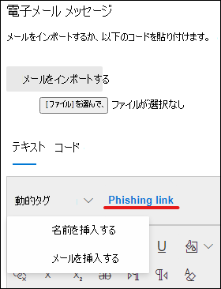

# 攻撃シミュレーショントレーニングのカスタム ペイロードを作成するCreate a custom payload for Attack simulation training

Microsoft は、攻撃シミュレーション トレーニングと組み合わせ、さまざまなソーシャル エンジニアリング手法の堅牢なペイロード カタログを提供しています。Microsoft offers a robust payload catalog for various social engineering techniques to pair with your attack simulation training. ただし、組織に合ったカスタム ペイロードを作成することもできます。However, you might want to create custom payloads that will work better for your organization. この記事では、365 用 Microsoft Defender での攻撃シミュレーション トレーニングでペイロードを作成するOffice説明します。This article describes how to create a payload in Attack simulation training in Microsoft Defender for Office 365.

ペイロードを作成するには、[専用のペイロード]タブまたはシミュレーション作成ウィザードで [ペイロードの作成[] をクリックします](attack-simulation-training.md#selecting-a-payload)。 You can create a payload by clicking on **Create a payload** in either the [dedicated **Payloads** tab](https://security.microsoft.com/attacksimulator?viewid=payload) or within the [simulation creation wizard](attack-simulation-training.md#selecting-a-payload).

ウィザードの最初の手順では、ペイロードの種類を選択します。The first step in the wizard will have you select a payload type. **現在、電子メールのみを使用できます**。**Currently, only email is available**.

次に、関連付けられた手法を選択します。Next, select an associated technique. 技術の詳細については [、「Selecting a social engineering technique 」を参照してください](attack-simulation-training.md#selecting-a-social-engineering-technique)。See more details on techniques at [Selecting a social engineering technique](attack-simulation-training.md#selecting-a-social-engineering-technique).

次の手順では、ペイロードに名前を付けています。In the next step name your payload. 必要に応じて、説明を指定できます。Optionally, you can give it a description.

## ペイロードの構成Configure payload

次に、ペイロードをビルドします。Now it's time to build your payload. [送信者の詳細] セクションに、送信者の名前、電子メール アドレス、および電子メールの件名 **を入力** します。Input the sender's name, email address, and the email's subject in the **Sender details** section. 指定されたリストからフィッシング URL を選択します。Pick a phishing URL from the provided list. この URL は、後でメッセージの本文に埋め込まれる予定です。This URL will later be embedded into the body of the message.

> [!TIP]
> ペイロードの送信者に対して内部メールを選択すると、そのペイロードが会社の別の従業員からのメールとして表示されます。You can choose an internal email for your payload's sender, which will make the payload appear as coming from another employee of the company. これにより、ペイロードの影響を受けやすくし、内部の脅威のリスクについて従業員を教育するのに役立ちます。This will increase susceptibility to the payload and will help educate employees on the risk of internal threats.

リッチ テキスト エディターを使用してペイロードを作成できます。A rich text editor is available to create your payload. 事前に作成したメールをインポートできます。You can also import an email that you've created beforehand. 電子メールの本文を作成する場合は、動的タグを利用して、メールをターゲットに合ってカスタマイズします。As you create the body of the email, take advantage of the **dynamic tags** to personalize the email to your targets. [ **フィッシング] リンクをクリック** して、以前に選択したフィッシング URL をメッセージの本文に追加します。Click **Phishing link** to add the previously selected phishing URL into the body of the message.

> [!TIP]
> 時間を節約するには、電子メール メッセージ内のすべてのリンクをフィッシング リンクに置き換える **オプションをオンにします**。To save time, toggle on the option to **replace all links in the email message with the phishing link**.

ペイロードの作成が完了したら、[次へ] を **クリックします**。Once you're done building the payload to your liking, click **Next**.

## インジケーターの追加Adding indicators

インジケーターは、攻撃シミュレーションを実行する従業員が、将来の攻撃で探す手がかりを理解するのに役立ちます。Indicators will help employees going through the attack simulation understand the clue they can look for in future attacks. 開始するには、[インジケーターの追加 **] をクリックします**。To start, click **Add indicator**.

ドロップダウン リストから使用するインジケーターを選択します。Select an indicator you'd like to use from the drop-down list. このリストは、フィッシングメール メッセージに表示される最も一般的な手がかりを含むキュアリングされます。This list is curated to contain the most common clues that appear in phishing email messages. 選択したら、インジケーターの配置が [メールの本文から] に設定され、[テキストの選択] を **クリックします**。Once selected, make sure the indicator placement is set to **From the body of the email** and click on **Select text**. このインジケーターが表示されるペイロードの部分を強調表示し、[選択] を **クリックします**。Highlight the portion of your payload where this indicator appears and click **Select**.

インジケーターを説明するカスタムの説明を追加し、インジケーターのプレビュー フレーム内をクリックすると、インジケーターのプレビューが表示されます。Add a custom description to describe the indicator and click within the indicator preview frame to see a preview of your indicator. 完了したら、[追加] を **クリックします**。Once done, click **Add**. ペイロード内のすべてのインジケーターをカバーするまで、これらの手順を繰り返します。Repeat these steps until you've covered all indicators in your payload.

## ペイロードの確認Review payload

ペイロードの構築は完了です。You're done building your payload. 次に、詳細を確認し、ペイロードのプレビューを確認します。Now it's time to review the details and see a preview of your payload. プレビューには、作成したインジケーターすべてが含まれます。The preview will include all indicators that you've created. この手順では、ペイロードの各部分を編集できます。You can edit each part of the payload from this step. 完了したら、ペイロード **を送信** できます。Once satisfied, you can **Submit** your payload.

> [!IMPORTANT]
> 作成したペイロードには、テナント **がソース** として含まれます。Payloads that you've created will have **Tenant** as their source. ペイロードを選択する場合は、テナントをフィルター処理しない必要 **があります**。When selecting payloads, make sure that you don't filter out **Tenant**.

## 関連リンクRelated links

[攻撃シミュレーション トレーニングの使用を開始するGet started using Attack simulation training](attack-simulation-training-get-started.md)

[フィッシング攻撃シミュレーションの作成Create a phishing attack simulation](attack-simulation-training.md)

[攻撃シミュレーション トレーニングを通して洞察を得るGain insights through Attack simulation training](attack-simulation-training-insights.md)
