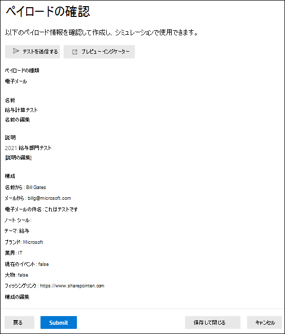

# Defender で攻撃シミュレーション トレーニング用のカスタム ペイロードを作成Office 365

**Microsoft** Defender for [Office 365プラン 2 に適用されます](defender-for-office-365.md)

攻撃シミュレーション トレーニングでは、 _ペイロードは_ フィッシングメール メッセージと、シミュレーションでユーザーに表示される Web ページです。 Microsoft 365 E5プラン 2 Microsoft 365 E5 Microsoft Office 365 Defender の攻撃シミュレーション トレーニングでは、使用可能なソーシャル エンジニアリング手法に対する堅牢な組み込みペイロード カタログが提供されます。 ただし、組織に合ったカスタム ペイロードを作成することもできます。

この記事では、攻撃シミュレーション トレーニングで独自のペイロードを作成する方法について説明します。 カスタム ペイロードは、次の場所に作成できます。

- [**ペイロード] タブ**: [Microsoft 365 Defender] ポータルの [メール] &[攻撃シミュレーション トレーニング ペイロード] <https://security.microsoft.com>  \>  \> **タブに移動** します。[ペイロード] タブに直接 **移動するには**、 を使用します <https://security.microsoft.com/attacksimulator?viewid=payload> 。
- シミュレーションの作成中: シミュレーション作成ウィザードの [ペイロードの選択] ページ (3 ページ目) でカスタム ペイロードを作成できます。 詳細については、「Defender[でフィッシング攻撃を](attack-simulation-training.md)シミュレートする」を参照Office 365。

攻撃シミュレーション トレーニングの概要については、「攻撃シミュレーション トレーニングの使用を開始 [する」を参照してください](attack-simulation-training-get-started.md)。

> [!NOTE]
> 特定の商標、ロゴ、記号、記号、その他のソース識別子は、地方、州、および連邦の法令および法律の下で保護を強化します。 このようなインジケーターを不正に使用すると、刑事罰金を含む罰則がユーザーに科される可能性があります。 広範なリストではありませんが、これには、大統領、副大統領、および議会のシール、CIA、FBI、社会保障、メディケアとメディケイド、米国内歳入サービス、およびオリンピックが含まれます。 これらの商標のカテゴリを超えて、サードパーティの商標の使用と変更は、固有のリスクを伴います。 ペイロードで独自の商標とロゴを使用すると、リスクが低く、特に組織が使用を許可している場合はリスクが低い可能性があります。 ペイロードを作成または構成する際に、何が適切か、または適切ではないかについてさらに質問がある場合は、法務アドバイザーに相談してください。

## ペイロードの作成

[ペイロードの作成 ![ ] アイコンをクリックした後。](../../media/m365-cc-sc-create-icon.png) **攻撃シミュレーション トレーニングの**[**ペイロード**] タブまたはシミュレーション作成ウィザード **** の [ペイロードの選択] ページからペイロードを作成すると、ペイロード作成ウィザードが開始され、このセクションで説明します。

### ペイロードの種類を選択する

[種類 **の選択] ページ** で、現在選択できる唯一の値は [メール] **です**。

**[次へ]** をクリックします。

### ソーシャル エンジニアリング手法の選択

[テクニック **の選択] ページ** で、使用可能なオプションは、シミュレーション作成ウィザードの [ テクニックの選択] ページと同じです。

- **資格情報の取得**
- **マルウェアの添付ファイル**
- **添付ファイルのリンク**
- **マルウェアへのリンク**
- **ドライブバイ URL**

完了したら、**[次へ]** をクリックします。

### ペイロードの名前と説明

[ペイロード名 **] ページで** 、次の設定を構成します。

- **名前**: ペイロードの一意でわかりやすい名前を入力します。
- **説明**: ペイロードのオプションの詳細な説明を入力します。

完了したら、**[次へ]** をクリックします。

## ペイロードを構成する

[ペイロード **の構成] ページ** で、ペイロードをビルドします。 使用可能な設定の多くは、[テクニックの選択] ページで行った選択 (リンクと添付ファイルなど) によって決まります。

- **[送信者の詳細** ] セクション: 次の設定を構成します。
  - **From name**
  - **表示名として名を使用する**: 既定では、この設定は選択されません。
  - **メールから**: ペイロードの送信者の内部メール アドレスを選択すると、ペイロードは仲間の従業員から送信されたと表示されます。 この送信者の電子メール アドレスは、ペイロードに対するユーザーの感受性を高め、内部の脅威のリスクについて従業員を教育するのに役立ちます。
  - **メールの件名**

- **[添付ファイルの** 詳細] セクション: このセクションは、[テクニックの選択] ページで[マルウェアの添付ファイル] 、添付ファイルのリンク、または [マルウェアへのリンク] を選択した場合 **にのみ使用** できます。  以下の設定を構成します。
  - **添付ファイルに名前を付け**
  - **添付ファイルの種類を選択** します。現在、使用可能な値は **Docx のみです**。

- **[添付ファイルのリンク**] セクション: このセクションは、[テクニックの選択] ページで [マルウェアへのリンク] を選択した **場合にのみ使用** できます。 [マルウェア **の添付ファイルとして使用** する URL を選択する] リンク ボックスで、使用可能な URL の 1 つ ([フィッシング リンク] セクションで説明されているのと同じ URL) **を選択** します。

  後で、メッセージの本文に URL を埋め込む予定です。

- **[フィッシング リンク**] セクション: このセクションは、[方法の選択]ページで [資格情報の取得] 、[添付ファイルのリンク]、または [ドライブバイ **URL]** を選択した場合 **にのみ使用** できます。

  [ **資格情報の取得** ] または **[ドライブバイ URL]** の場合、ボックスの名前は [フィッシング リンクとして **使用する URL を選択する] です**。 後で、メッセージの本文に URL を埋め込む予定です。

  [ **添付ファイル内のリンク**] の場合、ボックスの名前は[フィッシング リンクとして使用するこの添付ファイルの **URL を選択する] です**。 後で、添付ファイルに URL を埋め込む予定です。

  使用可能な URL 値のいずれかを選択します。
  
  - <https://www.mcsharepoint.com>
  - <https://www.attemplate.com>
  - <https://www.doctricant.com>
  - <https://www.mesharepoint.com>
  - <https://www.officence.com>
  - <https://www.officenced.com>
  - <https://www.officences.com>
  - <https://www.officentry.com>
  - <https://www.officested.com>
  - <https://www.prizegives.com>
  - <https://www.prizemons.com>
  - <https://www.prizewel.com>
  - <https://www.prizewings.com>
  - <https://www.shareholds.com>
  - <https://www.sharepointen.com>
  - <https://www.sharepointin.com>
  - <https://www.sharepointle.com>
  - <https://www.sharesbyte.com>
  - <https://www.sharession.com>
  - <https://www.sharestion.com>
  - <https://www.templateau.com>
  - <https://www.templatent.com>
  - <https://www.templatern.com>
  - <https://www.windocyte.com>

  > [!NOTE]
  > URL レピュテーション サービスは、これらの URL の 1 つ以上を安全でないと識別する場合があります。 シミュレーションで URL を使用する前に、サポートされている Web ブラウザーの URL の可用性を確認してください。 詳細については、「フィッシング シミュレーション URL が Google セーフブラウズによってブロックされている」[を参照してください](attack-simulation-training-faq.md#phishing-simulation-urls-blocked-by-google-safe-browsing)。

- **[添付ファイルコンテンツ**] セクション: このセクションは、[テクニックの選択] ページで [添付ファイルのリンク] を選択 **した場合にのみ使用** できます。

  リッチ テキスト エディターを使用すると、ファイル添付ファイルペイロードにコンテンツを作成できます。

  以前に **選択したフィッシング** URL を添付ファイルに追加するには、フィッシング リンク コントロールを使用します。

- 一般的な設定:
  - **タグの追加**
  - **テーマ**: 利用可能な値は、アカウントのアクティブ化、アカウント検証、課金、メールのクリーンアップ、ドキュメント受信、経費 **、FAX、****財務** レポート、受信メッセージ、**請求書**、アイテム受信、ログインアラート、メール受信、その他、パスワード、支払い、給与、個人設定されたオファー **、****検疫** です。    、**リモートワーク**、 **Review Message**、 Security **Update**、 **Service Suspended**、 Signature Required 、 Upgrade **Mailbox** **Storage**、 **Verify** mailbox , or **Voicemail**.
  - **ブランド**: 利用可能な値 **は、American Express**、 **Capital One**、 **DHL**、  **DocuSign**、 **Dropbox**、 **Facebook**、 First **American**、 **Microsoft**、 **Netflix**、 **Scotiabank**、 **SendGrid**、 スチュワートタイトル **、****テスコ**、**ウェル** ズファーゴ 、 **Syrinx Cloud**、または Other です。
  - **業種**: 利用可能な値は、銀行、**ビジネス** サービス、コンシューマー サービス、教育、**エネルギー**、建設、コンサルティング、金融サービス、政府、ホスピタリティ、保険、法務、**宅配** サービス **、IT**、**ヘルスケア**、製造、小売、テレコム、不動産、または **その他**.
  - **現在のイベント**: 使用可能な値は **Yes** または **No です**。
  - **論争 :** 使用可能な値は **Yes** または No **です**。

- **[言語** ] セクション: ペイロードの言語を選択します。 使用可能な値は、英語、**スペイン** 語 、ドイツ語 、日本語、 フランス語 、 ポルトガル語 、 イタリア語 、スウェーデン語 、 中国語 (簡体字 **)**、 ノルウェー語、 ロシア語 、 フィンランド語 、 韓国語 、 トルコ語 、 ハンガリー語 、 ヘブライ語 、 タイ語 、 アラビア語 、 ベトナム語 、 スロバキア語 、**ギリシャ語です。**、**インドネシア** 語 、**ルーマニア****語、スロベニア** 語、**クロアチア** 語、**カタロニア** 語、または他 **の .**

- **[電子メール メッセージ** ] セクション:

  - [メールのインポート **] をクリック** し、[ファイルの **選択** ] をクリックして、既存のプレーン テキスト メッセージ ファイルをインポートできます。

  - [テキスト **] タブ** では、リッチ テキスト エディターを使用して電子メール メッセージ ペイロードを作成できます。

    - 使用可能な **タグを挿入** して、ユーザーごとに電子メール メッセージをカスタマイズするには、動的タグ コントロールを使用します。
      - **名前の** 挿入 : メッセージ本文に追加される値は、 です `${userName}` 。
      - **電子メールの** 挿入: メッセージ本文に追加される値は、 です `${emailAddress}` 。

      ![Microsoft Defender の攻撃シミュレーション トレーニングのペイロード作成ウィザードの [ペイロードの構成] ページの [電子メール メッセージ] Office 365。](../../media/attack-sim-training-payloads-configure-payload-email-message.png)

      **フィッシング リンク制御**: このコントロールは、[選択方法]ページで[資格情報の取得] 、[添付ファイルのリンク]、または [ドライブバイ **URL]** を選択した場合 **にのみ使用** できます。 このコントロールを使用して、[フィッシング] リンク セクションで以前に選択した **URL を挿入** します。

      **マルウェアの添付ファイルリンク** コントロール: このコントロールは、[テクニックの選択] ページで **[** マルウェアへのリンク] を選択した **場合にのみ使用** できます。 [添付ファイルのリンク] セクションで以前に選択した URL を挿入するには、 **このコントロールを使用** します。

      [フィッシング リンク **] または [** マルウェアの添付ファイル] **リンクを** クリックすると、リンクの名前を指定するダイアログが開きます。 完了したら、[確認] を **クリックします**。

      メッセージ本文に追加された値 ([コード] タブに表示) **は、** です `<a href="${phishingUrl}" target="_blank">Name value you specified</a>` 。

  - [コード **] タブ** では、HTML コードを直接表示および変更できます。 動的タグやフィッシング リンク、 **マルウェア** 添付ファイル リンク **などの** 書式設定などの **コントロール** は使用できません。

  - [**メール メッセージ内のすべての** リンクをフィッシング リンクに置き換える] トグルは、[Select technique] ページで [資格情報の取得]、[マルウェアへのリンク]、または [ドライブバイ **URL]** を選択した場合にのみ **使用** できます。   このトグルは、メッセージ内のすべてのリンクを以前に選択したフィッシング リンクまたは添付ファイルURL のリンクに置き換え、時間 **を節約** できます。 これを行うには、設定を [トグルオン] アイコン 

完了したら、**[次へ]** をクリックします。

## フィッシングの手がかりにインジケーターを追加する

> [!NOTE]
> [テクニックの選択] ページで [マルウェアの添付ファイル] または **[マルウェア** へのリンク] を選択した場合、インジケーター **は使用** できません。

インジケーターは、従業員が攻撃シミュレーションを実行して、フィッシング メッセージの兆候を特定するのに役立ちます。

[インジケーターの **追加] ページで** 、[インジケーターの追加] **をクリックします**。 表示されるフライアウトで、次の設定を構成します。

- **インジケーター名** と **インジケーターの場所**: これらの値は相互に関連しています。 インジケーターを配置できる場所は、インジケーター自体によって異なります。 使用可能な値については、次の表で説明します。

   

  ****

  |インジケーター名|インジケーターの場所|
  |---|---|
  |**添付物の種類**|メッセージ本文|
  |**気を散らす詳細**|メッセージ本文|
  |**ドメインスプーフィング**|メッセージ本文 
 メール アドレスから|
  |**汎用案内応答**|メッセージ本文|
  |**人道的訴え**|メッセージ本文|
  |**不整合**|メッセージ本文|
  |**送信者の詳細が不足している**|メッセージ本文|
  |**法的言語**|メッセージ本文|
  |**期間限定オファー**|メッセージ本文|
  |**ロゴの模倣または日付付きブランド化**|メッセージ本文|
  |**作業プロセスまたはビジネス プロセスを模倣する**|メッセージ本文|
  |**いいえ/最小限のブランド化**|メッセージ本文|
  |**友人、同僚、監督者、または権限者の人物としてポーズをとる**|メッセージ本文|
  |**機密情報の要求**|メッセージ本文|
  |**セキュリティ インジケーターとアイコン**|メッセージ本文 
 メッセージの件名|
  |**送信者の表示名と電子メール アドレス**|From name 
 メール アドレスから|
  |**緊急性の感覚**|メッセージ本文 
 メッセージの件名|
  |**スペル チェックと文法の異常**|メッセージ本文 
 メッセージの件名|
  |**言語を脅かす**|メッセージ本文 
 メッセージの件名|
  |**本当のオファーになるには良すぎます**|メッセージ本文|
  |**デザインまたは書式設定の非プロフェス**|メッセージ本文|
  |**URL のハイパーリンク**|メッセージ本文|
  |**特別なユーザー**|メッセージ本文|
  |
  
  このリストは、フィッシング メッセージに表示される最も一般的な手がかりを含むキュアリングされます。

  インジケーターの場所として電子メール メッセージの件名またはメッセージ本文を選択すると、[テキストの選択] **ボタン** を使用できます。 このボタンをクリックして、インジケーターを表示するメッセージの件名またはメッセージ本文のテキストを選択します。 完了したら、[選択] を **クリックします**。

  

  - **インジケーターの** 説明 : インジケーターの既定の説明を受け入れるか、カスタマイズできます。

  - **インジケーターのプレビュー**: 現在のインジケーターの外観を確認するには、このセクション内をクリックします。

  完了したら、[追加] を **クリックします。**

複数のインジケーターを追加するには、このセクションの手順を繰り返します。

既存のインジケーターを編集するには、リストからインジケーターを選択し、[インジケーターアイコンの編集 ![ ] をクリックします。](../../media/m365-cc-sc-edit-icon.png) **ペイロードの編集**。

既存のインジケーターを削除するには、一覧からインジケーターを選択し、[削除] アイコン  **Delete**

完了したら、**[次へ]** をクリックします。

## ペイロードの確認

[ペイロード **の確認] ページ** で、ペイロードの詳細を確認できます。

[テストの ![ 送信] アイコンをクリックします。](../../media/m365-cc-sc-send-icon.png) **テスト ボタンを送信** して、ペイロード 電子メールのコピーを自分 (現在ログインしているユーザー) に送信して検査します。

[プレビュー]  **[プレビュー インジケーター]** ボタンをクリックすると、プレビュー フライアウトでペイロードが開きます。 プレビューには、作成したペイロードインジケーターすべてが含まれます。

メインの [ **ペイロードの確認]** ページで、各セクション **で [編集** ] を選択して、セクション内の設定を変更できます。 または、**[戻る]** をクリックするか、ウィザードで特定のページを選択します。

完了したら、**[送信]** をクリックします。 表示された [確認]ページで、**[完了]** をクリックします。

> [!IMPORTANT]
> 作成したペイロードには、Source プロパティ **の値 Tenant** が **設定** されます。 シミュレーションを作成してペイロードを選択する場合は、Source 値テナントをフィルター処理しな **か****から外してください**。

## 関連リンク

[攻撃シミュレーション トレーニングの使用を開始する](attack-simulation-training-get-started.md)

[フィッシング攻撃シミュレーションの作成](attack-simulation-training.md)

[攻撃シミュレーション トレーニングを通して洞察を得る](attack-simulation-training-insights.md)
