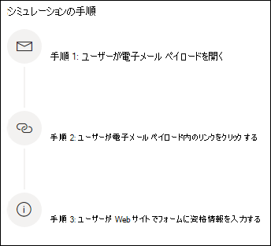

# フィッシング攻撃をシミュレートする

**Microsoft** Defender for [Office 365プラン 2 に適用されます](defender-for-office-365.md)

microsoft Defender for Office 365 の攻撃シミュレーション トレーニングを使用すると、組織で良性のサイバー攻撃シミュレーションを実行してセキュリティ ポリシーとプラクティスをテストし、従業員の意識を高め、攻撃に対する影響を減らします。 この記事では、攻撃シミュレーション トレーニングを使用してシミュレートされたフィッシング攻撃を作成する方法について説明します。

攻撃シミュレーション トレーニングの概要については、「攻撃シミュレーション トレーニングの使用を開始 [する」を参照してください](attack-simulation-training-get-started.md)。

シミュレートされたフィッシング攻撃を起動するには、Microsoft 365 Defender ポータル ( ) を開き、[メール & コラボレーション攻撃シミュレーション トレーニング] に移動し、[シミュレーション] タブ <https://security.microsoft.com/>  \> **[に切り替](https://security.microsoft.com/attacksimulator?viewid=simulations)** えます。

[ **シミュレーション] で**、[+ **シミュレーションの起動] を選択します**。

> [!NOTE]
> シミュレーション作成時の任意の時点で、保存して閉じて、後でシミュレーションの構成を続行できます。

## ソーシャル エンジニアリング手法の選択

4 つの異なる手法から選択します [。MITRE ATT および CK&フレームワーク®します](https://attack.mitre.org/techniques/enterprise/)。 さまざまなペイロードは、さまざまな手法で使用できます。

- **資格情報の取得** は、ユーザー名とパスワードを送信するための入力ボックスを持つよく知られている Web サイトにユーザーを連れて行き、資格情報を収集します。
- **マルウェアの添付** ファイルは、悪意のある添付ファイルをメッセージに追加します。 ユーザーが添付ファイルを開くと、攻撃者がターゲットのデバイスを侵害するのに役立つ任意のコードが実行されます。
- **添付ファイル内のリンク** は、資格情報の取得ハイブリッドの一種です。 攻撃者は電子メールの添付ファイルに URL を挿入します。 添付ファイル内の URL は、資格情報の取得と同じ手法に従います。
- **マルウェアへのリンクは** 、既知のファイル共有サービスでホストされているファイルから任意のコードを実行します。 ユーザーに送信されるメッセージには、この悪意のあるファイルへのリンクが含まれる。 ファイルを開き、攻撃者がターゲットのデバイスを侵害するのを助ける。
- **ドライブ URL は** 、メッセージ内の悪意のある URL が、ユーザーのデバイス上でコード コードをサイレントモードで実行またはインストールする見慣れた Web サイトにユーザーを連れ込む場所です。

> [!TIP]
> [各手法の **説明内の** 詳細を表示する] をクリックすると、その手法に関する詳細情報とシミュレーション手順が表示されます。
>
> 

テクニックを選択し、[次へ] をクリックした **後、シミュレーション** に名前と必要に応じて説明を指定します。

## ペイロードの選択

次に、既存のペイロード カタログからペイロードを選択する必要があります。

ペイロードには、次の選択に役立つデータ ポイントが多数含まれています。

- **言語** は、ペイロード コンテンツの言語を表示します。 Microsoft のペイロード カタログ (グローバル) は、10 以上の言語でペイロードを提供し、フィルター処理も可能です。
- **クリック率は** 、このペイロードをクリックしたユーザーの数をカウントします。
- **予測された妥協** 率は、このペイロードによって侵害される人の割合を、Microsoft Defender 全体のユーザーのペイロードの履歴データに基づいてOffice 365します。
- **起動されたシミュレーションは** 、このペイロードが他のシミュレーションで使用された回数をカウントします。
- **フィルターで** 使用できる複雑 **さは、** 攻撃の対象となるペイロード内のインジケーターの数に基づいて計算されます。 インジケーターが多い場合、複雑さも低くなります。
- **フィルター** を **使用して使用可能** なソースは、ペイロードがテナントに作成されたのか、Microsoft の既存のペイロード カタログ (グローバル) の一部であるかどうかを示します。

リストからペイロードを選択すると、ペイロードのプレビューが表示されます。

独自のペイロードを作成する場合は、「攻撃シミュレーション トレーニング用のペイロード [を作成する」を参照してください](attack-simulation-training-payloads.md)。

## 対象ユーザーの設定

次に、このシミュレーションの対象ユーザーを選択します。 組織内のすべてのユーザーを **含めるか** 、特定のユーザーとグループ **のみを含めるか選択できます**。

特定のユーザーと **グループのみを含める場合は** 、次のいずれかを実行できます。

- **ユーザーを** 追加します。これにより、テナントの検索と高度な検索およびフィルター機能 (過去 3 か月間シミュレーションの対象とされていないユーザーをターゲットに設定する機能など) を利用できます。

  

- **CSV からインポートすると** 、このシミュレーション用に定義済みの一連のユーザーをインポートできます。 CSV ファイルには、1 行に 1 つのメール アドレスが含まれている必要があります。

## トレーニングの割り当て

トレーニングを行う従業員が同様の攻撃を受けにくいので、シミュレーションごとにトレーニングを割り当てすることをお勧めします。

トレーニングを割り当てるか、自分でトレーニング コースとモジュールを選択できます。

トレーニング期日 **を選択して** 、従業員が適切な方法でトレーニングを終了します。

> [!NOTE]
> 自分でコースとモジュールを選択した場合でも、推奨されるコンテンツと利用可能なすべてのコースとモジュールを表示できます。
>
> 

次の手順では、自分でトレーニングを選択し、トレーニングのランディング ページをカスタマイズする場合は、[トレーニングの追加] が必要です。 トレーニングランディング ページをプレビューし、ヘッダーと本文を変更できます。

## 起動の詳細とレビュー

すべてが構成されたので、このシミュレーションを直ちに起動するか、後日スケジュールを設定できます。 また、このシミュレーションを終了する時間を選択する必要があります。 選択した時間を過ぎたこのシミュレーションとの相互作用のキャプチャを停止します。

**地域対応のタイム ゾーン配信を** 有効にして、地域に基づいて勤務時間中に従業員にシミュレートされた攻撃メッセージを配信します。

完了したら、[次へ] **をクリック** し、シミュレーションの詳細を確認します。 任意の **パーツの [** 編集] をクリックして戻り、変更が必要な詳細を変更します。 完了したら、[送信] を **クリックします**。

> [!NOTE]
> 特定の商標、ロゴ、記号、インスグニア、その他のソース識別子は、地方、州、および連邦の法令および法律の下で高い保護を受けます。 このようなインジケーターを不正に使用すると、刑事罰金を含む罰則がユーザーに科される可能性があります。 広範なリストではありませんが、これには、大統領、副大統領、および議会のシール、CIA、FBI、社会保障、メディケアとメディケイド、米国内歳入サービス、およびオリンピックが含まれます。 これらの商標のカテゴリを超えて、サードパーティの商標の使用と変更は、固有のリスクを伴います。 ペイロードで独自の商標とロゴを使用すると、リスクが低く、特に組織が使用を許可している場合はリスクが低い可能性があります。 ペイロードを作成または構成する際に、何が適切か、または適切ではないかについてさらに質問がある場合は、法務アドバイザーに相談してください。
